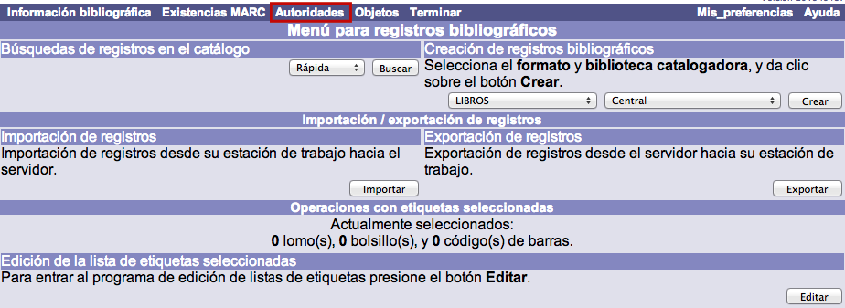
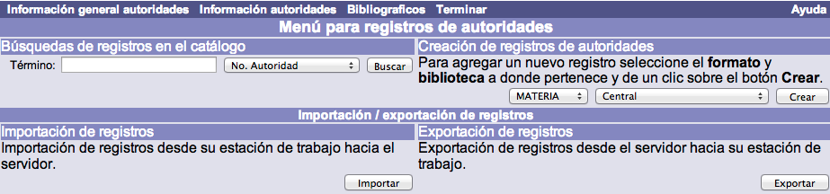

# Acceso a Control de autoridades

{{date}}

En primer lugar, un aspecto importante que es necesario destacar es que
el acceso al módulo de Control de autoridades se realiza **a través del
módulo de Control bibliográfico**.

Una vez que se ha entrado en dicho módulo, aparece la pantalla principal
del mismo.

Para ingresar al módulo de control de autoridades se debe hacer clic en
la opción ***Autoridades*** de la barra de herramientas que se muestra
en la imagen anterior, para que se despliegue el Menú para registros de
autoridades.

Desde esta página pueden llevarse a cabo las siguientes acciones:

-   Búsquedas en el catálogo de autoridades.
-   Creación de nuevos registros de autoridad.
-   Importar registros cargando un fichero de autoridades en el sistema.
-   Exportar autoridades del propio sistema a un fichero local.

## Barra de herramientas

Como sucede en otros módulos, el despliegue de las opciones que componen
la barra de herramientas cambia dependiendo de la que se esté ejecutando
en cada momento.

Las opciones que se muestran son las siguientes:

-   **Menú AUT** da acceso a la pantalla principal del módulo.
-   **Información general autoridades** da acceso a la información
    general de control del registro de autoridad que se ha creado o
    editado previamente.
-   **Información autoridades** da acceso al registro de autoridad en
    modo de edición. En esta pantalla es posible realizar modificaciones
    sobre los datos introducidos.
-   **Bibliográfico** permite regresar al módulo de Control
    Bibliográfico.
-   **Terminar** finaliza la sesión de trabajo.
