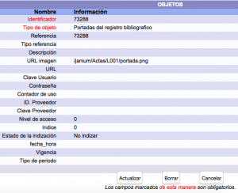
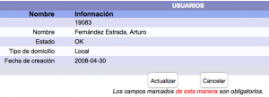
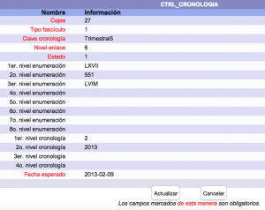
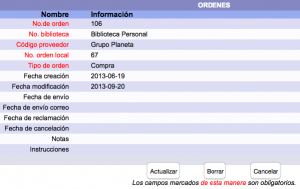

# Acceso a formularios de información

{{date}}

Al acceder a este tipo de de formularios, el sistema Janium permite
**añadir**, **modificar** o **eliminar** ciertos datos relativos a la
información que se tenga desplegada en ese momento. Es importante
insistir en la circunstancia de que, en algunos casos, no es posible editar determinados
campos.

Además, desde aquí también es posible borrar el registro completo
seleccionado.

A continuación, algunos ejemplos de formularios de información de
distintos módulos:

