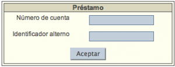

# Acceso a funciones de Circulación

Es importante destacar que para empezar a trabajar con las distintas funciones del módulo de Circulación, es necesario **identificar previamente al usuario** cuya información va a ser tratada, bien mediante su _número de cuenta_ o su _identificador alterno_.

