# Administración

## Introducción

El módulo de Administración está dividido en las siguientes secciones generales:

+ Configuración general.

+ Módulo de Catalogación.

+ Módulo de Circulación.

+ Módulo de Adquisiciones.

+ Módulo de Publicaciones periódicas.

+ Módulo de Seguridad avanzada.

+ Módulo de Inventario.

+ Tareas de mantenimiento general.

+ Módulo de Reportes.

+ Bitácora de cambios.

Además, cada una de estas secciones (a excepción de _Módulo de Inventario_ y _Bitácora de cambios_) se organizan en diferentes **subsecciones**, dependiendo del caso, que serán explicadas en detalle llegado el momento.

## Forma de acceso

El ingreso al módulo se realiza a través de internet y / o intranet, usando cualquiera de los navegadores existentes (Internet Explorer, Google Chrome, Mozilla Firefox o Safari, entre otros).

En algunos casos, las instituciones pueden contar con un enlace o medio similar para vincular el sistema con su página web. De no ser así, se deberá ingresar usando la siguiente "URL tipo" en el navegador:

> http://biblioteca.janium.net

Siendo el término “biblioteca” algo que cambiará para adecuar dicha URL a cada institución. El sistema Janium, por otro lado, también ofrece la posibilidad de configurar cualquier otro tipo de dirección distinta a la descrita que solicite la institución.

Una vez que la URL es reconocida, aparece la pantalla de acceso al sistema, donde se debe escribir un número de cuenta y contraseña autorizados.

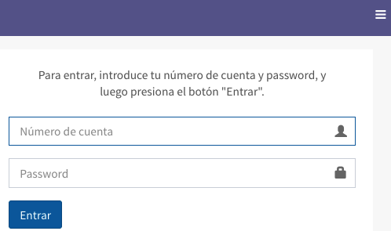

Tras haber ingresado los datos de identificación mencionados, se presenta la pantalla principal del módulo.

En esta pantalla pueden distinguirse cuatro tipos de iconos que determinan, a su vez, el tipo de función y su comportamiento:

+ 

	Agrupa funciones que comparten un módulo o temática común. Bajo este icono se establecen tanto grupos principales como subgrupos dentro de los primeros, los cuales pueden desplegarse y replegarse usando la "flecha" situada a la izquierda del icono.

+ 

	Permite acceder a la pantalla de creación y edición de registros para cada tipo de función.

+ 

	Ejecuta de forma automática la función seleccionada al hacer clic sobre su nombre.

+ 

	Permite acceder a la _Bitácora de cambios_ del sistema Janium.

Además, es importante destacar que en esta pantalla principal del módulo **es posible desplegar varios niveles del menú al mismo tiempo**, así como, mediante el uso del almacenamiento local del navegador (o _cookies_, cuando éste no esté disponible), **el sistema recuerda la última opción visitada**.

## Creación y edición de registros

**NOTA**: dado que el proceso para crear y editar un registro de información en el módulo de Administración es idéntico <u>para cualquier tipo de función</u>, se describe en este punto de forma global, evitando así la reiteración de incluirlo en cada una de las secciones relacionadas.

El procedimiento a seguir es el siguiente:

+ Introducir el valor a crear en el cuadro de texto del campo (o campos) _**Información**_, o seleccionarlo de la lista desplegable, dependiendo del tipo de función.

+ Hacer clic en el botón **OK**. Si el valor introducido en el paso anterior ya está asignado, el registro se despliega <u>para editarlo</u>. Si no es así, si es nuevo, el registro se despliega <u>para completarlo y guardarlo</u>.

+ Además, si se quiere saber cuál es el último <u>número de orden</u> que va a ser asignado por el sistema al valor que se va a crear, se puede hacer clic sobre el icono situado a la derecha del campo _**Información**_.

## Búsqueda y selección de registros

Para poder buscar, y seleccionar a continuación, valores ya creados para alguna de las funciones del módulo se debe desplegar la lista que se encuentra en el campo _**Nombre**_. Al llevar a cabo la selección del valor deseado, el sistema lo coloca de forma automática en su campo _**Información**_ correspondiente.

No obstante, la lista desplegable mencionada <u>no muestra el total de los valores registrados para la función</u>. Si se quiere seleccionar uno que no esté en ella, se debe hacer clic en el botón **Examinar** y buscarlo en la ventana emergente que se despliega, mediante los cuadros de texto disponibles. Es importante destacar que dichos cuadros <u>son sensibles a textos en minúsculas y mayúsculas</u> (no es igual _Nombre_ que _NOMBRE_ o _nombre_).

Una vez encontrado el valor deseado, hacer clic sobre su nombre para que el sistema lo coloque en el campo _**Información**_, como en el caso anterior.

La ventana emergente mencionada también puede mostrarse haciendo clic sobre la opción **Ver más**, que se encuentra al final de la lista desplegable de valores del campo _**Nombre**_.

Los elementos que pueden verse en la ventana de búsqueda y selección de registros son los siguientes:

+ Número de registros encontrados en total (1).

+ Número de registros desplegados por página (2).

+ Primera opción de búsqueda, que puede usarse introduciendo los términos deseados en el cuadro de texto y haciendo clic en el botón **Buscar** (3).

+ Segunda opción de búsqueda, que puede usarse introduciendo los términos deseados en el cuadro de texto y haciendo clic en el botón **Buscar** (4).

+ Botones de navegación, para pasar de una página de registros a otra (5).

+ Columna con los nombres de los valores, redactados de forma breve (6).

+ Columna con las descripciones respectivas de los valores (7).

+ Botón para cerrar la ventana emergente, situado en la parte inferior de la misma (8).

## Configuración general

En esta sección se determinan las características funcionales generales del sistema Janium para todos los módulos. Es importante mencionar que **el sistema Janium se entrega con parámetros ya establecidos para la mayor parte de las opciones**, por lo que no es necesario realizar una definición completa de estos parámetros por parte de la institución.

### Parámetros generales

Aquí se mantiene lo que acaba de indicarse: los parámetros generales quedan definidos **en el momento de instalar el sistema** y, si bien éstos pueden modificarse dependiendo de las necesidades de la institución, no pueden crearse nuevos parámetros por iniciativa propia, ya que son utilizados por los programas del sistema y por la base de datos del sistema Janium.

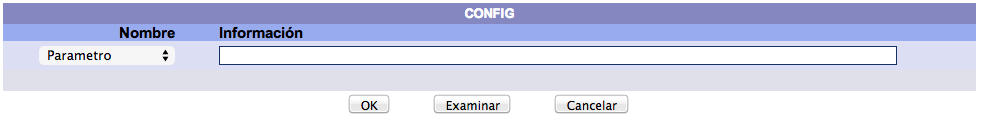

Los campos que se presentan en un registro de parámetros generales son los siguientes:

+ **Parámetro:** nombre identificador del parámetro.

+ **Descripción:** texto breve que describe la función o el propósito del parámetro.

+ **Valor 1**, **Valor 2**, **Valor 3**, **Valor 4** y **Valor 5:** estos campos van a contener distintos tipos de datos dependiendo del parámetro que se trate.

+ **Notas:** campo donde puede incluirse cualquier información que pueda ser de utilidad. Por ejemplo, la explicación ampliada de qué datos deben introducirse en cada uno de los campos de _Valor_.

#### Lista de parámetros generales

##### Parámetros de uso general

**add time**
Permite agregar tiempo (en segundos) a la hora de apertura y cierre de la biblioteca. Es complemento del parámetro _bloqueo holidays_.

**autoregistro usuarios**
Activa la configuración del autoregistro de usuarios. Valor 1: el sistema permite autoregistro de usuarios (1 = Sí, 0 = No). Valor 2: contenido del "asunto" de los correos de confirmación de registro que se enviarán.

**bloqueo holidays**
Controla que se puedan realizar o no préstamos, devoluciones y renovaciones de materiales en días y horas en que la institución esté cerrada. 0 = no verifica (siempre se pueden realizar estas acciones); 1 = valida que sea un día hábil y se esté dentro del horario de trabajo para permitir la realización de un préstamo, devolución o renovación.

**chat**
Controla la función de chat con operadores. Valor 1: indica si la función está disponible (1) o no (0). Valor 2: indica si es necesario (1) o no (0) que los usuarios del catálogo al público estén registrados en el sistema para acceder a la función. Si el valor 3 y el valor 4 son ambos distintos de nulo y tienen formato HH:MM, restringen el horario en que la función está disponible, con cualquier otro valor o nulo se indica "siempre".

**crea mensajes para envio x sms**
Define el envío de mensajes de tipo sms a los usuarios. Valor 1: 1 = se envían, 0 = no se envían. Valor 2: cuenta de correo a la que se enviarán los mensajes. Valor 3: columna de la que se obtendrá el identificador del usuario (_nocuenta_ o _altid_). Valor 4, si es numérico, indica en que _Tipo de domicilio_ se guarda el número de teléfono; si no es numérico, indica qué etiqueta de las _Notas extendidas_ contiene (en el subcampo a) el dato del teléfono.

**version**
Define la versión del sistema instalado en el servidor.

**multi**
Define si el sistema es multibibliotecas o no. El valor 0 indica una biblioteca, y el 1 un sistema multibibliotecas.

**seguridad**
Define si el sistema cuenta con seguridad avanzada o no. El valor 0 indica un sistema con seguridad estándar, y el 1 un sistema con seguridad avanzada.

**database**
Define el tipo de base de datos. 1=PostgreSQL, 2=ORACLE.

**dirdescarga**
Define la ruta desde la que se descargan los archivos del servidor. Por ejemplo: _/usr/local/janium/htdocs/Descargar_.

**dirrelativa**
Define la dirección relativa del servidor web local para almacenar objetos en el servidor. El valor 1 contiene la dirección relativa y el valor 2, la real. Por ejemplo: dirección relativa=_/janium/_ y dirección real=_/usr/local/janium/htdocs/_.

**maxtime**
Define la duración máxima (en segundos) de una sesión antes de desconectarla.

**timeout**
Define el tiempo máximo (en segundos) de inactividad de una sesión antes de desconectarla.

**mail handler**
Define el programa para envío de correo. Este programa depende de la plataforma en la que se instale el sistema. Los valores más comunes son 1=Linux/Unix SMTP, 2=Windows SMTP.

**mail params**
Parámetro donde se registran los datos que utilizará el sistema para el envío de correos electrónicos. Valor 1: nombre del remitente que envía el correo. Valor 2: cuenta de correo electrónico que envía el correo. Valor 3: dirección IP o nombre del servidor de correo. Valor 4: servidor que envía el correo y modo de autenticación. Valor 5: valores de autenticación.

**filtro salida**
Definición del filtro para la salida de texto (necesario para salida impresa). El valor por omisión para este parámetro es | awk ’{printf “ %s r n”,$0;}’.

**zona**
Definición de la zona horaria establecida en el sistema, tomando como referencia el huso horario de Greenwich.

**doblelogo**
Parámetro que permite usar dos logotipos en la cabecera de la página del sistema (_banner_). En el campo <u>valor 1</u> se escribe el dato **1** si se quieren mostrar dos imágenes. Se debe escribir **0** en caso de que se desee desplegar una sola imagen.

En el campo <u>valor 2</u> se escribe la ruta completa donde se localiza el archivo de imagen. Este archivo será utilizado cuando se coloque el dato **0** en el campo valor 1 (es decir, para desplegar una sola imagen). También se indica aquí la posición donde se va a situar (_left_: izquierda, _right_: derecha, _center_: centro). Por ejemplo: left:/janium/Imagenes/logo1.png

En el campo <u>valor 3</u> se escribe la ruta completa donde se localiza el archivo de imagen. Este archivo no será utilizado cuando se coloque el dato **0** en el campo valor 1. También se indica aquí la posición donde se va a situar (_left_: izquierda, _right_: derecha, _center_: centro). Por ejemplo: right:/janium/Imagenes/logo2.png

Finalmente, existen varias reglas relacionadas con <u>hojas de estilos</u> que afectan a este parámetro. Dichas reglas se definen en el archivo del sistema _janium.css_ y se pueden redefinir en _janium custom.css_

**cmdmove**
Este parámetro depende del sistema operativo usado y se refiere a la instrucción para <u>mover</u> un fichero de un directorio a otro. En Windows es _MOVE_ y en Linux es _mv_.

**tipo sistema**
Define el tipo de sistema y la plataforma en la que se ejecuta. Este valor no debe ser modificado ya que altera el comportamiento del sistema.

**show version**
Parámetro para mostrar u ocultar la indicación de versión del sistema. 1=Sí, 0=No.

**show logo**
Parámetro para mostrar u ocultar el logo en las páginas. 1=Sí, 0=No.

**allow proxy**
Permite el acceso simultáneo del mismo usuario desde la misma IP. Adecuado para proxys. 1=permitir, 0=no permitir.

**upload path**
Ruta para recibir los objetos digitales transferidos desde los clientes.

---- 

##### Parámetros sobre el catálogo al público

**acercamiento progresivo**
Permite la configuración del visor de acercamiento progresivo. Valor 1: muestra el botón _Vista de impresión_ (1=mostrar, otro=no mostrar). Valor 2: desactiva el menú de contexto en el visor de impresión (1=desactivar, otro=no desactivar).

**apartados otros usuarios**
Ofrece la posibilidad de que un usuario efectúe apartados para otros, a parte de él. Si el valor es 1, el usuario podrá apartar materiales para otras cuentas desde el catálogo al público. Si es 0, el usuario sólo podrá colocar apartados a sus propias cuentas.

**bib orden**
Parámetro que determina la ordenación de los sumarios de resultados:

+ <u>Valor 1</u>: número de índice alfabético usado para ordenar los sumarios de resultados.

+ <u>Valor 2</u>: aquí se escriben los campos y subcampos que serán utilizados para ordenar los registros en el sumario de resultados. Estos elementos deben ser introducidos separados por _pipes_ (**|**) y de forma continua (sin espacios). Algunas indicaciones genéricas:

	+ La palabra TERMINO colocada en el campo valor 2 representa al número de índice alfabético escrito en el campo valor 1.
	+ _E:S(*A*)_ se sustituye por la información del subcampo _S_ de la etiqueta _E_, tomando dicha información como “alfabética”. Es decir, eliminando de ella cualquier información no alfabética que contenga.
	+ _E:S(*N*)_ se sustituye por la información del subcampo _S_ de la etiqueta _E_, tomando dicha información como “numérica”. Es decir, eliminando de ella cualquier información no numérica que contenga.
	+ _E:S(*N\#*)_ se sustituye por la información del subcampo _S_ de la etiqueta _E_, tomando dicha información como “numérica”. Es decir, eliminando de ella cualquier información no numérica que contenga. Y, además, para formar la llave de ordenamiento, la información del subcampo se completa desde la izquierda hasta con **\\#** ceros para formar una cadena de **\\#** posiciones.
	+ Para que la llave de ordenamiento se construya es necesario utilizar un número de índice válido en valor 1, incluso cuando en valor 2 no se incluya el campo TERMINO.

+ <u>Valor 3</u>: criterios de ordenamiento del sumario: _asc_ (ascendente) o _desc_ (descendente). NULL equivale a _desc_.

Ejemplos:

+ Los registros serán ordenados por <u>Título</u> y <u>Número de edición</u>:

+ Los registros serán ordenados por <u>Fecha de publicación</u>, <u>Título</u> y <u>Autor</u>:

**bibliografia iconos**
Establece qué iconos se van a desplegar y cuáles no en la sección _Bibliografía_. 1=Sí, 0=No.

**bitacora busquedas**
Controla el comportamiento del registro de búsquedas en la bitácora. Valor 1: habilitar el registro de búsquedas en la bitácora (1 = Sí, 0 = no). Valor 2: no borrar bitácora (0), borrar bitácora diariamente (1), borrar bitácora cada mes (2), borrar bitácora cada año (3).

**busqueda palabras exacta**
Permite buscar los términos en el índice de palabras de manera exacta. Si no encuentra resultados reporta 0 encontrados. Si el valor es 0, al fallar la búsqueda se inicia una búsqueda alfabética en el índice alterno.

**columnas acervo opac**
Controla el despliegue de las columnas de información sobre los ejemplares en el catálogo al público. El valor 1 puede contener estos códigos: CB: Código de barras; BI: Biblioteca; CL: Clasificación; PA: Partes; UB: Ubicación; TM: Tipo de material; ES: Estado. En el campo quedaría así: CB|BI|CL|PA|UB|TM|ES

**confirmar usuario**
Controla el despliegue de la página de confirmación de datos del usuario. 1 = Sí, 0 = No.

**crit busq rapida**
Establece la búsqueda rápida como criterio por defecto en el catálogo al público. Valor 1: define si se muestra el selector de criterio en el catálogo a usuarios "no staff" (1 = Sí, 0 = No). Para usuarios de staff el criterio siempre es visible. Valor 2: define el criterio por defecto para usuarios "no staff" (p=palabra clave, a=alfabeticamente). Valor 3: define el criterio por defecto para usuarios de staff.

**historico prestamos**
Permite el despliegue, o no, del listado histórico de préstamos en el catálogo al público. Valor 1: 1 = lo permite, 0 = lo oculta. Valor 2: número de registros que se mostrará en cada página del histórico.

**info item sumario**
Configura la información que aparece en la columna _info_ del sumario en el catálogo al público. Valor 1 = código de biblioteca visible (1 = Sí, 0 = No). Valor 2 = formato de registro visible (1 = Sí, 0 = No). Valor 3 = formato de ítem visible (1 = Sí, 0 = No). Valor 4 = estado del ítem visible (1 = Sí, 0 = No).

**info sumario**
Usando este parámetro puede añadirse un texto de encabezamiento para la columna que contiene la información de las portadas en los <u>sumarios de resultados</u> y en el <u>despliegue del detalle</u>. El texto en sí se incluye en el campo _Notas_, mientras que en los campos de valor se autoriza o no su uso (1 = Sí, 0 = No.)

**limite terminos**
Establece el número de términos aceptados en las búsquedas por palabra clave. Valor 1: cifra de términos aceptados en las búsquedas (sin contar operadores y paréntesis). Si el límite se excede, el sistema responde con una alerta. NOTA: Sólo aplica si la base no es PostgreSQL.

**muestra prefs items**
Controla el despliegue de los prefijos de información de los ítems en el catálogo al público. Valor 1: Vol. Valor 2: Pte. Valor 3: No. Valor 4: Tomo. Valor 5: Ejemplar (1 = mostrar, Otro = no mostrar).

**opac formatos**
Permite limitar por formatos en el catálogo al público. El valor 1 habilita la función y 0 (o cualquier otro valor) la deshabilita. La restricción no aplica para catalogadores con instrucciones definidas.

**opac indices opcionales**
Permite mostrar u ocultar los índices opcionales de búsqueda en el catálogo al púbico. Valor 1: ISBN. Valor 2: ISSN. Valor 3: Editorial. Valor 4: Serie. Valor 5: Clasificación (1 = mostrar, 0 = no mostrar).

**orden items**
Controla el orden por defecto de los ejemplares en sus sumarios correspondientes. Valor 1: lista de códigos separados por comas. Los códigos que pueden usarse son: B = biblioteca, C = clasificación, CB = código de barras, V = volumen, P = parte, N = numero, T = tomo, E = ejemplar. A continuación de los códigos se coloca un + (signo más) para ordenamiento ascendente o un - (signo menos) para descendente. Por ejemplo: V+,P+,N+,T+,E+.

**prefs items**
Prefijos para el despliegue de la información de ejemplares. Se complementa con los parámetros _muestra prefs items_ y _desplieguecopia_. Valor 1: Vol. Valor 2: Pte. Valor 3: No. Valor 4: Tomo.

**radios busqueda avanzada**
Controla el despliegue y el orden de las opciones de selección mostradas en la búsqueda avanzada. Los códigos que pueden usarse son: CODBARRAS = Código de barras, NOCTRL = No. control, NOADQ = No. adquisición, CALL = Clasificación (item), CALLB = Clasificación (bib), ISBN = ISBN, ISBN = ISSN, NOBIB = No. de ficha, NOITEM = Id de item. Si no se definen al menos dos códigos válidos, la serie de valores por defecto será:

CODBARRAS|NOCTRL|NOADQ|CALL|CALLB|ISBN|ISBN|NOBIB|NOITEM

**seguridad biblioteca**
Restringe las búsquedas sólo a la biblioteca a la que pertenece el usuario. Valor 1: 1 = activa la función, 0 = desactiva la función.

**sel items opac**
Permite elegir en el catálogo al público las copias del registro para generar una papeleta de solicitud de material. Valor 1: controla si se muestra o no la casilla de selección (1 = Sí, 0 = No). Si en valor 1 es 1, en valor 2 se puede configurar una lista de números de ubicación separados por **|** (_pipes_) para indicar en qué ubicaciones se debe impedir la solicitud de préstamos.

**solicitudesabiertas**
Indica si permite hacer solicitudes a cualquier usuario desde el catálogo al público. Si es 1, no verifica el número de cuenta en la base de datos. Si es 0, no permite hacer la solicitud a menos que la cuenta sea válida en la base de datos del usuario.

**renovacion cat**
Determina si se puede renovar un préstamo desde el catálogo al público:

+ **Valor 1:** controla la posibilidad de que un usuario pueda renovar un material desde el catálogo (1: Sí, 0: No).
+ **Valor 2:** indica si para renovar un material desde el catálogo se tomará en consideración la fecha de vencimiento del mismo (1: Sí, 0: No).
+ **Valor 3:** número de días previos a la fecha de vencimiento a partir de los cuales se podrá renovar un material. Por ejemplo, si en este campo el valor es **2** y un material prestado por **8** días vence el viernes a medio día, el mismo sólo podrá ser renovado a partir del miércoles anterior, pasado el medio día. Antes de esa fecha y hora, el material no estará en condición de ser renovado.

**chop**
Define el porcentaje de caracteres que se quitan de la cadena de búsqueda antes de iniciar una búsqueda desde un hipervínculo alfabético. Esto provoca que la búsqueda considere cierto número de caracteres antes del final del término para así ampliar el número de resultados. Si el valor es mayor que 50 el sistema lo cambiará a 50, ya que es poco probable que una búsqueda obtenga resultados aceptables si busca términos recortados en más de un 50 por ciento.

**pagitems**
Define el tamaño de la página de despliegue de ítems en el programa que despliega la vista en detalle de los registros bibliográficos.

**bibformat1**
Si existe este parámetro, la opción de bibliografía en formato abreviado estará disponible en el catálogo al público.

**bibformat2**
Si existe este parámetro, la opción de bibliografía en formato bibliográfico estará disponible en el catálogo al público.

**bibformat3**
Si existe este parámetro, la opción de bibliografía en formato de etiquetas estará disponible en el catálogo al público.

**bibformat4**
Si existe este parámetro, la opción de bibliografía en formato bibliográfico sin copias estará disponible en el catálogo al público.

**limitebibliografia**
Indica el número máximo de registros que podrán seleccionarse y desplegarse en una bibliografía.

**pagsumario**
Define el tamaño de la página de despliegue de registros en los sumarios.

**desplieguecopia**
Define la descripción que se presenta en la columna copia en el detalle de registros bibliográficos. Los valores comunes pueden ser Copias o Ejemplares.

**pacubicaciones**
Permite limitar por ubicaciones/colecciones en el catálogo al público. El valor 1 indica que aparece la opción de selección de ubicaciones/colecciones y el 0 deshabilita esta función.

**pacestadoitem**
Permite limitar por estado del ejemplar en el catálogo al público. El valor 1 indica que aparece la opción de selección de estado y el 0 deshabilita esta función.

**pactipomaterial**
Permite limitar por tipo de material del ejemplar en el catálogo al público. El valor 1 indica que aparece la opción de selección de tipo de material y el 0 deshabilita esta función.

**desplegaretiqopac**
Indica si el botón de “desplegar etiquetas” que aparece en el despliegue de registros bibliográficos en el catálogo al público debe activarse o no. 1=Activar función, 0=No activar función.

**urlusuario**
Define si se activa el enlace asociado a una fotografía de usuario en el catálogo al público o no. 1=activar 0=desactivar.

**num columnas busq pred**
Define el número de columnas que se utilizarán para desplegar opciones en la página de la búsqueda predefinida.

**maxregsZ3950**
Define el número máximo de registros a recuperar en una consulta Z39.50. El valor 0 define número ilimitado de registros a recuperar.

**reservacion cat**
Determina si se puede reservar un material desde el catálogo al público. 1=Sí, 0=No.

**cat central**
Definición del tipo de catalogación para búsquedas. Si el parámetro es 1, define un catálogo central en el que la restricción de biblioteca se da desde la tabla _items_. Si es 0, define un comportamiento normal, en el que la biblioteca que está definida como propietaria del registro en la tabla _bibdata_ es la que se usa para la restricción de la búsqueda. La opción 1 requiere cambio de "views", por lo que, después de cambiar este valor es necesario utilizar el programa _platform setup_ para la creación de los "views" apropiados en la base de datos.

**sumario despfec**
Define si la fecha del subcampo $c de la etiqueta 260, es decir, la fecha de publicación, se desplegará en el sumario de títulos, junto a la clasificación. 1=Sí, 0=No. Esto sólo aplica para registros hechos con formatos basados en MARC.

**sumario despclas**
Define si se despliega, o no, la clasificación bibliográfica en el sumario. 1 = Sí, 0 = No.

---- 

##### Parámetros sobre la indización

**bloquepalabra**
Define cuántos registros se procesan en cada bloque para la generación de índices.

**caracteres equivalentes a espacio**
Define qué caracteres van a ser considerados por el sistema como equivalentes a espacio durante las búsquedas y la indización. Valor 1: lista de caracteres, enumerados uno junto a otro. Por ejemplo: .,:/~@\_;?¿¡!#$&'=\<\>+

**caracteres no alfanum indizables**
Define qué caracteres no alfanuméricos van a ser tenidos en cuenta por el sistema durante la indización. Valor 1: lista de caracteres, enumerados uno junto a otro. Por ejemplo: \*()"%-

**caracteres no alfanum validos en busquedas**
Define qué caracteres no alfanuméricos van a ser tenidos en cuenta por el sistema para realizar búsquedas. Valor 1: lista de caracteres, enumerados uno junto a otro. Por ejemplo: %-

**reindex**
Parámetro relacionado con la indización de registros en línea. Valor 1: indica al sistema si ejecuta la indización utilizando _reindex.pl_ (1 = Activo, 0 = Inactivo).

**tagsindicadoralfa1**
Define a qué etiquetas va a aplicarles la alfabetización en el primer indicador. Los valores deben separarse por el carácter **|**. Por ejemplo:|245|240|222|242|243|

**tagsindicadoralfa2**
Define a que etiquetas va a aplicarles la alfabetización en el segundo indicador. Los valores deben separarse por el carácter **|**. Por ejemplo:|730|740|

**prefijo url relativo ft**
Prefijo que se agrega a los urls relativos para la indización por texto completo. Normalmente sólo se necesita cuando el servidor debe responder a un puerto distinto de 80 o a un nombre distinto de servidor virtual.

---- 

##### Parámetros sobre el editor

**editor advertencia**
Indica si se deben desplegar advertencias cuando el editor encuentre elementos que no estén definidos en el sistema. 1=desplegar advertencias, 0=no desplegar advertencias.

**editor max columnas**
Define el número de columnas que se desplegarán como máximo al editar un campo de un registro bibliográfico. El valor por omisión es de 40. Este valor controla el despliegue definido en el campo _Capturar como área de texto_ de la tabla de _elementos formatos_.

**editor max renglones**
Define el número de renglones que se desplegarán como máximo al editar un campo de un registro bibliográfico. El valor por omisión es de 10. Este valor controla el despliegue definido en el campo _Capturar como área de texto_ de la tabla de _elementos formatos_.

---- 

##### Parámetros sobre Circulación

**acumula info prestamos**
Define la forma en que se acumula la información del material a prestar, devolver o renovar. Si es 1, los materiales se acumulan hasta que se oprime el botón _Fin_. Si es 0, los materiales aparecen en pantalla hasta que el sistema detecta que se trata de otro usuario; en ese momento, limpia la información del material existente y empieza a acumular la del nuevo usuario.

**apartados pcd por bib usuario**
Controla el comportamiento de los materiales apartados del tipo _Primera copia disponible_. Valor 1: si es 0, asignará el material de acuerdo a las reglas definidas en el mapa de circulación. Si es 1, al hacer un apartado asignará al usuario sólo aquellos materiales que pertenezcan a su biblioteca, aunque en el mapa de circulación tenga definidas reglas para otros ítems del mismo registro.

**auto codigo barras**
Establece el uso automático de los números de código de barras. Valor 1: el sistema genera automáticamente códigos de barras (1=Sí, 0=No). Valor 2: el sistema usa las máscaras configuradas por biblioteca durante la captura o el despliegue (1=Sí, 0=No). Valor 3: el sistema usa las máscaras configuradas por biblioteca durante la impresión de etiquetas (1=Sí, 0=No).

**controlprestamo**
Define si un material puede ser prestado a un usuario el mismo día en que éste realizó la devolución del material. Valor 1: 0 = permite el préstamo siempre, 1 = valida el ítem devuelto, 2 = valida todas las copias que pertenecen al mismo registro y biblioteca del material devuelto, 3 = valida todas las copias que pertenecen al mismo registro del material devuelto, sin importar la biblioteca. Valor 2: 1 = valida el número de cuenta del usuario, 2 = valida todas las cuentas ligadas al registro del usuario.

**desp prestamo interno**
Texto de despliegue para préstamos internos. Se muestra en la parte superior de la pantalla de devolución. Los valores comunes pueden ser _Préstamo interno_ o _Préstamo en sala_.

**despliegue usuario prestamo**
Permite elegir categorías informativas del usuario para su despliegue al estar realizando un préstamo. Valor 1 = Bibliotecas, valor 2 = Perfiles, valor 3 = Vigencia, valor 4 =Cat 1 de usuario valor 5 = Cat 2 de usuario (1 = se muestra el dato, 0 = no se muestra).

**estado items inv**
Definición de los estados de los ítems para inventarios. Valor 1 = "faltante", usado para marcar ítems existentes en la base de datos pero no encontrados en el inventario. Valor 2 = "perdido", usado para marcar ítems existentes en la base pero declarados perdidos (y no considerados nunca en un inventario). Valor 3 = "inexistente", usado para marcar ítems recogidos en un inventario pero que no existen en la base.

**estado usuario despues const no adeudo**
Estado que se asigna al usuario después de que se le emita una constancia de no adeudo.

**pass pre verif**
Permite la preverificación de contraseñas. Valor 1: 1 = password preverificado, 0 = password no preverificado. Valor 2: código que debe recibirse desde la forma preverificada.

**prestamo dias naturales**
Permite elegir la forma en que se desea que los días de préstamo de material sean calculados, bien usando días <u>naturales</u> (se incluyen fines de semana, festivos y vacaciones) o tomando en cuenta sólo días <u>hábiles</u> (aquellos en los que la institución permanece abierta). Valor 1: 1 = días naturales, 0 = días hábiles.

Por ejemplo: un material prestado a un usuario el día 1 del mes, durante un periodo de quince días, por una institución que tenga establecidos días <u>naturales</u> para el control de sus préstamos, debería ser devuelto el día 15 del mes, ya que se contabilizarían los fines de semana. Mientras que, si se aplicase un criterio de días <u>hábiles</u>, el material debería entregarse el día 22 del mes, excluyéndose del cálculo los fines de semana.

**ver domicilios**
Valida si se muestra o no la pestaña de información de domicilios al realizar el préstamo de material. 1 = Se muestra, 0 = No se muestra.

---- 

##### Parámetros sobre Adquisiciones

**adq ordenes**
Permite establecer la creación de líneas de orden de compra sólo si están relacionadas con registros bibliográficos, o forzar esta creación sin relaciones. Valor 1: si es 1, debe existir una relación para poder crear la línea de orden. Si es 0, permite crear líneas de orden sin relaciones con registros bibliográficos.

**codigos avisos adq**
Códigos correspondientes a las tablas _tipo cancelacion_ y _tipo reclamacion_ para ser utilizados por el programa en "batch" que genera reclamaciones y cancelaciones. El valor 1 se usa para definir _ntipo cancelacion_ y el valor 2, para definir _ntipo reclamacion_.

**equivalencias adq**
Definición de equivalencias para campos de órdenes de compra. Valor 1: se guarda el valor de _nformato_ por omisión cuando se leen registros desde la base de datos. Valor 2: contiene el formato por omisión para crear registros bibliográficos a partir de los registros de órdenes.

**estado items adq**
Definición de los estados de los ítems para Adquisiciones. Valor 1 = valor preferido al ordenar el ítem. Valor 2 = valor a asignar al ítem cuando es recibido. Valor 3 = valor a asignar al cancelar la línea de orden. Valor 4 = valor a asignar cuando se reclama el ítem.

**facturas**
Parámetro para control de facturación. Valor 1: 1 = permite facturar mayor cantidad a la ordenada, 0 = no permite facturar más de lo ordenado. Valor 2: 1 = permite crear facturas aunque no se hayan recibido los materiales, 0 = solo permite facturar la cantidad recibida.

---- 

##### Parámetros sobre Control bibliográfico

**autoridades**
Parámetros para controlar la creación de autoridades. Valor 1: 1 = crear autoridades si no existen, 0 = no crear autoridades. Valor 2: 1 = crear referencias cruzadas en autoridades, 0 = no crear referencias. Valor 3: 1 = balancear referencias cruzadas, 0 = no balancear referencias.

**boton acervo**
Controla la aparición de un botón para crear un nuevo ítem (_"Crear nueva copia"_) justo antes de la parte de información de ejemplares. 1 = usar botón, 0 = no usar botón.

**copiar clasificacion**
Permite copiar la clasificación al crear un ítem, desde la etiqueta o etiquetas definidas para ello. Valor 1: 1 = copiar, 0 = no copiar. Valor 2: etiqueta a copiar 1. Valor 3: etiqueta a copiar 2. Valor 4: etiqueta a copiar 3. Valor 5: etiqueta a copiar 4.

**listas aut**
Parámetro para controlar el uso de listas de autoridad en lugar del control de autoridades. Valor 1: 1 = usar listas, 0 = usar control. Valor 2: 1 = guardar entradas de la lista que no se usan, 0 = borrar entradas de la lista que no se usan.

**multi seleccion**
Permite seleccionar varios ítems de una vez para poder editarlos o borrarlos. Valor 1: 1 = conserva el comportamiento actual por el que, al hacer clic sobre cualquier cuadro de selección de ejemplar se despliega la pantalla de Administración de ítems. Valor 1: 0 = se activa la selección múltiple.

**ocultar referencias aut**
Permite mostrar u ocultar la columna de referencias en los sumarios de autoridades. Valor 1: 1 = ocultar, 0 = mostrar.

**solo formatos padres**
Define si se despliegan solamente formatos "padres", o no, en la lista de formatos durante la creación de registros (1 = Sí, 0 = No).

---- 

##### Parámetros sobre Reportes

**rep repetir iguales**
Permite repetir valores iguales en Reportes (1 = Repetir, 0 = No repetir).

---- 

##### Parámetros sobre Publicaciones periódicas

**tipo reclamacion pubper**
Número de tipo de reclamación preferida para publicaciones periódicas que el sistema usará al generar las reclamaciones de forma automática.

**usa sisac**
Activa el uso del número SISAC para identificar fascículos en el sistema. Valor 1: 1 = función activada, 0 = función desactivada.

### Definición de etiquetas a desplegar en OPAC

Es posible seleccionar las etiquetas y subcampos que deben desplegarse en el catálogo al público. Cualquier etiqueta que se haya definido en el sistema Janium, ya sea de formato MARC o no, puede ser mostrada al desplegar un registro.

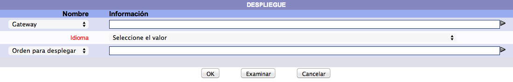

Los campos necesarios para definir una etiqueta que debe desplegarse en el catálogo al público son:

+ **Gateway**: número de _pasarela_ al que pertenece esta definición. Este es un dato numérico y es parte de la llave del registro.

+ **Idioma**: idioma bajo el que se desplegará la información definida en este registro.

+ **Orden para desplegar**: orden consecutivo para desplegar la información. Es recomendable dejar espacios en la numeración para poder intercalar nuevas definiciones sin tener que mover los registros existentes, por ejemplo, 120, 130, 140, etc.

+ **Desplegar etiqueta (1=Sí, 0=No)**: es posible definir etiquetas de texto a desplegar, por ejemplo la etiqueta 245 puede tener definida la etiqueta como TITULO o TITULO PRINCIPAL, etc. Este campo indica si esa etiqueta es desplegada o no.

+ **Saltar renglón (1=Sí, 0=No)**: indica si hace un salto de línea después de desplegar la información o continúa escribiendo a renglón seguido el siguiente elemento a desplegar.

+ **Etiqueta**: etiqueta del registro desde la que obtiene la información.

+ **Subcampo**: subcampo de la etiqueta desde el que obtiene la información.

+ **Etiqueta**: texto que debe desplegarse antes de la información, por ejemplo, TITULO, AUTOR, TEMA, etc.

+ **Búsqueda por hipertexto (1=Sí, 0=No)**: define si se habilita un hipervínculo para ejecutar una búsqueda con la información desplegada.

+ **Indice**: si el campo anterior tiene como valor 1, en este campo se debe indicar el número del índice en el que hará la búsqueda al dar click sobre la información. Se pueden seleccionar índices alfabéticos o de palabra clave. Cuando se seleccionan <u>índices de palabra clave</u>, todas las palabras que están desplegadas son enviadas al subsistema de búsquedas con operador booleano _and_. Por ejemplo, con una materia México – Historia, el término a buscar será MEXICO AND HISTORIA.

	Si se selecciona un <u>índice alfabético</u>, la entrada será enviada al subsistema de búsqueda para hacer una búsqueda alfabética. Si se quieren ampliar los resultados de la búsqueda se puede usar el parámetro _chop_ de la tabla _config_ para indicar el porcentaje de texto a buscar que será truncado. Por ejemplo, si el parámetro _chop_ tiene un valor de 5 % el término a buscar sería MEXICO HISTORI, y esta búsqueda obtendría entradas como México – Historia, México – Historiadores, etc. El valor máximo del parámetro _chop_ es de 50 %.
	 

### Contadores del sistema

La tabla de _contadores_ mantiene el **último número** que se ha usado dentro del sistema para distintas categorías de registros. Esta tabla es actualizada automáticamente por el sistema por lo que, si se altera algún contador de forma manual <u>el funcionamiento del sistema puede verse seriamente afectado</u>.

Los campos que se presentan en un registro de contadores del sistema son los siguientes:

+ **Clave:** nombre identificador del contador del sistema.

+ **Contador:** último número correlativo asignado por el sistema para el tipo de contador indicado en el campo anterior. El valor de este campo se establece en función de las diferentes acciones que se llevan a cabo con el sistema.

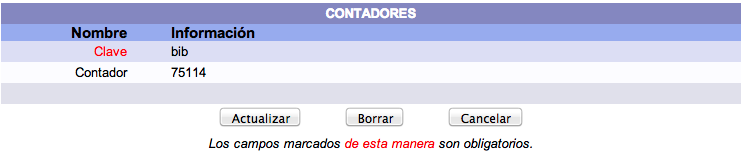

### Navegación en el sistema

La tabla de _navegación_ permite modificar las opciones que se presentan en el menú. Ayuda a personalizar el menú de opciones para distintos usuarios agregando o restringiendo funciones de acuerdo a las características del usuario que va a usar el sistema.

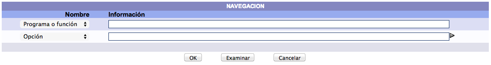

Los campos de la tabla se describen a continuación:

+ **Programa o función:** define el nombre del grupo de programas o funciones en el menú e incluye la posición que tiene en la jerarquía de las funciones. La notación es la misma que la de un directorio en Unix/Linux, <u>no se debe utilizar la notación de Windows</u>. El signo **/** indica el primer nivel o raíz del directorio, la segunda rama puede definirse como **/cat**. Para definir una tercera rama bajo la rama /cat tendríamos que usar una definición como la siguiente: **/cat/rama3** y así, sucesivamente.

+ **Opción:** número de la opción.

+ **Descripción:** nombre que se desplegará en el menú.

+ **Perfil de seguridad:** nombre del perfil de seguridad del usuario, requerido para hacer uso de esta función.

+ **Nombre programa:** nombre del programa a ejecutar. Si se trata de un submenú se tiene que indicar el nombre del manejador del menú _nav.pl_. Si se trata de un programa de ingreso y modificación de datos se usa el programa _universal.pl_.

+ **valor1:** nombre del programa o función que se presentará en el grupo o rama definido por el primer valor de _Programa o función_. Por ejemplo, en _Programa o función_ se indica que se está definiendo una entrada para el grupo o rama de catalogación **/cat** y en valor1 se indica que se trata de una subrama **/cat/indices**. Esto definiría un submenú dentro de un menú.

+ **valor2:** este campo está reservado para uso futuro.

+ **valor3:** valores que se envían al programa definido en el campo valor1. Si se usa el programa _universal.pl_ entonces en este campo se debe indicar el nombre de la tabla que se usa. La notación es la siguiente: tabla=NOMBRE TABLA.

### Bibliotecas del sistema

Conjunto de bibliotecas configuradas en el sistema y que son utilizadas por el personal de las mismas para sus actividades diarias y por los usuarios en el catálogo al público.

Los campos usados para definir un registro de biblioteca en el sistema son los siguientes:

+ **Biblioteca:** código numérico que identifica a la biblioteca dentro del sistema. <u>Este código es único y no es repetible</u>.

+ **Código biblioteca:** descripción abreviada que se va a desplegar en las distintas pantallas y reportes del sistema.

+ **Descripción:** campo de 100 caracteres para guardar el nombre completo de la biblioteca.

+ **Tipo:** se refiere al tipo de biblioteca: R=biblioteca real, V=biblioteca virtual.

+ **Hora apertura:** horario de inicio diario de labores en la biblioteca. El formato para registrar los datos es _00:00:00_.

+ **Hora de cierre:** horario de fin diario de labores en la biblioteca. El formato para registrar los datos es _00:00:00_.

+ **Activo (1=Sí, 0=No):** indica si esta entrada aparecerá en la lista de selección del catálogo al público.

+ **Duración apartado**: unidad temporal usada para regular la duración de los apartados / reservas de material llevadas a cabo por los usuarios (_Horas_, _Días_).

+ **Cantidad:** valor numérico relacionado con el campo anterior que define cuánto tiempo van a durar los apartados / reservas de material de los usuarios antes de anularse.

+ **Devolución de material de otra biblioteca (1 = Sí, 0 = No):** permite autorizar, o no, a la biblioteca que se está definiendo para recibir de los usuarios devoluciones de material prestado por parte de alguna otra biblioteca del sistema.

+ **Tiempo en tránsito:** unidad temporal usada para gestionar la duración del regreso del material devuelto en esta biblioteca a su biblioteca de origen (_Horas_, _Días_).

+ **Cantidad:** valor numérico relacionado con el campo anterior que define cuánto tiempo debe pasar para que el material devuelto en esta biblioteca regrese a la biblioteca que lo prestó.

### Biblioteca, excepciones de horario

Por lo general, mediante el parámetro _Bibliotecas del sistema_ se definen los horarios de apertura y cierre de la biblioteca para un periodo de lunes a viernes. Sin embargo, algunas puede que abran durante otros días (sábados, domingos o festivos). Para estos casos es necesario configurar **excepciones de horario**.

Los campos usados para definir un registro de excepción de horario en el sistema son los siguientes:

+ **No. biblioteca:** nombre o descripción de la biblioteca del sistema a la que va a aplicar la excepción.

+ **ndia:** día de la semana afectado por la excepción.

+ **Hora apertura:** horario de inicio de labores en la biblioteca en el día de la excepción. El formato para registrar los datos es _00:00:00_.

+ **Hora de cierre:** horario de fin de labores en la biblioteca en el día de la excepción. El formato para registrar los datos es _00:00:00_.

+ **Hora de vencimiento:** horario que será utilizado en los préstamos que se venzan en el día de la excepción. El formato para registrar los datos es _00:00:00_.

### Grupos de bibliotecas

Permite crear grupos de bibliotecas para ser utilizados como **limitadores de búsqueda** en el catálogo al público. Estos grupos serán identificados a través del código que lo defina en la lista de bibliotecas. De esta manera, los usuarios y operadores podrán seleccionar el grupo antes de ejecutar su búsqueda, para desplegar únicamente los registros pertenecientes a las bibliotecas agrupadas.

Los campos usados para definir un registro de grupo de bibliotecas en el sistema son los siguientes:

+ **No. biblioteca:** valor numérico de identificación del grupo. <u>Este número será el que se vea en la lista desplegable de limitadores de búsqueda en el catálogo al público</u>.

+ **Código biblioteca:** nombre o descripción breve del grupo.

+ **Descripción:** descripción larga sobre el grupo de bibliotecas.

+ **Grupo:** identificadores numéricos de las bibliotecas que serán agrupadas. Los valores deben ser escritos separados por comas y de forma continua, sin espacios entre ellos.

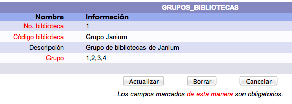

### Descripciones de campos

La tabla _descripción_ guarda las descripciones de los campos que se presentan en las pantallas de acceso, edición de datos y en los reportes. Mediante el uso de esta tabla se pueden "localizar" los términos para adecuar el sistema a las necesidades del usuario final.

Los campos para definir una entrada en la tabla son los siguientes:

+ **Etiqueta:** el nombre de la etiqueta a convertir. Cuando se encuentre un campo de cualquier tabla que se llame de la misma forma que la etiqueta definida aquí, la descripción a desplegar e imprimir serán la definida para este registro, en lugar del nombre del campo en la base de datos.

+ **Descripción corta para captura:** palabra o frase que se muestra en el ingreso y modificación de datos.

+ **Descripción larga para reportes:** palabra o frase que se usa en la impresión de los reportes del sistema.

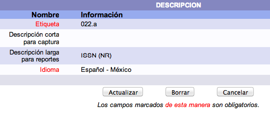

### Idiomas

La tabla de _idiomas_ contiene los idiomas soportados por el sistema.

Los campos necesarios para definir un idioma dentro del sistema son los siguientes:

+ **Idioma:** código numérico que identifica al idioma dentro del sistema. <u>Este código es único y no es repetible</u>.

+ **Descripción:** descripción del idioma.

### Control de impresoras

**NOTA**: parámetro obsoleto, que será eliminado próximamente.

Es posible definir varias colas de impresión y asociarlas a usuarios específicos o a grupos de usuarios, así como a funciones o programas particulares. También se puede definir una impresora por omisión a la que se envíen todos los reportes.

La prioridad de impresión es la siguiente: primero trata de imprimir en la impresora <u>definida para el programa</u>, si no encuentra una definición para el programa, intenta usar la <u>definida para el usuario</u>. Si el usuario no tiene definida una impresora, intenta con la <u>definida para un grupo de usuarios</u>. Por último, envía el reporte a la impresora <u>definida por omisión</u>.

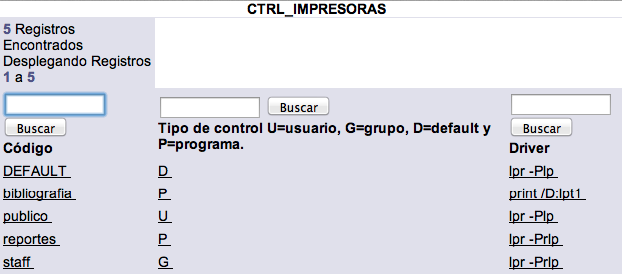

Los campos necesarios para definir una impresora en la tabla _ctrl impresoras_ son los siguientes:

+ **Código:** código alfanumérico que identifica a la impresora dentro del sistema. <u>Este código es único y no es repetible</u>.

+ **Tipo de control:** U=usuario, G=grupo, D=defecto y P=programa.

+ **Driver:** programa o _driver_ de impresión. Por ejemplo, _lpr -Plp_.

+ **No. de líneas por página:** define el largo de la página.

+ **No. de columnas en la página:** define el ancho de la página.

+ **Instrucciones para salto de página:** caracteres de control para salto de página.

+ **Instrucciones para densidad de impresión:** caracteres de control para modificar la densidad de impresión.

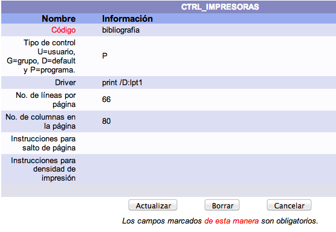

### Definición de URL´S por sistemas de automatización

El sistema Janium permite consultar catálogos externos y otras bases de datos mediante el uso de la tecnología CGI (_Common Gateway Interface_). Para configurar estos elementos de conexión se debe usar la tabla _instrucciones url_.

Los campos necesarios para definir un _cgi_ de consulta son los siguientes:

+ **Código sistema:** código alfanumérico que identifica al sistema externo. <u>Este código se puede repetir</u>.

+ **Índice:** número de índice con el que se hace la equivalencia de búsqueda. Por ejemplo, si el índice del sistema Janium número 50 es el de ISBN, cuando se seleccione el catálogo externo y se realice una búsqueda en ese otro catálogo, se usará el _cgi_ de este registro para obtener registros por ISBN.

+ **Instrucciones para URL:** contiene el URL con la información necesaria para obtener resultados. Es importante tener en cuenta que se debe usar el comodín \*TERMINO\* para remplazar, dentro del _cgi_, el término de búsqueda que es ingresado en el catálogo al público.

	Por ejemplo, en este campo puede introducirse la siguiente secuencia: http://108.226.6.4/uhtbin/issnsearch? *TERMINO*. Sin embargo, al llevar a cabo en el catálogo al público la búsqueda por el ISBN 1234567890, se usará el siguiente _cgi_ para conectarse a la fuente externa: http://108.226.6.4/uhtbin/issnsearch?1234567890.

### Definición de URL´S para búsquedas en otros catálogos

Este parámetro permite establecer consultas con otros sitios de referencia. Los sitios pueden ser <u>servidores Z39.50</u>, <u>portales web</u> o <u>buscadores</u>. Estos tres tipos de recursos se definen en la tabla _sitios_.

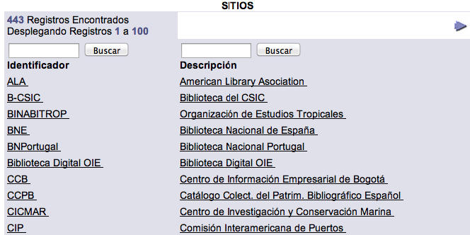

#### Servidores Z39.50

Para definir un sitio Z39.50 deben completarse los siguientes campos de la forma indicada:

+ **Identificador:** código alfanumérico que identifica al sitio dentro del sistema. <u>Este código es único y no se puede repetir</u>.

+ **Descripción:** nombre completo del sitio.

+ **Código biblioteca:** código o nombre abreviado del sitio que se va a desplegar en los resultados.

+ **URL:** el enlace de conexión del servidor Z39.50.

+ **Clave Usuario:** dato de autenticación del usuario. Este campo es opcional ya que sólo algunos servidores piden al usuario que se registre para poder hacer consultas.

+ **Contraseña:** dato de autenticación para poder tener acceso al servidor. Este campo también es opcional y está relacionado con el anterior.

+ **Sistema:** tipo de sistema al que se va a conectar. Para servidores Z39.50 se debe ingresar aquí: _Z3950_.

+ **Instrucciones:** para el caso de los servidores Z39.50, este campo debe dejarse en blanco ya que no se usa.

+ **URL principal:** URL de la página principal del sitio. Este campo es distinto al anterior _URL_.

+ **Puerto:** puerto o _socket_ por donde el servidor establece la comunicación con el sistema Janium. Si cuenta con un _firewall_ es importante permitir en él el paso de información de este _socket_ para poder comunicarse con el servidor.

+ **Base de datos:** nombre de la base de datos con la que se va a efectuar la conexión.

+ **Activo (1 = Sí, 0 = No):** indica si esta entrada aparecerá en la lista desplegable de selección del catálogo al público.

#### Portales web

Para definir un portal web deben completarse los siguientes campos de la forma indicada:

+ **Identificador:** código alfanumérico que identifica al portal dentro del sistema. <u>Este código es único y no se puede repetir</u>.

+ **Descripción:** nombre completo del portal.

+ **Código biblioteca:** código o nombre abreviado del portal que se va a desplegar en los resultados.

+ **URL:** el enlace del portal con el _cgi_ de búsqueda.

+ **Clave Usuario:** para el caso de los portales web, este campo debe dejarse en blanco ya que no se usa.

+ **Contraseña:** para el caso de los portales web, este campo debe dejarse en blanco ya que no se usa.

+ **Sistema:** tipo de sistema al que se va a conectar. Para portales web se debe ingresar aquí: _referenciabib_.

+ **Instrucciones:** para el caso de los portales web, este campo debe dejarse en blanco ya que no se usa.

+ **URL principal:** URL de la página principal del portal. Este campo es distinto al anterior _URL_.

+ **Puerto:** para el caso de los portales web, este campo debe dejarse en blanco ya que no se usa.

+ **Base de datos:** para el caso de los portales web, este campo debe dejarse en blanco ya que no se usa.

+ **Activo (1 = Sí, 0 = No):** indica si esta entrada aparecerá en la lista desplegable de selección del catálogo al público.

#### Buscadores

Para definir un buscador deben completarse los siguientes campos de la forma indicada:

+ **Identificador:** código alfanumérico que identifica al buscador dentro del sistema. <u>Este código es único y no se puede repetir</u>.

+ **Descripción:** nombre completo del buscador.

+ **Código biblioteca:** código o nombre abreviado del buscador que se va a desplegar en los resultados.

+ **URL:** el enlace del buscador con el _cgi_ de búsqueda. Por ejemplo: http://www.google.com/search?hl=es&safe=off&lr=lang\_es&q=

+ **Clave Usuario:** para el caso de los buscadores, este campo debe dejarse en blanco ya que no se usa.

+ **Contraseña:** para el caso de los buscadores, este campo debe dejarse en blanco ya que no se usa.

+ **Sistema:** tipo de sistema al que se va a conectar. Para buscadores se debe ingresar aquí: _buscador_.

+ **Instrucciones:** para el caso de los buscadores, este campo debe dejarse en blanco ya que no se usa.

+ **URL principal:** URL de la página principal del buscador. Este campo es distinto al anterior _URL_.

+ **Puerto:** para el caso de los buscadores, este campo debe dejarse en blanco ya que no se usa.

+ **Base de datos:** para el caso de los buscadores, este campo debe dejarse en blanco ya que no se usa.

+ **Activo (1 = Sí, 0 = No):** indica si esta entrada aparecerá en la lista desplegable de selección del catálogo al público.

### Administración de Referencista electrónico

**NOTA**: la información recogida aquí sobre esta sección del módulo de Administración debe complementarse con la que se encuentra en el manual concreto de la función **Referencista**.

#### Columnas del Referencista

El número de columnas que aparecen en el Referencista se puede modificar accediendo a la sección _Configuración general_, a continuación a _Parámetros generales_, y ahí, seleccionando la opción **num col busq pred**.

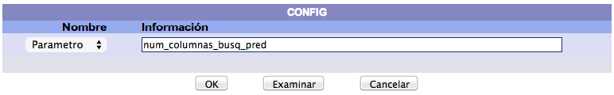

Una vez dentro de la pantalla de edición del parámetro, cambiar el valor del campo **valor1** por el número de elementos que se desea desplegar por columna.

#### Creación de registros del Referencista

Para crear un elemento del Referencista, el sistema Janium solicita tres parámetros básicos:

+ **Id grupo:** representado por un número entero que sirve para identificar a un grupo.

+ **Grupo:** es el nombre con el que se reconocerá al grupo. Es sensible a mayúsculas y minúsculas y no debe contener espacios en blanco.

+ **Orden de despliegue:** se refiere a la posición en que aparecerá el elemento dentro del Referencista. No debe haber dos o más elementos de un mismo grupo que tengan igual orden de despliegue.

Después de completar los campos anteriores y hacer clic en el botón _Crear_, se desplegará el registro para crear el nuevo elemento del Referencista, cuyos campos restantes son los siguientes:

+ **URL Imagen:** se debe ingresar la dirección donde se encuentra la imagen que va a aparecer como representación visual del elemento dentro del Referencista. El sistema Janium acepta cualquier tipo de imagen que pueda ser visible en web.

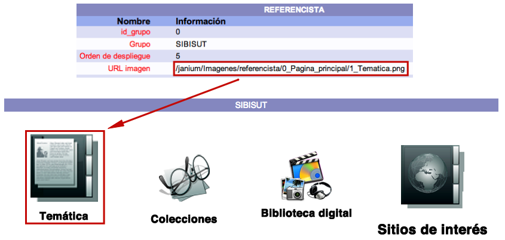

+ **Descripción:** texto breve que sirve para indicar al usuario (además de la representación gráfica) cuál es el tema, proyecto, perfil o acción al que está ligado el elemento del Referencista.

+ **Código del estado:** indica si el elemento recién creado estará visible o no desde el catálogo al público. Las opciones son:

	+ 1 = despliega el elemento en el catálogo.

	+ 0 = no despliega el elemento en el catálogo.

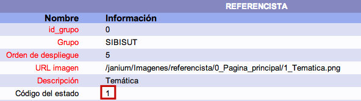

+ **Acción:** indica cuál va a ser la función que realizará el elemento del Referencista. Las opciones son:

	+ 1 = realiza búsquedas en el catálogo, por _palabra clave_ o _alfabética_.

	+ 2 = crea un enlace a un grupo dentro del Referencista.

	+ 3 = crea un enlace a una página, sitio o documento que se encuentre en internet.

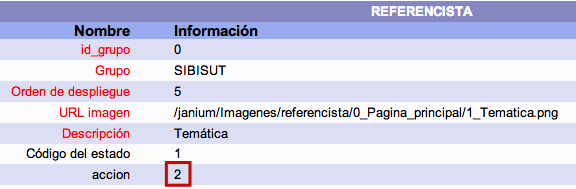

+ **Tipo:** indica el modo de búsqueda que se desea realizar. Las opciones son:

	+ <u>Si el código de acción es 1</u>:
		+ A = búsqueda alfabética. 
		+ P = búsqueda por palabra clave.
		+ C = búsqueda combinada.
		+ T = búsqueda por tags.

	+ <u>Si el código de acción es 2</u>:
		+ G = acceso a un grupo del Referencista.
	+ <u>Si el código de acción es 3</u>:
		 - I = acceso a un recurso externo.

+ **Instrucciones:** indica al Referencista los valores que va a buscar de acuerdo a lo que se configuró en los campos <u>acción</u> y <u>tipo</u>. Si el tipo es de _palabra clave_, los valores deben ingresarse con mayúsculas.

	Varios comentarios en este contexto:
	 
	+ La instrucción LITERATURA NOT KING va a hacer que se busque el término "literatura" por _palabra clave_, pero que no se incluyan los registros que contengan el término "king".
	+ Si la acción es **1** (búsqueda en el catálogo) y el tipo es **A** (alfabética), se debe ingresar el término o términos separados por espacios, sin acentos. Ejemplo: historia universal.
	+ Si la acción es **1** (búsqueda en el catálogo) y el tipo es **P** (palabra clave), se debe ingresar el término o términos separados por espacios, sin acentos y en mayúsculas. Ejemplo: MEXICO CONSTITUCION POLITICA.
	+ Si la acción es **2**, se debe colocar el nombre del grupo al que se desea ir. Debe ser escrito igual que el que está indicado en el campo _Grupo_. Ejemplos: BIBLIOTECA, grupo1, Principal, etc.
	+ Si la acción es **3**, cuando se trata de un enlace a una página web se debe colocar la dirección electrónica completa, incluyendo el indicador _http://_. Ejemplo: http://www.google.com.

+ **No. Índice:** este parámetro es importante cuando el valor en el campo de acción es **1** (búsqueda en el catálogo) y el tipo es **A** o **P**, ya que el sistema Janium identifica el índice en el que deberá realizar la búsqueda. Es necesario que se seleccione correctamente, debido a que, si se indicó que va a realizar una búsqueda por palabra clave y se selecciona un índice alfabético, o viceversa, el sistema no encontrará registros en el sistema.

+ **Nivel de seguridad:** indica el nivel asignado que debe tener el usuario para poder ver este elemento del Referencista. Debe ser menor o igual, de lo contrario no se le mostrará.

+ **Biblioteca:** en un entorno "multibiblioteca", el sistema Janium permite seleccionar la biblioteca en la que debe realizar la búsqueda. Si no se selecciona ninguna, se realizará la búsqueda en todas las bibliotecas.

+ **Ubicación:** este parámetro indica en qué colección o ubicación se desea realizar la búsqueda. Si no se selecciona ninguna, se realizará la búsqueda en toda la colección.

+ **Formato:** este parámetro permite seleccionar el formato de los materiales que se desean localizar. Si no se selecciona ningún formato, se realizará la búsqueda en todos los formatos existentes en la biblioteca.

### Comandos del sistema operativo

Esta sección regula el direccionamiento a los programas del sistema Janium que se utilizan para obtener los textos de los documentos asociados como objetos digitales a registros. Dicho de otra forma, está relacionada con el proceso de indización de texto completo y los comandos que intervienen en él.

Los campos necesarios para definir un comando del sistema operativo son los siguientes:

+ **Código:** nombre o identificador del comando dentro del sistema.

+ **Tipo de sistema:** 1 = Unix/Linux, o bien 2 = Windows.

+ **Descripción:** texto breve para describir el propósito del comando.

+ **Comando:** instrucción específica que sirve para ejecutar la acción en cuestión.

+ **Extensión del archivo:** indicación del tipo de documento a tratar.

+ **Comando recursivo (1 = Sí, 0 = No):** campo que permite al comando repetir su ejecución al encontrar varios ficheros dentro de una misma carpeta o archivo. Por ejemplo, indizando sucesivamente tres documentos en formato _pdf_ contenidos dentro de un fichero comprimido.

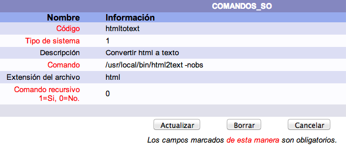

### Conexiones al sistema

Controla de manera detallada las conexiones que se han realizado al sistema Janium.

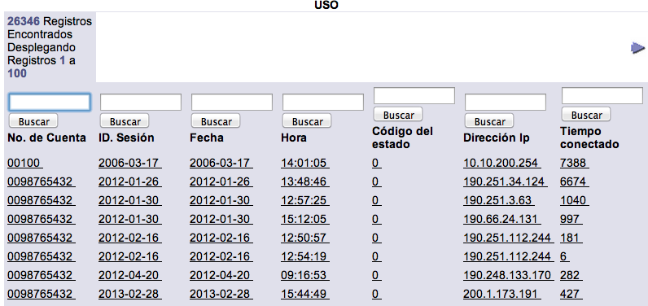

Los campos que se presentan en un registro de conexión al sistema son los siguientes:

+ **Fecha:** año, mes y día concretos en que se realizó la conexión, en formato AAAA-MM-DD.

+ **Hora de inicio de sesión**: hora, minutos y segundos concretos en los que comenzó la conexión, en formato HH:MM:SS.

+ **Número de cuenta:** cuenta de usuario del sistema Janium que se usó para realizar la conexión.

+ **ID. Sesión:** identificador único y no repetible de la sesión de conexión asignado automáticamente por el sistema.

+ **Código del estado:** indica si la conexión aún está activa (1) o no (0).

+ **Dirección IP de la máquina:** dirección que identifica al dispositivo que ha llevado a cabo la conexión.

+ **Tiempo que ha durado la sesión:** cifra en segundos totales que muestra el tiempo que ha durado la conexión.

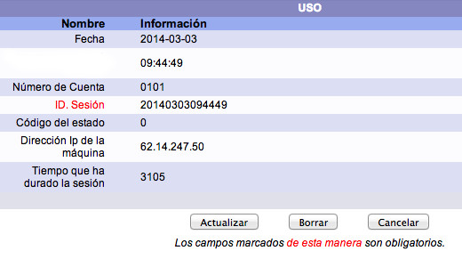

### Restricción de número de resultados en el OPAC

Permite limitar la cantidad de resultados que se le van a mostrar al usuario en los sumarios del catálogo al público al realizar búsquedas.

Los campos que se presentan en un registro de restricción de número de resultados en el catálogo al público son los siguientes:

+ **Número de cuenta:** cuenta del usuario del sistema para el que se va a aplicar la restricción.

+ **Limite:** valor numérico que representa la restricción a aplicar.

### Configuración de raíces de recursos vinculados

Se usa para establecer los directorios del sistema Janium en los que se van a almacenar los distintos objetos digitales asociados a los registros de la base de datos.

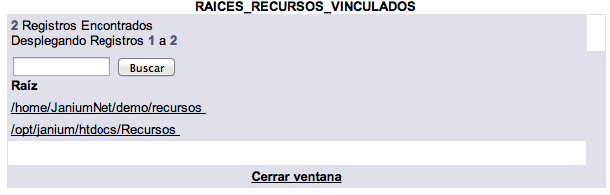

Los campos que se presentan en un registro de configuración de raíces de recursos vinculados son los siguientes:

+ **Raíz:** es la ruta completa que se define para poder almacenar y buscar los recursos vinculados.

+ **Directorio virtual:** es una ruta más breve derivada de la anterior cuyo propósito es, por un lado, mantener una estructura segura del sistema no permitiendo visualizar de manera pública niveles de directorios superiores y, por otro, simplificar las acciones de los usuarios a la hora de crear objetos digitales.

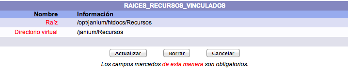

### Impresión de etiquetas

Este parámetro controla todos los elementos que intervienen en el proceso de impresión de las etiquetas que se colocan en los materiales para que queden identificados.

#### Tipos de papel

Establece los formatos de papel admitidos para la impresión, así como sus dimensiones.

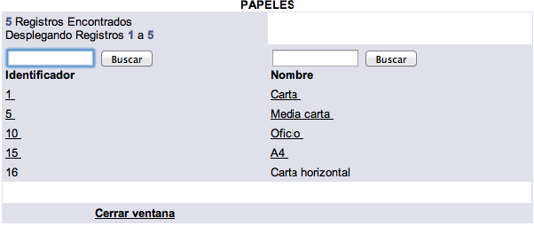

Los campos que se presentan en un registro de tipos de papel son los siguientes:

+ **Identificador:** valor numérico único y no repetible que identifica al tipo de papel dentro del sistema.

+ **Nombre:** nombre con el que se conoce al formato de papel.

+ **Altura en 72os. de pulgada:** valor numérico para este concepto tomando como referencia la fracción de pulgada indicada.

+ **Anchura en 72os. de pulgada:** valor numérico para este concepto tomando como referencia la fracción de pulgada indicada.

#### Modelos de etiquetas

Establece los estándares de formatos de etiquetas admitidos para la impresión.

Los campos que se presentan en un registro de modelos de etiquetas son los siguientes:

+ **Identificador:** valor que identifica de forma única e irrepetible al modelo de etiqueta dentro del sistema.

+ **Nombre:** nombre descriptivo sobre el modelo de etiqueta.

+ **Tipo de papel:** relacionado con la sección explicada antes.

+ **Número de etiquetas por página:** cantidad de etiquetas que van a imprimirse por cada página introducida.

+ **Número de columnas por etiquetas:** cantidad de columnas, dentro de cada etiqueta, en que va a distribuirse la información a imprimir.

+ **Distancia del borde izquierdo de la página a la primera etiqueta en 72os. de pulgada:** valor numérico para este concepto tomando como referencia la fracción de pulgada indicada.

+ **Distancia del borde superior de la página a la primera etiqueta en 72os. de pulgada:** valor numérico para este concepto tomando como referencia la fracción de pulgada indicada.

+ **Altura en 72 os. de pulgada:** valor numérico para este concepto tomando como referencia la fracción de pulgada indicada.

+ **Anchura en 72os. de pulgada:** valor numérico para este concepto tomando como referencia la fracción de pulgada indicada.

+ **Distancia horizontal entre etiquetas en 72os. de pulgada:** valor numérico para este concepto tomando como referencia la fracción de pulgada indicada.

+ **Distancia vertical entre etiquetas en 72os. de pulgada:** valor numérico para este concepto tomando como referencia la fracción de pulgada indicada.

#### Impresoras de etiquetas

Establece los dispositivos que van a usarse de forma predeterminada para la impresión de etiquetas.

Los campos que se presentan en un registro de impresoras de etiquetas son los siguientes:

+ **Identificador:** valor que identifica de forma única e irrepetible a la impresora dentro del sistema.

+ **Nombre:** nombre descriptivo sobre el tipo de impresora.

+ **Distancia extra desde el borde izquierdo de la página a la primera etiqueta (puede ser negativa) en 72os. de pulgada:** valor numérico para este concepto tomando como referencia la fracción de pulgada indicada.

+ **Distancia extra desde el borde superior de la página a la primera etiqueta (puede ser negativa) en 72os. de pulgada:** valor numérico para este concepto tomando como referencia la fracción de pulgada indicada.

+ **Margen izquierdo de área imprimible en 72os. de pulgada:** valor numérico para este concepto tomando como referencia la fracción de pulgada indicada.

+ **Margen derecho de área imprimible en 72os. de pulgada:** valor numérico para este concepto tomando como referencia la fracción de pulgada indicada.

+ **Margen superior de área imprimible en 72os. de pulgada:** valor numérico para este concepto tomando como referencia la fracción de pulgada indicada.

+ **Margen inferior de área imprimible en 72os. de pulgada:** valor numérico para este concepto tomando como referencia la fracción de pulgada indicada.

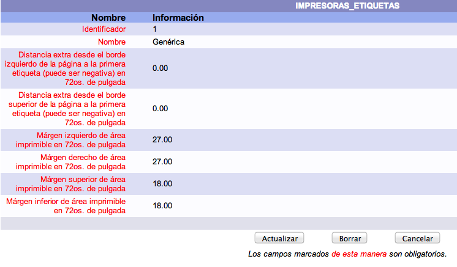

#### Formatos de etiquetas

Este parámetro relaciona y une los datos introducidos en las secciones _Modelos de etiquetas_ e _Impresoras de etiquetas_, explicadas anteriormente.

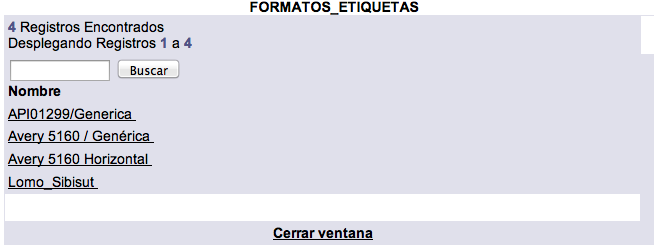

Los campos que se presentan en un registro de formatos de etiquetas son los siguientes:

+ **Nombre:** nombre descriptivo sobre el formato de etiquetas.

+ **Modelo de etiquetas:** el contenido de este campo debe coincidir con uno de los registros de la sección _modelos de etiquetas_.

+ **Impresora:** el contenido de este campo debe coincidir con uno de los registros de la sección _impresoras de etiquetas_.

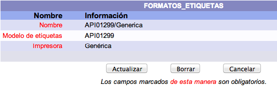

#### Lomos / Tejuelos

##### Campos a imprimir en los lomos / tejuelos

En este parámetro se determinan los campos que van a ser impresos en las etiquetas de lomos / tejuelos, teniendo en cuenta los datos existentes en los registros de ejemplar: <u>número de clasificación</u>, <u>volumen</u>, <u>número</u>, <u>tomo</u>, <u>copia</u>, <u>parte</u> e <u>información adicional</u>. No obstante, de forma previa a la configuración se debe conocer el **número de campos** de que se compondrá la clasificación.

A continuación, se muestran tres ejemplos de posibles distribuciones para una misma clasificación:

+ **T151.G518 2008**
	campo 1: T151
	campo 2: .G518
	campo 3: 2008

+ campo 1: T151.G518
	campo 2: 2008

+ campo 1: T
	campo 2: 151
	campo 3: .G518
	campo 4: 2008

En estos casos, el elemento que se utiliza como **separador de campos** es el <u>espacio</u>, pero también puede usarse el <u>punto</u>. De esta manera, y dependiendo de las necesidades de impresión de la institución, se puede realizar la configuración requerida. Aunque cabe mencionar que este proceso dependerá también de la forma en que la información es capturada en los registros.

A cada campo se le debe asignar un valor numérico, como parte del proceso de configuración y este número debe ser colocado entre corchetes ([]). Dicho esto, si es colocado únicamente el número (ejemplo: [1]) significa que el separador de campos puede ser, indistintamente, el <u>punto</u> o el <u>espacio</u>. Por otro lado, si es colocado el número con la letra _b_ como prefijo (ejemplo: [b1]) significa que sólo será considerado como separador de campos el <u>espacio</u>.

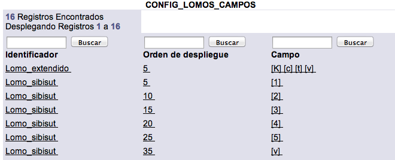

Los campos que se presentan en un registro de campos a imprimir en los lomos / tejuelos son los siguientes:

+ **Identificador:** nombre que identifica de forma única e irrepetible al tipo de configuración dentro del sistema.

+ **Orden de despliegue:** valor numérico que tendrá el campo dentro del grupo. Este número determina el orden de impresión que le corresponde.

+ **Campo:** clave relacionada con el campo que se desea crear (<u>ver lista de configuración autorizada para campos</u>).

+ **Alineación:** aquí se debe escribir uno de los siguientes valores:

	+ **\>** si la alineación debe ser a la derecha.
	+ **\<** si la alineación debe ser a la izquierda.
	+ **|** si la alineación debe ser al centro.

Además, la codificación que se debe usar para agregar la información complementaria es la siguiente:

+ [v] : Volumen.

+ [n] : Número.

+ [t] : Tomo.

+ [c] : Ejemplar o copia (incluso para la copia 1).

+ [C] : Ejemplar o copia (excepto para la copia 1).

+ [p] : Parte.

+ [i] : Información adicional del ítem.

+ [cb] : Código de biblioteca.

+ [nb] : Número de biblioteca.

+ [na] : Número de adquisición.

+ [nu]: Número de ubicación.

+ [cu]: Código de ubicación.

+ [B]: Código de barras.

+ [K]: Clasificación completa.

+ [BLANCO]: Línea en blanco.

##### Configuración de lomos / tejuelos

En relación con la sección anterior, para los ejemplos mencionados se utilizaría la siguiente configuración:

**T151.G518 2008**

Ejemplo 1

Ejemplo 2

Ejemplo 3

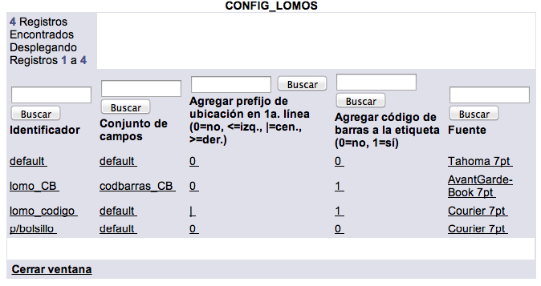

Los campos que se presentan en un registro de configuración de lomos / tejuelos son los siguientes:

+ **Identificador:** nombre que identifica de forma única e irrepetible al tipo de configuración dentro del sistema.

+ **Conjunto de campos a imprimir:** grupo de campos que va a ser utilizado para la impresión de las etiquetas de lomos / tejuelos.

+ **Fuente:** tipo y tamaño de letra que se va a aplicar en la impresión.

+ **Agregar prefijo de ubicación en 1a. línea:** se debe elegir uno de los siguientes valores:

	+ **0** si no desea imprimir el prefijo de ubicación.
	+ **\<** el prefijo será impreso y alineado al lado izquierdo.
	+ **|** el prefijo será impreso y alineado al centro.
	+ **\>** el prefijo será impreso y alineado al lado derecho.

+ **Agregar código de barras a la etiqueta:** se debe elegir uno de los siguientes valores:

	+ **1** sí se agregará el código de barras a la etiqueta.
	+ **0** no se agregará el código de barras a la etiqueta.

#### Bolsillos

##### Campos a imprimir en los bolsillos

En este parámetro se definen los campos que van a ser impresos en las etiquetas de bolsillos, pudiendo ser estos: <u>autor</u>, <u>título</u>, <u>código de barras</u>, <u>código de ubicación</u> y <u> clasificación del ítem. </u>

Los campos que se presentan en un registro de campos a imprimir en los bolsillos son los siguientes:

+ **Identificador:** nombre que identifica de forma única e irrepetible al grupo de campos que se va a crear. Los campos a imprimir en los bolsillos deben permanecer bajo el mismo identificador.

+ **Orden de despliegue:** valor numérico que tendrá el campo dentro del grupo. Este número determina el orden de impresión que le corresponde.

+ **Campo:** se debe elegir uno de los siguientes valores:

	+ [autor] : si el campo a crear es _Autor_.
	+ [titulo] : si el campo a crear es _Título_.
	+ [codbarras] : si el campo a crear es _Código de barras_.
	+ [ubicacion]: si el campo a crear es _Código de ubicación_.
	+  [clasificacion]: si el campo a crear es _Clasificación del ítem_.
	+ [BLANCO]: si se quiere introducir una línea en blanco.

+ **Alineación:** se debe elegir uno de los siguientes valores:

	+ **\<** si será alineado el campo a la izquierda.
	+ **|** si será alineado el campo al centro.
	+ **\>** si será alineado el campo a la derecha.

+ **Fuente:** tipo y tamaño de letra que se va a aplicar en la impresión.

+ **Ancho máximo (caracteres):** número de caracteres que tendrá cada línea donde se imprima este campo.

+ **Número blancos al inicio de la primera línea:** número de caracteres que se dejarán en blanco antes de iniciar la impresión de la información en la primera línea. Funciona como _sangría_ hacía la derecha.

+ **Número blancos al inicio de las segundas líneas:** número de caracteres que se dejarán en blanco antes de iniciar la impresión de la información en la segunda línea. Funciona como _sangría_ hacia la derecha.

+ **Número blancos al inicio de la primera línea después de línea blanca o con distinta alineación:** número de caracteres que se dejarán en blanco antes de iniciar la impresión de la información en la primera línea después de la colocación de una línea en blanco o con distinta alineación.

+ **Número blancos al inicio de las segundas líneas después de línea blanca o con distinta alineación:** número de caracteres que se dejarán en blanco antes de iniciar la impresión de la información en la segunda línea después de la colocación de una línea en blanco o con distinta alineación.

+ **Truncar en la 1a. línea:** se debe elegir uno de los siguientes valores:

	+ **0** si la información no será truncada en la primera línea.
	+ **1** si la información será truncada en la primera línea.

##### Configuración de bolsillos

Aquí se define el grupo de campos que van a ser considerados para la impresión de los bolsillos, así como la posibilidad de agregar a esta impresión las de las etiquetas de lomos / tejuelos y código de barras.

Los campos que se presentan en un registro de configuración de bolsillos son los siguientes:

+ **Identificador:** nombre que identifica de forma única e irrepetible al tipo de configuración dentro del sistema.

+ **Conjunto de campos a imprimir:** grupo de campos que va a ser utilizado para la impresión de las etiquetas.

+ **Agregar lomo a la etiqueta:** se debe elegir uno de los siguientes valores:

	+ **0**, no será impresa la etiqueta de lomo / tejuelo junto con la etiqueta de bolsillo.
	+ **1**, sí será impresa la etiqueta de lomo / tejuelo junto con la etiqueta de bolsillo.

+ **Agregar código de barras a la etiqueta:** se debe elegir uno de los siguientes valores:

	+ **0**, no será impreso el código de barras junto con la etiqueta de bolsillo.
	+ **1**, sí será impreso el código de barras junto con la etiqueta de bolsillo.

#### Códigos de barras

##### Esquemas

En este parámetro están configurados los esquemas utilizados para la generación de los códigos de barras. Son los siguientes:

+ **Codabar:** código de barras numérico de alta densidad. Incluye 16 caracteres: números 0-9, “-”, “.”, “:”, “$”, “/” y “+”. Además, incluye cuatro caracteres especiales (A, B, C, D) que se utilizan como elementos de _start_ y _stop_, y que no aparecen en la interpretación del código.

+ **Código 128:** código alfanumérico de alta densidad. Puede codificar 106 caracteres diferentes y se compone de tres subgrupos (A, B y C), que equivalen a distintas formas de interpretar la información codificada.

+ **Código 39:** fue el primer código alfanumérico y es el código de barras más empleado para uso no comercial. En su versión estándar se codifican 43 caracteres: A-Z, 0-9, espacio y “-”, “.”, “ ”, “$”, “/”, “+”, “%”. <u>Este es el esquema utilizado por omisión en el sistema Janium</u>.

Los campos que se presentan en un registro de esquemas de códigos de barras son los siguientes:

+ **Identificador:** nombre que identifica de forma única e irrepetible al tipo de esquema dentro del sistema.

+ **Descripción:** texto breve para explicar en qué consiste el esquema elegido.

##### Configuración de códigos de barras

Aquí se configura el esquema de códigos de barras que va a ser utilizado, así como los tipos de letra a aplicar para la interpretación y encabezado de dichos códigos.

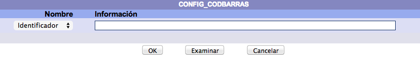

Los campos que se presentan en un registro de configuración de códigos de barras son los siguientes:

+ **Identificador:** nombre que identifica de forma única e irrepetible al tipo de configuración dentro del sistema.

+ **Esquema de códigos de barras:** el valor de este campo debe ser tomado del parámetro explicado anteriormente.

+ **Agregar interpretación del código de barras:** se debe elegir uno de los siguientes valores:

	+ **1**, sí será agregada la interpretación numérica del código de barras.
	+ **0**, no será agregada la interpretación numérica del código de barras.

+ **Fuente para la interpretación:** tipo y tamaño de la letra utilizado para imprimir la interpretación del código de barras.

+ **Encabezado del código de barras:** encabezado que será utilizado en la impresión de códigos de barras.

+ **Fuente para el encabezado:** tipo y tamaño de la letra utilizado para imprimir el encabezado del código de barras.

#### Colocación de información en las etiquetas

Sirve para configurar la posición donde se iniciará la impresión de la información en la etiqueta. Esto se aplica para los tres tipos de etiquetas: <u>lomo / tejuelo</u>, <u>bolsillo</u> y <u>código de barras</u>.

Además, se debe considerar el **tamaño de la etiqueta** configurada previamente, para determinar la posición de la información y evitar errores de configuración, ya que dicha información podría exceder del <u>espacio físico</u> de la etiqueta.

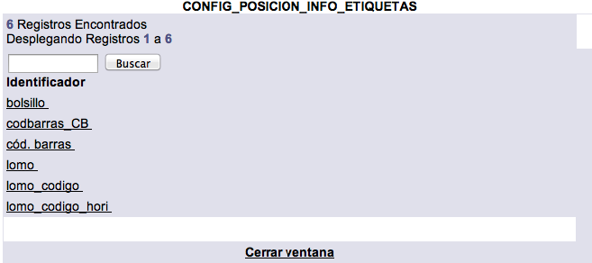

Los campos que se presentan en un registro de colocación de información en las etiquetas son los siguientes:

+ **Identificador:** nombre que identifica de forma única e irrepetible al tipo de configuración dentro del sistema.

+ **Distancia del borde izquierdo de la etiqueta a la primera línea del lomo en 72os. de pulgada:** distancia izquierda que se debe considerar antes de la impresión de la información del lomo / tejuelo.

+ **Distancia del borde superior de la etiqueta a la primera línea del lomo en 72os. de pulgada:** distancia superior que se debe considerar antes de la impresión de la información del lomo / tejuelo.

+ **Distancia del borde izquierdo de la etiqueta a la primera línea del bolsillo en 72os. de pulgada:** distancia izquierda que se debe considerar antes de la impresión de la información del bolsillo.

+ **Distancia del borde superior de la etiqueta a la primera línea del bolsillo en 72os. de pulgada:** distancia superior que se debe considerar antes de la impresión de la información del bolsillo.

+ **Distancia del borde izquierdo de la etiqueta al borde izquierdo del código de barras en 72os. de pulgada:** distancia izquierda que se debe considerar antes de la impresión del código de barras.

+ **Distancia del borde superior de la etiqueta al borde superior del código de barras en 72os. de pulgada:** distancia superior que se debe considerar antes de la impresión del código de barras.

+ **Ángulo de rotación del código de barras:** grado de rotación del código de barras. Si no existe este dato, se debe escribir 0.

+ **Ancho del código de barras en 72os. de pulgada:** ancho que tendrá el código de barras.

+ **Alto del código de barras en 72os. de pulgada:** altura que tendrá el código de barras.

#### Calibración de impresión de etiquetas

Esta función permite ajustar diferentes elementos estructurales que intervienen en el proceso de impresión de etiquetas de lomo / tejuelo, bolsillo y código de barras, para tratar de conseguir el mejor resultado posible en la impresión definitiva y evitando así posibles errores de configuración que se podrían traducir, por ejemplo, en <u>información mal encuadrada</u> dentro de las etiquetas o en un <u>exceso de tamaño</u> de esta, que sobrepasase los límites fijados para dichas etiquetas.

La pantalla de calibración de impresión de etiquetas presenta tres categorías principales, en las que se podrán regular aspectos como el **formato** y las **distancias extras**, además de poder verificar el resultado final de los parámetros elegidos anteriormente (esquema de colocación, configuración de impresión) mediante el uso de **hojas de calibración** y **hojas de prueba**.

En este contexto, conviene explicar algunos conceptos y definiciones:

+ **Distancia extra izquierda:** espacio adicional que, si se indica, se añadirá en la parte izquierda de las etiquetas, sumándolo al ya definido.

+ **Distancia extra superior:** espacio adicional que, si se indica, se añadirá en la parte superior de las etiquetas, sumándolo al ya definido.

+ **Hojas de calibración:**

	+ <u>Producir hoja de reglas:</u> al hacer clic sobre esta opción, se genera un fichero en formato _**pdf**_ que muestra una regla horizontal y otra vertical, que se puede usar para revisar las dimensiones configuradas en comparación con la hoja física.

	+ <u>Producir hoja de cajas:</u> al hacer clic sobre esta opción, se genera un fichero en formato _**pdf**_ que muestra una estructura de rectángulos e indicaciones, que se puede usar para revisar la configuración establecida para los márgenes.

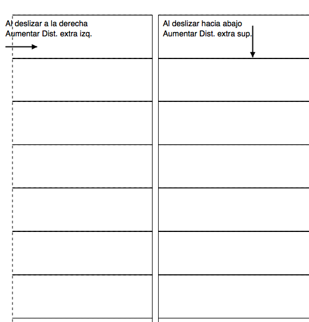

### Tags

**NOTA**: la información recogida sobre esta sección del módulo de Administración debe complementarse con la que se encuentra en el manual de **catálogo al público**.

#### Usuarios que pueden crear tags públicas

En primer lugar, es importante mencionar que no todos los usuarios registrados en el sistema Janium tienen la posibilidad de crear _tags_ de tipo público, es decir, que puedan ser vistas por todas las personas que accedan al catálogo al público, o de asociar registros bibliográficos a estas categorías. Por lo tanto, para que un usuario pueda utilizar esta función es necesario registrarlo en este parámetro.

Los campos que se presentan en un registro de usuarios que pueden crear _tags_ públicas son los siguientes:

+ **Número de cuenta:** número de cuenta asignado al usuario al que se le ha concedido permiso para poder crear _tags_ públicas.

#### Tags públicas y usuarios que las crearon

A través de esta sección se establece la relación entre las <u>_tags_ públicas</u> ya creadas y los <u>usuarios</u> responsables de haberlas creado.

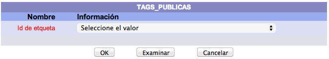

Los campos que se presentan en un registro de _tags_ públicas y usuarios que las crearon son los siguientes:

+ **Id de etiqueta:** identificador único e irrepetible de la _tag_ dentro del sistema. Equivale al nombre que aparece en el catálogo al público.

+ **Número de cuenta:** número de cuenta asignado al usuario que llevó a cabo la creación de la _tag_.

#### Lista de todas las tags

Listado completo de las _tags_ creadas en el sistema, <u>tanto públicas como privadas</u>.

Los campos que presenta un registro de esta sección son los siguientes:

+ **Identificador:** valor numérico único e irrepetible que identifica a la _tag_ dentro del sistema.

+ **Etiqueta:** nombre descriptivo de la _tag_.

+ **Número de cuenta:** número de cuenta asignado al usuario que llevó a cabo la creación de la _tag_.

### Ayuda

El sistema Janium cuenta con un conjunto de **ayudas contextuales** integrado con las distintas interfaces que utiliza el usuario y asociado a documentación e información técnica. Estas ayudas pueden consistir en ejemplos, instrucciones, observaciones o directrices que tienen como objetivo orientar al usuario en los variados procesos a realizar.

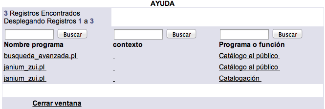

Los campos que se presentan en un registro de ayuda son los siguientes:

+ **Nombre programa:** nombre identificador del programa del sistema (_.pl_) que ejecuta la carga del sitio de ayuda correspondiente a la sección en que se esté. Este programa, a su vez, requiere de un fichero _html_ asociado, que es el que contiene toda la información.

+ **Contexto:** campo destinado para uso futuro del sistema.

+ **Programa o función:** descripción del área general a la que pertenece la opción elegida en _nombre programa_.

+ **URL:** enlace al recurso donde se encuentra alojado el contenido de la ayuda.

## Módulo de Catalogación [enlace5]

### Indización

El sistema Janium cuenta con un motor de búsqueda extremadamente
potente, que permite recuperar resultados utilizando índices de
**palabra clave**, **alfabéticos** y **directos**.

Los índices de palabra clave permiten recuperar información ingresando
uno o más términos de búsqueda en combinación con operadores *booleanos*
(AND, OR y NOT), para recuperar la información. Además, se pueden
componer sentencias de búsqueda con paréntesis, permitiendo agrupar los
términos de búsqueda. En la búsqueda por palabra clave se pueden
ingresar términos en cualquier orden y el resultado no varía.

Las consultas alfabéticas despliegan una lista de los términos por orden
alfabético. Esta búsqueda trabaja por “aproximación”, es decir,
despliega una lista en la que el término buscado se parece a los
resultados del índice. Los resultados alfabéticos presentan un número de
referencias que tienen esa entrada, por ejemplo, cuántos registros
contienen la misma materia.

Las búsquedas directas se efectúan sobre índices numéricos, en los que
el sistema busca exactamente la entrada que fue introducida.

#### Índices del sistema

Esta función permite definir qué índices mantiene el sistema, así como
modificar la lista de ellos.

Los campos que se presentan en un registro de índices del sistema son
los siguientes:

-   **No. Índice:** valor numérico único e irrepetible que identifica al
    índice dentro del sistema.

-   **Descripción:** nombre o texto breve descriptivo sobre el índice.

-   **Atributo Z39.50:** número del atributo Z39.50 que representa éste
    índice. Cuando una búsqueda de este tipo se identifique con su
    número de atributo, el índice que se usará será el que tenga un
    número igual al del atributo. Si el índice soporta más de un
    atributo, entonces debe separarse con el carácter **|**.

-   **Tabla:** nombre de la tabla, dentro del sistema Janium, que tiene
    almacenada la información del índice. Para el caso de los índices de
    autoridades es necesario anteponer el prefijo *aut* al nombre de la
    tabla. Por ejemplo, cuando se requiere un índice de autoridad para
    materia, si la tabla del índice se llama *materia*, el índice de
    autoridad de materia debe usar la tabla *autmateria*.

-   **Tipo:** tipo de índice: 1 = índice de palabra clave, 2 = índice
    alfabético y 3 = índice directo.

-   **Contexto:** tabla que se relaciona con el índice. Los valores de
    este campo pueden variar con las nuevas versiones. Actualmente, se
    usa el contexto *bib* para los índices relacionados con los
    registros bibliográficos y el contexto *aut* para los registros de
    autoridades.

-   **Índice alternativo:** valor numérico que identifica al mismo
    índice que se está definiendo, de forma alternativa.

#### Mapas de etiquetas

Los mapas de etiquetas definen el contenido de cada uno de los índices.
Cada mapa tiene asociada una **etiqueta** y un **subcampo** del formato
MARC. No importa que las etiquetas o los subcampos sean repetibles, el
sistema indizará todas las repeticiones de cada elemento con su
información correspondiente.

Los campos que se presentan en un registro de mapas de etiquetas son los
siguientes:

-   **No. índice:** lista de los códigos de índices del sistema, entre
    los que se selecciona el que se va a definir.

-   **Etiqueta:** etiqueta relacionada con el formato MARC cuyo
    contenido se va a indizar.

-   **Subcampos:** subcampos (asociados a la etiqueta elegida)
    relacionados con el formato MARC cuyo contenido se va a indizar.

#### Palabras sin valor en índices (*Stopwords*)

En esta sección se incluyen aquellas palabras que van a ser ignoradas, o
no tenidas en cuenta, para la construcción de los índices. Es
conveniente ingresar aquí aquellos términos que puedan repetirse mucho
en la base de datos, provocando un gran número de resultados y dando
lugar, finalmente, a que las búsquedas pierdan precisión. Por ejemplo:
artículos, preposiciones, etc.

El único campo que se presenta en un registro de *stopwords* es el de
**Palabra**, donde se introduce el término concreto que se va a añadir.

#### Equivalencias de etiquetas

El sistema Janium permite manejar tanto registros en formato MARC como
registros “no MARC”. Teniendo esto en cuenta, aquí se definen qué
etiquetas van a contener cada tipo de dato. Por ejemplo:

> La equivalencia EDITORIAL puede estar representada por las siguientes
> etiquetas: (tag=’260’ or tag=’008EDITOR’ or tag=’005EDITOR’ or
> tag=’029EDITORINSPUBSER’ or tag=’038EDITORIAL’)

Es importante notar que se usa una construcción de **lenguaje SQL** para
definir las mencionadas equivalencias.

Los campos que se presentan en un registro de equivalencias de etiquetas
son los siguientes:

-   **Campo:** nombre de la equivalencia que se está definiendo.

-   **Etiquetas:** lista de etiquetas que son equivalentes entre los
    distintos formatos.

#### Definición de tesauros de autoridad

La definición de tesauros sirve para establecer las relaciones entre una
tabla base y otra tabla de autoridades. El control de autoridades
requiere de estas definiciones para poder hacer las relaciones entre las
tablas base y los registros de autoridad.

Los campos que se presentan en un registro de definición de tesauros de
autoridad son los siguientes:

-   **ntesauro:** valor numérico que identifica al tesauro dentro del
    sistema. Es único e irrepetible.

-   **tesauro:** nombre descriptivo del tesauro.

-   **Tipo:** valor numérico entero que identifica al tipo de tesauro
    dentro del sistema. Es único e irrepetible.

-   **No. índice:** número de índice donde se almacena la información de
    autoridades. Por ejemplo, *autmaterias*.

-   **nindice base:** número de índice de la tabla base. Por ejemplo,
    *materias*.

#### Procesadores para esquemas de clasificación

Este parámetro contiene información de configuración relacionada con la
**indización de números de clasificación**. Concretamente, lo que se
hace aquí es indicar al sistema cómo debe construir ciertas partes de
los términos introducidos para facilitar su ordenamiento. Es decir, como
la base de datos ordena los elementos de forma alfabética, el sistema,
mediante este parámetro, construye “representaciones” de los números de
clasificación para que el ordenamiento de los mismos se produzca
correctamente.

Por ejemplo: la clasificación *QA76.73.C15 G68 2005* es modificada por
el sistema a *QA0076.00730000 G68 2005*, asegurando que de esa manera
aparecerá antes que las que comiencen por *QA760.*

Los campos que se presentan en un registro de procesadores para esquemas
de clasificación son los siguientes:

-   **Código cadena:** valor identificador del elemento dentro del
    sistema.

-   **Esquema clasificación:** tipo de esquema de clasificación del
    conocimiento elegido.

-   **Cadena de texto a procesar:** patrón, o modelo, que se va a buscar
    en cada una de las partes del número de clasificación para aplicar
    el parámetro.

-   **Ordenamiento alternativo:** texto que va a sustituir al valor
    indicado en el campo anterior, dentro del número de clasificación.

-   **Instrucciones:** aquí pueden establecerse dos valores posibles:

    -   **1:** indica que se debe reemplazar el valor del campo *Cadena
        de texto a procesar* por el de *Ordenamiento alternativo*.

    -   **2:** indica que el valor del campo *Cadena de texto a
        procesar* debe simplemente eliminarse de la clasificación.

### Códigos

Es posible crear tablas de códigos predeterminados para usarlas en la
creación o captura de registros así como en las limitaciones de
búsquedas. Utilizar estas tablas facilita la introducción de cierta
información cuyos datos **se encuentren ya normalizados**. Por ejemplo,
los códigos de algunas posiciones de las etiquetas de campos de control
006 o 008 de los registros bibliográficos del formato MARC, como los de
idioma o de lugar de publicación.

Gracias a esta función, los códigos mencionados (u otro tipo de elemento
a elección de la institución) pueden mostrarse en una lista donde el
catalogador sólo tenga que seleccionar el valor correspondiente.

Los campos que se presentan en un registro de códigos son los
siguientes:

-   **Clave:** identificador de la tabla de códigos.

-   **Orden de despliegue:** valor numérico que indica el orden en que
    se debe mostrar el elemento definido dentro de la tabla de códigos.

-   **Código:** elemento que será almacenado si se selecciona este
    valor.

-   **Descripción:** descripción del código. Al seleccionar un campo
    cuyo valor sea uno de varios códigos, desplegará tanto el código
    como la descripción ingresada aquí.

### Definición de limitaciones en búsquedas

En el sistema Janium, al obtener un sumario de registros como resultado
de una búsqueda (ya sea en el catálogo al público o en el módulo de
Control bibliográfico), se despliega un botón con la **opción para
limitar los resultados** de dicho sumario. Al presionarlo, se muestra
una lista con los posibles criterios de limitación. Todos esos criterios
pueden ser definidos aquí.

Para poder configurarlos, es importante conocer que se pueden definir
criterios de limitación tanto para **subcampos** de una etiqueta como
para **posiciones** en etiquetas de longitud fija. Por ejemplo, es
posible limitar por las editoriales que estén definidas en el subcampo b
de la etiqueta 260 o por los materiales que estén escritos en español
según las posiciones 15-17 de la etiqueta 008.

Los criterios de limitación se dividen en dos tipos:

-   **Tipo 1:** este criterio espera a que el usuario escriba en el
    cuadro de texto los términos por los que quiere limitar los
    resultados. Además, es necesario seleccionar un operador para
    aplicarlo a la limitación. Por ejemplo, si un usuario ingresa el
    término *mex* y escoge el operador **Contiene**, entonces
    seleccionará todos los registros que tengan las letras *mex* en
    cualquier palabra: México, Mexicana, Mexicanos, etc. Si el usuario
    utiliza el operador del signo **igual** (**=**) entonces el término
    a buscar sería exactamente *mex*.

-   **Tipo 2:** en esta opción, el usuario sólo puede seleccionar un
    término de una lista que le ofrece el sistema. Esto es útil para
    campos que contienen valores fijos normalizados como los de
    ilustraciones, idiomas o países. Por ejemplo, un posible usuario
    sabe que busca registros de materiales en español pero no sabe que
    el código para el español es *spa*; por tanto, el sistema le
    mostrará el término español e internamente hará la conversión para
    limitar por *spa*.

Los campos que se presentan en un registro de definición de limitaciones
de búsqueda son los siguientes:

-   **No. de limitación:** valor numérico que identifica a la limitación
    dentro del sistema. Es único e irrepetible.

-   **Etiqueta:** etiqueta que va a tomarse como referencia para
    efectuar la limitación.

-   **Tipo:** modo de limitación: P = limitación por posición o S =
    limitación por subcampo.

-   **Descripción:** texto que se va a desplegar en la pantalla desde la
    que se selecciona el tipo de limitación.

-   **Limitador:** elemento dentro de la etiqueta que va a tomarse como
    referencia para efectuar la limitación. Por ejemplo, en las
    posiciones 24-27 de la etiqueta 008, el limitador sería 24-27, o en
    el subcampo c de la etiqueta 260, el limitador sería c.

-   **Valores:** clave del grupo de códigos (de la tabla códigos) que
    pueden ser seleccionados como valor para limitar.

### Esquemas de clasificación

Esta sección regula los formatos de clasificación bibliográfica que van
a utilizarse durante el proceso de catalogación de materiales por parte
de los operadores del módulo de Control bibliográfico.

Los campos que se presentan en un registro de esquemas de clasificación
son los siguientes:

-   **Esquema clasificación:** valor numérico que identifica al esquema
    dentro del sistema. Es único e irrepetible.

-   **Descripción:** nombre o texto breve descriptivo acerca del esquema
    de clasificación.

### Ubicaciones o colecciones de los materiales

Las **ubicaciones** o **colecciones** sirven para indicar de qué forma
está organizado y dividido el conjunto de los materiales de una
institución.

Los campos que se presentan en un registro de ubicaciones o colecciones
de materiales son los siguientes:

-   **Ubicación:** valor numérico que identifica al elemento dentro del
    sistema. Es único e irrepetible.

-   **Ubicación/Colección:** nombre o descripción breve del elemento.

-   **Activo (1 = Sí, 0 = No):** indica si esta entrada va a aparecer en
    la lista desplegable de selección del catálogo al público.

-   **Esquema clasificación:** código relacionado con el esquema de
    clasificación bibliográfica aplicado al elemento elegido.

-   **Prefijo:** código abreviado que representa al valor seleccionado
    en el campo *Ubicación/Colección*.

### Estados de los ejemplares

Esta sección contiene una lista de los posibles estados que puede tener
un ítem, los cuales pueden cambiar **de acuerdo a las operaciones que se
ejecuten** sobre dicho ítem. Por ejemplo, al prestar un material, su
estado es cambiado automáticamente por el sistema de *Disponible* a
*Prestado*.

Por otro lado, se pueden cambiar las descripciones de los estados que se
despliegan en el catálogo al público, pero es importante **no borrar los
códigos** que el sistema maneja de forma automática. Los códigos de
estado que el sistema requiere van del **0** al **5**. No obstante,
también pueden agregarse nuevos estados para reflejar situaciones reales
de las colecciones: procesos de restauración, digitalización, etc.

Los campos que se presentan en un registro de estados de ejemplares son
los siguientes:

-   **Estado:** valor numérico que identifica al estado dentro del
    sistema. Es único e irrepetible.

-   **Código del estado:** nombre o descripción breve acerca del estado.

### Tipos de material para los ejemplares

El tipo de material se utiliza para **identificar un ítem dentro de la
colección**. Explicado esto con un ejemplo, es posible tener un material
como *libro impreso* y también como *libro electrónico*. El uso de este
campo, por tanto, sirve para gestionar estas diferencias.

Los campos que se presentan en un registro de tipos de material para
ejemplares son los siguientes:

-   **Tipo material:** valor numérico que identifica al tipo de material
    dentro del sistema. Es único e irrepetible.

-   **Código del material:** nombre o descripción breve acerca del tipo
    de material.

-   **Permite ser apartado (1 = Sí, 0 = No):** este campo establece si
    los ejemplares que tengan este tipo de material asociado podrán ser
    apartados por los usuarios del catálogo al público.

-   **Permite el préstamo (1 = Sí, 0 = No):** este campo establece si
    los ejemplares que tengan este tipo de material asociado podrán ser
    prestados a los usuarios del catálogo al público.

### Puntuación automática

El sistema Janium permite definir que la puntuación que es utilizada
durante el proceso de **catalogación de materiales** sea introducida de
forma automática. En instituciones que usan el formato MARC,
generalmente se ingresa esta puntuación como parte de la información,
salvo algunas excepciones. Sin embargo, en otras, la puntuación no es
recogida como parte de dicha información.

Los campos que se presentan en un registro de puntuación automática son
los siguientes:

-   **Etiqueta:** etiqueta del formato MARC donde se va a buscar la
    información. Este campo es obligatorio y forma parte de la llave del
    registro.

-   **Subcampo:** contiene la información a la que se le agregará la
    puntuación. Este campo es obligatorio y forma parte de la llave del
    registro.

-   **Puntuación:** caracteres que deben agregarse como puntuación.

-   **Lugar:** posición donde debe agregarse la puntuación. Los posibles
    valores son ANTES y DESPUES.

Si se desea que la puntuación incluya **toda una etiqueta**,
independientemente de los subcampos, en el campo *Subcampo* debe
introducirse el símbolo de corchete cuadrado ( **\[** ) para iniciar y
el de corchete cuadrado ( **\]** ) para cerrar.

Por ejemplo, para que se desplegasen paréntesis en la etiqueta 490 se
crearían dos registros en esta tabla, en uno se ingresaría el “**\[**” y
en el otro “**\]**”. En cada uno de esos registros, el campo
*Puntuación* contendría el símbolo de paréntesis que abre “**(**“ y el
de paréntesis que cierra “**)**” respectivamente.

### Tipos de formatos bibliográficos

El sistema Janium permite definir diversos tipos de formatos y
agruparlos **bajo un mismo tipo de material**. Esto es importante para
un sistema como Janium, que puede manejar formatos MARC y “no MARC”. Por
ejemplo, se puede definir un formato MARC para libros y otro formato
DUBLIN CORE también para libros. Los dos representan el mismo tipo de
material pero tienen distintas etiquetas para definirlo.

Los campos que se presentan en un registro de tipos de formatos
bibliográficos son los siguientes:

-   **Tipo de formato:** código que representa al tipo de formato. Es
    conveniente usar los códigos definidos por MARC para representar los
    distintos formatos. Como convención, el sistema Janium trata los
    códigos numéricos indicados en este campo como formatos de
    autoridades. Cualquier otro código que tenga sólo texto, o texto y
    números, es tratado como un formato bibliográfico.

-   **Descripción:** nombre o descripción breve acerca del tipo de
    formato.

### Formatos o tipos de material bibliográfico

De forma predeterminada, el sistema Janium se entrega con una gran
cantidad de formatos ya definidos. Aún así, se pueden **modificar** esos
formatos o **agregar nuevos** para satisfacer las necesidades de
procesos técnicos de la institución. Estos formatos solicitados pueden
ser MARC o formatos definidos por el usuario.

Gracias a esta característica, se pueden continuar utilizando **formatos
locales estándar que no estén diseñados como MARC**, ya que en la misma
base de datos pueden coexistir formatos de diversos tipos. Entre otras
funciones, este parámetro controla la estructura que va a servir de
referencia para diseñar y utilizar las plantillas de los registros.

Los campos que se presentan en un registro de esta sección son los
siguientes:

-   **Formato:** valor numérico que identifica al formato dentro del
    sistema. Es único e irrepetible.

-   **Descripción:** nombre o descripción breve acerca del tipo de
    formato.

-   **Tipo de formato:** tipo al que pertenece este formato. Debe ser
    creado previamente en la tabla *tipo formato*.

-   **Usa etiquetas en el editor:** si el formato va a utilizar campos o
    etiquetas similares a las del formato MARC, el valor a introducir
    será **1**. Si el formato no es MARC, será **0**.

-   **Usa indicadores en el editor:** si el formato va a utilizar
    indicadores similares a los de las etiquetas del formato MARC, el
    valor a introducir será **1**. Si el formato no es MARC, será **0**.

-   **Usa subcampos en el editor:** si el formato va a utilizar
    subcampos dentro de las etiquetas o campos, similares a los del
    formato MARC, el valor a introducir será **1**. Si el formato no es
    MARC y no va a utilizar subcampos, será **0**.

-   **Activo (1 = Sí, 0 = No):** indica si esta entrada va a aparecer en
    la lista desplegable de selección del catálogo al público.

-   **Códigos en el líder:** en este campo se almacenan las
    combinaciones de los códigos del *líder* (o cabecera) de los
    registros MARC correspondientes a las posiciones 06 y 07. Con estas
    combinaciones, el sistema puede saber **qué formato debe asignar a
    cada registro que sea importado a la base de datos**.

    Por ejemplo, si se importa un registro de un libro que en la
    posición 06 tenga el código *a* y en la posición 07 el código *m*,
    se genera una combinación que resulta en *am*. Por lo tanto, si el
    parámetro de formato para Libros está configurado de tal forma que
    se incluya en este campo el código *am*, cuando el registro sea
    importado se cargará en la base de datos con el formato correcto de
    Libros.

    Por omisión, el sistema Janium incluye ya una serie de códigos para
    cada formato basados en la nomenclatura de MARC. Así, por ejemplo,
    el formato para publicaciones periódicas está recogido como *as*.
    Por esta razón **no es conveniente modificar este campo**, debido a
    que se podría alterar la asignación de formatos cuando se importen
    registros MARC.

    Por otro lado, si un registro que se va a importar no contiene
    valores en las posiciones 06 y 07 del líder, o sólo contiene un
    valor en una de esas posiciones pero en la otra no, el formato que
    se le asignará será el que se haya seleccionado **en la función de
    importación de registros del módulo de Control bibliográfico**.

    NOTA: si cualquiera de los tres campos: *Usa etiquetas en el
    editor*, *Usa indicadores en el editor* o *Usa subcampos en el
    editor* se deja en blanco, el sistema asume que el valor es **1**,
    lo que indica que sí se utilizan.

### Listas para servicios de alerta

Esta función permite agrupar **registros de distintos formatos y
ubicaciones** mediante el uso de las listas de selección que serán
visualizadas en el catálogo al público. Estos grupos o listas de
registros pueden utilizarse para reunir, por un tiempo específico,
materiales sobre temas comunes y que puedan ser de interés para un grupo
de usuarios de la institución.

Los campos que se presentan en un registro de listas para servicios de
alerta son los siguientes:

-   **Lista:** valor numérico que identifica al elemento dentro del
    sistema. Es único e irrepetible.

-   **Código lista:** código o clave única que identifica la lista.

-   **Descripción:** texto que se desplegará en el catálogo al público
    cuando se seleccione la lista.

-   **Vigencia:** periodo de tiempo durante el cual el registro
    permanecerá incluido en la lista.

-   **Tipo de periodo:** campo relacionado con el anterior. El tipo
    **1** define un periodo de vigencia de días, el tipo **2** un
    periodo de meses y el tipo **3** un periodo de años.

    Por ejemplo, si se define una *vigencia* de **3** y en *tipo de
    periodo* se utiliza el tipo **2**, esto indicará al sistema que debe
    mantener en la lista los registros por un periodo de 3 meses.

**IMPORTANTE:** los códigos introducidos se deben colocar en la etiqueta
*598* del formato MARC o bien en la que se determine en formatos no
MARC.

### Códigos para clases estadísticas 1 y 2 de existencias

NOTA: aunque aquí se describen de forma conjunta, estas categorías son
**independientes** y así se reflejan en el módulo.

Es posible asignar dos valores para uso estadístico interno a cada ítem
de la colección. Estas categorías son definidas de acuerdo a las
necesidades de cada institución. Cada vez que se realiza un préstamo,
por ejemplo, estas categorías son utilizadas para describir la nueva
transacción.

Los campos que se presentan en un registro de códigos para clases
estadísticas de existencias son los siguientes:

-   **Categoría 1 (o 2):** valor numérico que identifica a la categoría
    dentro del sistema. Es único e irrepetible.

-   **Descripción:** nombre o descripción breve acerca de la categoría.

### Descripciones de elementos de los formatos bibliográficos

En este parámetro se indican los términos concretos (los “textos”) que
se van a mostrar en las plantillas para describir cada elemento de cada
formato.

Los campos que se presentan en un registro de descripciones de elementos
de formatos son los siguientes:

-   **Etiqueta:** identificador de la etiqueta a la que pertenece la
    descripción.

-   **Tipo de formato:** tipo de formato al que pertenece la etiqueta
    elegida.

-   **Idioma:** código de idioma relacionado con el elemento.

-   **Descripción:** texto descriptivo que se va a desplegar en la
    plantilla.

### Elementos de los formatos bibliográficos

Esta sección contiene la definición de las **etiquetas**, **subcampos**
e **indicadores** para un tipo de material o formato. Parte de la
información almacenada en esta tabla son instrucciones para el personal
catalogador, así como la definición de elementos requeridos, etiquetas
repetibles, subcampos repetibles, etc. Un **elemento** es el componente
más pequeño de una etiqueta. Los elementos pueden ser tanto subcampos
como indicadores o posiciones. Para el caso de subcampos enlazados con
autoridades, en esta tabla se definen también las relaciones entre los
dos.

Cuando se definen **formatos “no MARC”** se deben usar solamente
subcampos ***a*** para establecer los elementos de esos formatos. El
subcampo ***a*** será tratado internamente como una etiqueta de un solo
elemento. Además, es importante tomar en cuenta la tabla de *formatos*
que debe definirse con anterioridad, ya que en ella existen algunas
opciones de configuración para indicar si el formato usa indicadores y
subcampos. De esta forma, aunque se den de alta indicadores y subcampos
adicionales al subcampo ***a***, éstos aparecerán en la plantilla sólo
si en la tabla *formatos* dichas opciones de configuración están
activadas.

Los campos que se presentan en un registro de elementos de formatos para
definir **indicadores** son los siguientes:

-   **Etiqueta:** nombre de la etiqueta a la que pertenece el indicador.
    Este campo es alfanumérico, con una longitud máxima de 20 caracteres
    y es sensible a la forma en que se escribe, es decir, una etiqueta
    *titulo* es distinta a una etiqueta *TITULO*.

-   **Elemento:** nombre del indicador. Este campo es alfanumérico con
    una longitud máxima de 15 caracteres y es sensible a la forma en que
    se escribe. Cuando el formato tenga la opción para usar indicadores
    desactivada, aunque estos se definan, no aparecerán en la plantilla.
    Para definir indicadores se deben usar etiquetas del tipo \***I1**
    para el primer indicador o \*\*\*I2\*\* para el segundo. Esta es la
    única forma en que el sistema podrá reconocer un indicador.

-   **Tipo de formato:** en este campo se define a qué tipo de formato
    pertenece la etiqueta. Todos los elementos definidos para un tipo de
    formato estarán disponibles en todas las plantillas que se definan
    con ese tipo de formato.

-   **Idioma:** código de idioma relacionado con este elemento.

-   **Orden de despliegue:** valor que indica en qué posición se va a
    desplegar el elemento dentro de la plantilla.

-   **Tipo de campo:** el tipo de campo define si se trata de un
    indicador o de un subcampo. Para este caso se debe usar el valor
    *Indicador*.

-   **Tipo de dato:** establece las características de los datos del
    elemento (numéricos, alfanuméricos).

-   **Etiqueta repetible (1 = Sí, 0 = No):** define si la etiqueta a la
    que pertenece el elemento es repetible o no.

-   **Elemento repetible (1 = Sí, 0 = No):** define si el subcampo es
    repetible o no. Cuando el formato tenga la opción para usar
    subcampos desactivada, el subcampo no debe ser repetible.

-   **Elemento requerido (1 = Sí, 0 = No):** indica si el elemento es
    necesario o no. Cuando el elemento se defina como requerido, la
    opción para borrarlo de la hoja de captura no estará disponible.
    Para asegurarse de que los elementos de título, autor, etc. sean
    introducidos al crear el registro, es conveniente establecerlos como
    requeridos.

-   **Rango:** sirve para indicar qué valores se pueden ingresar en éste
    campo. Si, por ejemplo, el valor que se puede guardar es numérico y
    va del rango 1-4 y 6-8, se codifica con el separador **|** de la
    siguiente forma: 1|2|3|4|6|7|8.

    Si el valor se debe tomar de una lista de códigos definidos en la
    sección **Códigos**, se codifica aquí indicando el nombre de la
    tabla de códigos como sigue: *codigos=pubgubernamental*. En este
    ejemplo, *pubgubernamental* sería el identificador de la lista de
    códigos.

-   **Descripción:** texto descriptivo que se despliega en la plantilla.
    Esta descripción sólo se despliega para subcampos, en el caso de los
    indicadores no es necesaria.

-   **Ayuda:** texto libre con la información que se desea mostrar al
    pulsar el botón de ayuda del sistema. Se puede editar su contenido
    para que muestre instrucciones precisas sobre el tratamiento que se
    le debe dar a un elemento.

-   **Índice:** para subcampos que no tienen vínculo con el control de
    autoridades, debe usarse el valor **0**.

-   **Capturar (1 = Sí, 0 = No):** indica si el campo puede editarse con
    la plantilla o sólo se va a desplegar.

-   **Etiqueta Autoridad:** define qué etiqueta del control de
    autoridades se va a usar para vincular el campo con las autoridades.

-   **Subcampo Autoridad:** define qué subcampo de la etiqueta del
    control de autoridades se va a usar para vincular el subcampo con
    las autoridades.

Los campos que se presentan en un registro de elementos de formatos para
definir **subcampos** son los siguientes:

-   **Etiqueta:** nombre de la etiqueta a la que pertenece el subcampo.
    Este campo es alfanumérico, con una longitud máxima de 20 caracteres
    y es sensible a la forma en que se escribe, es decir, una etiqueta
    *titulo* es distinta a una etiqueta *TITULO*.

-   **Elemento:** nombre del subcampo. Este campo es alfanumérico con
    una longitud máxima de 15 caracteres y es sensible a la forma en que
    se escribe, es decir, un subcampo ***b*** es distinto a un subcampo
    ***B***. Cuando el formato tenga la opción para usar subcampos
    desactivada, el subcampo debe ser obligatoriamente ***a***.

-   **Tipo de formato:** en este campo se define a qué tipo de formato
    pertenece la etiqueta. Todos los elementos definidos para un tipo de
    formato estarán disponibles en todas las plantillas que se definan
    con ese tipo de formato.

-   **Idioma:** código de idioma relacionado con este elemento.

-   **Orden de despliegue:** valor que indica en qué posición se va a
    desplegar el elemento dentro de la plantilla.

-   **Tipo de campo:** el tipo de campo define si se trata de un
    indicador o de un subcampo. Para este caso se debe usar el valor
    *Subcampo*.

-   **Tipo de dato:** establece las características de los datos del
    elemento (numéricos, alfanuméricos).

-   **Etiqueta repetible (1 = Sí, 0 = No):** define si la etiqueta a la
    que pertenece el elemento es repetible o no.

-   **Elemento repetible (1 = Sí, 0 = No):** define si el subcampo es
    repetible o no. Cuando el formato tenga la opción para usar
    subcampos desactivada, el subcampo no debe ser repetible.

-   **Elemento requerido (1 = Sí, 0 = No):** indica si el elemento es
    necesario o no. Cuando el elemento se defina como requerido, la
    opción para borrarlo de la hoja de captura no estará disponible.
    Para asegurarse de que los elementos de título, autor, etc. sean
    introducidos al crear el registro, es conveniente establecerlos como
    requeridos.

-   **Rango:** sirve para indicar qué valores se pueden ingresar en éste
    campo. Si, por ejemplo, el valor que se puede guardar es numérico y
    va del rango 1-4 y 6-8, se codifica con el separador **|** de la
    siguiente forma: 1|2|3|4|6|7|8.

    Si el valor se debe tomar de una lista de códigos definidos en la
    sección **Códigos**, se codifica aquí indicando el nombre de la
    tabla de códigos como sigue: *codigos=pubgubernamental*. En este
    ejemplo, *pubgubernamental* sería el identificador de la lista de
    códigos.

-   **Descripción:** texto que se despliega en la plantilla. Esta
    descripción sólo se despliega para subcampos, en el caso de los
    indicadores no es necesaria.

-   **Ayuda:** texto libre con la información que se desea mostrar al
    pulsar el botón de ayuda del sistema. Se puede editar su contenido
    para que muestre instrucciones precisas sobre el tratamiento que se
    le debe dar a un elemento.

-   **Índice:** para subcampos que no tienen vínculo con el control de
    autoridades, debe usarse el valor **0**.

-   **Capturar (1 = Sí, 0 = No):** indica si el campo puede editarse con
    la plantilla o sólo se va a desplegar.

-   **Etiqueta Autoridad:** define qué etiqueta del control de
    autoridades se va a usar para vincular el campo con las autoridades.

-   **Subcampo Autoridad:** define qué subcampo de la etiqueta del
    control de autoridades se va a usar para vincular el subcampo con
    las autoridades.

### Formatos de captura de registros bibliográficos

El sistema Janium permite crear múltiples plantillas para cada tipo de
formato definido. Por ejemplo, para el tipo de formato ***Libros*** se
pueden diseñar plantillas para registrar monografías de la colección
general, tesis, libros de un editor particular, etc. Cada plantilla, a
su vez, puede estar formada por distintas etiquetas y valores por
omisión para cada elemento, pero al final, el tipo de material será
**libro**.

Los campos que se presentan en un registro de formatos de captura son
los siguientes:

-   **Formato:** código alfanumérico que identifica la plantilla.

-   **Etiqueta:** nombre de la etiqueta a la que pertenece el subcampo.
    Este campo es alfanumérico con una longitud máxima de 20 caracteres
    y es sensible a la forma en que se escribe, una etiqueta *titulo* es
    distinta a una etiqueta *TITULO*.

-   **Elemento:** nombre del elemento, subcampo o indicador. Este campo
    es alfanumérico con una longitud máxima de 15 caracteres y es
    sensible a la forma en que se escribe, un subcampo ***b*** es
    distinto a un subcampo ***B***.

-   **Valor por omisión:** valor que se va a insertar automáticamente en
    la plantilla cada vez que se cree un registro.

-   **Elemento requerido (1 = Sí, 0 = No):** indica si el elemento es
    necesario. Cuando el subcampo se defina como requerido, la opción
    para borrarlo en la plantilla no estará disponible. Para asegurarse
    de que los elementos de título, autor, etc. sean introducidos al
    crear un registro, es conveniente definirlos como requeridos.

-   **Nivel de acceso:** indica el nivel de acceso mínimo que debe tener
    el catalogador para poder editar este elemento. Esta característica
    es útil para evitar la modificación de información creada por
    especialistas. Por ejemplo, el resumen que sobre una obra de
    investigación científica haya creado un investigador no debería
    poder ser editado por un catalogador que no tenga conocimientos
    profundos sobre el tema.

-   **Capturar como área de texto (1 = Sí, 0 = No):** este campo
    establece si después de introducir información en el subcampo o
    elemento, esta va a desplegarse en la plantilla como un campo de un
    solo renglón, que no permita insertar saltos de línea, o bien como
    un área de varios renglones. Si se introduce el valor **1**, el
    campo se desplegará como un área de texto de varios renglones y si
    se introduce el valor **0**, se desplegará como un solo renglón.

-   **Orden de despliegue:** valor que indica en qué posición se va a
    desplegar el elemento dentro de la plantilla.

### Equivalencias para etiquetas bibliográficas con objetos

Cuando en el sistema Janium se crea o captura un registro en formato
MARC que tiene **información externa asociada**, esta se codifica usando
la etiqueta 856. En dicha etiqueta debe constar un subcampo que contenga
el **hipervínculo** (URL), propiamente dicho, y otro la **nota
pública**. De esta forma, al desplegar un registro bibliográfico en el
catálogo al público, el contenido de la nota pública aparece con formato
de *enlace* y al hacer clic sobre él, se ejecuta el hipervínculo para
acceder a la información externa.

Por otro lado, el sistema también permite copiar este comportamiento
para **formatos “no MARC”**, en los que no se cuenta con subcampos o en
los que la etiqueta para los hipervínculos es distinta a la 856. En este
caso es necesario establecer una equivalencia entre las etiquetas de los
formatos “no MARC” para definir qué etiqueta va a contener el
hipervínculo y cuál la nota pública.

Los campos que se presentan en un registro de esta sección para definir
**hipervínculos** son los siguientes:

-   **Formato:** código alfanumérico que identifica la plantilla.

-   **Etiqueta:** nombre de la etiqueta a la que pertenece el subcampo.
    Este campo es alfanumérico, con una longitud máxima de 20 caracteres
    y es sensible a la forma en que se escribe, es decir, una etiqueta
    *titulo* es diferente de una etiqueta *TITULO*.

-   **Subcampo:** nombre del subcampo. Este campo es alfanumérico, con
    una longitud máxima de 15 caracteres y es sensible a la forma en que
    se escribe, es decir, un subcampo ***b*** es distinto a un subcampo
    ***B***. Además, es opcional, de forma que, si se deja en blanco el
    sistema asumirá el subcampo ***a***. Cuando el formato no use
    subcampos, este campo debe permanecer vacío.

-   **Tipo:** define el comportamiento del campo. **0** indica que la
    etiqueta contiene un hipervínculo y que esta **no se desplegará en
    el catálogo al público** ya que la información será usada como
    hipervínculo de otra.

-   **Etiqueta para liga:** no ingresar ningún valor, ya que no se usa
    para definir etiquetas con hipervínculos.

-   **Subcampo para liga:** no ingresar ningún valor, ya que no se usa
    para definir etiquetas con hipervínculos.

Los campos que se presentan en un registro de esta sección para definir
**notas públicas** son los siguientes:

-   **Formato:** código alfanumérico que identifica la plantilla.

-   **Etiqueta:** nombre de la etiqueta a la que pertenece el subcampo.
    Este campo es alfanumérico, con una longitud máxima de 20 caracteres
    y es sensible a la forma en que se escribe, es decir, una etiqueta
    *titulo* es diferente de una etiqueta *TITULO*.

-   **Subcampo:** nombre del subcampo. Este campo es alfanumérico, con
    una longitud máxima de 15 caracteres y es sensible a la forma en que
    se escribe, es decir, un subcampo ***b*** es distinto a un subcampo
    ***B***. Además, es opcional, de forma que, si se deja en blanco el
    sistema asumirá el subcampo ***a***. Cuando el formato no use
    subcampos, este campo debe permanecer vacío.

-   **Tipo:** define el comportamiento del campo. **1** indica que la
    etiqueta contiene una nota pública y que esta **será mostrada en el
    catálogo al público**.

-   **Etiqueta para liga:** referencia con la definición de la etiqueta
    que contiene el hipervínculo. Este campo es alfanumérico, con una
    longitud máxima de 20 caracteres y es sensible a la forma en que se
    escribe, es decir, una etiqueta *titulo* es diferente de una
    etiqueta *TITULO*.

-   **Subcampo para liga:** nombre del subcampo que contiene el
    hipervínculo. Este campo es alfanumérico, con una longitud máxima de
    15 caracteres y es sensible a la forma en que se escribe, es decir,
    un subcampo ***b*** es distinto a un subcampo ***B***. Además, es
    opcional, de forma que, si se deja en blanco el sistema asumirá el
    subcampo ***a***. Cuando el formato no use subcampos, este campo
    debe permanecer vacío.

### Opciones del catalogador

Esta sección permite personalizar la forma en que trabaja el módulo de
Control bibliográfico para cada uno de los catalogadores autorizados,
habilitando o restringiendo ciertas acciones y procesos: creación de
registros, borrado, edición, duplicación, etc.

Los campos que se presentan en un registro de opciones del catalogador
son los siguientes:

-   **Número de cuenta:** código de la cuenta del catalogador para el
    que se van a definir las opciones.

-   **Nivel de acceso:** valor numérico jerárquico de seguridad
    predeterminado que se asignará a los registros creados o copiados
    desde otro catálogo por este usuario.

-   **No. biblioteca:** biblioteca predeterminada que se asignará a los
    registros creados o copiados desde otro catálogo por este usuario.

-   **Formato:** formato predeterminado que se asignará a los registros
    creados o copiados desde otro catálogo por este usuario.

-   **Ubicación:** colección / ubicación predeterminada que se asignará
    a los registros creados o copiados desde otro catálogo por este
    usuario.

-   **Estado:** estado predeterminado que se asignará a los registros de
    ítems creados por este usuario.

-   **Tipo material:** tipo de material predeterminado que se asignará a
    los registros de ítems creados por este usuario.

-   **Categoría 1:** valor predeterminado para la categoría estadística
    1 que se asignará a los registros de ítems creados por este usuario.

-   **Categoría 2:** valor predeterminado para la categoría estadística
    2 que se asignará a los registros de ítems creados por este usuario.

-   **No. moneda:** moneda predeterminada que se asignará a los
    registros de ítems creados por este usuario.

-   **Número de piezas:** cantidad predeterminada de unidades (partes de
    un mismo material) que se asignará a los registros de ítems creados
    por este usuario.

-   **Desplegar existencias en OPAC:** 1 = Sí, 0 = No.

-   **Circula:** 1, si los ejemplares creados podrán prestarse, de forma
    predeterminada. En caso contrario, 0.

-   **Item permanente:** 1, si de forma predeterminada va a establecerse
    que los ejemplares creados pertenezcan a la biblioteca. 0, para
    ejemplares temporales.

-   **Generar existencias MARC:** 1, si el usuario podrá crear registros
    de existencias de publicaciones periódicas. En caso contrario, 0.

-   **Activar existencias:** 1, si los registros de existencias estarán
    activos en el catálogo al público. En caso contrario, 0.

-   **Instrucciones:** conjunto de códigos para habilitar o restringir
    funciones de este usuario. Algunas de las que pueden usarse son las
    siguientes:

| Función     | Descripción                                                                                                                                                           |
|-------------|-----------------------------------------------------------------------------------------------------------------------------------------------------------------------|
| z3950       | Permite copiar registros de los sitios Z39.50 activos. El parámetro es “z3950” sin punto.                                                                             |
| duplicar    | Permite duplicar registros bibliográficos.                                                                                                                            |
| noeditar    | No permite realizar ningún cambio.                                                                                                                                    |
| noedbib     | No permite editar registros bibliográficos.                                                                                                                           |
| noedaut     | No permite editar registros de autoridades.                                                                                                                           |
| noedMH      | No permite editar registros de existencias MARC.                                                                                                                      |
| Bib:\#      | Limita la edición de registros bibliográficos e ítems a una biblioteca específica.                                                                                    |
| noborrar    | No permite eliminar registros bibliográficos.                                                                                                                         |
| noimportar  | No permite importar registros bibliográficos.                                                                                                                         |
| noexportar  | No permite exportar registros bibliográficos.                                                                                                                         |
| noetiquetas | No permite agregar etiquetas en la captura.                                                                                                                           |
| BibB:\#     | Biblioteca por omisión en el limitador por biblioteca; se indica el número de la biblioteca.                                                                          |
| EDITAR:\#   | Permite editar registros e ítems en el limitador por biblioteca; se indica el número de la biblioteca. con la opción ALL permite a todas las bibliotecas del sistema. |

**NOTA:** Las funciones pueden ser introducidas en minúsculas o
mayúsculas y deben escribirse separadas por el símbolo **|** y todas de
forma continua, sin espacios. Por ejemplo:

copiar|duplicar|Z3950|Bib:3|AV:CodBarras.

### Equivalencias de etiquetas

(Consultar la información sobre este parámetro en la sección:
**Indización**).

### Registros activos en el editor

Se utiliza para poder conocer qué registros permanecen abiertos, o
activos, en el sistema, su sesión correspondiente y el módulo desde el
que ha tenido lugar el acceso. Un ejemplo de situación que puede
requerir consultar este parámetro es cuando el sistema se bloquea, por
alguna razón, mientras un operador de Control bibliográfico está
trabajando con un registro. Por lo tanto, si otro operador quisiera
acceder a dicho registro, no podría hacerlo.

Otro ejemplo puede darse durante la impresión de lotes de etiquetas. De
esta forma, se puede ver qué ítems están seleccionados para imprimir
desde qué sesión. Si se ha producido un error de creación del listado
respectivo en formato *pdf*, por ejemplo, por falta de espacio o por un
error de conexión, se puede acceder aquí y eliminar esos registros para
poder generar nuevamente el listado.

Los campos que se presentan en un registro de esta sección son los
siguientes:

-   **ID. Sesión:** identificador único de la sesión del sistema a la
    que pertenece el registro activo.

-   **No. de ficha:** identificador único del registro dentro del
    sistema.

-   **Tipo:** valor que establece el módulo o la función del sistema
    desde la que se ha accedido al registro. Por ejemplo: *cat* =
    Control bibliográfico, *bib* = Información bibliográfica o *pubper*
    = Publicaciones periódicas.

### Monedas

Aquí se definen las unidades monetarias que van a gestionar los módulos
implicados en procesos y acciones de tipo económico, como el de
Adquisiciones.

Los campos que se presentan en un registro de monedas son los
siguientes:

-   **No. moneda:** valor numérico que identifica a la moneda dentro del
    sistema. Es único e irrepetible.

-   **Descripción:** nombre o texto breve para describir la moneda.

-   **Tipo de cambio:** parámetro económico que sirve para realizar la
    conversión entre diferentes monedas, tomando como referencia la
    moneda base definida.

-   **Moneda base:** unidad monetaria que va a servir como patrón o
    modelo para llevar a cabo las conversiones, según el tipo de cambio
    establecido.

### Códigos de barras

Este parámetro permite la asignación automática de la numeración de
códigos de barras y números de adquisición por biblioteca. Los
contadores que se definen aquí son independientes para cada biblioteca
registrada en el sistema.

Los campos que se presentan en un registro de códigos de barras son los
siguientes:

-   **No. biblioteca:** valor identificativo de la biblioteca del
    sistema que se va a asignar.

-   **Prefijo:** prefijo que será colocado en los números de códigos de
    barras y adquisiciones para la biblioteca seleccionada.

-   **Código de barras:** número utilizado para asignar automáticamente
    el primer código de barras (este número se actualiza automáticamente
    conforme son creados los ejemplares de la biblioteca seleccionada).

-   **No. Adquisición:** número utilizado para asignar automáticamente
    el primer número de adquisición (este número se actualiza
    automáticamente conforme son creados los ejemplares de la biblioteca
    seleccionada).

-   **masc codigo barras:** configuración aplicada para la creación del
    código de barras. Por ejemplo:

    -   **%07s:** código de barras de 7 dígitos, si el número es menor a
        7 dígitos se completará con ceros a la izquierda (0000123).

-   **masc nadquisicion:** configuración aplicada para la creación del
    número de adquisición. Por ejemplo:

    -   **%07s:** número de adquisición de 7 dígitos, si el número es
        menor a 7 dígitos se completará con ceros a la
        izquierda (0000099)

## Módulo de Circulación [enlace6]

### Creación de usuarios

De forma similar a como sucede en el **módulo de Circulación propiamente
dicho**, en esta sección del módulo de Administración también pueden
crearse nuevos registros de usuarios del sistema.

El procedimiento a seguir es el siguiente:

-   Acceder a la función haciendo clic sobre el nombre de la misma.

-   Escribir el número de cuenta del usuario en el campo de texto de la
    sección *Crear usuario*. Hacer clic en el botón **Crear**.

-   Se despliega el registro para completar la información del usuario.
    Introducir los datos correspondientes y hacer clic en el botón
    **Aceptar**.

    Los tipos de datos que se pueden encontrar aquí son los siguientes:

    Información general

    -   **Número de cuenta:** elemento de identificación del usuario
        asignado en el paso anterior. Aquí solamente se visualiza y no
        se puede editar.

    -   **Estado del usuario:** situación administrativa en la que se
        encuentra el usuario y que define su relación con la
        institución. Algunos estados pueden ser: *OK*, que indica que el
        usuario no tiene ninguna sanción de algún tipo con la
        institución; *Bloqueado por multas*, que indica que el usuario
        debe multas y no puede realizar ningún préstamo o solicitud a la
        institución a menos que un operador autorizado lo permita;
        *Suspendido*, que indica que el usuario no tiene ningún derecho
        hasta que se haya resuelto su situación; *Bloqueado y
        suspendido*, que indica que el usuario, además de estar
        bloqueado por tener alguna multa, ha sido suspendido.

    -   **Nombre:** nombre completo del usuario. Siguiendo las políticas
        de la institución, debe ingresarse de forma normalizada para que
        al buscarlo, la lista de usuarios no muestre información
        contradictoria o incompleta. Se recomienda introducir siempre
        los apellidos y luego el nombre. Pueden ingresarse todos con
        mayúsculas o todos con minúsculas, pero conviene hacerlo siempre
        de la misma manera. Por ejemplo: GUEVARA HERNANDEZ ANA.

    Perfil del usuario: una institución puede agrupar a sus usuarios en
    grupos para diferenciarlos y otorgarles mayores o menores
    privilegios. En el sistema Janium, cada uno de estos grupos puede
    ser representado por un perfil, y cada usuario puede tener asignado
    más de un perfil si es necesario. Por ejemplo, puede pertenecer a
    una institución como alumno y como empleado, en cuyo caso tendría
    dos perfiles asociados.

    -   **Identificador alterno:** número de identificación, adicional
        al ID y al número de cuenta, que puede utilizarse cuando no se
        conoce o no se puede disponer de este último. Este identificador
        alterno es proporcionado por la institución y es aconsejable que
        el usuario lo conozca y recuerde.

    -   **Perfil del usuario:** elemento que determina cómo se le
        prestarán al usuario los diferentes materiales de la
        institución. Cada perfil tiene sus propios parámetros respecto
        del número de materiales a prestar, apartados que se pueden
        realizar o fechas de vencimiento de privilegios. Como ya se ha
        explicado, pueden asignarse distintos perfiles para un mismo
        usuario.

    -   **Biblioteca:** biblioteca a la que pertenece el usuario. Si el
        usuario tiene más de un perfil pero pertenece a la misma
        biblioteca, todos sus perfiles contendrán el mismo valor en este
        campo.

    -   **Vigencia:** fecha en que expiran los privilegios del usuario.
        Por ejemplo, si se trata de un usuario empleado por sólo seis
        meses, aquí se colocaría la fecha en que termina su relación con
        la biblioteca. Si se trata de estudiantes, puede ingresarse la
        fecha en que termina el semestre o curso completo.

    -   **Categoría 1 de usuario:** categoría para clasificar al
        usuario, con fines de elaboración de informes o estadísticas.

    -   **Categoría 2 de usuario:** segunda categoría para clasificar al
        usuario, con fines de elaboración de informes y estadísticas.

    -   **Límite préstamos:** número de préstamos que se le pueden hacer
        al usuario. Si este límite queda vacío, se aplica el valor
        predeterminado definido para el tipo de perfil al que va a
        pertenecer este usuario. Por ejemplo, todos los usuarios con
        perfil de *alumnos* pueden tener permitido un número de 5
        préstamos, pues así está definido en el parámetro del perfil
        correspondiente a *alumnos*; pero si se desea hacer una
        excepción a un usuario específico, en este campo se puede poner
        un número diferente de préstamos.

    Domicilio

    -   **Tipo domicilio:** en este campo generalmente se registra el
        domicilio particular. No obstante, un usuario puede tener más de
        un domicilio, por lo que puede introducirse también el de su
        trabajo u otro. De ser así, los demás tipos se registran después
        de guardar todos los datos del usuario. Los tipos de domicilio
        disponibles en el sistema son *Local*, *Lugar de origen*,
        *Particular* y *Temporal*. La institución puede utilizar cada
        uno conforme a sus necesidades. Si se requiere de un nuevo tipo
        de domicilio, también puede agregarse.

    -   **Domicilio:** calle y número del domicilio del usuario.

    -   **Colonia:** división territorial donde se encuentra el
        domicilio del usuario.

    -   **Ciudad:** ciudad del domicilio del usuario.

    -   **Código postal:** código postal del domicilio del usuario.

    -   **Teléfono:** número de teléfono de contacto del usuario.

    -   **E-mail:** cuenta de correo electrónico de contacto del
        usuario. Esta cuenta será utilizada para el envío de
        notificaciones por parte de la institución.

    Acceso: cuando un usuario accede al catálogo al público tiene que
    identificarse con su cuenta y una contraseña autorizada. La forma de
    definir el número de cuenta ya ha sido explicada. La contraseña se
    establece aquí.

    -   **Password:** conjunto de 6 a 15 caracteres alfanuméricos.

    -   **Confirma password:** contraseña ingresada en el campo
        anterior. Esta acción forma parte del proceso de validación de
        la misma.

    -   **Nivel de acceso:** nivel de seguridad que tendrá asignado el
        usuario. Este campo relacionará al usuario con un nivel que le
        permitirá ver registros y campos bibliográficos que tengan el
        mismo nivel. Si un registro o campo tiene un nivel de seguridad
        igual o menor al del usuario, éste podrá verlos en el catálogo
        al público. Si el nivel es mayor, el usuario no podrá verlos.
        Estos niveles se pueden modificar de acuerdo a las políticas de
        la institución.

    -   **Función:** campo que determina el ámbito de actuación y las
        acciones que va a poder realizar el usuario en base a él y al
        nivel de acceso elegido.

    -   **Valor 1**, **Valor 2** y **Valor 3**: campos destinados a usos
        futuros del sistema.

-   El sistema muestra de nuevo la información registrada para su
    verificación. Hacer clic en el botón **Aceptar**.

#### Configuración de usuarios de *staff*

Durante el proceso de creación de un usuario, cuando en el campo del
formulario **Nivel de acceso** se selecciona el valor *staff* y en el
campo **Función**, por ejemplo, *Circulación* (lo que significa que se
va a crear un usuario del módulo de Circulación), el sistema da paso a
una nueva pantalla para definir los privilegios de dicho usuario.

La siguiente pantalla se muestra después de haber confirmado la
información introducida en el paso anterior. Los campos que aparecen en
el formulario son:

-   **Número de cuenta:** cuenta del operador u operadores del módulo de
    Circulación para la que se van a definir los privilegios.

-   **Prestar:** 1 = función activa. 0 = función inactiva.

-   **Devolver:** 1 = función activa. 0 = función inactiva.

-   **Renovar:** 1 = función activa. 0 = función inactiva.

-   **Reservar:** 1 = función activa. 0 = función inactiva.

-   **Crear Usuario:** 1 = función activa. 0 = función inactiva.

-   **Editar Usuario:** 1 = función activa. 0 = función inactiva.

-   **Borrar Usuario:** 1 = función activa. 0 = función inactiva.

-   **Crear Multa:** 1 = función activa. 0 = función inactiva.

-   **Cobrar Multa:** 1 = función activa. 0 = función inactiva.

-   **Borrar Multa:** 1 = función activa. 0 = función inactiva.

-   **Condonar Multa:** 1 = función activa. 0 = función inactiva.

-   **Crear apartado:** 1 = función activa. 0 = función inactiva.

-   **Editar apartado:** 1 = función activa. 0 = función inactiva.

-   **Borrar apartado:** 1 = función activa. 0 = función inactiva.

-   **Revisar Solicitudes:** 1 = función activa. 0 = función inactiva.

-   **Borrar Solicitudes:** 1 = función activa. 0 = función inactiva.

-   **Crear Usuario de Circulación:** 1 = función activa. 0 = función
    inactiva.

-   **Crear Constancias:** 1 = función activa. 0 = función inactiva.

-   **Crear Copia:** 1 = función activa. 0 = función inactiva.

-   **Crear Registros:** 1 = función activa. 0 = función inactiva.

-   **Pasar por Alto Bloqueo de usuario:** 1 = función activa. 0 =
    función inactiva.

-   **Pasar por Alto Vencimiento de Privilegios:** 1 = función activa. 0
    = función inactiva.

-   **Pasar por Alto Máximo de Préstamos:** 1 = función activa. 0 =
    función inactiva.

-   **Pasar por Alto Material Vencido:** 1 = función activa. 0 = función
    inactiva.

-   **Pasar por Alto Total de Préstamos:** 1 = función activa. 0 =
    función inactiva.

-   **Pasar por Alto Material no circula:** 1 = función activa. 0 =
    función inactiva.

-   **Pasar por Alto Nivel del usuario:** 1 = función activa. 0 =
    función inactiva.

-   **Pasar por Alto Apartado:** 1 = función activa. 0 = función
    inactiva.

-   **Pasar por Alto Límite por tipo de material:** 1 = función activa.
    0 = función inactiva.

-   **Instrucciones:** en este campo se incluyen códigos e indicaciones
    para delimitar por bibliotecas las funciones que puede ejecutar el
    operador del módulo. Algunos de ellos son:

### Privilegios del staff de Circulación

Este parámetro regula las diferentes operaciones que puede ejecutar un
operador del módulo de Circulación. Se configura **para cada número de
cuenta individual**, es decir, si dos o más operadores comparten un
mismo número de cuenta, tendrán asignados los mismos privilegios.

Los campos que se presentan en un registro de privilegios del staff de
Circulación **son los mismos** que se muestran en el formulario de
configuración explicado en la sección anterior.

### Preferencias para usuarios

En esta sección pueden establecerse condiciones particulares de
actuación por defecto del sistema Janium para usuarios concretos. Por
ejemplo, el idioma de la interfaz o las bibliotecas donde el usuario
puede o no realizar búsquedas.

Los campos que se presentan en un registro de preferencias para usuarios
son los siguientes:

-   **Número de cuenta:** cuenta del usuario para la que se van a
    definir las preferencias.

-   **Módulo:** módulo del sistema Janium que está relacionado con la
    preferencia.

-   **Llave:** tipo de preferencia a aplicar.

-   **Valor:** identificador numérico que representa el valor que se va
    a establecer como preferido en relación a la opción seleccionada en
    *Llave*.

-   **ID. Sesión:** identificador de la sesión del sistema.

### Ubicaciones o colecciones de los materiales (Circulación)

(Consultar la información sobre este parámetro en la sección: **Módulo
de Catalogación**).

### Tipos de domicilio

Aquí se definen los distintos tipos de domicilio que se van a manejar en
el sistema Janium.

Los campos que se presentan en un registro de tipos de domicilio son los
siguientes:

-   **Tipo de domicilio:** valor numérico único e irrepetible que
    identifica al tipo de domicilio dentro del sistema.

-   **Código de domicilio:** nombre o descripción del tipo de domicilio.
    El valor de este campo se muestra en una lista desplegable en el
    formulario de creación de usuarios.

-   **Mostrar (1 = Sí, 0 = No):** campo que determina si los usuarios
    podrán ver la información registrada en este tipo de domicilio.

-   **Editar (1 = Sí, 0 = No):** campo que determina si los usuarios
    podrán modificar la información registrada en este tipo de
    domicilio.

-   **Auto guardar (1 = Sí, 0 = No):** este campo establece si los
    usuarios podrán modificar la información registrada en este tipo de
    domicilio sin necesidad de que medie validación alguna por parte del
    personal del módulo de Circulación.

### Estados de los ejemplares (Circulación)

(Consultar la información sobre este parámetro en la sección: **Módulo
de Catalogación**).

### Tipos de material para los ejemplares (Circulación)

(Consultar la información sobre este parámetro en la sección: **Módulo
de Catalogación**).

### Códigos para clases estadísticas 1 y 2 de usuarios

NOTA: aunque aquí se describen de forma conjunta, estas categorías son
**independientes** y así se reflejan en el módulo.

Es posible asignar dos valores para uso estadístico interno a cada
usuario del sistema. Estas categorías son definidas de acuerdo a las
necesidades de cada institución.

Los campos que se presentan en un registro de códigos para clases
estadísticas de existencias son los siguientes:

-   **Categoría 1 (o 2):** valor numérico que identifica a la categoría
    dentro del sistema. Es único e irrepetible.

-   **Descripción:** nombre o descripción breve acerca de la categoría.

### Configuración de parámetros de circulación

Para que las políticas de circulación y multas de la institución se
puedan ejecutar con garantías, es necesario configurar el sistema a
través de los datos correspondientes en los parámetros que se describen
a continuación. Es importante que se definan **todos los parámetros**
que se mencionan, dando prioridad al orden en que aparecen en este
documento. El motivo de esto es que la falta de uno de ellos puede hacer
que el sistema se comporte de modo diferente a lo deseado por la
institución.

#### Perfil del usuario

Define el comportamiento de los préstamos, apartados / reservas y
bloqueos de los usuarios. Los perfiles agrupan a usuarios con
características similares que van a tener el mismo patrón de
privilegios.

Los campos que se presentan en un registro de perfil del usuario son los
siguientes:

-   **Perfil del usuario:** valor numérico único e irrepetible que
    identifica al perfil dentro del sistema. Este número también puede
    ser usado para ordenar la lista de valores cuando se desplieguen
    todos.

-   **Código de perfil:** código único, de hasta 20 caracteres, asignado
    por la institución para identificar al perfil. Por ejemplo: *Alumnos
    lic*.

-   **Descripción:** texto breve, de hasta 60 caracteres, que describe
    el perfil. Por ejemplo: *Alumnos licenciatura*.

-   **Máximo de préstamos:** número máximo de préstamos que se van a
    permitir a los usuarios que pertenezcan a este perfil. Establece
    cuántos préstamos en total se le harán a los usuarios durante el
    periodo que estarán registrados como usuarios de la institución.

-   **Prioridad de apartado:** cuando más de un usuario aparta (o
    reserva) un material, uno de ellos tiene prioridad sobre el otro.
    Por lo tanto, en este campo se asigna un número de orden que
    controla dicha prioridad. Los usuarios que pertenezcan al perfil con
    prioridad más alta (número mayor), tendrán prioridad sobre el
    material en cuestión. En cambio, si dos usuarios con el mismo perfil
    reservan el mismo material, la prioridad se asignará por orden de
    solicitud.

-   **Privilegio del usuario:** fecha en que vencerán los privilegios
    que tiene como usuario de la institución. Por ejemplo: un grupo de
    estudiantes de licenciatura cuyo semestre termine el 15 de
    diciembre, podrían tener como límite de privilegios hasta ese día.

-   **Bloqueo por material:** número de préstamos de material vencidos
    (es decir, cuya fecha de préstamo ya haya pasado pero el material
    aún siga en posesión del usuario) a partir del cual se bloqueará al
    usuario. Por ejemplo: si se ingresa **1**, cuando el usuario con
    este perfil tenga un préstamo vencido, será bloqueado. Si se ingresa
    **2** y se le ha vencido un solo préstamo no será bloqueado, pero sí
    cuando tenga otro más.

-   **Bloqueo por multas:** cantidad económica que puede ser cobrada a
    los usuarios que tengan asignado este perfil y se encuentren
    bloqueados por alguna multa.

-   **Límite de apartados:** número máximo de materiales apartados /
    reservados que puede tener un usuario. Por lo tanto, un usuario
    puede acumular, por ejemplo, hasta **5** apartados / reservas y si
    desea hacer otro tendría que cancelar uno de los cinco.

-   **Límite de préstamos:** número máximo de materiales prestados que
    puede tener un usuario simultáneamente. Por ejemplo, si se ingresa
    el valor **10**, el usuario con este perfil podrá tener 10
    materiales prestados a la vez. Si quisiera tener otro, tendría que
    devolver uno de los diez.

-   **Estado:** cuando un material sea prestado a usuarios con este
    perfil, dicho material cambiará su estado para adecuarse al valor
    que se seleccione en este campo.

-   **Cargo por servicio:** cantidad económica que puede ser cobrada a
    los usuarios que tengan asignado este perfil y hagan uso de algún
    servicio establecido por la institución como de pago.

#### Periodos de préstamo

Define las unidades de medida temporal de préstamo de los materiales que
se van a usar en el sistema Janium (horas, días, etc.).

Los campos que se presentan en un registro de periodos de préstamo son
los siguientes:

-   **Llave del periodo:** número único identificador del periodo de
    préstamo dentro del sistema. Este número también puede ser usado
    para ordenar la lista de valores cuando se desplieguen todos.

-   **Código del periodo:** código único asignado por la institución
    para identificar el periodo.

-   **Descripción:** descripción breve, de hasta 60 caracteres, del
    periodo.

-   **Tipo de periodo:** elemento temporal de contabilización del
    préstamo (horas, días, una fecha específica, etc.).

-   **Unidad por tipo:** número de unidades, según el tipo definido, en
    las que se prestará el material. Por ejemplo, **2**. Este valor,
    junto con el del campo anterior, por ejemplo *horas*, haría que el
    préstamo se hiciera por *2 horas*.

-   **Hora:** hora máxima en que se podrá devolver el material, antes de
    que se considere el préstamo como “vencido”.

#### Razón de multa

Define el tipo de multa que se le cobrará a un usuario, desde el módulo
de Circulación, cuando un operador asigne esta sanción,
independientemente de las multas que se generen de forma automática por
préstamos vencidos. De la misma forma, permite relacionar el tipo de
sanción que se va a aplicar, ya sea monetaria o administrativa, con un
ejemplar. Aquí se pueden agregar nuevos valores pero **no deben ser
borrados los que ya se encuentran definidos en el sistema**.

Los campos que se presentan en un registro de razón de multa son los
siguientes:

-   **Razón de multa:** número único identificador de la razón de multa.
    También puede ser usado para ordenar la lista de valores cuando se
    desplieguen todos.

-   **Código de razón de multa:** nombre, de hasta 30 caracteres, de la
    razón de multa.

-   **Descripción:** descripción breve, de hasta 60 caracteres, de la
    razón de multa.

-   **Asociada con un ítem (1 = Sí, 0 = No):** indica si la multa se va
    a asociar o no con un ejemplar.

-   **Tipo de multa:** tipo de sanción que se va a aplicar. Si se
    selecciona *Monetaria*, se hará un cargo económico al usuario. Si se
    selecciona *Administrativa*, se suspenderán los servicios al usuario
    por un tiempo específico.

#### Estructura de multa

Define la cifra de los cargos económicos o multas por concepto de
apartados / reservas y préstamos de los materiales. También especifica
la cantidad máxima que se va a cobrar a los usuarios.

Los campos que se presentan en un registro de estructura de multa son
los siguientes:

-   **Llave de la estructura:** número único identificador de la
    estructura de multa. Este número también puede ser usado para
    ordenar la lista de valores cuando se desplieguen todos.

-   **Código de la estructura:** nombre, de hasta 20 caracteres, de la
    estructura de multa.

-   **Descripción:** descripción breve, de hasta 60 caracteres, de la
    estructura de multa.

-   **Tipo de multa:** indica si la multa que se cobrará implica cargos
    económicos (*Monetaria*) o sanciones relacionadas con suspensión a
    los usuarios (*Administrativa*).

-   **Cargo por apartado:** si se va a cobrar una cantidad por cada
    material que el usuario aparte / reserve, se ingresa aquí esa
    cantidad. Si se decide ingresar una cantidad, ésta será cargada al
    usuario en el momento en que se le asigne el material, incluso
    cuando no se le haya prestado todavía.

-   **Cargo por préstamo:** si se va a cobrar una cantidad por prestar
    un material, independientemente de la cantidad que se cobre por el
    vencimiento, se ingresa aquí esa cantidad. La cantidad cargada se
    contabilizará por unidad, es decir, por cada material prestado.

-   **Monto máximo de cargo:** si la institución decide cobrar multas
    hasta una cierta cantidad, independientemente de que un usuario deba
    más de dicha cantidad, esa cifra límite se ingresa en este campo. Si
    se ingresa **0.00** o se deja en blanco, el sistema asumirá que sí
    existe una cantidad y bloqueará al usuario sin crear multas. Si no
    se desea usar, se recomienda ingresar una cantidad muy alta.

NOTA: todos los campos numéricos de cantidad de multa sólo aceptan el
**punto decimal**, por lo tanto, cada cantidad debe ingresarse sólo con
ese símbolo separador. Por ejemplo: 10000.00, 5000.00, etc.

#### Multa monetaria

Define la cantidad de cargos o multas por concepto de vencimiento de los
préstamos de los materiales. También especifica si la multa se
incrementa por cada día u hora transcurridos.

Los campos que se presentan en un registro de multa monetaria son los
siguientes:

-   **Llave de la estructura:** valor relacionado con el campo
    *Estructura de multa* que se aplicará para esta multa.

-   **Cargo por vencimiento:** si se va a cobrar una cantidad por cada
    préstamo vencido a los usuarios. Si se decide ingresar una cantidad,
    ésta será cargada al usuario en el momento en que devuelva el
    material. Si se deja en blanco, el sistema asume la cantidad de
    **0.00**. Por ejemplo, si se ingresa *1.00*, el primer cargo se hará
    por esa cantidad y se irá incrementando según el *Tipo de unidad*,
    que se selecciona en el campo siguiente.

-   **Tipo de unidad:** número de unidades en las que se incrementará la
    multa. Por ejemplo, eligiendo *Días* y asociando un cargo por
    vencimiento de **1.00**, cada día que pase y el préstamo siga
    vencido, la multa se incrementará en esa unidad. Continuando con el
    ejemplo, si pasasen tres días, la multa sería de **3.00**.

-   **Cargo por renta:** si se va a cobrar un cantidad por concepto de
    renta del material prestado, se ingresa aquí esa cantidad, que será
    cargada al usuario en el momento de devolver el material prestado,
    independientemente de que haya vencido el préstamo o no. Por
    ejemplo, si se ingresa *1.00*, el primer cargo se hará por esa
    cantidad y se irá incrementando según el *Tipo de unidad por renta*,
    que se selecciona en el campo siguiente.

-   **Tipo de unidad por renta:** número de unidades en las que se
    incrementará la cantidad por concepto de renta. Por ejemplo,
    eligiendo *Horas* y asociando un cargo por renta de **5.00**, cada
    hora que pase se le hará un cargo al usuario por ese importe.
    Continuando con el ejemplo, si pasasen diez horas, el cargo por
    renta sería de **50.00**.

#### Multa administrativa

Define el periodo durante el que se suspenderá el servicio al usuario
multado, lo que significa que, por ejemplo, en ese intervalo de tiempo
no podrá solicitar el préstamo o renovación de un material.

Los campos que se presentan en un registro de multa administrativa son
los siguientes:

-   **Llave de la estructura:** valor relacionado con el campo
    *Estructura de multa* que se aplicará para esta multa.

-   **Tipo de periodo:** intervalo de contabilización de la suspensión
    del servicio (horas, días, una fecha específica, etc.).

-   **Unidad por tipo:** número de unidades, según el tipo, con las que
    se sancionará al usuario. Si, por ejemplo, en el campo anterior se
    elige *Días* y en este campo se ingresa **2**, el usuario será
    sancionado durante 2 días.

-   **Perfil del usuario:** tipo de perfil de los usuarios a los que se
    aplicará esta multa. Si no se selecciona nada en este campo, la
    multa se aplicará a todos los perfiles del sistema.

-   **Tipo material:** código del tipo de ítem al que pertenece el
    material vencido, y por el que se va a sancionar el usuario. Si se
    selecciona un tipo de material en particular, se sancionará al
    usuario que adeude un material perteneciente a ese tipo. Si no se
    selecciona ninguno, la multa se aplicará a todos los tipos de
    material del sistema.

#### Reglas de circulación

En ellas, se combinan el **periodo de préstamo** y la **estructura de
multa** para crear una base que se utilizará como regla al prestar un
material. También definen cuántas veces se puede renovar un préstamo.

Los campos que se presentan en un registro de reglas de circulación son
los siguientes:

-   **Llave de regla:** número único identificador de la regla de
    circulación. También puede ser usado para ordenar la lista de
    valores cuando se desplieguen todos.

-   **Código de la regla:** nombre identificador de la regla de
    circulación dentro del sistema.

-   **Descripción:** descripción breve, de hasta 60 caracteres, de la
    regla de circulación.

-   **Llave del periodo:** campo que enlaza con el parámetro *Periodo de
    Préstamo* y que va a definir el tiempo de préstamo del material.

-   **Llave de la estructura:** campo que enlaza con el parámetro
    *Estructura de multa* y que se va a aplicar cuando se venza un
    préstamo.

-   **Límite de renovaciones:** número máximo de renovaciones del
    préstamo, por ítem, que puede hacer un usuario.

-   **Permite el préstamo (1 = Sí, 0 = No):** define si la regla se va a
    aplicar a materiales que pueden prestarse o no.

-   **Límite de material:** número máximo de materiales a la vez que
    puede tener en préstamo un usuario para esta regla.

#### Mapas de circulación

Definen el comportamiento de cada material prestado a los usuarios. En
ellos, se combinan **el perfil y la biblioteca del usuario**, **el tipo
y la biblioteca del material** y **una de las reglas de circulación**
creadas anteriormente. Con los mapas de circulación, el sistema es capaz
de saber cuánto tiempo se va a prestar un material de cierto tipo y de
una biblioteca específica a un usuario de determinada biblioteca y con
cierto perfil. Además, con ellos se pueden calcular las multas y la
forma en que se deben incrementar.

Los campos que se presentan en un registro de mapas de circulación son
los siguientes:

-   **Llave del mapa:** número único identificador del mapa de
    circulación dentro del sistema. También puede ser usado para ordenar
    la lista de valores cuando se desplieguen todos.

-   **Código del mapa:** nombre, de hasta 20 caracteres, del mapa de
    circulación.

-   **Descripción:** descripción breve, de hasta 60 caracteres, del mapa
    de circulación.

-   **Perfil del usuario:** campo que enlaza con el parámetro del mismo
    nombre y que va a definir el tipo de perfil de los usuarios a los
    que se aplicará el mapa de circulación.

-   **Biblioteca del perfil:** código de la biblioteca del sistema a la
    que pertenecen los usuarios para los que se aplicará el mapa de
    circulación.

-   **Tipo de material:** código del tipo de material que se va a
    prestar a los usuarios, siguiendo los valores de una de las reglas
    de circulación creadas anteriormente.

-   **No. biblioteca:** código de la biblioteca a la que pertenecen los
    materiales que se van a prestar.

-   **Minuto:** Se utilizará en versiones futuras. Dejar en blanco.

-   **Hora:** Se utilizará en versiones futuras. Dejar en blanco.

-   **Día de la semana:** Se utilizará en versiones futuras. Dejar en
    blanco.

-   **Mes:** Se utilizará en versiones futuras. Dejar en blanco.

-   **Día del mes:** Se utilizará en versiones futuras. Dejar en blanco.

-   **Llave de regla:** campo que enlaza con el parámetro *Reglas de
    circulación* y que va a controlar tanto el préstamo de los
    materiales, cuyo tipo y biblioteca se definieron en los campos
    previos, como a los usuarios cuyo perfil y biblioteca también se
    establecieron más arriba.

#### Configuración de parámetros para el cobro de multas

Define los días y las horas que se considerarán para cobrar multas a un
usuario con adeudos.

Los campos que se presentan en un registro de esta sección son los
siguientes:

-   **No. biblioteca:** valor identificador de la biblioteca del sistema
    para la que se aplicarán los parámetros.

-   **Días de cierre (1 = Sí, 0 = No):** si se elige el valor **1**, el
    sistema cobrará multas inclusive los días en que la biblioteca
    cierre por vacaciones, días feriados / festivos, etc. Estos días son
    los que se establecen en el parámetro *Fechas de cierre*. Si el
    valor elegido es **0**, no se considerarán estos días para el
    cálculo de las multas.

-   **Días no hábiles (1 = Sí, 0 = No):** si se elige el valor **1**, el
    sistema cobrará multas inclusive los días de la semana en que la
    biblioteca esté cerrada. Por ejemplo, si la biblioteca cierra todos
    los domingos y el valor elegido es **0**, no se tendrán en cuenta
    los domingos para calcular y cobrar multas. Estos días son los que
    se establecen en el parámetro *Días no laborables*.

-   **Horario (1 = Sí, 0 = No):** si se elige el valor **1**, el sistema
    cobrará multas inclusive durante las horas en que la biblioteca esté
    cerrada. Si el valor elegido es **0**, no se considerarán esas
    horas. El horario de la biblioteca se establece en el parámetro
    *Biblioteca*.

#### Días no laborables

Define los días de la semana en que la biblioteca cierra habitualmente.

Los campos que se presentan en un registro de días no laborables son los
siguientes:

-   **Biblioteca:** identificador de la biblioteca del sistema cuyo
    cierre tiene lugar el día seleccionado en el siguiente campo.

-   **Día:** día de la semana en que se produce el cierre de la
    biblioteca elegida en el campo anterior.

#### Fechas de cierre

Define los días en que la biblioteca cierra por conceptos como
vacaciones, días feriados / festivos, etc.

Los campos que se presentan en un registro de fechas de cierre son los
siguientes:

-   **Identificador:** número único identificador de la fecha o fechas
    de cierre. También puede ser usado para ordenar la lista de valores
    cuando se desplieguen todos.

-   **No. biblioteca:** biblioteca del sistema a la que se van a aplicar
    las fechas de cierre.

-   **Fecha 1 de cierre:** día concreto en el que cierra la biblioteca
    seleccionada en el campo anterior. Se deben especificar las fechas
    para cada una de las bibliotecas del sistema.

-   **Fecha 2 de cierre (fin de rango):** si se trata de un rango de
    fechas, la primera se introduce en el campo anterior y la última
    fecha, en este. Se deben especificar las fechas para cada una de las
    bibliotecas del sistema.

NOTA: las fechas se ingresan en un formato año-mes-día (AAAA-MM-DD). Se
puede utilizar el icono del **calendario** para buscar e ingresar la
fecha.

### Definición de notificaciones

En esta sección del sistema Janium se pueden configurar los mensajes, o
avisos, que van a ser enviados a los usuarios para recordarles, por
ejemplo, la fecha de entrega de los materiales que tienen en préstamo, o
los días que acumulan de vencimiento de los mismos. **Cabe aclarar que
los mensajes deben ser distintos para las devoluciones y los
vencimientos**.

Los campos que se presentan en un registro de definición de
notificaciones son los siguientes:

-   **ID. Notificación:** valor único identificador que se le asigna a
    la nueva notificación que se va a crear.

-   **No. biblioteca:** biblioteca del sistema a la que se va a asignar
    la notificación.

-   **Idioma:** idioma en que será redactada la notificación.

-   **Número de días:** determina el número de días tomado como
    referencia para enviar la notificación. Pueden utilizarse dos
    delimitadores: antes o después. En el primer caso, el objetivo es
    recordarle al usuario los días que le restan antes del vencimiento
    del material prestado. En esta codificación se antepone un signo
    menos (**-**) al número: Ejemplo: **-2**, es decir, el sistema
    avisará al usuario dos días antes de la fecha de vencimiento.

    En el segundo caso, el objetivo es notificarle al usuario que su
    material ha vencido en cuanto a fechas de préstamo y debe proceder a
    devolverlo. Ejemplo: **2**, es decir, el sistema avisará al usuario
    dos días después de la fecha de vencimiento.

-   **Texto al inicio de la notificación:** parte inicial del mensaje
    que se incluirá en el correo electrónico que será enviado al
    usuario.

-   **Texto al final de la notificación:** parte final del mensaje que
    se incluirá en el correo electrónico que será enviado al usuario.

A continuación, se muestra una posible notificación de ejemplo. En ella,
se han señalado todas y cada una de las partes de la información que el
sistema completa de forma automática.

### Impresión de papeletas

Aquí se establecen los diferentes parámetros que permiten controlar la
impresión de los comprobantes para los usuarios, que son resultado de
acciones como pagos por préstamos o cobro de multas.

#### Configuración de papeletas

Define el formato y la estructura que van a presentar las papeletas
impresas.

Los campos que se presentan en un registro de configuración de papeletas
son los siguientes:

-   **No. biblioteca:** biblioteca del sistema que va a aparecer en la
    papeleta.

-   **Tipo de papeleta:** tipo de papeleta que se va a imprimir, en
    función de la tarea correspondiente.

-   **Conjunto de campos:** esquema de los campos de información que van
    a mostrarse en la papeleta y de su distribución dentro de la misma.

-   **Número de cuenta del operador:** si se quiere que aparezca este
    dato, introducirlo aquí.

-   **Número de caracteres por renglón:** cantidad de caracteres de
    texto por línea que van a aparecer en la papeleta.

-   **Título de la papeleta:** texto de encabezamiento de la papeleta.

-   **Tamaño de fuente:** tamaño de la letra que va a presentar la
    información recogida.

-   **Número de papeletas:** cantidad de papeletas del tipo definido que
    se van a imprimir de una sola vez al ejecutar la acción, en el caso
    de que sea necesario usar varias de ellas, por ejemplo, si se va a
    entregar una copia al usuario.

-   **Firma del usuario (1 = Sí, 0 = No):** indica si se debe mostrar o
    no un campo, o zona, en la papeleta para que el usuario pueda
    introducir su firma.

-   **Imagen de la papeleta (URL):** ubicación, dentro del sistema, del
    archivo de imagen que se desea utilizar en las papeletas, por
    ejemplo, a modo de logotipo de la institución. Este archivo debe
    estar en un formato reconocible por los navegadores (**.png**,
    **.jpg**, .**gif**) y debe ser congruente con el tipo de impresora
    definido. A diferencia de la impresión de etiquetas, aquí no es
    necesario ni recomendable usar el formato **.eps**.

#### Campos a imprimir en las papeletas

Define en detalle los campos de información que van a mostrarse en las
papeletas impresas, así como la distribución y el despliegue de cada de
uno de ellos.

Los campos que se presentan en un registro de esta sección son los
siguientes:

-   **Identificador:** valor que identifica al esquema de información
    dentro del sistema. Se relaciona con el campo *Conjunto de campos*
    del parámetro anterior.

-   **Tipo de papeleta:** tipo de papeleta que se va a imprimir, en
    función de la tarea correspondiente.

-   **Orden de despliegue:** valor numérico que determina la ubicación
    del campo dentro de la papeleta.

-   **Campo:** nombre o descripción breve del campo que se va a mostrar
    en la papeleta. El texto debe introducirse entre corchetes
    (**\[\]**).

-   **Despliegue (1 = Sí, 0 = No):** regula si el campo se va a
    desplegar en la papeleta o no.

#### Ejemplo de papeleta

A continuación, se muestra un posible ejemplo de papeleta creada por el
sistema Janium.

## Módulo de Adquisiciones [enlace7]

### Categorías de fondos (1, 2, 3 y 4)

Cuando se va a crear un **Fondo**, el sistema Janium ofrece la
posibilidad de seleccionar cuatro categorías diferentes para
describirlo, con fines estadísticos o de elaboración de reportes. Esas
categorías se definen en estos parámetros. Además, dentro de cada uno de
ellos se podrán crear todas las opciones que sean necesarias.

NOTA: al ser el proceso de configuración **similar para las cuatro
categorías**, en esta sección sólo se describe el mismo una vez.

Los campos que se presentan en un registro de categorías de fondos son
los siguientes:

-   **Categoría 1 (o 2, 3, 4):** valor identificador de la categoría
    dentro del sistema.

-   **Descripción:** nombre o texto descriptivo breve acerca de la
    categoría.

### Fondos

Representan a las cuentas o presupuestos con que se pagará a los
proveedores los materiales facturados. Como se explica más ampliamente
en el manual concreto del módulo, **cada fondo debe tener al menos un
ciclo de fondo relacionado** para poder pagar con él.

Por ejemplo, se puede configurar un fondo para *material bibliográfico*
y un ciclo de fondo para el año *2014*, de tal forma que el total del
presupuesto para ese tipo de material en ese periodo sea de 700 000.00.
Esta cantidad se consignaría en el ciclo de fondo, mientras que en el
fondo se definiría el concepto de la partida.

Así, durante la configuración, el fondo para *material bibliográfico* se
crearía una sola vez, mientras que cada ciclo de fondo se crearía
conforme se fuera necesitando, es decir para *2015*, *2016*, etc.

Los campos que se presentan en un registro de fondos son los siguientes:

-   **No. de fondo:** valor identificativo único e irrepetible del fondo
    dentro del sistema.

-   **Biblioteca:** biblioteca para la que se define este fondo.

-   **Descripción:** nombre o descripción breve acerca del fondo.

-   **Número de cuenta:** si el fondo o presupuesto es identificado con
    un número de cuenta o partida, puede ingresarse en este campo.

-   **Categoría 1:** primera categoría estadística definida en el
    parámetro anterior.

-   **Categoría 2:** segunda categoría estadística definida en el
    parámetro anterior.

-   **Categoría 3:** tercera categoría estadística definida en el
    parámetro anterior.

-   **Categoría 4:** cuarta categoría estadística definida en el
    parámetro anterior.

-   **Notas:** cualquier comentario o indicación adicional sobre el
    fondo.

### Ciclos fiscales de fondos

Cada fondo puede asociarse con uno o más ciclos de fondos. Los ciclos de
fondos contienen **información sobre el fondo correspondiente a un
periodo específico**. Por ejemplo, una institución puede tener un fondo
identificado por el tipo de material que pretende adquirir pero,
periódicamente, puede asignar una cantidad de dinero parcial a ese
fondo. Cada una de esas asignaciones sería un ciclo de fondo.

Los campos que se presentan en un registro de ciclos de fondos son los
siguientes:

-   **No. fondo:** fondo para el que se va a crear el ciclo
    correspondiente. Los fondos deben diseñarse previamente a este
    proceso.

-   **Ciclo:** valor identificativo del ciclo, relacionado con el
    periodo cubierto (trimestre, semestre, año calendario, año fiscal,
    etc.). Por ejemplo: *2014*, *2014.1*, *2014.2*, *2014.3*, etc.

-   **Monto total:** cantidad total asignada como presupuesto para el
    ciclo que se está creando. Esta cantidad no es modificada por
    ninguno de los cálculos que efectúa el sistema y se utiliza para
    calcular los límites o topes.

-   **Porcentaje comprometido:** cantidad, en formato de porcentaje, que
    indica hasta dónde se puede comprometer el fondo. Este campo no es
    modificado por el sistema. Cuando se pasa del límite definido, el
    sistema despliega mensajes de alerta. Si no se ingresa un valor en
    este campo, no es posible facturar materiales ordenados utilizando
    este ciclo de fondo.

-   **Permitir comprometer fondos (1 = Sí, 0 = No):** permite utilizar
    parte del fondo para comprometerlo en las órdenes de compra.

-   **Permitir crear órdenes de compra (1 = Sí, 0 = No):** permite
    utilizar estos fondos al crear órdenes de compra.

-   **Permitir efectuar pagos (1 = Sí, 0 = No):** permite utilizar este
    fondo para pagar materiales:

-   **Monto comprometido:** cantidad del fondo que ya ha sido
    comprometida. Es actualizado automáticamente por el sistema y cambia
    conforme se utiliza el fondo para crear órdenes de compra.

-   **Monto facturado:** cantidad del fondo que ya ha sido facturada. Es
    actualizado automáticamente por el sistema y cambia conforme se
    utiliza el fondo para facturar.

-   **Monto pagado:** cantidad que ya ha sido pagada utilizando este
    fondo. Es actualizado automáticamente por el sistema y cambia
    conforme se pagan órdenes con el fondo.

-   **Balance libre:** cantidad del fondo que aún está libre para
    ejercer. Es actualizado automáticamente por el sistema.

-   **Balance de efectivo:** cantidad de dinero en efectivo que aún está
    disponible en el fondo.

-   **No. copias ordenadas:** número de copias que se han ordenado
    utilizando este fondo, independientemente de que se hayan facturado
    o no. Es actualizado automáticamente por el sistema.

-   **No. copias faltantes:** número de copias que se han ordenado
    utilizando este fondo, pero no se han recibido. Es actualizado
    automáticamente por el sistema.

-   **No. copias pagadas:** número de copias que ya fueron pagadas
    utilizando este fondo. Es actualizado automáticamente por el
    sistema.

-   **Precio promedio ordenado:** promedio en precio de lo que se ha
    ordenado utilizando este fondo. Es actualizado automáticamente por
    el sistema.

-   **Precio promedio pagado:** promedio de lo que se ha pagado
    utilizando este fondo. Es actualizado automáticamente por el
    sistema.

-   **Descuento promedio:** promedio del descuento obtenido al utilizar
    este fondo. Es actualizado automáticamente por el sistema.

### Monedas (Adquisiciones)

Cuando se ordenan materiales a un proveedor, éste va a enviar una
factura; y esta factura es pagada en la moneda en la que cobra el
proveedor, por lo que este parámetro puede variar. Cuando un proveedor
cobre en una moneda diferente a la establecida como local, el sistema
Janium puede llevar a cabo la conversión del tipo de cambio.

(Consultar la información completa sobre este parámetro en la sección:
**Módulo de Catalogación**).

### Categorías de proveedores (1 y 2)

Cuando se crea un proveedor, el sistema Janium ofrece la posibilidad de
seleccionar dos categorías diferentes para describirlo, con fines
estadísticos o de elaboración de reportes. Esas categorías se definen en
este parámetro. Además, dentro de cada una de ellas se podrán crear
todas las opciones que sean necesarias.

NOTA: al ser el proceso de configuración **similar para las dos
categorías**, en esta sección sólo se describe el mismo una vez.

Los campos que se presentan en un registro de categorías de proveedores
son los siguientes:

-   **Categoría 1 (o 2):** valor identificador de la categoría dentro
    del sistema.

-   **Descripción:** nombre o texto descriptivo breve acerca de la
    categoría.

### Proveedores

Son las entidades, organismos o empresas a las que se les ordena el
material. Dependiendo del tipo de proveedor que se relacione con una
orden de compra, el sistema va a darle un tratamiento específico a dicha
orden. Antes de poder crear una orden de compra es necesario crear al
menos un proveedor. Si algunos materiales se adquieren por medio de
**donaciones** o **canje**, se debe crear también un proveedor que
identifique esos tipos de adquisiciones.

Los campos que se presentan en un registro de proveedores son los
siguientes:

-   **Código del proveedor:** código, de hasta 30 caracteres, con el que
    se va a identificar al proveedor.

-   **Proveedor:** nombre o descripción breve acerca del proveedor.

-   **No. moneda:** moneda en la que cobra el proveedor. Si no cobra en
    la moneda local, cuando se pague a este proveedor, el sistema hará
    la conversión según el tipo de cambio definido en el parámetro
    *Monedas*.

-   **No. tipo de descuento:** tipo de descuento que aplica el proveedor
    cuando le ordenamos material. Este parámetro se crea en la siguiente
    sección del módulo.

-   **Código de cliente:** código con el que el proveedor identifica a
    la institución.

-   **Período de reclamo en días:** número de días que deben pasar antes
    de reclamar al proveedor los materiales ordenados y no recibidos.

-   **Período de cancelación en días:** número de días que deben pasar
    antes de cancelar la orden de los materiales ordenados y no
    recibidos.

-   **Categoría 1:** primera categoría estadística para identificar al
    proveedor.

-   **Categoría 2:** segunda categoría estadística para identificar al
    proveedor.

-   **Activo (1 = Sí, 0 = No):** este campo establece si se trata de un
    proveedor plenamente operativo o de uno, por ejemplo, al que ya no
    se le va a ordenar material, pero se desea mantener en la base de
    datos.

-   **Atención:** nombre de la persona, contacto o empresa a la que va a
    ir dirigida la información enviada a este proveedor.

-   **Calle:** calle del domicilio del proveedor donde se enviará la
    información.

-   **Ciudad:** ciudad del domicilio del proveedor donde se enviará la
    información.

-   **Código del estado:** código del estado, región o división
    geográfica del domicilio del proveedor donde se enviará la
    información.

-   **Código postal:** código postal del domicilio del proveedor donde
    se enviará la información.

-   **País:** país del domicilio del proveedor donde se enviará la
    información.

-   **Teléfono:** teléfono o teléfonos de contacto del proveedor. Es
    recomendable incluir los códigos o claves internacionales.

-   **Fax:** fax o faxes de contacto del proveedor. Es recomendable
    incluir los códigos o claves internacionales.

-   **Correo electrónico:** cuenta o cuentas de correo electrónico de
    contacto del proveedor. A esta dirección se enviarán los avisos y
    notificaciones sobre órdenes de compra, reclamaciones y
    cancelaciones.

-   **Web:** sitio web del proveedor.

-   **Notas:** cualquier tipo de información adicional sobre el
    proveedor que pueda ser de utilidad para los operadores del módulo.

-   **R.F.C. / CIF:** datos sobre el registro fiscal del proveedor. El
    nombre de este campo puede variar según el tipo de regulación de
    cada país.

### Tipos de descuento

Hay proveedores que efectúan descuentos de diferentes tipos al adquirir
sus productos. En el sistema Janium, estos descuentos se pueden definir
para que, al ordenar materiales a esos proveedores, las cantidades se
ajusten **automáticamente** en relación al importe total de las líneas
de orden.

Por ejemplo, si un proveedor realiza un descuento por pedirle materiales
por valor de una cantidad de dinero específica, se crea el tipo de
descuento correspondiente. De esta forma, cuando se ejecute una línea de
orden para dicho proveedor, se aplicará el tipo de descuento definido,
con lo que el sistema hará el ajuste aplicando dicho descuento al total
de la línea de orden.

Los campos que se presentan en un registro de tipos de descuento son los
siguientes:

-   **No. tipo de descuento:** valor identificativo único e irrepetible
    del tipo de descuento dentro del sistema.

-   **Descripción:** nombre o descripción breve acerca del tipo de
    descuento.

-   **Tipo de descuento (1 = Porcentaje, 2 = Monto):** este campo
    establece si el descuento se hará sobre un porcentaje del total de
    la línea de orden o si será una cantidad fija.

-   **Monto total:** en el caso de que el tipo de descuento se haga por
    una cantidad fija, es decir, que en el campo anterior se haya
    ingresado el valor **2**, aquí se debe indicar la cifra
    correspondiente. Si, por el contrario, en el campo anterior se
    ingresó el valor **1**, para indicar que se tratará de un
    porcentaje, en este campo se debe indicar dicho porcentaje numérico.

### Ciclos para proveedores

La primera vez que se utiliza un ciclo de fondo para pagar a un
proveedor, se crea automáticamente un **ciclo de proveedor**. Este
elemento es útil para definir ciertos parámetros que podrían ser
diferentes a los del registro del proveedor y que **sólo se van a
aplicar durante la vigencia del ciclo**, por ejemplo, durante un año o
un semestre.

Como los ciclos para proveedores se crean automáticamente, no es
necesario configurarlos durante el inicio de la parametrización del
sistema. Por otro lado, los únicos campos que se pueden modificar en
este caso son los de *Período de reclamo en días* y *Período de
cancelación en días*. Estos campos se pueden modificar conforme se vaya
utilizando el ciclo y conforme a las necesidades de la institución.

Los campos que se presentan en un registro de ciclos para proveedores
son los siguientes:

-   **Código de proveedor:** nombre del proveedor. Este campo es
    ingresado automáticamente por el sistema.

-   **Ciclo:** elemento creado por el sistema tomando como referencia el
    ciclo de fondo que se utilizó al ordenar por primera vez un
    material. Este campo es ingresado automáticamente por el sistema.

-   **Monto total:** cantidad total gastada utilizando el ciclo de fondo
    específico y que se ha pagado al proveedor. Por ejemplo, si se ha
    utilizado el ciclo de fondo *2014* para pagar al proveedor *Grupo
    Planeta* un total de *679.50*, el sistema insertará aquí esa
    cantidad. Esta cifra es actualizada automáticamente por el sistema
    cada vez que se factura.

-   **Período de reclamo en días:** número de días que deben pasar antes
    de reclamar al proveedor los materiales ordenados y no recibidos
    durante este ciclo. Este valor se inserta automáticamente tomándolo
    del campo *Período de reclamo en días* del registro del proveedor.
    Si se desea hacer una excepción que aplique sólo durante la vigencia
    del ciclo, por ejemplo, durante un semestre o un año, se puede
    modificar el valor de este campo sin tenerlo que cambiar en el
    proveedor.

-   **Período de cancelación en días:** número de días que deben pasar
    antes de cancelar la orden de los materiales ordenados y no
    recibidos. Este valor se inserta automáticamente tomándolo del campo
    *Período de cancelación en días* del registro del proveedor. Si se
    desea hacer una excepción que aplique sólo durante la vigencia del
    ciclo, por ejemplo, durante un semestre o un año, se puede modificar
    en este campo sin tenerlo que cambiar en el proveedor.

-   **Tipo de descuento 1:** si en una línea de orden (en la que se
    utilizó el ciclo de fondo a partir del cual se creó este ciclo de
    proveedor), se seleccionó un tipo de descuento, el sistema inserta
    dicho valor en este campo.

-   **Monto descuento 1:** cantidad del descuento aplicado por cada
    ejemplar o copia, según el tipo de descuento definido en el campo
    anterior.

-   **Tipo de descuento 2:** si en una línea de orden (en la que se
    utilizó el ciclo de fondo a partir del cual se creó este ciclo de
    proveedor), se seleccionó un segundo tipo de descuento, el sistema
    inserta dicho valor en este campo.

-   **Monto descuento 2:** cantidad del descuento aplicado por cada
    ejemplar o copia, según el tipo de descuento definido en el campo
    anterior.

-   **Tipo de descuento 3:** si en una línea de orden (en la que se
    utilizó el ciclo de fondo a partir del cual se creó este ciclo de
    proveedor), se seleccionó un tercer tipo de descuento, el sistema
    inserta dicho valor en este campo.

-   **Monto descuento 3:** cantidad del descuento aplicado por cada
    ejemplar o copia, según el tipo de descuento definido en el campo
    anterior.

-   **Tipo de descuento 4:** si en una línea de orden (en la que se
    utilizó el ciclo de fondo a partir del cual se creó este ciclo de
    proveedor), se seleccionó un cuarto tipo de descuento, el sistema
    inserta dicho valor en este campo.

-   **Monto descuento 4:** cantidad del descuento aplicado por cada
    ejemplar o copia, según el tipo de descuento definido en el campo
    anterior.

-   **Tipo de descuento 5:** si en una línea de orden (en la que se
    utilizó el ciclo de fondo a partir del cual se creó este ciclo de
    proveedor), se seleccionó un quinto tipo de descuento, el sistema
    inserta dicho valor en este campo.

-   **Monto descuento 5:** cantidad del descuento aplicado por cada
    ejemplar o copia, según el tipo de descuento definido en el campo
    anterior.

### Equivalencias para campos de órdenes

Cuando se crean líneas de orden de compra, se consignan los datos del
material que se está ordenando, como por ejemplo, el título y el autor.
El sistema Janium contiene hasta cinco campos para este tipo de datos.
Dichos campos **se pueden corresponder con cinco campos de alguno de los
formatos de recogida de información diseñados**. De esta manera, cuando
se cree una línea de orden y se decida crear un registro bibliográfico
dentro de ella, eligiendo su formato respectivo, los campos que se
usarán para el mismo serán los que se definan en esta sección.

Por otro lado, este parámetro está relacionado con otro,
***Descripciones de campos***, que se encuentra dentro de la sección
*Configuración General* de este mismo módulo. Es posible que el
parámetro mencionado no tenga que ser modificado puesto que, por
omisión, el sistema Janium se instala con una descripción de campos
estándar.

Si se accede a *Descripciones de campos*, se despliega la tabla
“descripcion”. En ella, se encuentran varias descripciones utilizadas en
diferentes áreas del sistema; las que se relacionan con el parámetro que
se está describiendo aquí, comienzan con el texto “equivalencias
adq.descripcion” y son las siguientes:

(Cada una de estas descripciones se corresponde con uno de los cinco
campos de descripción de las líneas de orden).

Los campos que se presentan en un registro de equivalencias para campos
de órdenes son los siguientes:

-   **Formato:** formato de recogida de información para el que se va a
    definir el campo que se desea utilizar. Cuando se cree un registro
    bibliográfico desde una línea de orden con este formato, se usará la
    etiqueta y el campo ingresados en los campos *Etiqueta* y *Campo*
    que se mencionan a continuación.

-   **campo adq:** uno de los campos de descripción disponibles para la
    línea de orden. Por ejemplo, si en la tabla “descripcion” el campo
    *equivalencias adq.descripcion2* se usa para los autores, y en los
    campos *Etiqueta* y *Campo* se seleccionan valores relacionados con
    autores, en este campo se utilizaría descripcion2.

-   **Etiqueta:** etiqueta del formato MARC que corresponde al campo que
    se desea utilizar cuando se creen registros bibliográficos. Por
    ejemplo, si en el campo *Formato* se seleccionó Libros, y en *campo
    adq* se eligió descripcion2, y éste está definido en la tabla
    “descripcion” para los autores, aquí se podría seleccionar la
    etiqueta **100**.

-   **Campo:** si en lugar de crear un nuevo registro bibliográfico, se
    copia uno que ya existe, el sistema debe saber qué campos del
    registro bibliográfico se deben insertar en qué campos de
    descripción de la línea de orden. Esa acción se realiza aquí. Por
    ejemplo, si se está definiendo la *descripcion2* y en este campo se
    selecciona AUTOR, cuando se copien los datos, el sistema insertará
    el autor del bibliográfico en la *descripcion2*.

NOTA: si se crean nuevos formatos para describir materiales, es posible
que sea necesario **actualizar** las equivalencias para campos de
órdenes, dando de alta los nuevos campos del nuevo formato.

### Tipos de orden

Aquí se definen los tipos de órdenes de adquisición de materiales que se
presentan de forma predeterminada en el sistema Janium.

Los campos que se presentan en un registro de tipos de orden son los
siguientes:

-   **Tipo de orden:** valor identificativo único e irrepetible del tipo
    de orden dentro del sistema.

-   **Descripción:** nombre o descripción breve acerca del tipo de
    orden.

### Tipos de cancelación

Aquí se definen los tipos o razones de cancelación de órdenes de
adquisición de materiales que se presentan de forma predeterminada en el
sistema Janium.

Los campos que se presentan en un registro de tipos de cancelación son
los siguientes:

-   **Tipo de cancelación:** valor identificativo único e irrepetible
    del tipo de cancelación dentro del sistema.

-   **Descripción:** nombre o descripción breve acerca del tipo de
    cancelación.

### Tipos de reclamación

Aquí se definen los tipos o razones de reclamación a los proveedores por
materiales ordenados y no recibidos, o recibidos con algún defecto, que
se presentan de forma predeterminada en el sistema Janium.

Los campos que se presentan en un registro de tipos de reclamación son
los siguientes:

-   **Tipo de reclamación:** valor identificativo único e irrepetible
    del tipo de reclamación dentro del sistema.

-   **Descripción:** nombre o descripción breve acerca del tipo de
    reclamación.

### Reclamaciones

Aquí se registran todas las reclamaciones de adquisiciones que ha
llevado a cabo el sistema Janium, con información sobre el tipo, fecha,
orden y linea de compra, etc.

Los campos que se presentan en un registro de reclamaciones son los
siguientes:

-   **No. de orden:** valor identificativo de la orden de compra
    afectada por la reclamación.

-   **No. de línea:** valor identificativo de la línea, dentro de la
    orden de compra, afectada por la reclamación.

-   **Tipo de reclamación:** concepto debido al cual se realizó la
    reclamación.

-   **Fecha de reclamación:** fecha, en formato AAAA-MM-DD, en la que se
    realizó la reclamación.

-   **Cantidad:** número de ejemplares reclamados por línea de orden de
    compra.

-   **No. de partes:** número de partes de ejemplares reclamadas por
    línea de orden de compra. La diferencia con respecto al campo
    anterior es que, en ocasiones, se puede reclamar un material que no
    esté formado por partes (*3 libros*); pero, otras veces, si el
    material consta de más de una parte, se puede reclamar el material
    completo o sólo alguna de dichas partes.

-   **Fecha de envío:** fecha, en formato AAAA-MM-DD, prevista por el
    proveedor para llevar a cabo el envío del material.

-   **No. de reclamaciones:** cantidad total de veces que se ha repetido
    el envío de esta reclamación.

-   **Código del estado:** número que va variando, dependiendo de la
    fase en la que se encuentre una reclamación en particular (*activa*,
    *cancelada*, *facturada*).

-   **Respuesta:** si se ha recibido algún tipo de respuesta a la
    reclamación por parte del proveedor, se introduce aquí.

-   **Fecha de respuesta:** fecha en la que ha tenido lugar la respuesta
    a la reclamación por parte del proveedor.

### Tipos de avisos

Aquí se definen los tipos de avisos que van a ser generados y enviados
por el sistema Janium, en relación con la adquisición de materiales.
Este parámetro está directamente relacionado con el siguiente: *Textos
para avisos / reclamaciones*.

Los campos que se presentan en un registro de tipos de avisos son los
siguientes:

-   **Tipo de aviso:** valor identificativo único e irrepetible del tipo
    de aviso dentro del sistema.

-   **Descripción:** nombre o descripción breve acerca del tipo de
    aviso.

### Textos para avisos / reclamaciones

En esta sección del sistema Janium se pueden configurar los textos de
los avisos que van a ser enviados a los proveedores para notificarles,
por ejemplo, la cancelación de una orden de compra o la reclamación de
materiales no recibidos, o recibidos con algún defecto.

Los campos que se presentan en un registro de textos para avisos son los
siguientes:

-   **id aviso:** valor único identificador que se le asigna al nuevo
    aviso que se va a crear.

-   **Tipo de aviso:** en este campo debe elegirse uno de los valores
    definidos en el parámetro anterior (*Tipos de avisos*).

-   **No. biblioteca:** biblioteca del sistema a la que se va a asignar
    el aviso.

-   **Idioma:** idioma en que será redactada la notificación.

-   **Número de días:** determina el número de días tomado como
    referencia para enviar la notificación. Pueden utilizarse dos
    delimitadores: antes o después. En el primer caso, el objetivo es
    recordarle al proveedor los días que restan antes del vencimiento de
    su fecha de envío propuesta. En esta codificación se antepone un
    signo menos (**-**) al número: Ejemplo: **-2**, es decir, el sistema
    avisará al proveedor dos días antes del vencimiento de la fecha de
    envío.

    En el segundo caso, el objetivo es notificarle al proveedor que la
    fecha que propuso para el envío de sus materiales ha vencido.
    Ejemplo: **2**, es decir, el sistema avisará al proveedor dos días
    después del vencimiento de la fecha de envío.

-   **Texto al inicio de la notificación:** parte inicial del mensaje
    que se incluirá en el correo electrónico que será enviado al
    proveedor.

-   **Texto al final de la notificación:** parte final del mensaje que
    se incluirá en el correo electrónico que será enviado al proveedor.

### Indexar líneas de órdenes de compra y facturas

Para llevar a cabo esta acción de mantenimiento automático del sistema
Janium relacionada con Adquisiciones, se debe hacer clic sobre su nombre
en la pantalla principal del módulo.

## Módulo de Publicaciones periódicas [enlace8]

### Tipo de fascículos

Cuando se crea una **suscripción** y se esperan recibir fascículos,
éstos pueden corresponder, por ejemplo, a una edición regular, a un
suplemento, anuario o índice. Por tanto, antes de poder predecir y
recibir dichos fascículos, es necesario seleccionar de qué tipo se
tratan. Este proceso se lleva a cabo aquí, además de poder crear nuevos
tipos que sean solicitados por la institución.

Los campos que se presentan en un registro de tipos de fascículos son
los siguientes:

-   **Tipo de fascículo:** valor identificativo único e irrepetible del
    tipo de fascículo dentro del sistema.

-   **Descripción:** nombre o descripción breve, de hasta 60 caracteres,
    acerca del tipo de fascículo.

### Numeración y cronología

Todos los fascículos publicados contienen una designación numérica y/o
cronológica. Generalmente, esta designación se mantiene uniforme, aunque
en algunas publicaciones puede cambiar debido a modificaciones en la
frecuencia o periodicidad.

Para poder predecir y recibir fascículos **hay que asignar un patrón de
cronología y numeración a la suscripción**. No obstante, por ejemplo,
existen publicaciones diarias que incluyen el día, mes y año, además del
número y el volumen; pero hay otras, también diarias, que junto con el
día, mes y año, sólo incluyen el número. En estos casos, se deberían
utilizar dos cronologías diferentes. Así, puede haber tantos patrones de
cronología como sean necesarios y un mismo patrón puede utilizarse para
más de una publicación, si esta se ajusta a las designaciones
correspondientes.

Con base en el patrón seleccionado después de crear la suscripción, el
sistema podrá hacer las predicciones.

Los campos que se presentan en un registro de numeración y cronología
son los siguientes:

-   **Clave cronología:** valor identificativo de la cronología, único y
    alfanumérico, de hasta 30 caracteres.

-   **Descripción:** texto que se desplegará en el módulo de
    Publicaciones periódicas cuando se seleccione una cronología. Es
    alfanumérica y de hasta 60 caracteres.

-   **Etiqueta:** elemento del formato MARC de existencias donde se
    conservará la información del patrón. Esta etiqueta define la
    estructura del patrón respecto de los diferentes niveles de
    numeración y cronología. Lo que se defina en este registro se
    guardará automáticamente en una etiqueta del registro MARC de
    existencias. Para patrones de una edición regular, se utiliza la
    etiqueta **853**; para patrones de suplementos, la **854**; para
    patrones de índices, la **855**.

-   **Etiqueta existencias:** elemento del formato MARC de existencias
    en la que se conservan los datos de numeración y cronología de cada
    fascículo. Estos datos se almacenan en los subcampos
    correspondientes a los de la etiqueta indicada en el campo anterior.
    Para fascículos de una edición regular, se utiliza la etiqueta
    **863**; para los de suplementos, la **864**; para los de índices,
    la **865**.

-   **1er. nivel numeración:** cada publicación periódica tiene al menos
    un nivel de designación numérica. En este campo se ingresa el primer
    nivel del patrón que se está creando. Es común que las publicaciones
    definan sus niveles de numeración desde lo general a lo específico.

-   **2º nivel numeración:** si existe, el segundo nivel es más
    específico que el anterior, como ya se ha mencionado.

-   **Unidades para siguiente nivel:** la numeración del nivel anterior
    (en este caso, del 1er. nivel) va a cambiar después del número de
    unidades que se ingrese aquí. Por ejemplo, si cada cuatro números la
    publicación cambia su indicación de *volumen*, en este campo se
    introduce el valor **4**.

-   **Numeración continua:** en este campo, si la numeración del segundo
    nivel continua su secuencia sin interrupción, se ingresa el valor
    **c**. Si sucede al contrario, si cada cierto numero de unidades la
    numeración de los fascículos se reinicia, se ingresa el valor **r**.

-   **3er nivel numeración:** si existe un tercer nivel de designación
    numérica, se ingresa aquí.

-   **Unidades para siguiente nivel:** número de fascículos o unidades
    que deben publicarse antes de que, tanto el nivel anterior como éste
    (si está definido para reiniciar), reinicie la numeración.

-   **Numeración continua:** en este campo, si la numeración del tercer
    nivel continua su secuencia sin interrupción, se ingresa el valor
    **c**. Si sucede al contrario, si cada cierto numero de unidades la
    numeración de los fascículos se reinicia, se ingresa el valor **r**.

-   **4º nivel numeración:** si existe un cuarto nivel de designación
    numérica, se ingresa aquí.

-   **Unidades para siguiente nivel:** número de fascículos o unidades
    que deben publicarse antes de que, tanto el nivel anterior como éste
    (si está definido para reiniciar), reinicie la numeración.

-   **Numeración continua:** en este campo, si la numeración del cuarto
    nivel continua su secuencia sin interrupción, se ingresa el valor
    **c**. Si sucede al contrario, si cada cierto numero de unidades la
    numeración de los fascículos se reinicia, se ingresa el valor **r**.

-   **5º nivel numeración:** si existe un quinto nivel de designación
    numérica, se ingresa aquí.

-   **Unidades para siguiente nivel:** número de fascículos o unidades
    que deben publicarse antes de que, tanto el nivel anterior como éste
    (si está definido para reiniciar), reinicie la numeración.

-   **Numeración continua:** en este campo, si la numeración del quinto
    nivel continua su secuencia sin interrupción, se ingresa el valor
    **c**. Si sucede al contrario, si cada cierto numero de unidades la
    numeración de los fascículos se reinicia, se ingresa el valor **r**.

-   **6º nivel numeración:** si existe un sexto nivel de designación
    numérica, se ingresa aquí.

-   **Unidades para siguiente nivel:** número de fascículos o unidades
    que deben publicarse antes de que, tanto el nivel anterior como éste
    (si está definido para reiniciar), reinicie la numeración.

-   **Numeración continua:** en este campo, si la numeración del sexto
    nivel continua su secuencia sin interrupción, se ingresa el valor
    **c**. Si sucede al contrario, si cada cierto numero de unidades la
    numeración de los fascículos se reinicia, se ingresa el valor **r**.

-   **7º nivel numeración:** si existe un séptimo nivel de designación
    numérica, se ingresa aquí.

-   **Unidades para siguiente nivel:** número de fascículos o unidades
    que deben publicarse antes de que, tanto el nivel anterior como éste
    (si está definido para reiniciar), reinicie la numeración.

-   **Numeración continua:** en este campo, si la numeración del séptimo
    nivel continua su secuencia sin interrupción, se ingresa el valor
    **c**. Si sucede al contrario, si cada cierto numero de unidades la
    numeración de los fascículos se reinicia, se ingresa el valor **r**.

-   **8º nivel numeración:** si existe un octavo nivel de designación
    numérica, se ingresa aquí.

-   **Unidades para siguiente nivel:** número de fascículos o unidades
    que deben publicarse antes de que, tanto el nivel anterior como éste
    (si está definido para reiniciar), reinicie la numeración.

-   **Numeración continua:** en este campo, si la numeración del octavo
    nivel continua su secuencia sin interrupción, se ingresa el valor
    **c**. Si sucede al contrario, si cada cierto numero de unidades la
    numeración de los fascículos se reinicia, se ingresa el valor **r**.

-   **1er. nivel cronología:** las designaciones cronológicas de las
    publicaciones generalmente incluyen fechas contenidas por el año, el
    mes y el día. En este campo, se ingresa el que se va a usar como
    primer nivel. Si se tratase, por ejemplo, de una publicación con
    datos como *2014 Enero 10*, el primer nivel de cronología sería el
    año, que se ingresa entre paréntesis y en inglés, como **(year)**.

-   **2o. nivel cronología:** siguiendo con el ejemplo, el segundo nivel
    de cronología sería el mes, que se ingresa en inglés y entre
    paréntesis, como **(month)**.

-   **3er. nivel cronología:** siguiendo con el ejemplo, el tercer nivel
    de cronología sería el día, que se ingresa en inglés y entre
    paréntesis, como **(day)**.

-   **4º. nivel cronología:** si hiciera falta un cuarto nivel de
    cronología, por ejemplo, para la estación del año u otro periodo, se
    puede introducir aquí, en cuyo caso se ingresa entre paréntesis y en
    inglés, como **(season)**.

-   **Frecuencia:** conjunto de códigos establecidos por MARC para
    definir las diferentes frecuencias de publicación:

    -   Anual = a

    -   Bimensual = b

    -   Semisemanal = c

    -   Diario = d

    -   Quincenal = e

    -   Semianual = f

    -   Bienal = g

    -   Tres veces por semana = i

    -   Tres veces al mes = j

    -   Actualizado continuamente = k

    -   Mensual = m

    -   Trimestral = q

    -   Semimensual = s

    -   Tres veces al año = t

    -   Semanal = w

-   **Cambio calendario:** campo para ingresar la fecha de un posible
    cambio del calendario.

-   **Patrón regularidad:** campo para ingresar uno de los códigos de
    frecuencia, según MARC, que está relacionado con la regularidad.

-   **Esquema numeración:** campo para ingresar un esquema de numeración
    según MARC.

### Códigos de cronología

En ocasiones, hay publicaciones que contienen los datos de cronología
(las fechas) en otros idiomas. Por lo tanto, en esos casos, es necesario
registrar los meses, días, estaciones, etc. en los diferentes idiomas.
En este sentido, el sistema Janium utiliza **códigos de cronología**
para desplegar los elementos mencionados.

Los campos que se presentan en un registro de códigos de cronología son
los siguientes:

-   **Codigo cronologia:** término, de hasta 25 caracteres, que se usará
    como código para identificar a la cronología que se desea
    configurar.

-   **Entrada cronologia:** número que identifica a la unidad, dentro de
    la cronología, y que se usará para definirla como única. Se
    recomienda usar conjuntos de dos dígitos.

-   **Descripción:** texto, de hasta 60 caracteres, que describe el
    código que se está creando. Tal como aparezca aquí, se desplegará en
    las fechas de los fascículos dentro del módulo de Publicaciones
    periódicas.

### Proveedores (Publicaciones periódicas)

En el módulo de Publicaciones periódicas, los registros de suscripciones
tienen un campo para indicar el **proveedor del material**. Es
importante relacionar a un proveedor con una suscripción para, por
ejemplo, poder reclamar aquellos números que no se hayan recibido o
hayan llegado defectuosos, o también para renovar la suscripción, cuando
sea el caso.

Si un proveedor que se desea crear ya existe porque fue configurado para
el módulo de Adquisiciones, pero los parámetros no coinciden, aunque se
trate del mismo, **conviene crear un nuevo registro de proveedor con los
parámetros específicos para Publicaciones periódicas**.

Los campos que se presentan en un registro de proveedores son los
siguientes:

-   **Código del proveedor:** código único, de hasta 30 caracteres, con
    el que se va a identificar al proveedor.

-   **Proveedor:** nombre o descripción breve acerca del proveedor. Este
    nombre es el que se usará para las notificaciones.

-   **No. moneda:** moneda en la que cobra el proveedor. Si no cobra en
    la moneda local, cuando se pague a este proveedor, el sistema hará
    la conversión según el tipo de cambio definido en el parámetro
    *Monedas*. Este parámetro debe haber sido creado previamente.

-   **No. tipo de descuento:** tipo de descuento que aplica el proveedor
    cuando le ordenamos material. Este parámetro debe haber sido creado
    previamente.

-   **Código de cliente:** código, de hasta 30 caracteres, con el que el
    proveedor identifica a la institución.

-   **Período de reclamo en días:** número de días que deben pasar antes
    de reclamar al proveedor los materiales ordenados y no recibidos.

-   **Período de cancelación en días:** número de días que deben pasar
    antes de cancelar la orden de los materiales ordenados y no
    recibidos.

-   **Categoría 1:** primera categoría estadística para identificar al
    proveedor. Este parámetro debe haber sido creado previamente.

-   **Categoría 2:** segunda categoría estadística para identificar al
    proveedor. Este parámetro debe haber sido creado previamente.

-   **Activo (1 = Sí, 0 = No):** este campo establece si se trata de un
    proveedor plenamente operativo o de uno, por ejemplo, al que ya no
    se le va a ordenar material, pero se desea mantener en la base de
    datos.

-   **Atención:** nombre de la persona, contacto o empresa a la que va a
    ir dirigida la información enviada a este proveedor.

-   **Calle:** calle del domicilio del proveedor donde se enviará la
    información.

-   **Ciudad:** ciudad del domicilio del proveedor donde se enviará la
    información.

-   **Código del estado:** código del estado, región o división
    geográfica del domicilio del proveedor donde se enviará la
    información.

-   **Código postal:** código postal del domicilio del proveedor donde
    se enviará la información.

-   **País:** país del domicilio del proveedor donde se enviará la
    información.

-   **Teléfono:** teléfono o teléfonos de contacto del proveedor. Es
    recomendable incluir los códigos o claves internacionales.

-   **Fax:** fax o faxes de contacto del proveedor. Es recomendable
    incluir los códigos o claves internacionales.

-   **Correo electrónico:** cuenta o cuentas de correo electrónico de
    contacto del proveedor. A esta dirección se enviarán los avisos y
    notificaciones sobre órdenes de compra, reclamaciones y
    cancelaciones.

-   **Web:** sitio web del proveedor.

-   **Notas:** cualquier tipo de información adicional sobre el
    proveedor que pueda ser de utilidad para los operadores del módulo.

-   **R.F.C. / CIF:** datos sobre el registro fiscal del proveedor. El
    nombre de este campo puede variar según el tipo de regulación de
    cada país.

### Tipos de reclamación (Publicaciones periódicas)

En este parámetro se gestionan las razones que van a definirse para
aquellos fascículos que, por algún motivo, no llegan en las fechas
esperadas, o si llegan, se reciben incompletos o defectuosos. Para que
la institución sepa por que está reclamando uno o más fascículos, puede
seleccionar un tipo de reclamación.

Los campos que se presentan en un registro de tipos de reclamación son
los siguientes:

-   **Tipo de reclamación:** valor identificativo único e irrepetible
    del tipo de reclamación dentro del sistema. El valor que se ingrese
    aquí es importante porque va a definir los tipos de reclamaciones
    que se envíen a los proveedores por correo electrónico. Si, por
    ejemplo, se introduce el número **3** y en el parámetro general
    *tipo reclamacion pubper* (No. tipo de reclamación preferida), se
    introduce también el **3**, las reclamaciones serán de este tipo.

-   **Descripción:** nombre o descripción breve, de hasta 40 caracteres,
    acerca del tipo de reclamación. Este texto es el que va a aparecer
    en la lista correspondiente del módulo de Publicaciones periódicas.

### Reclamaciones (Publicaciones periódicas)

Cuando un fascículo es reclamado, se genera un registro de reclamación
que se conserva en la tabla de reclamaciones de publicaciones
periódicas. Tomando como referencia estas reclamaciones, el sistema
construye las notificaciones que envía por correo electrónico a los
proveedores. No es necesario modificarlas, ya que el sistema las
controla automáticamente.

NOTA: Este parámetro está directamente relacionado con la ejecución de
las opciones Generación de reclamaciones de publicaciones periódicas y
Envío de avisos de publicaciones periódicas (reclamaciones). Ambas están
localizadas en la sección de este módulo **Tareas de mantenimiento
general** y son explicadas en ese punto.

Los campos que se presentan en un registro de reclamaciones son los
siguientes:

-   **Copia:** número de copia o suscripción a la que corresponde el
    fascículo reclamado.

-   **Tipo fascículo:** tipo de fascículo seleccionado cuando se creó la
    cronología para este fascículo que está siendo reclamado.

-   **Nivel enlace:** El nivel de enlace hace referencia al tipo de
    fascículo. Cuando se crea una suscripción para recibir fascículos de
    la edición regular, se selecciona una cronología; todos los
    fascículos recibidos con esa cronología tienen el nivel de enlace
    uno (“**1**”). Si además se reciben fascículos de un suplemento, que
    tienen otra frecuencia o periodicidad, se debe seleccionar otra
    cronología, en cuyo caso los fascículos recibidos para ese
    suplemento tendrán el nivel de enlace dos (“**2**”). Si hay
    necesidad de seleccionar una tercera cronología, para por ejemplo
    recibir índices de esa publicación, sus fascículos tendrían el nivel
    de enlace tres (“**3**”).

-   **Subnivel enlace:** dentro de cada nivel de enlace, a cada
    fascículo el sistema le asignará un número. Este número es el
    subnivel de enlace y está separado del nivel de enlace por un punto.
    Por ejemplo, un fascículo que en el *kardex* despliega los números
    1.22, tendría como subnivel de enlace el 22 y como nivel el 1.

-   **Tipo de reclamación:** motivo que afecta a los fascículos y por el
    que se crea la reclamación.

-   **Fecha de reclamación:** fecha en que el sistema genera la
    reclamación.

-   **Fecha de envío:** fecha en que el sistema envía la reclamación,
    dependiendo de cuando se haya ejecutado la opción Envío de avisos de
    publicaciones periódicas (reclamaciones) antes mencionada.

-   **No. de reclamaciones:** cantidad total de veces que se ha repetido
    el envío de esta reclamación.

-   **Código del estado:** número que va variando, dependiendo de la
    fase en la que se encuentre una reclamación en particular (*activa*,
    *cancelada*, *facturada*).

-   **Respuesta:** si se ha recibido algún tipo de respuesta a la
    reclamación por parte del proveedor, se introduce aquí.

-   **Fecha de respuesta:** fecha en la que ha tenido lugar la respuesta
    a la reclamación por parte del proveedor.

### Textos para reclamaciones

Cuando se envían notificaciones de reclamaciones por correo electrónico,
el sistema incluye, de forma automática, una serie de textos
predeterminados en los mensajes que pueden ser modificados en este punto
para adaptarlos a las necesidades de la institución.

Los campos que se presentan en un registro de textos para reclamaciones
son los siguientes:

-   **id Aviso:** valor único e irrepetible, de hasta 15 caracteres, que
    representa a la reclamación dentro del sistema.

-   **Biblioteca:** nombre de la biblioteca cuyos fascículos se van a
    reclamar.

-   **Idioma:** idioma en el que va a estar redactado el texto de la
    reclamación.

-   **No. días:** periodo en días que van a transcurrir para que se
    ejecute de nuevo el envío de la reclamación.

-   **Texto al inicio de la notificación:** parte del texto colocado al
    comienzo del mensaje, después de los datos del proveedor y antes de
    la información sobre los fascículos reclamados.

-   **Texto al final de la notificación:** parte del texto colocado al
    final del mensaje.

A continuación, presentamos un posible ejemplo de mensaje de
reclamación:

## Módulo de Seguridad avanzada [enlace9]

El concepto de seguridad en el sistema Janium parte del **nivel de
acceso asociado al usuario**. Este parámetro es definido para cada
usuario al ser registrado en la base de datos.

Además, cuando un usuario accede al sistema, se establece una sesión de
trabajo que tiene un tiempo de vida predefinido. El registro de esta
sesión va a identificar al usuario, así como la dirección IP desde la
que se conecta y sus privilegios asociados con el nivel de acceso. Así,
durante todo el tiempo que dure la sesión en el sistema, el nivel de
seguridad va a actuar para determinar **qué información tiene derecho a
ver y editar el usuario, y qué funciones, de todas las disponibles, le
son permitidas**; de tal forma que sólo se desplegarán esa información y
esas funciones, y no más.

A continuación, se muestran algunos ejemplos de acciones para las que
pueden aplicarse criterios de seguridad. Es importante tener en cuenta
que **algunos de estos criterios se definen desde la sección *Seguridad
avanzada*, mientras que para otros es necesario acceder a su sección
correspondiente**:

-   Para ocultar registros completos, campos o etiquetas de un registro
    y objetos a los usuarios que no tienen privilegios para verlos:

    1.  *Administración -&gt; Módulo de Seguridad Avanzada -&gt; Niveles
        de Seguridad.*

    2.  *Administración -&gt; Módulo de Seguridad Avanzada -&gt;
        Descripción de Niveles de Seguridad.*

-   Para desplegar los datos de un campo, pero no permitir su edición:

    1.  *Administración -&gt; Módulo de Catalogación -&gt; Formatos de
        Captura de Registros Bibliográficos.*

-   Para que un operador de Circulación pueda prestar y devolver
    materiales pero no pueda cobrar multas; o que pueda cobrar multas
    pero no renovar préstamos de los materiales ni generar “constancias
    de adeudo” para los usuarios o utilizar alguna otra de las opciones
    del módulo:

    1.  *Administración -&gt; Módulo de Circulación -&gt; Privilegios
        del staff de Circulación.*

-   Para que un operador de Control bibliográfico pueda ver registros
    bibliográficos, de autoridades y de existencias MARC, pero no
    editarlos:

    1.  *Administración -&gt; Módulo de Catalogación, Opciones del
        catalogador.*

### Niveles de seguridad

En el sistema Janium, la información está protegida conforme a una
estructura de niveles. Así, al establecer niveles de seguridad se evita
que toda la información disponible en la base de datos sea desplegada
para todos los usuarios. Por lo tanto, **el sistema muestra solamente
aquello a lo que un usuario tenga derecho según su *nivel de acceso***.

Como la información desplegada puede variar de un usuario individual a
otro, es recomendable definir los niveles de acceso tomando como
referencia los grupos de usuarios previamente identificados y definidos.

Los campos que se presentan en un registro de niveles de seguridad son
los siguientes:

-   **Perfil de seguridad:** descripción breve que identifica el nivel
    de seguridad dentro del sistema. Es conveniente definir nombres que
    se puedan entender y relacionar claramente con sus usuarios (o
    grupos de usuarios) correspondientes.

-   **Nivel de acceso:** valor numérico jerárquico que establece qué
    grado de seguridad va a tener asociado este nivel.

Por otro lado, el orden para configurar niveles de seguridad es el que
se describe a continuación: primero, se crea el nivel de seguridad,
después la descripción del nivel y finalmente, se lleva a cabo la
asignación a un usuario.

#### Niveles de seguridad para registros bibliográficos

La seguridad a nivel de registro bibliográfico **se aplica para todo el
registro completo, incluyendo todas sus etiquetas y objetos digitales
asociados**. Así, cuando un registro esté asegurado y un usuario con un
nivel de seguridad inferior realice una búsqueda, si dicho registro
pertenece al grupo de resultados, será excluido del sumario que se
despliegue. No obstante, el sistema no alertará al usuario sobre tal
circunstancia.

Sobre el procedimiento, cada registro se asegura **asignándole un número
de nivel de acceso al crearlo**. Ese número se comparará con el valor de
*Nivel de seguridad* asociado al campo de *nivel de acceso* que tenga
definido el usuario para su perfil.

#### Niveles de seguridad para elementos específicos

Además del nivel de protección para registros bibliográficos completos,
el sistema Janium permite asignar niveles de seguridad **de forma
individual** a las etiquetas y a los objetos digitales asociados a los
registros. Esta función flexibiliza aún más la configuración de las
medidas de seguridad en el sistema Janium.

En un ambiente académico, por ejemplo, se puede asignar un nivel de
seguridad **a nivel de registro** para que sólo los miembros de la
institución tengan acceso a la información. Pero también pueden existir
etiquetas que contengan enlaces a sitios en Internet o a documentos que
necesiten estar asegurados para que sólo los investigadores de la
institución puedan acceder a ellos. O también, en otra posible
situación, se pueden restringir ciertas etiquetas para que solamente los
operadores del módulo con el nivel de seguridad correspondiente puedan
verlas y editarlas.

Los niveles de seguridad asociados a las **etiquetas** son
independientes entre cada etiqueta. Es decir, una etiqueta puede tener
un nivel más alto que otra dependiendo de las necesidades de seguridad
propias del documento. Los **objetos digitales**, por su parte, también
pueden ser protegidos de forma individual según se requiera.

### Control de acceso

Este parámetro presenta los mismos campos de información que aparecen en
la sección ***Control de acceso***, dentro del módulo de Circulación,
opción *Usuarios*. También se encuentra definido en este módulo porque
puede haber operadores de Administración que deseen cambiar los datos de
un usuario específico pero no tengan acceso a Circulación, en cuyo caso
lo harían desde Administración. Además, entre otras cosas define el
programa con el que inicia la sesión en el sistema el usuario.

Los campos que se presentan en un registro de control de acceso son los
siguientes:

-   **Número de cuenta:** código alfanumérico único e irrepetible que
    identifica al usuario.

-   **Contraseña:** este campo no puede ser editado directamente aquí ya
    que la información que se despliega está encriptada y no puede ser
    modificada por el operador. Las formas para cambiar la contraseña
    son dos: mediante la opción *Administración de usuarios* del módulo
    de Circulación (si lo hace un operador del sistema) o la opción
    *Servicios al usuario* del catálogo al público (si el cambio lo
    realiza el propio usuario).

-   **Perfil de seguridad:** código del perfil de seguridad asignado al
    usuario. El valor de este campo está relacionado con el que aparece
    en el parámetro *Descripción de Niveles de Seguridad*.

-   **Programa o función:** campo que determina el ámbito de actuación y
    las acciones que va a poder realizar el usuario en base al valor
    introducido aquí y al nivel de acceso asociado.

-   **Valor 1:** parámetro que se envía a la función inicial del
    usuario. Cuando la función inicial es la de navegación se debe
    ingresar la rama del menú desde la que va a iniciar la sesión. Para
    el menú completo se debe indicar el nivel raíz con la entrada /. Si
    se desea indicar el nivel de catalogación se ingresa /cat.

-   **Valor 2:** este valor está reservado para uso futuro.

-   **Valor 3:** instrucciones para definir la tabla en la función de
    mantenimiento de tablas.

### Etiquetas aseguradas

Como ya se ha mencionado, se pueden definir distintos niveles de
seguridad para las etiquetas que componen un registro. El sistema
compara el nivel definido para el registro (mediante la plantilla
correspondiente), con el nivel definido para el usuario.

Se puede acceder a la lista de etiquetas aseguradas a través de este
parámetro, sin necesidad de tener que abrir el registro desde el módulo
de Control bibliográfico. Sin embargo, esta sección no está diseñada
para reemplazar a las plantillas sino como ayuda auxiliar para el
operador de Administración.

Los campos que se presentan en un registro de etiquetas aseguradas son
los siguientes:

-   **No. de ficha:** número de identificación del registro
    bibliográfico que contiene la etiqueta asegurada.

-   **Etiqueta:** nombre o descripción del campo al que se le va a
    asignar el nivel de seguridad. Es alfanumérico, con una longitud
    máxima de 20 caracteres y sensible a la forma en que se escribe (una
    etiqueta *titulo* es distinta a una etiqueta *TITULO*).

-   **No. de etiqueta:** número de orden de la etiqueta a asegurar, ya
    que un registro puede tener más de una cuando esta es repetible.

-   **Nivel de seguridad:** valor numérico entero que expresa el nivel
    de seguridad asignado a la etiqueta.

### Niveles de seguridad (Circulación)

Es posible definir distintos niveles de seguridad para las funciones del
módulo de Circulación, con la idea de gestionar qué perfil de seguridad
debe tener un operador de este módulo para poder ejecutar cada opción.

Los campos que se presentan en un registro de niveles de seguridad en
Circulación son los siguientes:

-   **Operación:** nombre o descripción de la función del módulo a la
    que se va a aplicar el nivel de seguridad.

-   **Perfil de seguridad:** valor numérico entero que expresa el nivel
    de seguridad requerido para poder ejecutar la función indicada en el
    campo anterior.

### Descripción de niveles de seguridad

En este parámetro se definen de forma ampliada los valores establecidos
en el campo ***Perfil de seguridad*** de la sección *Niveles de
seguridad*.

Los campos que se presentan en un registro de descripción de niveles de
seguridad son los siguientes:

-   **Perfil de seguridad:** valor de identificación del nivel de
    seguridad, que coincide con el del campo ***Perfil de seguridad***
    de la sección *Niveles de seguridad*.

-   **codnivel:** nombre o descripción ampliada acerca del nivel de
    seguridad definido en el campo anterior.

## Módulo de Inventario [enlace10]

Además de en el módulo de Circulación, aquí también se encuentra una
función con una destacada importancia para cualquier tipo de
institución: la **ejecución de inventarios**. De manera precisa, esta
acción se define como el *proceso de comparación entre los materiales
existentes en las colecciones contra la información registrada en un
sistema de control (base de datos, lista impresa, sistema de
automatización, etc.)*.

Por lo tanto, el objetivo principal de un inventario es verificar la
presencia real de todos los materiales recogidos en las colecciones y en
el sistema de control de una institución, sea cual sea este.

### Funcionamiento general

Explicado de forma sencilla, el comportamiento de esta función puede
resumirse en tres puntos:

-   El operador envía una **lista de códigos de barras** al sistema,
    indicando las restricciones (biblioteca, ubicación, tipo de material
    o estado del material) a aplicar durante la comparación contra los
    datos de ejemplares registrados en el propio sistema.

-   El sistema despliega los **resultados** del proceso en pantalla.

-   El operador revisa los resultados y descarga las **listas creadas**.

Un par de comentarios adicionales:

1.  Se indica la biblioteca propietaria de los materiales inventariados
    para que el sistema no considere los materiales de otras bibliotecas
    (por ejemplo, en el caso de una red de ellas). De esta manera se
    evita obtener resultados equivocados en las listas generadas.

2.  Se indica la ubicación de los materiales inventariados para que el
    sistema no considere los materiales de otras ubicaciones de la
    biblioteca. De esta manera se evita, al igual que en el caso
    anterior, obtener resultados erróneos en las listas generadas.

### Procedimiento de ejecución

#### Lista de códigos de barras

En primer lugar, es necesario crear un fichero que contenga los números
de códigos de barras de los materiales. Para generar esta lista se
recomienda el uso de lectores de códigos de barras, ya que estos
dispositivos agilizan el procedimiento y disminuyen la existencia de
errores en la captura de los datos.

Por otro lado, la lista de códigos de barras debe tener las siguientes
características:

-   Ser un fichero de *texto plano* (extensión **.txt**).

-   Tener un número de código de barras por línea.

-   Sin espacios u otros caracteres antes del código de barras.

-   Sin espacios u otros caracteres después del código de barras.

#### Transferencia del archivo

El acceso a la función de inventario se realiza a través de la opción
correspondiente del módulo.

En esta pantalla se deben marcar aquellas restricciones que se deseen
aplicar al inventario: *biblioteca*, *ubicación*, *tipo de material* y
*estado del material*, para después hacer clic en el botón **Transferir
el archivo y ejecutar el inventario**.

#### Obtención de resultados

Después de transferir el archivo con la lista de códigos de barras al
sistema, el proceso de inventario se lleva a cabo automáticamente. Esta
acción puede tardar algunos minutos dependiendo de la cantidad de
ejemplares existentes en el archivo y de la cantidad de ejemplares
considerados para la comparación.

Al finalizar el proceso mencionado, el sistema muestra los resultados
obtenidos en detalle.

Las cifras se distribuyen en las siguientes categorías:

-   **Códigos de barras transferidos**: cantidad de códigos existentes
    en el archivo transferido.

-   **Códigos de barras duplicados en el listado**: cantidad de códigos
    existentes en dos o más ocasiones dentro del archivo transferido.

-   **Códigos inexistentes (en la base de datos pero no en el
    listado)**: cantidad de códigos que están en el sistema pero no en
    el archivo transferido.

-   **Códigos sin proceso técnico (en el listado pero no en la base de
    datos)**: cantidad de códigos que están en el archivo transferido
    pero que no fueron encontrados en el sistema.

-   **Códigos que coinciden entre el listado y la base y están en la
    misma biblioteca**: cantidad de códigos existentes en el archivo
    transferido, en el sistema y en la biblioteca elegida como
    restricción.

-   **Códigos que coinciden entre el listado y la base y no están en la
    misma biblioteca**: cantidad de códigos existentes en el archivo
    transferido y en el sistema pero pertenecientes a otra biblioteca
    diferente a la seleccionada en la restricción.

-   **Códigos inventariados**: cantidad total de códigos de barras
    tratados.

#### Listados descargables

Para todos aquellos resultados de un inventario que son **numéricos**,
se generan listados asociados que pueden ser descargados. Estas listas
se crean cuando el número de códigos de barras resultante es mayor que
cero.

La opción que permite la descarga de los listados aparece representada
por un icono situado en la parte derecha de la pantalla.

##### Listado de códigos duplicados

Este tipo de lista muestra los números de códigos de barras que fueron
localizados en dos o más ocasiones.

##### Listado de códigos inexistentes

Este tipo de lista muestra los datos de los ejemplares cuyos códigos de
barras no existen en el archivo transferido y, por lo tanto, se
consideran no inventariados.

En este listado pueden aparecer indicados: código de barras, estado del
material, biblioteca propietaria, número de ficha / registro,
clasificación, volumen, número, tomo, ejemplar, parte, información
adicional, título y autor, para su posible búsqueda y recuperación.
Además, los resultados se encuentran ordenados por estado del material /
código de barras.

##### Listado de códigos sin proceso técnico

Este tipo de lista muestra los códigos de barras de los ejemplares cuyos
números existen en el archivo transferido pero no están registrados en
el sistema.

##### Listado de códigos de otras bibliotecas

Este tipo de lista muestra los datos de los ejemplares cuyos números
están en el archivo transferido pero que pertenecen a otra biblioteca.
Es decir, no coinciden con la restricción de biblioteca propietaria
utilizada en la ejecución del inventario.

En este listado pueden aparecer indicados: código de barras, estado del
material, biblioteca propietaria, número de ficha / registro,
clasificación, volumen, número, tomo, ejemplar, parte, información
adicional, título y autor.

##### Listado de códigos inventariados

Este tipo de lista muestra los datos de los ejemplares cuyos números
están en el archivo transferido y fueron encontrados en el sistema, por
lo que son materiales inventariados.

En este listado pueden aparecer indicados: código de barras, estado del
material, biblioteca propietaria, número de ficha / registro,
clasificación, volumen, número, tomo, ejemplar, parte, información
adicional, título y autor.

## Tareas de mantenimiento general [enlace11]

Es importante destacar que en esta sección del módulo, muchas de las
funciones **se ejecutan de forma automática al hacer clic sobre ellas**,
sin que exista una pantalla intermedia de configuración como en otros
casos. No obstante, esta circunstancia se advierte individualmente para
cada una.

### Mantenimiento a listas de selección

NOTA: esta tarea se ejecuta de forma automática al hacer clic sobre
ella.

Tarea relacionada con la configuración de **servicios de alerta**, la
cuál permite agrupar registros de distintos formatos y ubicaciones
mediante el uso de listas de selección. Estas listas se utilizan para
reunir, durante un tiempo determinado, materiales sobre temas comunes y
que pueden ser de interés para un grupo de usuarios de la institución.

Dentro del módulo de Administración, las listas de selección se definen
en la sección *módulo de Catalogación*, seleccionando la opción *Listas
para servicio de alerta*.

Una vez configurados los períodos de vigencia correspondientes, se puede
ejecutar esta tarea para que el sistema **retire de las listas de
selección los registros que ya no deban permanecer en ellas**.

### Envío de notificaciones

NOTA: esta tarea se ejecuta de forma automática al hacer clic sobre
ella.

Tarea relacionada con la opción ***Definición de notificaciones*** de la
sección *módulo de Circulación*, la cuál gestiona los mensajes, o
avisos, que son enviados a los usuarios para recordarles, por ejemplo,
la fecha de entrega de los materiales que tienen en préstamo, o los días
que acumulan de vencimiento de los mismos.

Al ejecutar esta tarea, se produce el envío **inmediato** de las
notificaciones, sin tener en cuenta los periodos en días establecidos
para cada tipo de notificación.

### Borrar autoridades no relacionadas con registros bibliográficos

NOTA: esta tarea se ejecuta de forma automática al hacer clic sobre
ella.

Tarea que permite eliminar aquellos registros de autoridad que no tienen
vinculación con ningún registro bibliográfico del sistema. Esta
circunstancia puede producirse, por ejemplo, al crear una autoridad,
asignársela a un bibliográfico, y posteriormente editar este y asignarle
una autoridad distinta (por revisión de autoridades, por unificación de
criterios, etc.), quedando la primera mencionada sin vinculación.

También se pueden crear registros de autoridad sin asociarlos a
bibliográficos en un primer momento. E incluso pueden provenir de cargas
de datos después de las cuáles debe depurarse la información introducida
en la base de datos.

### Indizar objetos en cola para texto completo

NOTA: esta tarea se ejecuta de forma automática al hacer clic sobre
ella.

Tarea que permite la indización manual de objetos digitales de forma
**inmediata**, para aquellos casos que no pueden esperar a la ejecución
automática de este proceso. Es necesario tener en cuenta que esta
indización puede requerir cierto tiempo por parte del sistema,
dependiendo de la cantidad de objetos digitales a indizar. Dicho proceso
finaliza cuando se actualiza la pantalla, regresando a las opciones de
Administración.

### Editar lista de objetos en cola para texto completo

Tarea que permite acceder al listado de los objetos digitales pendientes
de indizar por parte del sistema, para poder modificar en ellos lo que
sea necesario.

En relación con esto, cuando se lleva a cabo la subida de un objeto
digital, este no se indiza en el momento, de forma automática, para ser
buscado por texto completo, sino que pasa a formar parte de una *cola*
de objetos pendientes. Esta *cola* se indiza **cada día a una hora
preconfigurada**.

### Actualizar cola de indización de texto completo

NOTA: esta tarea se ejecuta de forma automática al hacer clic sobre
ella.

Tarea que permite agregar nuevos objetos digitales al listado de
pendientes para ser indizados. En esta situación, por ejemplo, los
objetos pueden provenir de un proceso de catalogación (cuyos registros
aún no se hayan indizado o porque el sistema en cuestión no realice la
indización automática), o bien de cambios hechos desde la tarea *Editar
lista de objetos en cola para texto completo*.

### Generación de reclamaciones y cancelaciones

NOTA: esta tarea se ejecuta de forma automática al hacer clic sobre
ella.

Tarea que permite generar y enviar todas las reclamaciones (usuarios,
proveedores, etc.) de forma adelantada al proceso configurado que tenga
cada una de ellas.

### Envío de avisos de adquisiciones

NOTA: esta tarea se ejecuta de forma automática al hacer clic sobre
ella.

Tarea que permite enviar todos los mensajes de aviso relacionados con el
módulo de Adquisiciones de forma adelantada al proceso configurado que
tenga cada uno de ellos.

### Generación de reclamaciones de publicaciones periódicas y Envío de avisos publicaciones periódicas (reclamaciones)

NOTA: estas tareas se ejecutan de forma automática al hacer clic sobre
ellas.

NOTA 2: al tratar ambas tareas del mismo tema y estar directamente
relacionadas, se explican de forma conjunta en este punto.

La generación y envío de reclamaciones que se hacen a los proveedores de
materiales se basan en datos de diferentes partes. Para reclamar, el
sistema Janium sigue el siguiente procedimiento:

-   Para que se pueda reclamar uno o más fascículos, primero tienen que
    haber sido **predichos**.

-   Una vez se tengan dichos fascículos predichos, con diferentes fechas
    de esperados pasadas, se ejecuta la tarea ***Generación de
    reclamaciones de publicaciones periódicas***. Al hacer esto, se
    generan las reclamaciones correspondientes y el sistema recarga la
    página del menú de Administración.

En relación con esto último, el sistema revisa varios datos:

-   Las fechas de espera de los fascículos predichos.

-   El número de días indicado en el campo *Período de cancelación* del
    registro del proveedor relacionado con la suscripción de que se
    trate

-   El número de días para reclamar indicado en el registro de la
    suscripción.

Con esta información, el sistema genera reclamaciones para aquellos
fascículos cuyas fechas de espera no hayan sobrepasado el número de días
del *Período de cancelación* del proveedor (los que ya pasaron serán
anulados automáticamente). Además, tomando como referencia el número de
días para reclamar del registro de suscripción, se toman los fascículos
cuyas fechas de espera hayan sobrepasado ese número de días para
reclamarlos.

Una vez hechas estas acciones, el sistema crea:

-   Un registro de reclamación por cada fascículo. Este registro se
    guardará en la tabla de reclamaciones.

-   Un mensaje de correo electrónico con los datos de todos los
    fascículos que deben ser reclamados, que será enviado al proveedor
    al ejecutar la opción ***Envío de avisos de publicaciones periódicas
    (reclamaciones)***.

### Limpia transacciones Control de Préstamos

NOTA: esta tarea se ejecuta de forma automática al hacer clic sobre
ella.

Tarea que permite llevar a cabo manualmente la limpieza del registro de
transacciones de control de préstamo. Está relacionada con el parámetro
general **controlprestamo** (sección *Configuración general*,
*Parámetros generales*).

## Módulo de Reportes [enlace12]

### Nuevos tipos de reportes

A través de este parámetro se pueden definir categorías nuevas de
reportes que, a su vez, van a permitir diseñar nuevos reportes para los
distintos módulos del sistema Janium.

Los campos que se presentan en un registro de nuevos tipos de reportes
son los siguientes:

-   **id srpte:** valor identificativo único e irrepetible del tipo de
    reporte dentro del sistema.

-   **Tipo:** categoría a la que corresponde el tipo de reporte creado.
    Los valores que se definan en este campo se corresponden con los
    tipos que van a aparecer en el módulo de Reportes.

-   **linker:** campo que recoge los enlaces a las tablas temporales del
    sistema usadas para ejecutar las consultas.

-   **Indice:** índice general utilizado en las tablas temporales
    mencionadas.

### Agregar / Quitar columnas en los reportes

Aquí se establecen los campos de información que se van a mostrar como
seleccionables en el momento del diseño y la creación de algún reporte.

Los campos que se presentan en un registro de esta sección son los
siguientes:

-   **Identificador:** valor identificativo único e irrepetible del
    reporte dentro del sistema.

-   **id srpte:** valor identificativo del tipo de reporte, relacionado
    con el parámetro anterior.

-   **Tabla:** tabla temporal del sistema usada para ejecutar la
    consulta.

-   **Campos especiales:** listado de campos de información que se van a
    desplegar en el reporte para poder ser seleccionados, con mención
    expresa de sus etiquetas asociadas.

## Bitácora de cambios [enlace13]

Esta función del módulo de Administración permite acceder a las
**descripciones de mejoras, adiciones o correcciones implementadas en el
sistema Janium**, que serán mencionadas brevemente aquí, incluyendo
información como el tipo de cambio, la fecha de realización y el número
de versión del sistema a la que pertenece.

-   <a href="index.html?p=1317#" class="icon">Facebook</a>
-   <a href="index.html?p=1317#" class="icon">Twitter</a>
-   <a href="index.html?p=1317#" class="icon">Google</a>
-   <a href="index.html?feed=comments-rss2" class="icon">RSS</a>
