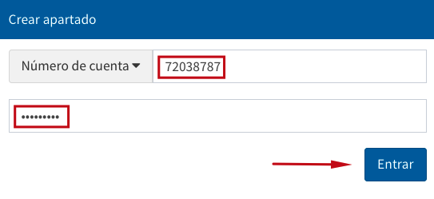

# Apartados / Reservas (Catálogo al público)

{{date}}

En esta opción, el usuario puede apartar / reservar un material cuyo
estado en ese momento sea *Prestado*. Para ello, el procedimiento a
seguir es el siguiente:

-   En primer lugar, el usuario debe tomar nota del número de *código de
    barras* del material que desea apartar.

-   Hacer clic sobre la opción **Servicios al usuario** de la barra de
    herramientas del catálogo.

-   Hacer clic sobre la opción **Crear apartado** de la pantalla de
    Servicios al usuario.

-   Escribir el número de cuenta (o identificador alterno) y la
    contraseña. Hacer clic en el botón **Entrar**.

-   Introducir el número de cuenta y el código de barras anotado con
    anterioridad en los campos de texto correspondientes de la sección
    *Creación de apartados*. Elegir la opción deseada para la selección
    del ítem:

    -   **Esta copia**: se reservará el ejemplar concreto cuyo código de
        barras se ha escrito.

    -   **Primera disponible**: se reservará el primer ejemplar
        disponible cuando todos los ejemplares del libro se encuentren
        prestados.

-   Al presionar el botón ***Crear*** en el paso anterior se despliega
    una pantalla donde poder escribir una nota aclaratoria relacionada
    con la reserva, antes de terminar el proceso.

-   Finalmente, hacer de nuevo clic sobre el botón ***Crear*** para que
    el sistema despliegue el mensaje *El apartado de material fue
    realizado*. Hacer clic en el botón ***Aceptar***.

