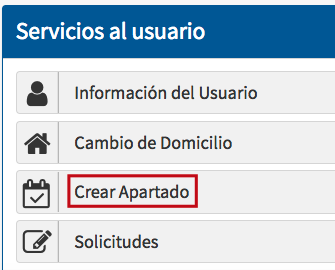
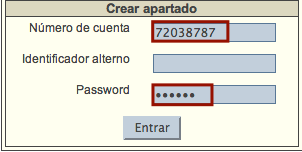
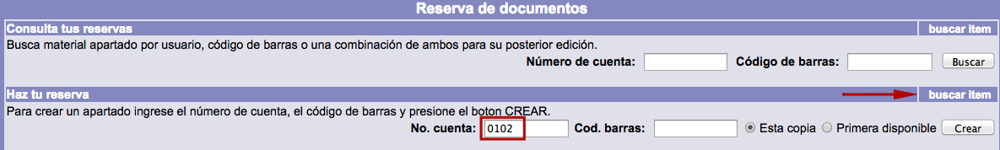
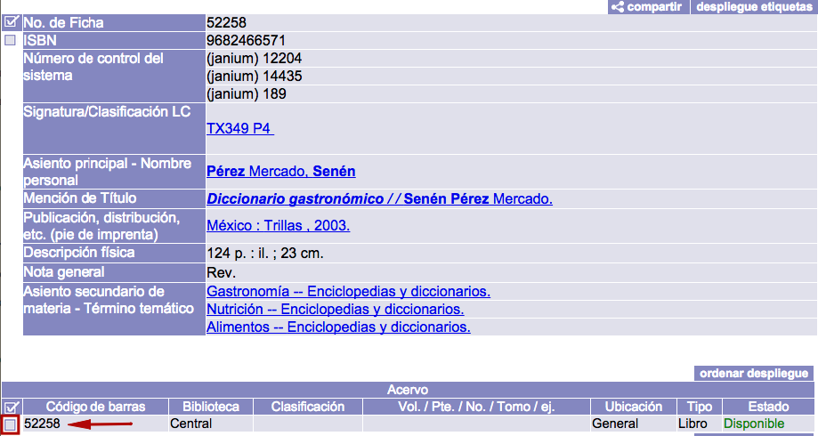
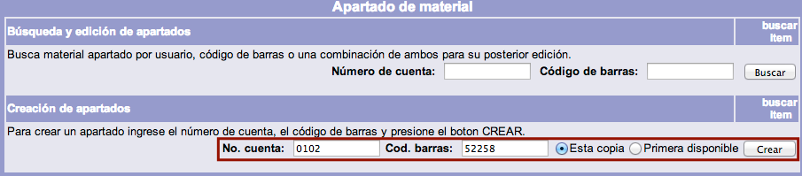

# Apartados / Reservas (Circulación)

Los usuarios interesados en obtener en préstamo un material que no está disponible **por estar prestado a otro usuario** pueden registrar en el sistema un apartado / reserva del mismo.

Al llevar a cabo esta acción, la petición queda en una “lista de espera” del material, por lo que, al ser éste devuelto, queda reservado para el usuario solicitante por un tiempo determinado establecido por la institución. Además, el usuario solicitante es informado de la disponibilidad del material por medio de **notificaciones por correo electrónico**.

Durante el tiempo designado por la institución para mantener la reserva,
el material apartado no puede ser prestado a otro usuario, a menos que
ésta determine lo contrario a través de la función *Pasar por alto &gt;
Material apartado*.

Los apartados / reservas pueden ser gestionados desde el catálogo al
público o desde el módulo de Circulación.

## Apartados / Reservas desde el catálogo al público

En este caso, **el usuario es el responsable de gestionar la acción**,
sin la intervención de un operador del módulo.

NOTA: El siguiente procedimiento se realiza desde el catálogo al
público:

-   En primer lugar, el usuario debe tomar nota del número de código de barras del
    material que desea apartar.

-   Hacer clic sobre la opción **Servicios al usuario** de la barra de
    herramientas del catálogo.

-   Hacer clic sobre la opción **Crear apartado** de la pantalla de
    Servicios al usuario.

-   Escribir el número de
    cuenta (o identificador alterno) y la contraseña. Hacer clic en
    el botón **Entrar**.

-   Introducir el número de cuenta y el código de barras anotado con
    anterioridad en los campos de texto correspondientes de la sección
    *Creación de apartados*. Elegir la opción deseada para la selección
    del ítem:

    Esta copia: se
    reservará el ejemplar concreto cuyo código de barras se ha escrito.

    Primera disponible:
    se reservará el primer ejemplar disponible cuando todos los
    ejemplares del libro se encuentren prestados.

-   Al presionar el botón *Crear* se despliega una pantalla donde poder
    escribir una nota relacionada con la reserva, antes de terminar el
    proceso.

-   Finalmente, hacer de nuevo clic sobre el botón *Crear* para que el
    sistema despliege el mensaje ***El apartado de material fue
    realizado***. Hacer clic en el botón **Aceptar**.

## Apartados / Reservas desde Circulación

En esta opción, es el operador del módulo el que lleva a cabo la acción,
por lo que debe conocer el número de cuenta del usuario
y el número de código de
barras del material a apartar.

El procedimiento a seguir es el siguiente:

-   Hacer clic sobre la opción **Apartado** de la barra de herramientas
    del módulo.

-   Estando en la pantalla de Apartado, introducir en primer lugar el
    **número de cuenta** del usuario.A continuación, hacer clic en el
    botón **buscar ítem**, situado en la parte derecha, para acceder a
    la función de búsqueda
    avanzada del catálogo (en ventana emergente) y así llevar a
    cabo la búsqueda del ítem que se va a reservar.

-   Introducir los términos de búsqueda correspondientes, ejecutar la
    acción y desplegar el registro bibliográfico del material en
    cuestión para seleccionar uno de sus ítems, haciendo clic sobre su cuadro
    selector.

-   El sistema introduce automáticamente el número de código de barras del
    ítem a reservar que se ha seleccionado en el campo de texto
    de la sección destinada para ello. Elegir la opción deseada para la
    selección del ítem (*Esta copia* o *Primera disponible*). Hacer clic
    en el botón **Crear**.

-   El sistema despliega el mensaje ***El apartado de material fue
    realizado***. Hacer clic en el botón **Aceptar**.

