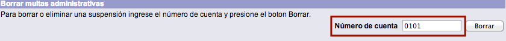
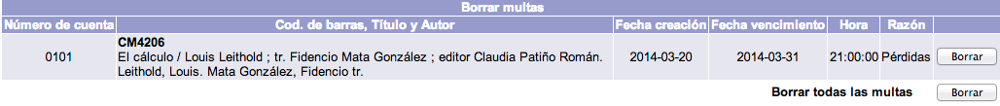
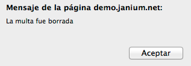
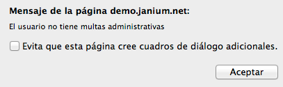

# Borrado de multas administrativas

{{date}}

La institución puede determinar borrar las sanciones administrativas
relacionadas con un usuario. Al registrar esta acción, el usuario
multado vuelve a tener su estado **OK** y puede solicitar de nuevo materiales
en préstamo.

El procedimiento a seguir es el siguiente:

-   Hacer clic sobre la opción **Multas** de la barra de herramientas
    del módulo.

-   Escribir el número de
    cuenta del usuario en el campo de texto de la sección *Borrar
    multas administrativas*. Hacer clic en el botón **Borrar**.

-   El sistema muestra la lista de suspensiones asociadas al usuario.
    Hacer clic en el botón **Borrar** de aquella que se quiera eliminar.

-   Después de la acción anterior, aparece el mensaje informando del
    borrado de la multa. Hacer clic en el botón **Aceptar**.

-   Y, para finalizar, el mensaje confirmando que el usuario no tiene
    asignada ningún tipo de sanción (si es el caso). Hacer
    clic en el botón **Aceptar**.

