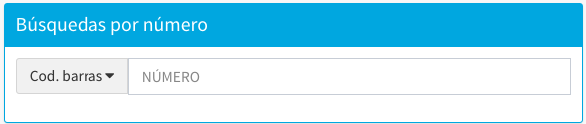
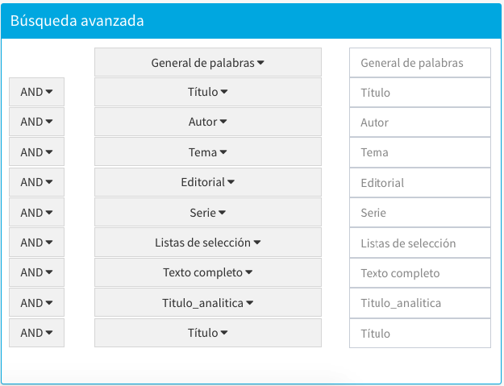

meta-json: {"viewport":"width=device-width, initial-scale=1.0, maximum-scale=1.0,\nuser-scalable=0","robots":"noindex,follow","title":"Búsqueda avanzada en Circulación | Ayuda contextual de Janium","generator":["Divi v.2.2","WordPress 4.0.18"]}
robots: noindex,follow
title: Búsqueda avanzada en Circulación | Ayuda contextual de Janium
viewport: width=device-width, initial-scale=1.0, maximum-scale=1.0, user-scalable=0
Date:Nov 26, 2014

# Búsqueda avanzada en Circulación

[%Date]

De la misma forma que ocurre para el Catálogo al público y el módulo de
Control bibliográfico, desde Circulación también se puede acceder a la
función de *Búsqueda avanzada*.

Los elementos principales de esta sección son los siguientes:

#### Búsqueda por número

Formada por un campo de
texto donde se introduce el dato a buscar y un conjunto de opciones de búsqueda numérica
que pueden configurarse a medida de la institución.

En este contexto, en las búsquedas numéricas **por código de barras**,
cuando se restringe por una
sola biblioteca, el sistema aplica la configuración de **máscaras
y prefijos de entrada de datos** que se haya definido para ella.

Fundamentalmente, esto equipara el comportamiento del catálogo al
público, en este sentido, con lo que sucede en el módulo de Circulación
y en la impresión de etiquetas.

#### Búsqueda por índices

Es posible llevar a cabo una búsqueda avanzada utilizando hasta ocho
índices de forma simultánea. Para ello, se deben escribir los términos
en los cuadros de texto asignados; términos que además pueden
relacionarse entre ellos a través de la lista de operadores booleanos
(AND, OR y NOT). Por omisión, el sistema Janium aplica el operador AND.

Un detalle importante es que la búsqueda por número y la búsqueda por
índices son procesos **excluyentes**, por lo que no pueden ejecutarse a
la vez. En este sentido, en el caso de que exista información en ambos
apartados, el sistema realiza una búsqueda por número por
defecto.

#### Limitadores de búsqueda

Al igual que en búsqueda rápida, aquí también se permite precisar la
búsqueda aplicando criterios relacionados con formato, biblioteca,
colección, material y estado.

### Soporte de Javascript personalizado

Tanto para las funciones de **Búsqueda rápida** como de **Búsqueda
avanzada** se puede hacer uso de Javascript personalizado para los casos
donde el cliente solicita alguna configuración que no es posible
realizar directamente a través de la modificación de parámetros del
sistema o mediante la utilización de estilos CSS.

A continuación, un par de ejemplos de aplicación:

*Ocultar los botones ISBN, ISSN y Clasificación de la página de Búsqueda
rápida, tanto para el catálogo al público como para Control
Bibliográfico:*

Pueden ocultarse los botones solicitados de la página de Búsqueda rápida
a través del parámetro config.opac\_indices\_opcionales, pero su
utilización no tiene impacto sobre los usuarios catalogadores, por lo
que es necesario utilizar Javascript.

*Ocultar el índice Listas de alerta de la página de Búsqueda avanzada:*

En la página de búsqueda avanzada se muestra automáticamente un renglón
de la forma de búsqueda por cada índice de palabra clave configurado. Si
no se desea desactivar o eliminar un índice, sino solamente eliminarlo
de la forma, se debe recurrir a un ajuste vía Javascript.
