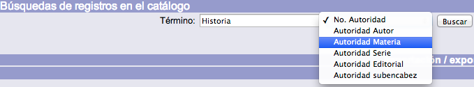
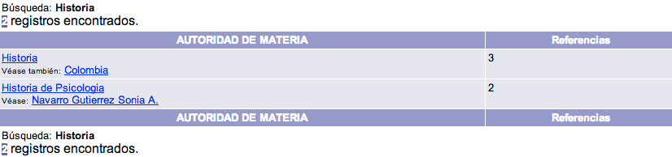
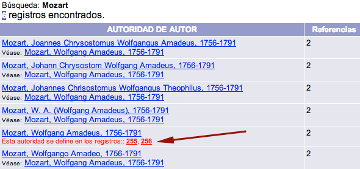

# Búsqueda de registros de autoridad

{{date}}

Pueden realizarse búsquedas de los registros de autoridad existentes en
el propio sistema. Para ello, se debe seleccionar el tipo de autoridad que se
desea buscar e introducir los términos de consulta.

Una vez realizada la consulta, se muestra la relación de registros que
cumplen con los criterios de búsqueda. Además, el sistema Janium ofrece
la posibilidad de visualizar referencias cruzadas y jerárquicas por cada uno de
los registros obtenidos en la búsqueda.

## Visualización de registros duplicados

Como se ha explicado, una de las posibilidades que pueden darse al
ejecutar una búsqueda por autoridad es que se muestre una lista de
términos coincidentes.

En este caso, si el sistema detecta la existencia de **registros de
autoridad duplicados** (considerando la configuración de las llaves de unicidad),
despliega la **alerta** correspondiente en la parte inferior de dicha
referencia en color rojo, incluyendo los números de registro afectados.

Estos números son, a su vez, **vínculos** hacia los registros de
autoridad concretos.

## Búsqueda sin resultados

Si se produce la circunstancia de que no exista equivalencia alguna
entre los términos de búsqueda introducidos y la información recogida en
el sistema, lo que se despliega es un mensaje avisando de la situación.

