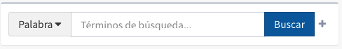
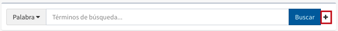
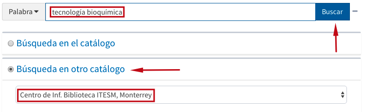

meta-json: {"viewport":"width=device-width, initial-scale=1.0, maximum-scale=1.0,\nuser-scalable=0","robots":"noindex,follow","title":"Búsqueda rápida en Control bibliográfico | Ayuda contextual de Janium","generator":["Divi v.2.2","WordPress 4.0.18"]}
robots: noindex,follow
title: Búsqueda rápida en Control bibliográfico | Ayuda contextual de Janium
viewport: width=device-width, initial-scale=1.0, maximum-scale=1.0, user-scalable=0
Date:Nov 25, 2014

# Búsqueda rápida en Control bibliográfico

[%Date]

De la misma forma que ocurre para el Catálogo al público, en este módulo
también se puede acceder a la función de *Búsqueda rápida*.

Los elementos principales de esta sección son los siguientes:

#### Campo de texto

Este es el lugar donde deben introducirse los términos de búsqueda.

Un aspecto importante que se debe tener en cuenta es que al escribir dos
o más términos en el campo de texto, el sistema asigna *de forma
automática* el operador booleano **AND** para relacionarlos.

Por otro lado, el sistema Janium reconoce **todas las variantes
posibles** en la manera de introducir un término de búsqueda, por lo que
no es necesario seguir un único criterio para el uso de *signos
diacríticos* o *mayúsculas* / *minúsculas*.

Con los términos ya introducidos, la ejecución de la búsqueda se realiza
haciendo clic sobre el botón ***Buscar*** situado a la derecha del
cuadro de texto. O bien presionando la tecla ***Enter*** / ***Intro***
del teclado. Si, por algún motivo, se hace esto sin haber introducido
antes algún término de búsqueda, el sistema avisa de tal circunstancia.

#### Opciones de búsqueda

En caso de ser necesario perfilar la búsqueda rápida que se va a llevar
a cabo, puede hacerse utilizando varios instrumentos:

##### Criterios de ordenación

Son los siguientes:

**Por palabra clave:** el sistema despliega los resultados que contengan
los términos buscados, sin importar la posición en la que se encuentren
situados en el registro bibliográfico o en el documento electrónico a
texto completo.

Además, aquí no es necesario escribir artículos o preposiciones en el
momento de realizar la búsqueda, ya que estas son palabras sin valor
para el sistema.

Por ejemplo, al buscar las palabras *Economía e Historia* usando esta
opción y seleccionando el índice Título, se obtienen los siguientes
resultados:

-   **Economía** y sociedad en el siglo XIX: **historia** nuestra.
-   La **historia** de América Latina : sociedad, derecho y
    **economía**.
-   Estudio de **historia** social y **economía** de América.
-   Cacao: **economía**, **historia** y cultura.
-   Breve **historia** de la **economía** internacional.

En esta opción de búsqueda no es posible utilizar los índices *ISBN*,
*ISSN* y *Clasificación*.

**Alfabéticamente:** el sistema despliega el sumario de resultados en
orden alfabético a partir de los términos buscados.

Por ejemplo, al buscar la palabra *Gestión* usando esta opción y
eligiendo el índice Título, se recupera la siguiente lista:

-   **Gestión** de conflictos / Mauro Rodríguez Estrada.
-   **Gestión** de crisis en las empresas / José Arturo Betancourt.
-   **Gestión** de materiales / John R. Immer.
-   **Gestión** de personal / José Huerta Ibarra.
-   **Gestión** de personal y relaciones industriales / Dale Yoder.
-   **Gestión** de problemas y toma de decisiones / Mauro Rodríguez
    Estrada.
-   **Gestión** de recursos humanos / Jesús Hernández Castro.
-   **Gestión** de residuos / Juan Carlos Vega de Kuyper.

Para esta opción de búsqueda es importante tener en cuenta el orden de
las palabras en relación con el índice utilizado. En este caso,
***Gestión*** es la primera palabra de todos los títulos.

Por otro lado, no se pueden ejecutar búsquedas alfabéticas por el índice
*Palabra* y *Texto completo*.

##### Limitadores

-   **Búsqueda en el catálogo:** esta sección se despliega y repliega al
    pulsar sobre el signo “más” / “menos” (**+**, **-**) que se
    encuentra a la derecha del botón *Buscar*. Desde ella se pueden
    seleccionar: la **biblioteca**, el **formato**, la **colección**, el
    **tipo de material** y el **estado de ejemplar**, con el objetivo de
    llevar a cabo una búsqueda de información más precisa.

    Esto puede hacerse de forma **simultánea**, es decir, eligiendo y
    combinando varios criterios a la vez. Por omisión, el sistema
    ejecuta las búsquedas sin aplicar ningún tipo de limitación.

-   **Búsqueda en otro catálogo:** este elemento también se encuentra
    integrado en la pantalla de búsqueda rápida y permite la
    recuperación de información procedente de diferentes sistemas
    externos mediante el protocolo **Z39.50**.

    Para ello, se debe seleccionar la opción correspondiente en el
    catálogo; después, en la lista desplegable de recursos configurados,
    elegir aquel que se quiera usar. A continuación, introducir los
    términos de búsqueda en el campo de texto y hacer clic en el botón
    ***Buscar***.

En este caso, al tratarse de una búsqueda en un catálogo externo, no
pueden utilizarse los limitadores de búsqueda, **pero sí los índices**.
Además, en el sumario de resultados obtenidos, no se muestra la
información relativa a los ejemplares.

-   **Búsqueda en web:** como en el caso anterior, este elemento también
    está incluido en la pantalla de búsqueda rápida y ofrece la
    posibilidad de ejecutar búsquedas en **recursos web** ajenos a la
    institución.

    El proceso es similar al ya descrito para la búsqueda en otros
    catálogos, es decir, se debe seleccionar la opción correspondiente
    en el catálogo; después, en la lista desplegable de recursos
    configurados, elegir aquel que se quiera usar. A continuación,
    introducir los términos de búsqueda en el campo de texto y hacer
    clic en el botón ***Buscar***.

Finalmente, se muestra una ventana emergente que presenta el recurso
elegido con los resultados obtenidos.

