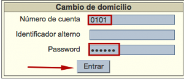

# Acceso a Cambio de domicilio

{{date}}

Para acceder a esta función **por primera vez** es necesario escribir el
número de cuenta (o identificador alterno) y la contraseña en los
cuadros de texto correspondientes. A continuación, hacer clic en el
botón *Entrar*.

