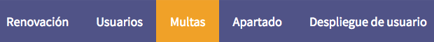
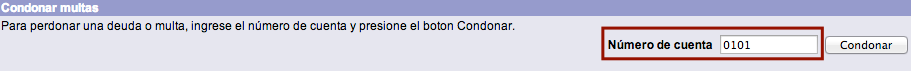
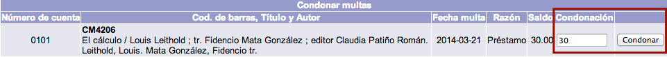

# Condonación de multas

Esta función se utiliza cuando la institución toma la decisión de **no cobrar una multa monetaria** (total o parcialmente) a un usuario. De esta forma, éste queda liberado del pago de la cantidad original de la misma. La cifra a condonar puede ser _parcial_ o _total_.

Este tipo de decisiones pueden ser tomadas cuando la cuantía de la multa **excede una cantidad establecida por la institución**, de manera que se establece un acuerdo con el usuario para determinar la parte a condonar.

El procedimiento a seguir es el siguiente:

- Hacer clic sobre la opción **Multas** de la barra de herramientas del módulo.

- Escribir el _número de cuenta del usuario_ en el campo de texto de la sección *Condonar multas*. Hacer clic en el botón **Condonar**.

- El sistema muestra la lista de multas económicas con los datos del usuario y del material vinculados. Escribir la cantidad a condonar en el cuadro de texto del campo **Condonación**. A continuación, hacer clic en el botón **Condonar**.

- Después de la acción anterior, aparece el mensaje informando de la ejecución de la condonación de la multa. Hacer clic en el botón **Aceptar**.
- Si la condonación es _parcial_, el sistema vuelve a la lista de multas mostrando la cantidad pendiente de abonar una vez llevada a cabo el proceso. Si es _total_, se muestra el mensaje:

> El usuario no tiene multas monetarias

