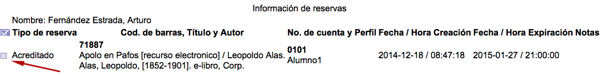
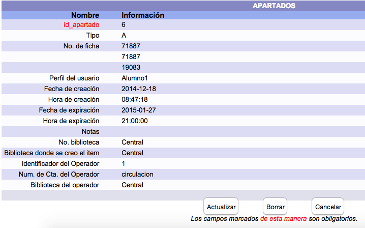

meta-json: {"viewport":"width=device-width, initial-scale=1.0, maximum-scale=1.0,\nuser-scalable=0","robots":"noindex,follow","title":"Consulta y edición de apartados / reservas | Ayuda contextual de Janium","generator":["Divi v.2.2","WordPress 4.0.18"]}
robots: noindex,follow
title: Consulta y edición de apartados / reservas | Ayuda contextual de Janium
viewport: width=device-width, initial-scale=1.0, maximum-scale=1.0, user-scalable=0
Date:Mar 23, 2015

# Consulta y edición de apartados / reservas

[%Date]

Para proceder a la consulta y posible edición de la información
relacionada con los materiales apartados / reservados de un usuario, se
accede a la siguiente pantalla:

Si se hace clic sobre el **cuadro selector** situado en la parte
izquierda de cada una de las entradas (o en el cuadro selector general,
para elegirlas todas a la vez), el sistema muestra el formulario para
modificar los datos que se deseen o incluso borrar el registro completo:

