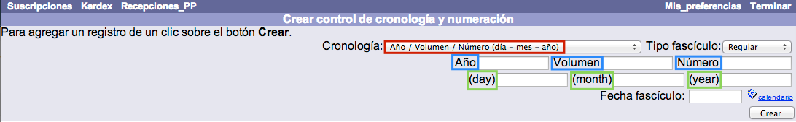
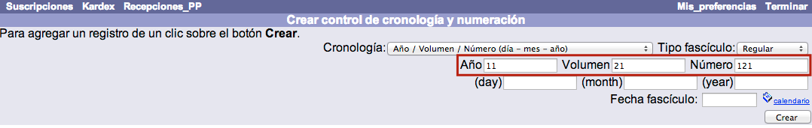
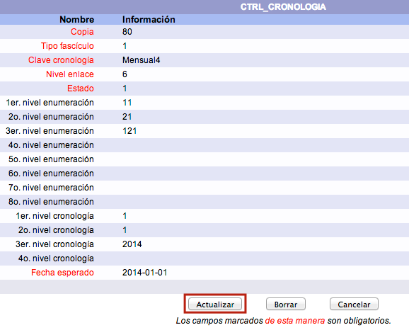
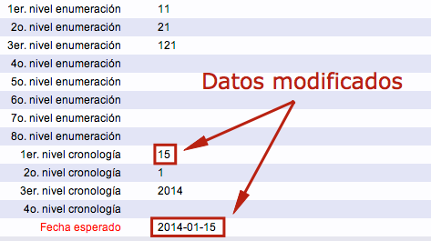

meta-json: {"viewport":"width=device-width, initial-scale=1.0, maximum-scale=1.0,\nuser-scalable=0","robots":"noindex,follow","title":"Control de cronologías y numeraciones | Ayuda contextual de Janium","generator":["Divi v.2.2","WordPress 4.0.18"]}
robots: noindex,follow
title: Control de cronologías y numeraciones | Ayuda contextual de Janium
viewport: width=device-width, initial-scale=1.0, maximum-scale=1.0, user-scalable=0
Date:Nov 27, 2014

# Control de cronologías y numeraciones

[%Date]

Esta función sirve para indicar al sistema que los fascículos se
publican con una frecuencia o periodicidad específica y están numerados
en base a uno o más niveles concretos (año, tomo, época, número), además
de contener una fecha que puede incluir los datos referidos a día, mes y
/ o año. Es importante destacar que, para comenzar a crear un control de
cronología y numeración, **se debe conocer previamente el esquema de
periodicidad de la publicación que se trate**.

Por otro lado, todas las suscripciones de las que se van a predecir y
recibir fascículos necesitan un control de cronología y numeración
**para un tipo de edición**. De esta forma, una publicación periódica
puede tener una _edición
regular_y un _suplemento_, que se publican
con diferentes frecuencias, en cuyo caso se necesitan dos controles de
cronología y numeración diferentes, uno para la edición regular y otro
para el suplemento.

El procedimiento a seguir para la creación de un control de este tipo es
el siguiente:

-   Estando en la opción *Suscripciones* del módulo, hacer clic sobre el _número de suscripción_ para el que se desea crear el control, de entre todos los que se muestren en la lista.

-   En la pantalla de creación de controles de cronología y numeración,
    elegir en primer lugar el _tipo de cronología_ a
    aplicar, en función de la periodicidad de la publicación original.
    Los tipos predeterminados que aparecen en la lista desplegable se
    crean desde el **módulo de Administración**, por lo que si no hay
    ninguno que se ajuste a las necesidades, puede ser generado por un
    operador de este módulo. En el momento de seleccionar el tipo de
    cronología, los campos que se despliegan se adaptan automáticamente
    a esta selección. Es decir, el ejemplo que se está mostrando aquí
    (*Año / Volumen / Número (día – mes – año)*) ha sido definido desde
    el módulo de Administración con tres **designaciones numéricas:**
    año, volumen y número, y con tres **designaciones cronológicas:**
    día, mes y año. Por esta razón se despliegan esos campos asociados.

-   Elegir el _tipo de
    fascículo_ (regular, suplemento, anuario, índice) que va a
    determinar el **nivel de enlace** de las existencias. Para un
    fascículo con un tipo de edición regular, el nivel de enlace sería
    *1*, mientras que para un suplemento sería *2*. Como en el caso
    anterior, si es necesario, pueden crearse nuevos tipos de forma
    sencilla mediante el módulo de Administración.

-   Introducir los valores para los campos de _designaciones numéricas_.
    En este ejemplo, se ingresan las cifras de año, volumen y número **a
    partir de las cuáles se iniciará la predicción y registro de los
    fascículos por el sistema**.

-   Introducir los valores para los campos de _designaciones
    cronológicas_. En este ejemplo, se ingresan las cifras de día,
    mes y año **en que se publicó el fascículo tomado como referencia
    para la creación del control**. Los datos *day*, *month*, y *year*
    aparecen en inglés para que sean reconocidos por el sistema al crear
    las existencias MARC, que contienen los códigos en ese idioma. Sin
    embargo, no se muestran así en el catálogo al público, a menos que
    la configuración establecida lo requiera expresamente.

-   Introducir la _fecha de
    recepción del primer fascículo_, que determinará, a su vez,
    las fechas de recepción posteriores. Este dato se puede ingresar,
    bien en el campo de texto correspondiente con el formato
    *aaaa-mm-dd*, bien utilizando la opción de *Calendario*, que se
    encuentra justo a la derecha del mencionado campo de texto. La
    asignación correcta de esta fecha es importante porque, si se
    comienza a predecir a partir de números ya pasados, las fechas de
    recepción de cada fascículo serán, lógicamente, también pasadas.
    Este hecho puede provocar que las funciones de **generación y envío
    de reclamaciones** produzcan y manden mensajes reclamando estos
    fascículos de forma errónea.

-   Hacer clic sobre el botón **Crear**. El sistema genera el control de
    cronología y numeración y despliega la pantalla de *kardex* para
    comenzar a predecir y recibir fascículos. Este proceso se realiza
    _una sola vez_ por
    cada tipo de fascículo cuyos números se vayan a recibir.

## Modificación de controles de cronología y numeración

En ocasiones, puede ocurrir que las numeraciones y fechas de los
fascículos tengan que alterarse para que, a partir de cierto número,
**se apliquen otros valores distintos**. Por ejemplo, una publicación
mensual cuyos fascículos aparecen el día 1 decide publicarlos el día 15
y, además, empezar a contar sus números desde cero.

En casos como ese, lo que se debe hacer es **modificar el registro de
control de cronología de la suscripción**. En este registro, el sistema
guarda y actualiza la información del siguiente fascículo que deberá
predecir. Sin embargo, antes de realizar cualquier variación en el
control de cronología es necesario _anular_ y _borrar_ los fascículos ya
predichos.

El procedimiento a seguir es el siguiente:

-   Teniendo desplegada la lista de fascículos para la suscripción y
    cronología deseadas, seleccionar_todos_ los números
    **predichos y aún esperados** usando el cuadro selector habilitado
    para ello. Después, hacer clic en el botón **Anular**.

-   Al anular los fascículos predichos, estos desaparecen de la lista
    que se muestra en pantalla (la de _Esperados_). Para
    visualizarlos y proceder a su borrado, elegir la opción adecuada en
    el menú desplegable de la sección *Kardex. Tipo Fascículo.*

-   Seleccionar los fascículos anulados y hacer clic en el botón
    **Borrar**. Es importante que los números que se van a borrar hayan
    sido_anulados
    previamente_, para no borrar por error aquellos que presentan
    un estado diferente, como los recibidos. A partir de este momento,
    todos los fascículos existentes desaparecen y ya es posible editar
    el control de cronología de la suscripción para cambiar los datos
    necesarios.

-   Para acceder a la mencionada edición del control de cronología,
    hacer clic sobre el **Id de la suscripción activa**.

-   Se muestra el formulario con los campos detallados del control de
    cronología. Hacer clic en el botón **Actualizar** para proceder a
    realizar los cambios necesarios. _Campos que se pueden modificar
    para iniciar una nueva predicción_
    -   *1er. nivel numeración:* en este caso, corresponde al dato
        **Año**, con valor 11.
    -   *2o. nivel numeración:* en este caso, corresponde al dato
        **Volumen**, con valor 21.
    -   *3er. nivel numeración:* en este caso, corresponde al dato
        **Número**, con valor 121.
    -   *Niveles siguientes:* el sistema acepta hasta 8 niveles de
        numeración.
    -   *1er. nivel cronología:* en este caso, corresponde al dato
        **Día**, con valor 1.
    -   *2o. nivel cronología:* en este caso, corresponde al dato
        **Mes**, con valor 1.
    -   *3er. nivel cronología:* en este caso, corresponde al dato
        **Año**, con valor 2014.
    -   *Niveles siguientes:* el sistema acepta hasta 4 niveles de
        cronología.
    -   *Fecha esperado:* para que el sistema no genere y envíe
        reclamaciones de fascículos que aún no se han publicado, también
        se debe actualizar esta fecha con los datos correctos.

-   Llevar a cabo las modificaciones oportunas. _En este ejemplo_: debido a
    que la publicación en cuestión ha cambiado la fecha de lanzamiento
    de sus fascículos, desde principios de mes a mediados, es necesario
    actualizar el dato **1 – 1 – 2014** a **15 – 1 – 2014**.

-   Para confirmar los cambios realizados, hacer de nuevo clic en el
    botón **Actualizar**. Ahora, el sistema está listo para predecir a
    partir de una nueva cronología. Si se efectúa dicha predicción,
    pueden verse los datos actualizados.

## Cambios en control de cronología para suscripciones activas

Otra de las ventajas del módulo de Publicaciones periódicas es la
posibilidad de **aplicar un nuevo control de cronología a una
suscripción que ya está activa**, evitando así tener que crear una nueva
suscripción si la publicación, por algún motivo, cambia su periodicidad.

Para describir esta función, se toma como ejemplo la publicación
*Revista Española de Salud Pública*, para la que ya se ha creado una
suscripción en la sección **Control de cronologías y numeración** de
este manual. Dicha publicación tenía una periodicidad _mensual_, pero, por motivos
económicos, la editorial decide cambiarla a _trimestral_. No obstante, la
institución va a continuar suscrita a ella y, además, no desea perder la
información almacenada en el sistema sobre los ejemplares ya predichos y
recibidos.

El procedimiento a seguir es el siguiente:

-   Estando en la opción *Suscripciones* del módulo, hacer clic sobre el
    _número de
    suscripción_ para el que se desea crear el nuevo control de
    cronología, de entre todos los que se muestren en la lista.

-   Al acceder a la pantalla de creación de controles de cronología y
    numeración se muestra el control (o controles) que ya ha sido creado
    para la suscripción.

-   Elegir el **nuevo tipo de cronología** de la lista desplegable. Al
    hacerlo, como ya se ha explicado, los campos que se despliegan se
    adaptan automáticamente a esta selección. Además, en el caso
    concreto de esta función, los valores que deben introducirse en los
    campos mencionados, tanto los de _designaciones numéricas_    como _cronológicas_,
    también son colocados de forma automática tomando como referencia el
    último fascículo predicho, cuyos datos en este ejemplo son: *Año 11,
    Volumen 22, Número 132, 1 Diciembre 2014*. Hacer clic en el botón
    **Crear**.

-   El sistema genera el nuevo control de cronología y numeración y
    despliega la pantalla de *kardex* para comenzar a predecir y recibir
    los fascículos según la nueva periodicidad establecida **pero
    manteniendo igual toda la información acerca de los fascículos
    anteriores**.

-   Además, si se consulta la publicación en el catálogo al público, se
    observa que existe una única suscripción con los fascículos (una vez
    que se hayan recibido y estén disponibles) organizados de acuerdo a
    los distintos controles.
