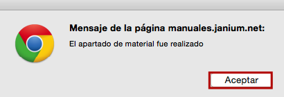

# Creación de apartados / reservas

{{date}}

En relación con el proceso de creación de apartados / reservas, es en
esta pantalla donde se puede escribir una nota informativa acerca de la
reserva, antes de terminar el proceso.

Finalmente, hacer de nuevo clic sobre el botón *Crear* para que el
sistema despliege el mensaje ***El apartado de material fue
realizado***. Hacer clic en el botón **Aceptar**.

