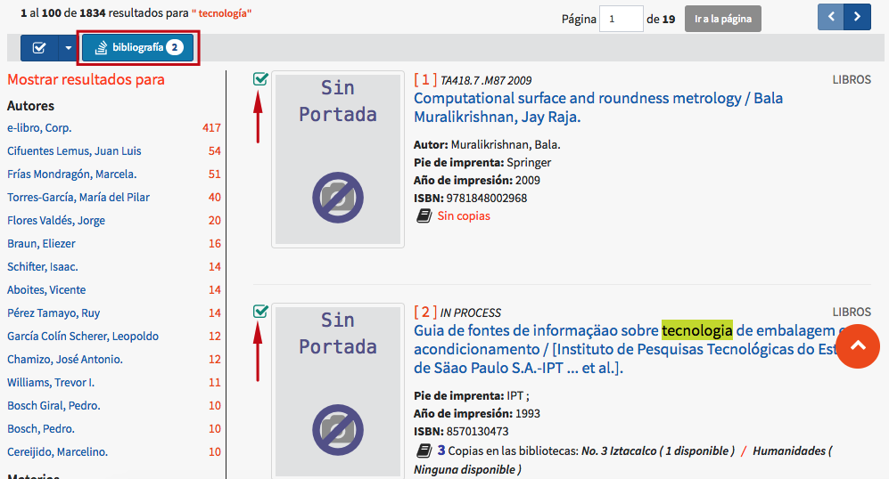
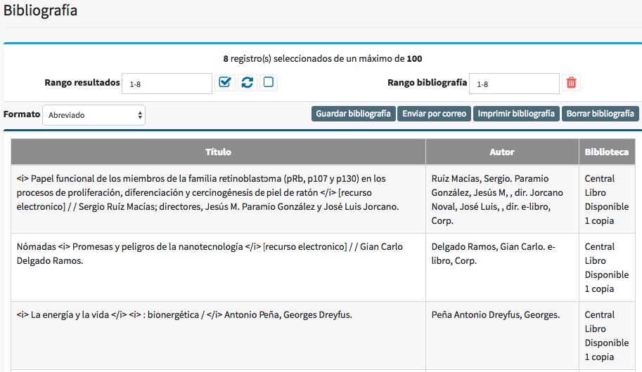
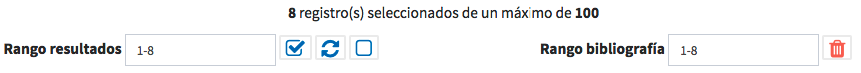
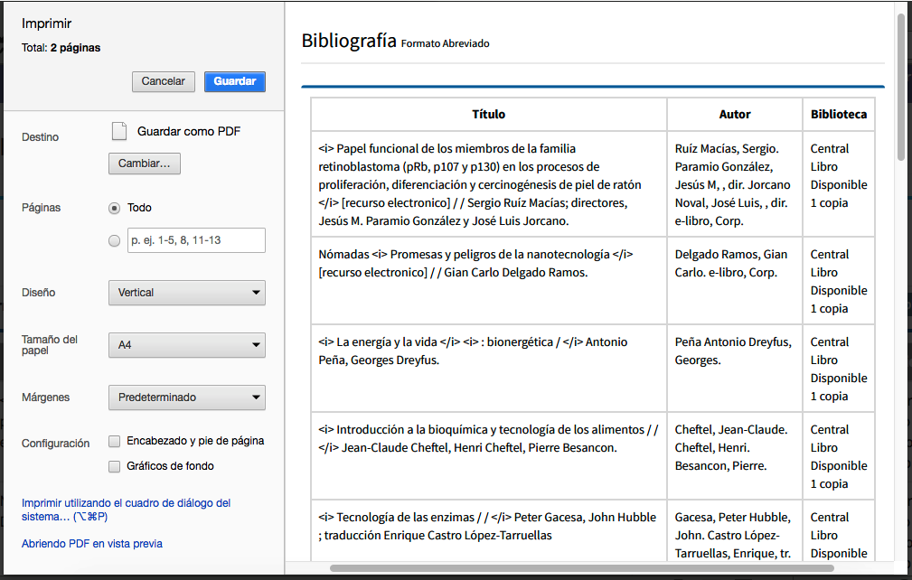

# Creación de bibliografías

Mediante esta función, el usuario tiene la posibilidad de gestionar sus propios registros a partir de cualquier tipo de búsqueda que lleve a cabo.

Para ello, en el sumario que se haya obtenido, se pueden marcar las **casillas de selección** de todos los registros destinados a formar parte de la bibliografía, o bien elegir estos de forma global mediante los selectores indicados anteriormente. A continuación, hacer clic en el **botón _Bibliografía_**, que lleva a la **pantalla de gestión** de la misma.

Un comentario importante sobre esta función es que es posible seleccionar registros bibliográficos _procedentes de diferentes búsquedas_, ya que los que se hayan guardado permanecerán en el sistema hasta borrar la bibliografía completa (en el caso de usuarios registrados) o cerrar la sesión activa del catálogo (para usuarios no registrados). De esta forma, no es necesario generar una nueva bibliografía para cada búsqueda que se realice.

### Opciones de rango

Estas opciones permiten agregar o borrar registros para la generación de la bibliografía, lo cual se explica a continuación:

+ **Rango resultados**: es la caja de texto que muestra el total de registros obtenidos en la última búsqueda realizada.

+ **Selector de resultados**: al presionarlo, se seleccionan los registros considerados en el campo _Rango resultados_, es decir, los obtenidos en la última búsqueda realizada.

+ **Invertir selección de resultados**: al presionarlo, se invierte la condición de los registros en _Rango bibliografía_ y los de _Rango resultados_. De esta forma, se quitan los registros guardados para la generación de la bibliografía y son sustituidos por registros obtenidos en la última búsqueda que no hayan sido previamente seleccionados.

+ **Eliminar últimos seleccionados**: al presionarlo, son eliminados de la lista los registros seleccionados en la última búsqueda realizada. Si los registros fueron elegidos en dos o más búsquedas, se eliminarán los últimos guardados.

+ **Rango bibliografía**: es la caja de texto que muestra el total de registros seleccionados para la generación de la bibliografía.

+ **Borrar todos seleccionados**: al presionarlo, elimina los registros del campo _Rango bibliografía_, es decir, el total de registros seleccionados.

### Opciones de formato / visualización

- _Abreviado_: se muestra la información básica de los registros seleccionados: *Título*, *Autor* y *Biblioteca* (incluyendo aquí, de forma predeterminada, ubicación del material, tipo de soporte, número de ejemplares y estado de los mismos).

- _Bibliográfico_: se muestra el despliegue en detalle de cada uno de los registros guardados, incluyendo la información acerca de sus ejemplares.

- _Bibliográfico sin copias_: opción similar a la anterior, pero sin mostrar la información de los ejemplares asociados.

- _Etiquetas_: muestra los datos de cada registro seleccionado conforme a la estructura del formato MARC21: etiquetas, indicadores, subcampos e información relacionada.

### Opciones de exportación de resultados

- _Guardar bibliografía_: permite guardar los registros bibliográficos seleccionados en un archivo electrónico (por ejemplo, un fichero de texto plano), para su almacenamiento y uso posterior.

- _Enviar por correo_: permite enviar los registros bibliográficos seleccionados a una cuenta de correo electrónico.

- _Imprimir bibliografía_: permite imprimir la bibliografía en la impresora (local o en red) que se encuentre configurada para el equipo.

- _Borrar bibliografía_: permite borrar la lista de registros seleccionados para la bibliografía.

