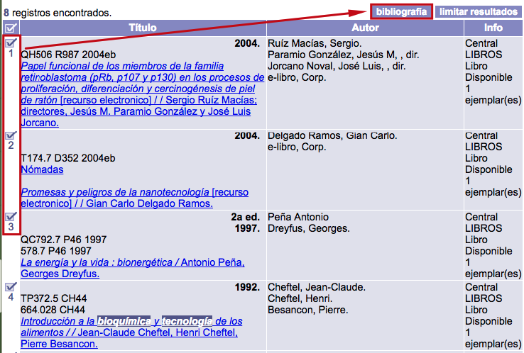

meta-json: {"viewport":"width=device-width, initial-scale=1.0, maximum-scale=1.0,\nuser-scalable=0","robots":"noindex,follow","title":"Creación de bibliografías | Ayuda contextual de Janium","generator":["Divi v.2.2","WordPress 4.0.18"]}
robots: noindex,follow
title: Creación de bibliografías | Ayuda contextual de Janium
viewport: width=device-width, initial-scale=1.0, maximum-scale=1.0, user-scalable=0
Date:Nov 24, 2014

# Creación de bibliografías

[%Date]

Mediante esta función, el usuario tiene la posibilidad de gestionar sus
propios registros a partir de cualquier tipo de búsqueda que lleve a
cabo.

Para ello, en el sumario que se haya obtenido, se deben marcar las
**casillas de selección** de todos los registros destinados a formar
parte de la bibliografía, para a continuación hacer clic en el **botón**
que aparece y que lleva a la **pantalla de gestión** de la misma.

Un comentario importante sobre este proceso es que es posible
seleccionar registros bibliográficos procedentes de diferentes
búsquedas, ya que los que se hayan guardado permanecerán en el
sistema hasta borrar la bibliografía completa (en el caso de usuarios
registrados) o cerrar la sesión activa del catálogo (para usuarios no
registrados). De esta forma, no es necesario generar una nueva
bibliografía para cada búsqueda que se realice.

### Opciones de rango

Estas opciones permiten agregar o borrar registros para la generación de
la bibliografía, lo cual se explica a continuación:

-   **Rango resultados**: es la caja de texto que muestra el total de
    registros obtenidos en la última búsqueda realizada.
-   **Rango bibliografía**: es la caja de texto que muestra el total de
    registros seleccionados para la generación de la bibliografía.
-   **Selector de resultados**: al presionarlo, se seleccionan los
    registros considerados en el campo *Rango resultados*, es decir, los
    obtenidos en la última búsqueda realizada.

-   **Invertir selección de resultados**: al presionarlo, se invierte la
    condición de los registros en *Rango bibliografía* y los de *Rango
    resultados*. De esta forma, se quitan los registros guardados para
    la generación de la bibliografía y son sustituidos por registros
    obtenidos en la última búsqueda que no hayan sido previamente
    seleccionados.

-   **Eliminar últimos seleccionados**: al presionarlo, son eliminados
    de la lista los registros seleccionados en la última búsqueda
    realizada. Si los registros fueron elegidos en dos o más búsquedas,
    se eliminarán los últimos guardados.

-   **Borrar todos seleccionados**: al presionarlo, elimina los
    registros del campo *Rango bibliografía*, es decir, el total de
    registros seleccionados.

### Opciones de formato / visualización

-   Abreviado: se
    muestra la información básica de los registros seleccionados:
    *Título*, *Autor* y *Biblioteca* (incluyendo aquí, de forma
    predeterminada, ubicación del material, tipo de soporte, número de
    ejemplares y estado de los mismos).

-   Bibliográfico: se
    muestra el despliegue en detalle de cada uno de los registros
    guardados, incluyendo la información acerca de sus ejemplares.

-   Bibliográfico sin
    copias: opción similar a la anterior, pero sin mostrar la
    información de los ejemplares asociados.

-   Etiquetas: muestra
    los datos de cada registro seleccionado conforme a la estructura del
    formato MARC21: etiquetas, indicadores, subcampos e información
    relacionada.

### Opciones de formato / visualización

-   Guardar
    bibliografía: permite guardar los registros bibliográficos
    seleccionados en un archivo electrónico (por ejemplo, un fichero de
    texto plano), para su almacenamiento y uso posterior.

-   Enviar por correo:
    permite enviar los registros bibliográficos seleccionados a una
    cuenta de correo electrónico.

-   Imprimir
    bibliografía: permite imprimir la bibliografía en la
    impresora (local o en red) que se encuentre configurada para el
    equipo.

-   Borrar
    bibliografía: permite borrar la lista de registros
    seleccionados para la bibliografía.

