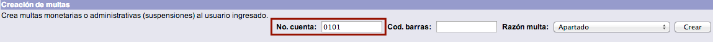
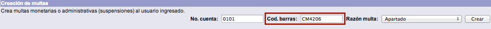
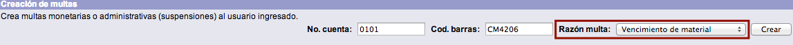
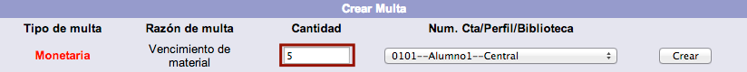
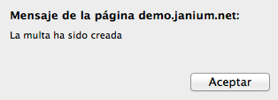
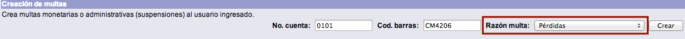
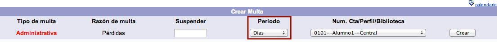
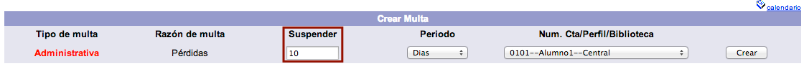
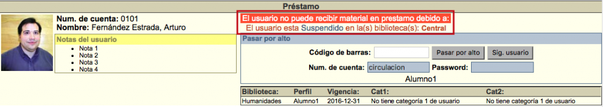

meta-json: {"viewport":"width=device-width, initial-scale=1.0, maximum-scale=1.0,\nuser-scalable=0","robots":"noindex,follow","title":"Creación de multas | Ayuda contextual de Janium","generator":["Divi v.2.2","WordPress 4.0.18"]}
robots: noindex,follow
title: Creación de multas | Ayuda contextual de Janium
viewport: width=device-width, initial-scale=1.0, maximum-scale=1.0, user-scalable=0
Date:Nov 26, 2014

# Creación de multas

[%Date]

## Creación de multas monetarias

El procedimiento a seguir es el siguiente:

-   Hacer clic sobre la opción **Multas** de la barra de herramientas
    del módulo.

-   Escribir el número de cuenta del usuario en el campo de texto de la
    sección *Creación de multas*.

-   Escribir el número de código de barras del material en el campo de
    texto correspondiente.

-   Seleccionar el asunto relacionado con la sanción en el menú
    desplegable *Razón multa*. Hacer clic sobre el botón **Crear**.

-   Se despliega la pantalla de creación de multas. Escribir la cifra
    específica del importe en el campo *Cantidad*. Hacer clic en el
    botón **Crear**.

-   El sistema muestra el mensaje informando de la creación de la multa.
    Hacer clic sobre el botón **Aceptar**.

-   Si se consulta de nuevo la ficha de información del usuario, se
    observa el aviso relacionado con la multa.

## Creación de multas administrativas

Al igual que en el caso anterior, la creación de este tipo de sanciones
puede requerir el código de barras del material relacionado, dependiendo
de la definición de la política *Razón de multa* hecha por la
institución.

El procedimiento a seguir es el siguiente:

-   Hacer clic sobre la opción **Multas** de la barra de herramientas
    del módulo.

-   Escribir el número de cuenta del usuario en el campo de texto de la
    sección *Creación de multas*.

-   Escribir el número de código de barras del material en el campo de
    texto correspondiente.

-   Seleccionar el asunto relacionado con la sanción en el menú
    desplegable *Razón multa*. Hacer clic sobre el botón **Crear**.

-   Se despliega la pantalla de creación de multas. Elegir el
    **periodo** deseado en la lista destinada para ello (los periodos
    que pueden ser seleccionados son: horas, días, fecha e indefinido,
    en función de los valores establecidos por la institución).

-   Escribir la cifra específica de sanción administrativa relacionada
    con el periodo elegido. Hacer clic en el botón **Crear**.

-   El sistema muestra el mensaje informando de la creación de la multa.
    Hacer clic sobre el botón **Aceptar**.

-   Si se consulta de nuevo la ficha de información del usuario, se
    observa el aviso relacionado con la multa.

