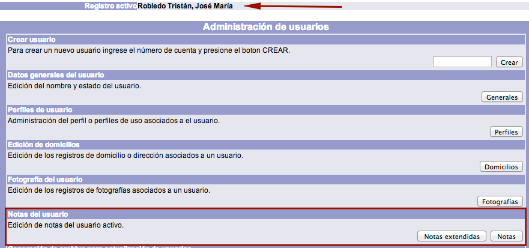
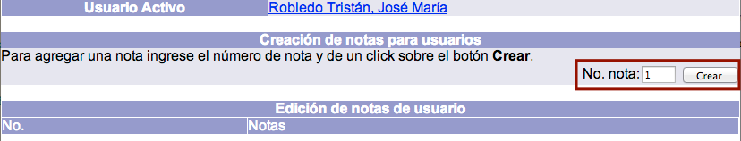
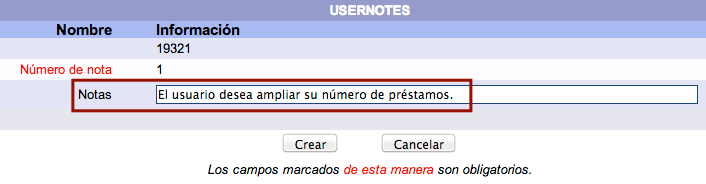

# Creación de notas para usuario

{{date}}

Estas notas informativas son **privadas**, es decir, no pueden ser
vistas por los usuarios desde el catálogo al público. La intención de
ellas es incluir datos relevantes que los operadores del módulo deban
tener en cuenta. Las notas se despliegan en las funciones de
**préstamo**, **devolución** y **despliegue del usuario**.

El procedimiento a seguir es el siguiente:

-   Hacer clic sobre la opción **Usuarios** de la barra de herramientas
    del módulo.

-   Buscar al usuario en cuestión por ID del usuario, número de cuenta / identificador
    alterno o nombre.
-   Teniendo al usuario como **registro activo**, hacer clic en el botón
    **Notas** de la sección *Notas del usuario*.

-   Se despliega la pantalla de creación de notas para el usuario
    activo. Escribir el número
    de orden (no es necesario que la numeración sea consecutiva)
    en el campo de texto correspondiente y hacer clic sobre el botón
    **Crear**.

-   El sistema muestra la pantalla *USERNOTES*, en la que se debe
    introducir el texto deseado para la nota en el campo destinado para
    ello y hacer clic sobre el botón **Crear**.

