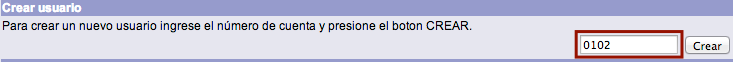
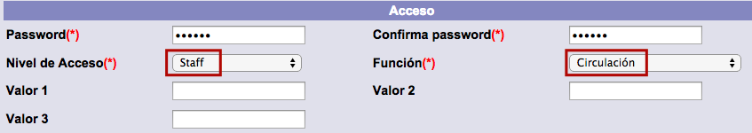
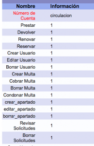
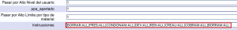
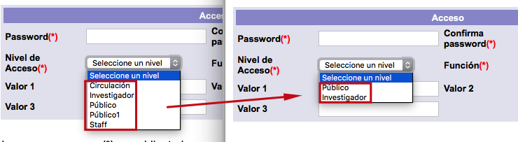

# Creación de usuarios

{{date}}

Esta opción permite crear nuevos registros de usuarios del sistema. Para
esto es necesario asignar un **número de cuenta** a cada uno de ellos.
Existen cuatro formas de crear usuarios en el sistema Janium:

-   Función *Creación de usuarios* en el módulo de Circulación (la que nos ocupa aquí).

-   Carga masiva de usuarios en el módulo de Circulación.

-   Complemento “auto-registro” de usuarios.

-   API de creación de usuarios.

El procedimiento a seguir para la primera de ellas es el siguiente:

-   Hacer clic sobre la opción **Usuarios** de la barra de herramientas
    del módulo.

-   Escribir el número de
    cuenta del usuario en el campo de texto de la sección *Crear
    usuario*. Hacer clic en el botón **Crear**.

-   Se despliega la ficha de información del usuario. Introducir los
    datos correspondientes y hacer clic en el botón **Aceptar**.Los
    tipos de datos que se pueden encontrar aquí son los siguientes:
    Información general
    -   **Número de cuenta:** elemento de identificación del usuario
        asignado en el paso anterior. Aquí solamente se visualiza.
    -   **Estado del usuario:** situación administrativa en la que se
        encuentra el usuario y que define su relación con la
        institución. Algunos estados pueden ser: *OK*, que indica que el
        usuario no tiene ningún problema con la institución; *Bloqueado
        por multas*, que indica que el usuario debe multas y no puede
        realizar ningún préstamo o solicitud a la institución a menos
        que un operador autorizado lo permita; *Suspendido*, que indica
        que el usuario no tiene ningún derecho hasta que se haya
        resuelto su situación; *Bloqueado y suspendido*, que indica que
        el usuario, además de estar bloqueado por tener alguna multa, ha
        sido suspendido.
    -   **Nombre:** nombre completo del usuario. Siguiendo las políticas
        de la institución, debe ingresarse de forma normalizada para que
        al buscarlo, la lista de usuarios no muestre información
        contradictoria o incompleta. Se recomienda introducir siempre
        los apellidos y luego el nombre. Pueden ingresarse todos con
        mayúsculas o todos con minúsculas, pero conviene hacerlo siempre
        de la misma manera. Por ejemplo: GUEVARA HERNANDEZ ANA. Perfil del usuario:
        una institución puede agrupar a sus usuarios para diferenciarlos
        y otorgarles mayores o menores privilegios. Cada grupo es un
        perfil, y cada usuario puede tener más de un perfil si es
        necesario. Por ejemplo, puede pertenecer a una institución como
        alumno y como empleado, en cuyo caso tendría dos perfiles
        asociados.
    -   **Identificador alterno:** número de identificación, adicional
        al ID y al número de cuenta, que puede utilizarse cuando no se
        conoce o no se puede disponer de este último. Este identificador
        alterno es proporcionado por la institución y es aconsejable que
        el usuario lo conozca y recuerde.
    -   **Perfil del usuario:** elemento que determina cómo se le
        prestarán al usuario los diferentes materiales de la
        institución. Cada perfil tiene sus propios parámetros respecto
        del número de materiales a prestar, apartados que se pueden
        realizar o fechas de vencimiento de privilegios. Como ya se ha
        explicado, pueden
        asignarse distintos perfiles para un mismo usuario.
    -   **Biblioteca:** biblioteca a la que pertenece el usuario. Si el
        usuario tiene más de un perfil pero pertenece a la misma
        biblioteca, todos sus perfiles contendrán el mismo valor en este
        campo.
    -   **Vigencia:** fecha en que expiran los privilegios del usuario.
        Por ejemplo, si se trata de un usuario empleado por sólo seis
        meses, aquí se colocaría la fecha en que termina su relación con
        la biblioteca. Si se trata de estudiantes, puede ingresarse la
        fecha en que termina el semestre o curso completo.
    -   **Categoría 1 de usuario:** categoría para clasificar al usuario
        y utilizarla en informes o estadísticas.
    -   **Categoría 2 de usuario:** segunda categoría para clasificar al
        usuario y utilizarla en informes y estadísticas.
    -   **Límite préstamos:** número de préstamos que se le pueden hacer
        al usuario. Si este límite queda vacío, se aplica el valor
        predeterminado definido para el tipo de perfil al que va a
        pertenecer este usuario. Por ejemplo, todos los usuarios con
        perfil de *alumnos* pueden tener permitido un número de 5
        préstamos, pues así está definido en la política del perfil
        correspondiente a *alumnos*; pero si se desea hacer una
        excepción a un usuario específico, en este campo se puede poner
        un número diferente de préstamos. Domicilio
    -   **Tipo domicilio:** en este campo generalmente se registra el
        domicilio particular. No obstante, un usuario puede tener más de
        un domicilio, por lo que puede introducirse también el de su
        trabajo u otro. De ser así, los demás tipos se registran después
        de guardar todos los datos del usuario. Los tipos de domicilio
        disponibles en el sistema son *Local*, *Lugar de origen*,
        *Particular* y *Temporal*. La institución puede utilizar cada
        uno conforme a sus necesidades. Si se requiere de un nuevo tipo
        de domicilio, también puede agregarse.
    -   **Domicilio:** calle y número del domicilio del usuario.
    -   **Colonia:** división territorial donde se encuentra el
        domicilio del usuario.
    -   **Ciudad:** ciudad del domicilio del usuario.
    -   **Código postal:** código postal del domicilio del usuario.
    -   **Teléfono:** número de teléfono de contacto del usuario.
    -   **E-mail:** cuenta de correo electrónico de contacto del
        usuario. Esta cuenta será utilizada para el envío de
        notificaciones por parte de la institución. Acceso
    -   **Password:** conjunto de 6 a 15 caracteres alfanuméricos.
    -   **Confirma password:** contraseña ingresada en el campo
        anterior. Esta acción forma parte del proceso de validación de
        la misma.
    -   **Nivel de acceso:** nivel de seguridad que tendrá asignado el
        usuario. Este campo relacionará al usuario con un nivel que le
        permitirá ver registros y campos bibliográficos que tengan el
        mismo nivel. Si un registro o campo tiene un nivel de seguridad
        igual o menor
        al del usuario, éste podrá verlos en el catálogo al público. Si
        el nivel es mayor, el usuario no
        podrá verlos. Estos niveles se pueden modificar de acuerdo a las
        políticas de la institución.
    -   **Función:** campo que determina el ámbito de actuación y las
        acciones que va a poder realizar el usuario con base en él y en
        el nivel de acceso elegido.
    -   **Valor 1**, **Valor 2** y **Valor 3**: campos destinados a usos
        futuros del sistema.

-   El sistema muestra de nuevo la información registrada para su
    verificación. Hacer clic en el botón **Aceptar**.

-   El sistema regresa a la pantalla de administración de usuarios con
    el nombre del usuario creado como **registro activo**.

### Configuración de usuarios de *staff*

Durante el proceso de creación de un usuario, cuando en el campo del
formulario **Nivel de acceso** se selecciona el valor *staff* y en el
campo **Función**, por ejemplo, *Circulación* (lo que significa que se
va a crear un usuario del módulo de Circulación), el sistema da paso a
una nueva pantalla para definir los privilegios de dicho usuario.

Después de haber confirmado la información introducida en el paso
anterior, se presenta una nueva pantalla que presenta los siguientes
campos:

-   **Número de cuenta:** cuenta del operador u operadores del módulo de
    circulación para la que se van a definir los privilegios.
-   **Prestar:** 1 = función activa. 0 = función inactiva.
-   **Devolver:** 1 = función activa. 0 = función inactiva.
-   **Renovar:** 1 = función activa. 0 = función inactiva.
-   **Reservar:** 1 = función activa. 0 = función inactiva.
-   **Crear Usuario:** 1 = función activa. 0 = función inactiva.
-   **Editar Usuario:** 1 = función activa. 0 = función inactiva.
-   **Borrar Usuario:** 1 = función activa. 0 = función inactiva.
-   **Crear Multa:** 1 = función activa. 0 = función inactiva.
-   **Cobrar Multa:** 1 = función activa. 0 = función inactiva.
-   **Borrar Multa:** 1 = función activa. 0 = función inactiva.
-   **Condonar Multa:** 1 = función activa. 0 = función inactiva.
-   **Crear apartado:** 1 = función activa. 0 = función inactiva.
-   **Editar apartado:** 1 = función activa. 0 = función inactiva.
-   **Borrar apartado:** 1 = función activa. 0 = función inactiva.
-   **Revisar Solicitudes:** 1 = función activa. 0 = función inactiva.
-   **Borrar Solicitudes:** 1 = función activa. 0 = función inactiva.
-   **Crear Usuario de Circulación:** 1 = función activa. 0 = función
    inactiva.
-   **Crear Constancias:** 1 = función activa. 0 = función inactiva.
-   **Crear Copia:** 1 = función activa. 0 = función inactiva.
-   **Crear Registros:** 1 = función activa. 0 = función inactiva.
-   **Pasar por Alto Bloqueo de usuario:** 1 = función activa. 0 =
    función inactiva.
-   **Pasar por Alto Vencimiento de Privilegios:** 1 = función activa. 0
    = función inactiva.
-   **Pasar por Alto Máximo de Préstamos:** 1 = función activa. 0 =
    función inactiva.
-   **Pasar por Alto Material Vencido:** 1 = función activa. 0 = función
    inactiva.
-   **Pasar por Alto Total de Préstamos:** 1 = función activa. 0 =
    función inactiva.
-   **Pasar por Alto Material no circula:** 1 = función activa. 0 =
    función inactiva.
-   **Pasar por Alto Nivel del usuario:** 1 = función activa. 0 =
    función inactiva.
-   **Pasar por Alto Apartado:** 1 = función activa. 0 = función
    inactiva.
-   **Pasar por Alto Límite por tipo de material:** 1 = función activa.
    0 = función inactiva.
-   **Instrucciones:** campo que debe completarse con los códigos
    indicados en el siguiente gráfico, en función de los privilegios que
    se quieran asignar al operador del módulo:

##### Agrupación de niveles de seguridad por funciones

Es posible configurar el sistema para ocultar o deshabilitar
determinados **niveles de acceso**, si la institución así lo decide,
para evitar que aquellos operadores de Circulación que no tengan
privilegios para crear cierto tipo de usuarios, puedan asignar permisos
a usuarios no autorizados.

Esta configuración debe ser solicitada al personal del departamento de
Soporte Técnico.

