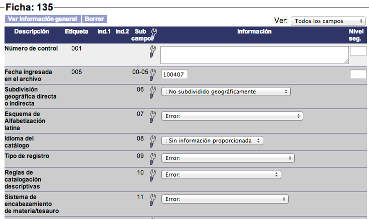
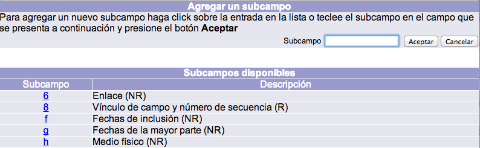

meta-json: {"viewport":"width=device-width, initial-scale=1.0, maximum-scale=1.0,\nuser-scalable=0","robots":"noindex,follow","title":"Creación, edición y borrado de registros de autoridad | Ayuda contextual\nde Janium","generator":["Divi v.2.2","WordPress 4.0.18"]}
robots: noindex,follow
title: Creación, edición y borrado de registros de autoridad | Ayuda contextual
  de Janium
viewport: width=device-width, initial-scale=1.0, maximum-scale=1.0, user-scalable=0
Date:Nov 25, 2014

# Creación, edición y borrado de registros de autoridad

[%Date]

## Creación de registros

El procedimiento de creación de registros de autoridad es el siguiente:

-   En la sección de *Creación de registros de autoridad*, seleccionar
    el formato que se desea utilizar para la nueva autoridad, así como
    la biblioteca responsable de crearla. Esto se realiza dando clic en
    el menú desplegable correspondiente.

-   Hacer clic en el botón **Crear** de la misma sección. Se despliega
    la hoja de captura / formulario de catalogación relacionado con el
    formato elegido en el paso anterior.

-   Introducir la información sobre la autoridad en los campos
    destinados a ello.

-   Una vez concluida la introducción de datos, para proceder a guardar
    el registro, colocar el puntero del ratón sobre el icono de
    *herramienta* para desplegar el menú contextual asociado. A
    continuación, hacer clic en la opción **Guardar y salir** (o
    **Guardar**, si se quiere seguir trabajando sobre el registro).

-   Finalmente, el sistema regresa a la pantalla de *Menú AUT* mostrando
    la autoridad creada como **registro activo**, lo que indica que
    dicha autoridad ha sido guardada con éxito y ya puede ser consultada
    a través del catálogo de autoridades o desde las hojas de captura de
    control bibliográfico.

### Menú contextual de opciones

Uno de los elementos de la plantilla es el **icono de herramienta**, que
despliega el menú contextual de opciones para todos los campos al
colocar el puntero del ratón sobre cualquiera de estas imágenes.

Las opciones que aparecen en el menú contextual son las siguientes:

-   **Agregar etiqueta:** al hacer clic sobre esta opción, se despliega
    una ventana emergente con la lista de etiquetas definidas que pueden
    añadirse a la plantilla. Para seleccionar una de ellas, se puede
    pinchar en el número de la etiqueta que se quiere agregar o bien
    escribir dicho número en el campo de texto Etiqueta, situado en la
    parte superior derecha y después hacer clic en el botón *Aceptar*.

-   **Borrar etiqueta:** permite borrar el campo seleccionado, subcampos
    incluidos. Este tipo de opciones, al igual que *Borrar subcampo*, no
    modifican el diseño de la plantilla. Es decir, no borran definitivamente la
    etiqueta de todos los registros, sino sólo del que se está
    creando o editando.
-   **Repetir etiqueta:** permite repetir el campo seleccionado. La
    nueva etiqueta se agrega justo debajo de la usada como referencia
    para la repetición. Al igual que en el caso anterior, estas opciones
    tampoco modifican el diseño de la plantilla.
-   **Agregar subcampo:** como sucede con *Agregar etiqueta*, al hacer
    clic sobre esta opción también se muestra una ventana emergente con
    la lista de subcampos definidos que pueden añadirse en la plantilla.
    Sin embargo, la diferencia aquí radica en que la lista mostrada está asociada
    a la etiqueta donde se quiere añadir el subcampo.

-   **Borrar subcampo:** permite borrar el elemento seleccionado. No se
    borrará la etiqueta a la que pertenece, excepto cuando sea el único
    subcampo desplegado en ella.
-   **Repetir subcampo:** permite repetir los subcampos definidos como
    repetibles. Al presionar esta opción, se despliega un campo
    de texto donde se escribe el código del subcampo que se desea
    repetir. Después de escribir el código se da clic en el botón
    *Aceptar* para ejecutar la acción.
-   **Guardar:** permite guardar la información introducida sin tener
    que salir de la plantilla, si la intención es continuar agregando
    más datos.
-   **Guardar y salir:** guarda la información introducida y sale de la
    plantilla. Después de esta acción, se despliega la vista en detalle
    del registro, tal y como se va a ver en el catálogo al público.
-   **Salir:** permite salir de la plantilla sin guardar la información
    editada.
-   **Ayuda:** despliega la ayuda contextual de la etiqueta o subcampo
    seleccionado. Este punto puede ser configurado por la institución.

## Edición de registros

El procedimiento de edición de registros de autoridad es el siguiente:

-   En la pantalla de *Menú AUT*, buscar la autoridad a editar mediante
    la sección correspondiente. En este sentido:
    -   Si se realiza la búsqueda **por número de registro** de la
        autoridad, se despliega inmediatamente la hoja de captura con la
        información de la misma, para que pueda ser editada.  
        

    -   En cambio, si la búsqueda se lleva a cabo por **autor**,
        **materia**, **serie** o **editorial**, el sistema muestra la
        lista de referencias coincidentes con el término que se ha
        buscado. En este caso, para dar paso a la edición es necesario
        hacer clic sobre la
        referencia deseada.
          
       
       -   Después de haber hecho las modificaciones pertinentes dentro de la
    hoja de captura / formulario de catalogación, guardar el registro a
    través de la opción **Guardar** o **Guardar y salir** del menú
    contextual al que se accede mediante el icono de *herramienta*.

## Borrado de registros

El procedimiento de borrado de registros de autoridad es el siguiente:

-   Buscar la autoridad a eliminar siguiendo los mismos pasos indicados
    en el procedimiento de **Edición de registros**, teniendo en cuenta
    lo ya mencionado:
    -   Si se realiza la búsqueda **por número de registro** de la
        autoridad, se despliega de inmediato la hoja de captura con la
        información de la misma, para que pueda ser borrada
        directamente.
    -   En cambio, si la búsqueda se lleva a cabo por **autor**,
        **materia**, **serie** o **editorial**, el sistema muestra la
        lista de referencias coincidentes con el término que se ha
        buscado. En este caso, para dar paso al formulario es necesario
        hacer clic sobre la
        referencia deseada.
-   Una vez dentro de la hoja de captura, hacer clic en el botón
    **Borrar** situado en la parte superior izquierda de la pantalla. El
    sistema elimina el registro seleccionado y vuelve a la pantalla de
    *Menú AUT*.

