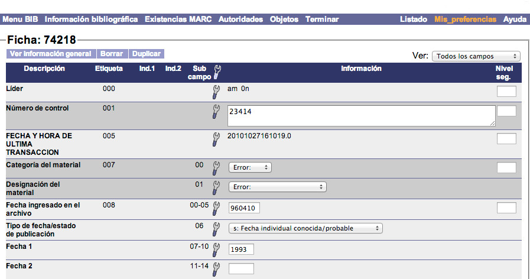
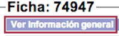
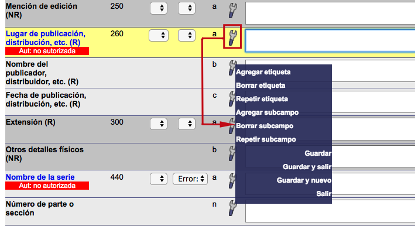

meta-json: {"viewport":"width=device-width, initial-scale=1.0, maximum-scale=1.0,\nuser-scalable=0","robots":"noindex,follow","title":"Creación y edición de registros bibliográficos | Ayuda contextual de\nJanium","generator":["Divi v.2.2","WordPress 4.0.18"]}
robots: noindex,follow
title: Creación y edición de registros bibliográficos | Ayuda contextual de
  Janium
viewport: width=device-width, initial-scale=1.0, maximum-scale=1.0, user-scalable=0
Date:Nov 25,2014

# Creación y edición de registros bibliográficos

[%Date]

Por lo general, un nuevo registro bibliográfico se crea cuando:

-   El título no ha sido capturado previamente.
-   No se ha capturado una edición diferente del título.
-   No fue localizado en otros catálogos.

Como ya se ha mencionado, el paso previo a la creación de un registro
bibliográfico es la selección del formato del material, que
determina a su vez la plantilla, y de la biblioteca catalogadora.

Una vez realizada esta acción y tras hacer clic en el botón *Crear*, se
despliega la plantilla correspondiente. Es en este punto cuando el
sistema asigna el **número de ficha** al registro creado. Este número es
de carácter único, lo que significa que si el registro fuera borrado no
se asignaría el mismo a uno nuevo.

### Elementos de la plantilla

#### Información general

Al crear o editar un registro este elemento no está desplegado por
defecto. Para hacerlo, es necesario hacer clic en el botón *Ver
información general* situado justo debajo del número de ficha.

Esta sección tiene los siguientes campos:

-   **No. control:** número de control del registro asignado por la
    institución. Sirve como dato de recuperación en la búsqueda avanzada
    a través de la búsqueda numérica. Su uso es opcional, por lo que este
    campo puede no contener información.
-   **Biblioteca:** biblioteca responsable de la creación y recogida de
    la información en el registro, llamada también *Biblioteca
    catalogadora*.
-   **Formato:** estructura de datos utilizada para crear el registro.
    Determina por lo tanto los campos que serán usados para introducir
    la información.
-   **Nivel de acceso:** valor numérico que establece el nivel de acceso
    mínimo que el usuario debe tener para poder desplegar el registro en
    el catálogo al público. Este campo puede no tener ningún número lo
    que significa que cualquier usuario podrá desplegarlo.
-   **Creado por:** número de cuenta del operador responsable de la
    creación del registro.
-   **Fecha creación:** fecha de creación del registro en formato
    AAAAMMDD.
-   **Modificado por:** número de cuenta del operador responsable de la
    última modificación realizada en la información del registro.
-   **Fecha modificación:** fecha de la última modificación realizada en
    la información del registro en formato AAAAMMDD.

Los campos No. control,
Biblioteca, Formato y Nivel de acceso pueden ser
modificados por el operador del módulo. Los campos Creado por, Fecha creación, Modificado por y Fecha modificación son
controlados por el módulo y no pueden ser modificados por el operador.

Al realizar algún cambio en esta sección, el operador debe confirmar la
acción haciendo clic en el botón *Actualizar*.

#### Columnas

La plantilla presenta las siguientes columnas:

-   **Descripción:** término descriptivo del campo de catalogación.
-   **Etiqueta:** número representativo del campo de catalogación.
-   **Ind. 1:** indicador 1 relacionado con el campo *Etiqueta*.
-   **Ind. 2:** indicador 2 relacionado con el campo *Etiqueta*.
-   **Subcampo:** elemento identificador relacionado con el campo
    *Etiqueta*.
-   **Icono de herramienta:** imagen orientativa que da acceso al menú
    contextual de opciones para cada campo de la plantilla.
-   **Información:** campo de texto o selección donde se registra la
    información descriptiva del material.
-   **Nivel seg:** valor numérico para establecer el nivel de acceso
    mínimo que los usuarios deben tener asignado para desplegar la
    información del campo concreto.

Dependiendo del formato elegido, algunos de estos elementos pueden
aparecer o no (como etiqueta, ind. 1, ind. 2 o subcampo). Por ejemplo, el
formato Dublin Core no tiene indicadores, etiquetas ni subcampos, por lo
que en su plantilla sólo constan descripción, imagen de herramienta, información y nivel de seguridad.

#### Menú contextual de opciones

Como se acaba de describir, uno de los elementos de la plantilla es el
**icono de herramienta**, que despliega el menú contextual de opciones
para todos los campos al colocar el puntero del ratón sobre cualquiera
de estas imágenes.

Las opciones que aparecen en el menú contextual son las siguientes:

-   **Agregar etiqueta:** al hacer clic sobre esta opción, se despliega
    una ventana emergente con la lista de etiquetas definidas que pueden
    añadirse a la plantilla. Para seleccionar una de ellas, se puede
    pinchar en el número de la etiqueta que se quiere agregar o bien
    escribir dicho número en el campo de texto Etiqueta, situado en la
    parte superior derecha y después hacer clic en el botón *Aceptar*.

-   **Borrar etiqueta:** permite borrar el campo seleccionado, subcampos
    incluidos. Este tipo de opciones, al igual que *Borrar subcampo*, no
    modifican el diseño de la plantilla. Es decir, no borran definitivamente la
    etiqueta de todos los registros, sino sólo del que se está
    creando o editando.
-   **Repetir etiqueta:** permite repetir el campo seleccionado. La
    nueva etiqueta se agrega justo debajo de la usada como referencia
    para la repetición. Al igual que en el caso anterior, estas opciones
    tampoco modifican el diseño de la plantilla.
-   **Agregar subcampo:** como sucede con *Agregar etiqueta*, al hacer
    clic sobre esta opción también se muestra una ventana emergente con
    la lista de subcampos definidos que pueden añadirse en la plantilla.
    Sin embargo, la diferencia aquí radica en que la lista mostrada está asociada
    a la etiqueta donde se quiere añadir el subcampo.

-   **Borrar subcampo:** permite borrar el elemento seleccionado. No se
    borrará la etiqueta a la que pertenece, excepto cuando sea el único
    subcampo desplegado en ella.
-   **Repetir subcampo:** permite repetir los subcampos definidos como
    repetibles. Al presionar esta opción, se despliega un campo
    de texto donde se escribe el código del subcampo que se desea
    repetir. Después de escribir el código se da clic en el botón
    *Aceptar* para ejecutar la acción.
-   **Guardar:** permite guardar la información introducida sin tener
    que salir de la plantilla, si la intención es continuar agregando
    más datos.
-   **Guardar y salir:** guarda la información introducida y sale de la
    plantilla. Después de esta acción, se despliega la vista en detalle
    del registro, tal y como se va a ver en el catálogo al público.
-   **Guardar y nuevo:** guarda el registro activo en el editor, crea
    uno nuevo con el mismo formato, en la misma biblioteca y comienza su
    edición.
-   **Salir:** permite salir de la plantilla sin guardar la información
    editada.
-   **Ayuda:** despliega la ayuda contextual de la etiqueta o subcampo
    seleccionado. Este punto puede ser configurado por la institución.

**NOTA:** en este contexto, se debería verificar que el navegador
utilizado permita el despliegue de las ventanas emergentes que genera el
sistema Janium. A veces, los navegadores muestran un aviso que indica
que se evitó el despliegue de estas ventanas y es necesario autorizar la
acción.

### Edición de “información general” desde *Detalle*

Es posible configurar el sistema para que permita que los catalogadores
revisen y modifiquen la información de control (o **información
general**) de los registros bibliográficos desde la página de *Detalle*,
sin tener que entrar necesariamente a la plantilla para tal propósito.

Si el sistema está configurado para ello, en la pantalla de *Detalle* se
podrá observar una nueva pestaña: **“Ver información general”**.

Al hacer clic sobre ella aparecerá la sección desplegada, justo como lo
hace en la plantilla:

De igual modo, la sección puede ocultarse haciendo clic nuevamente en
“Información general”.

**Notas aclaratorias sobre esta función:**

-   Su presencia no altera en absoluto el comportamiento actual de las
    plantillas, con su propia sección de edición.
-   En ella aplican las mismas restricciones de seguridad y opciones de
    catalogador que aplican en las plantillas.

