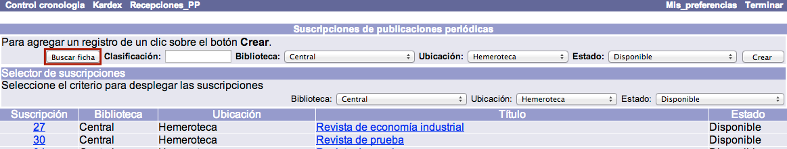
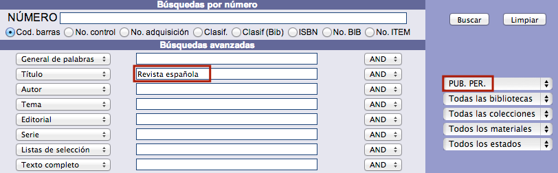
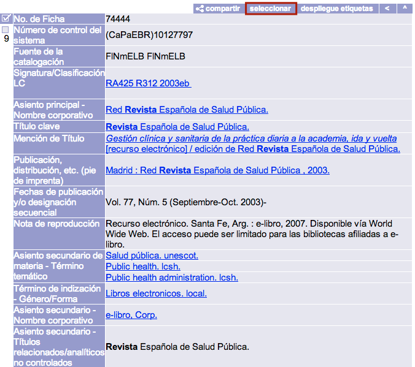
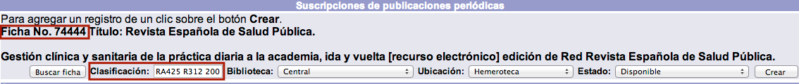
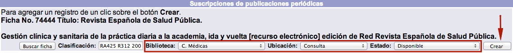
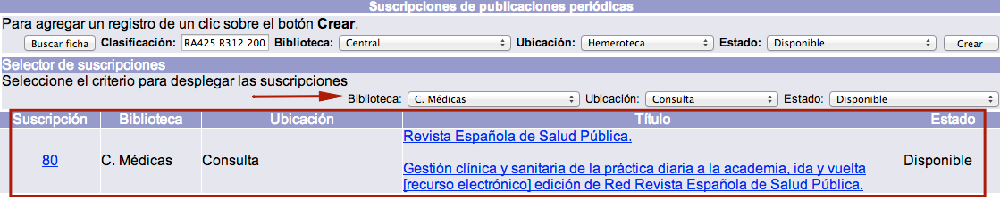
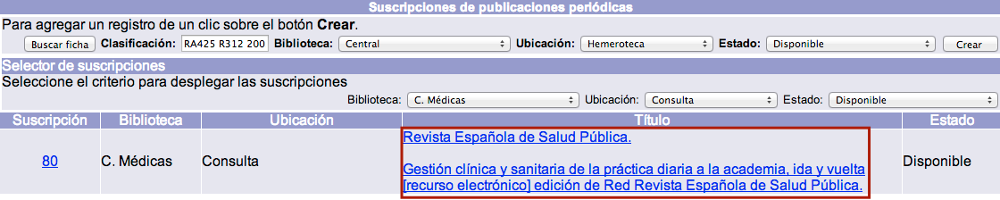
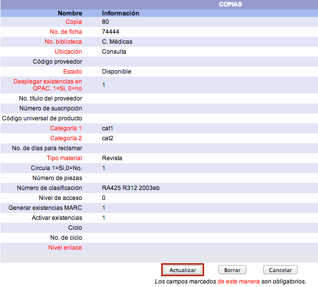

# Creación y edición de suscripciones
## Creación de suscripciones

Para crear una suscripción se deben seleccionar únicamente **registros bibliográficos creados con los formatos correspondientes a publicaciones periódicas**. De esta forma, un registro creado con el formato *Libro* no permitirá asociarle una suscripción.

El procedimiento a seguir es el siguiente:

- Estando en la opción *Suscripciones* del módulo, hacer clic en el botón **Buscar ficha** para proceder a buscar el registro para el que se va a crear la suscripción.

- A continuación, el sistema despliega una ventana emergente con la opción de *Búsqueda avanzada*, donde introducir los términos deseados. Una vez encontrado y desplegado en detalle el registro en cuestión, hacer clic en el botón **Seleccionar** para elegirlo.

- De regreso a la pantalla de *Suscripciones*, se presenta el registro seleccionado, incorporando también los datos de _número de ficha / registro y _número de clasificación_, si lo tiene. Si se desea que para la nueva suscripción se asigne un número de clasificación diferente al del registro, a los ítems creados al recibir los fascículos, puede introducirse este dato en el campo **Clasificación**
    

- Elegir la **Biblioteca**, la **Ubicación** y el **Estado** de la suscripción mediante las listas desplegables habilitadas para ello. Esta acción es necesaria porque, aunque una publicación periódica se registra una sola vez,_puede tener asociada más de una suscripción_, por ejemplo, para responder a las necesidades de varias unidades dependientes de una misma institución. Hacer clic en el botón **Crear**.

- Finalmente, el sistema crea la suscripción y la muestra en la parte inferior de la pantalla del módulo, intercalando la información con los registros de suscripciones de otras publicaciones que ya puedan existir.

## Edición de suscripciones

El procedimiento a seguir es el siguiente:

- Desde la lista de suscripciones creadas, hacer clic sobre el _título de la publicación_ cuya suscripción se desea editar.

- Se muestra el formulario con los campos detallados de la suscripción. Hacer clic en el botón **Actualizar** para proceder a realizar los cambios necesarios. Los campos que se presentan son los siguientes:

    - *Copia:* número que el sistema asigna automáticamente a la suscripción.
    - *No. de ficha:* número del registro descriptivo para el que se creó la suscripción.
    - *Biblioteca:* unidad institucional a la que pertenece la suscripción. Los fascículos recibidos serán asociados a esta biblioteca.
    - *Ubicación:* sección / lugar en el que estarán los fascículos recibidos de la suscripción.
    - *Código proveedor:* identificador del organismo que suministra la suscripción. Los avisos de reclamaciones se enviarán a la dirección de correo electrónico ingresada en el registro de este proveedor.
    - *Estado:* situación (en relación al flujo de procesos de la institución) de los ítems creados al recibir los fascículos.
    - *Desplegar existencias en opac:* si se asigna el valor **1**, las existencias MARC creadas al recibir fascículos se muestran en el catálogo al público. Si se asigna el valor **0**, esta acción no se produce.
    - *No. título del proveedor:* identificador específico que opcionalmente puede asignar el organismo suministrador al título cuya suscripción se recibe.
    - *Número de suscripción:* identificador de la suscripción, distinto al que aparece en el campo _Copia_, que opcionalmente puede ser asignado por el proveedor o por la institución.
    - *Código universal del producto:* si los fascículos contienen este identificador, puede registrarse aquí.
    - *Categoría 1* y *Categoría 2:* al recibir un fascículo, a cada ítem creado se le asignan dos categorías estadísticas, que son las mismas a las utilizadas en el módulo de Control bibliográfico.
    - *No. de días para reclamar:* cantidad de días que deben pasar, desde la fecha en que debió recibirse el fascículo (“fecha de esperado”), para que empiecen a generarse reclamaciones al proveedor.
    - *Tipo material:* al recibir un fascículo, a cada ítem creado se le asigna un tipo de material, que son los mismos a los utilizados en el módulo de Control bibliográfico.
    - *Circula:* si se asigna el valor **1**, los ítems creados pueden ser prestados a los usuarios. Si se asigna el valor **0**, esta acción no se produce.
    - *Número de piezas:* cantidad de elementos que forman un ítem y que se agrupan bajo un solo código de barras.
    - *Número de clasificación:* el cuál se asigna a los ítems creados al recibir los fascículos. Puede ser el ingresado al crear el registro de la suscripción o el extraído del registro de la publicación periódica.
    - *Nivel de acceso:* identificador numérico jerárquico que determina si este registro va a estar restringido a ciertos operadores del módulo.
    - *Generar existencias MARC:* si se asigna el valor **1**, se crean existencias de este tipo al recibir los fascículos. Si se asigna el valor **0**, esta acción no se produce.
    - *Activar existencias:* si se asigna el valor **1**, al recibir fascículos se crea un registro de ítem para cada uno de ellos. Si se asigna el valor **0**, esta acción no se produce.
    - *Ciclo:* fondo / partida presupuestal que se destina al pago de la suscripción al proveedor.
    - *No. ciclo:* identificador numérico del fondo / partida presupuestal indicada.
    - *Nivel de enlace:* cantidad de niveles que hay para esta suscripción. Cada nivel representa un _tipo de fascículo_. Por ejemplo, si se están recibiendo dos tipos: los de la edición regular y los del suplemento, cada uno tiene su propia designación cronológica y numérica, por lo tanto, se usan dos tipos y se tienen dos niveles.

- Después de haber llevado a cabo las modificaciones correspondientes, hacer clic de nuevo en el botón **Actualizar** para guardar los cambios realizados.
