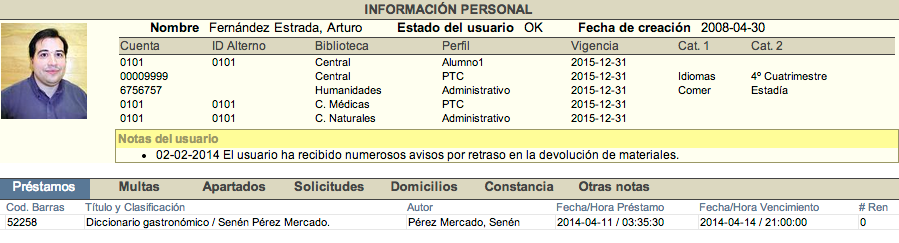
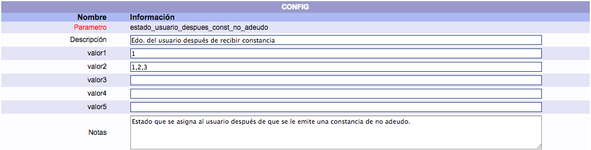
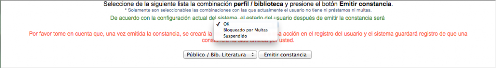

# Despliegue de usuario

{{date}}

Esta opción del módulo se compone de diferentes secciones ya que depende
de la información vinculada con el registro del usuario:

-   **Información personal del usuario**:

    -   Nombre.
    -   Fotografía.
    -   Estado.
    -   Fecha de creación del registro de usuario.
    -   Datos sobre perfiles asociados (número de cuenta, ID alterno,
        biblioteca, tipo de perfil, vigencia, categoría 1 y categoría
        2).
    -   Notas informativas.

-   **Información de circulación**:

    -   Préstamos.
    -   Multas.
    -   Apartados / Reservas.
    -   Solicitudes.
    -   Domicilios.
    -   Constancias.
    -   Otras notas.

## Constancias de no adeudo

Este tipo de notificación se genera cuando un usuario no tiene ninguna
vinculación en vigor con alguno de los servicios de la institución
(préstamos, reservas o multas).

La opción de constancia de no
adeudo se activa en la sección de **Despliegue del usuario**.
Para llevar a cabo este proceso es necesario seleccionar el perfil y la
biblioteca a considerar para la generación de la constancia. Por otro
lado, cuando se crea esta constancia, también se crea automáticamente
una **nota** con el nombre del operador autor de la misma y la fecha
correspondiente.

Un aspecto importante es que, aunque el sistema genera las constancias,
se debe hacer el diseño previo de ellas en **formato html**. Una vez
realizado este paso, se debe configurar en la sección *Descripciones*
del módulo de Administración, dentro de *Configuración general*.

### Selección de estado de usuario en constancias

Por otro lado, es posible que el operador seleccione el **estado** que
va a tener el usuario una vez que la constancia sea emitida.

Esta acción permite extender el uso en la generación de constancias,
posibilitando que no se emitan únicamente para liberar el servicio de la
biblioteca, sino también para presentarse ante otras instituciones o
dependencias de la misma, sin que ello implique dejar de recibir el
servicio de la institución (asignado el estado **OK**, por ejemplo).

También hace posible definir y seleccionar nuevos estados que la
institución requiera, como indicar que la constancia se emitió por
concepto de una *baja temporal* o una *baja definitiva*.

A continuación, unas imágenes de ejemplo:

**Despliegue general de estados del usuario**

**Configuración de lista de estados**

**Lista creada a partir de configuración**

