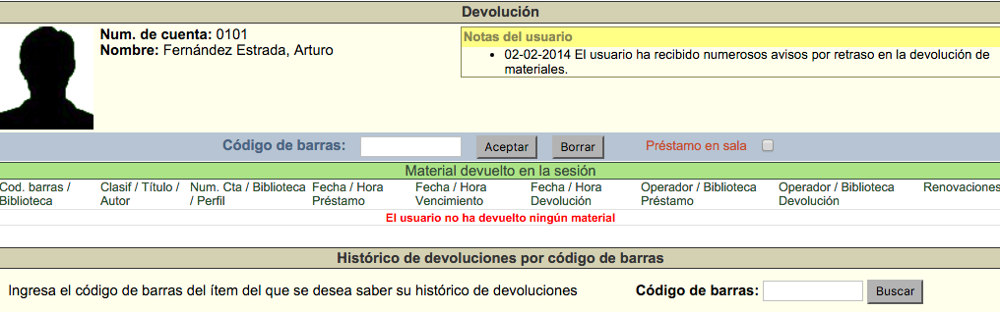

meta-json: {"viewport":"width=device-width, initial-scale=1.0, maximum-scale=1.0,\nuser-scalable=0","robots":"noindex,follow","title":"Devoluciones | Ayuda contextual de Janium","generator":["Divi v.2.2","WordPress 4.0.18"]}
robots: noindex,follow
title: Devoluciones | Ayuda contextual de Janium
viewport: width=device-width, initial-scale=1.0, maximum-scale=1.0, user-scalable=0
Date:Nov 26, 2014

# Devoluciones

[%Date]

Estas acciones consisten en registrar la entrega en la biblioteca de un
material prestado. Cuando se registra la devolución de dicho material
antes de su fecha y hora de vencimiento no se genera ninguna sanción
(monetaria o administrativa) al usuario.

### Pantalla

La pantalla de Devolución se compone de tres secciones:

-   **Información sobre el usuario**, que muestra lo siguiente:

    -   Número de cuenta y nombre completo del usuario.
    -   Notas informativas asociadas al usuario.

-   **Campo de código de barras y préstamo en sala**, que muestra lo
    siguiente:

    -   Campo de texto para escribir el código de barras.
    -   Cuadro de selección para préstamo en sala.

-   **Lista de material devuelto en la sesión activa**, que muestra lo
    siguiente:

    -   Código de barras y biblioteca del ejemplar.
    -   Clasificación, título y autor.
    -   Número de cuenta del usuario, biblioteca del usuario y perfil.
    -   Fecha y hora de préstamo.
    -   Fecha y hora de vencimiento.
    -   Fecha y hora de devolución.
    -   Número de cuenta y biblioteca del operador de Circulación
        responsable del préstamo.
    -   Número de cuenta y biblioteca del operador de Circulación
        responsable de la devolución.
    -   Renovaciones efectuadas.

-   **Historial de devoluciones de un material:** que puede ser
    consultado introduciendo el código de barras del ítem.

### Procedimiento de devolución

-   Hacer clic sobre la opción **Devolución** de la barra de
    herramientas del módulo.

-   Escribir el número de
    código de barras del material en el campo de texto de la
    sección destinada para ello y hacer clic en el botón **Aceptar**.

-   Al llevar a cabo la acción anterior, se despliegan los datos del
    usuario que tenía vinculado el material en préstamo y la información
    del registro de devolución.

### Devolución de un préstamo vencido

Cuando se devuelve un material cuyo período de préstamo ha expirado, el
sistema avisa de tal situación y, además, ejecuta la multa monetaria o suspensión administrativa
correspondiente dependiendo de las **políticas de circulación**
aplicadas por la institución.

El posible mensaje de alerta es el siguiente:

> Por favor, tenga en cuenta que el usuario ha sido multado por retraso
> en la devolución del material.

### Devolución de un material apartado / reservado

Un usuario puede solicitar el apartado / reserva de un material que se
encuentre **Prestado**. Esto significa que al registrar la devolución
del material, este queda reservado para el usuario solicitante siguiente
evitando que otros usuarios lo
puedan pedir en préstamo, durante el tiempo que la institución
haya definido para estos casos. Además, el sistema avisa de la
mencionada circunstancia.

El posible mensaje de alerta es el siguiente:

> Por favor, tenga en cuenta que el material fue apartado por el
> usuario: 1234

