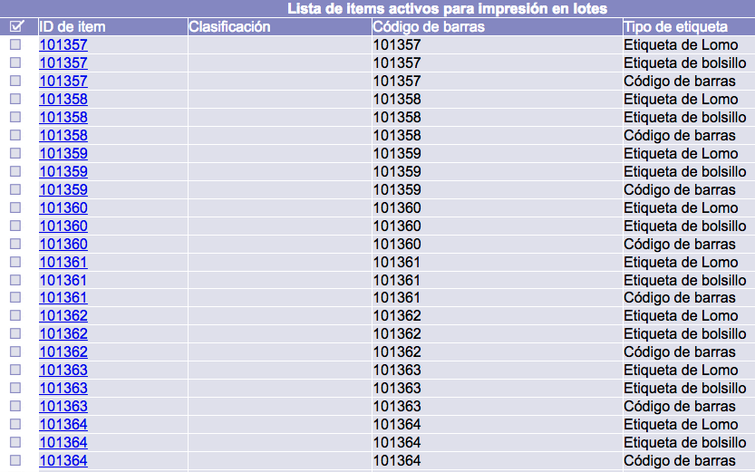
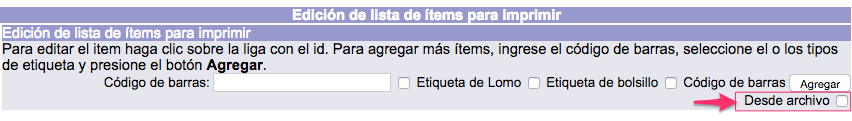
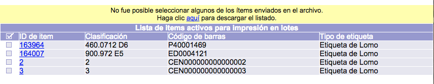
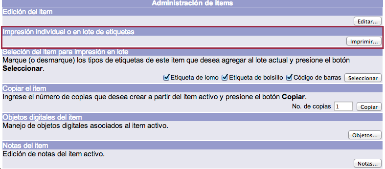

# Edición de lista de etiquetas a imprimir

Si se conocen los números de códigos de barras de los materiales para los que se imprimirán etiquetas, no es necesario buscar cada uno de ellos de forma individual. Se pueden agregar estos números a la lista a través del botón ***Editar***, localizado en la pantalla del menú principal del módulo.

Dicho botón despliega la pantalla de ***Edición de lista de ítems para imprimir***. En esta pantalla se debe escribir el número de código de barras en el cuadro de texto, elegir los tipos de etiqueta y, finalmente, hacer clic en el botón *Agregar*.

Como resultado, en la parte inferior se muestra una línea por cada tipo de etiqueta seleccionada.

### Selección masiva de ejemplares

En el caso de que los números de códigos de barras sean **consecutivos** se puede realizar una selección masiva escribiendo un _rango_ en el campo de texto antes mencionado.

Este rango numérico tiene que presentar la siguiente estructura: el primer número y el último del intervalo separados por dos guiones juntos; por ejemplo, **101357– –101396**.

El resto del procedimiento es igual al descrito en el punto anterior.

### Selección de ejemplares desde archivo

La captura de códigos de barras para la impresión de etiquetas puede no hacerse necesariamente capturando uno a la vez. Es decir, se pueden enviar al sistema listados de texto, **con un código en cada línea**, para acelerar el proceso de captura.

En la interfaz de captura aparece una _casilla de selección_ para especificar que la carga de códigos se hará desde un archivo.

Al marcar la casilla, la caja de texto para captura individual de códigos de barras desaparece.

Tras presionar el botón “Agregar” y transferir el archivo, la interfaz regresa a su estado original y la lista de ítems activos para impresión mostrará los remitidos.

El usuario recibe una notificación cuando alguno de los códigos enviados no puede ser seleccionado. También se le provee de un enlace mediante el cual puede obtener la lista de los códigos enviados que pudieron seleccionarse para impresión.

### Creación del patrón de etiquetas

Existen tres formas de crear este patrón, que se corresponden con las maneras de acceder a la pantalla de _impresión de etiquetas_:

- **Desde *Edición de lista de ítems para imprimir*:** la opción *Imprimir* se activa tras agregar un número o rango de números de códigos de barras.

- **Desde *Menú BIB*:** la opción *Imprimir* se activa al seleccionar al menos un registro de ejemplar.

- **Desde *Administración de ítems*:** la opción *Imprimir* se muestra al elegir un ejemplar mediante el cuadro selector y entrar en *Administración de ítems*.

