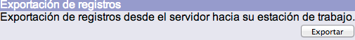
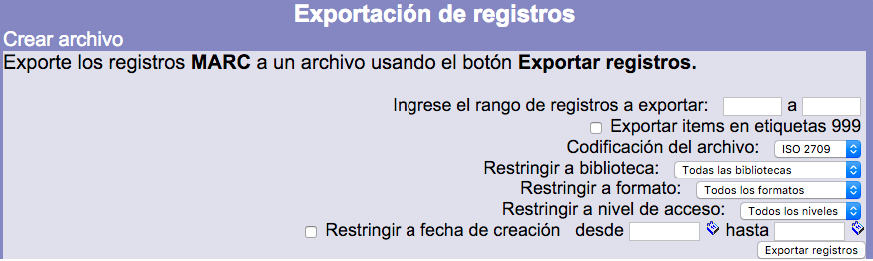

# Exportación de registros bibliográficos

El sistema exporta a un archivo los registros en formato MARC21 que hayan sido seleccionados. En esta función, es opcional la exportación también de la información de los **ejemplares** vinculados a los registros bibliográficos, que sería colocada en la etiqueta 999 de MARC21.

Para ejecutar este proceso es necesario escribir el rango de números de ficha de los registros que serán exportados. Además, también pueden definirse limitaciones para los resultados, como son: **biblioteca**, **formato**, **nivel de acceso** y **fecha de creación**.

