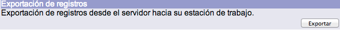
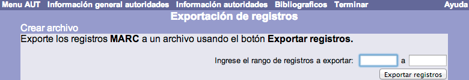
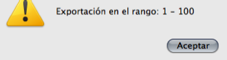
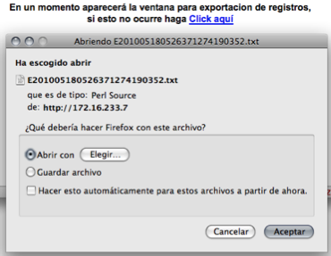

# Exportación de registros de autoridad

El procedimiento de exportación de registros de autoridad es el siguiente:

- En la pantalla de *Menú AUT*, hacer clic en el botón **Exportar** de la sección correspondiente.

- Se despliega el menú de *Exportación de registros*. Escribir el rango o intervalo de números de registro a exportar (el primero y el último) en los cuadros de texto definidos para ello. Hacer clic en el botón **Exportar registros**.

- En la siguiente ventana emergente, el sistema muestra el rango o intervalo indicado para que sea validado por el usuario. Hacer clic en el botón **Aceptar** para confirmar la exportación.

- Después del paso anterior, aparece en un primer momento el aviso de la próxima descarga del archivo de registros, y después, la ventana para llevar a cabo este proceso en el directorio que se seleccione. Finalmente, hacer clic en el botón **Aceptar** para llevar a cabo la acción elegida (abrir el archivo o guardarlo en el equipo local).

