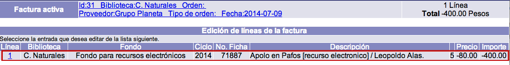
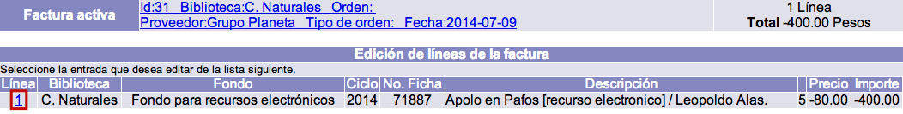

# Facturación de material #

Generalmente, la facturación tiene lugar después de la recepción. No obstante, se puede facturar _incluso antes de haber recibido los materiales_.

Después de facturar una orden de compra **ya no es posible recibir ni reclamar materiales** para dicha orden. Esto es así porque se asume que la factura de un proveedor representa un envío que es aceptado en el momento de introducir los datos de la factura en el sistema. De esta forma, como sugerencia, se recomienda no facturar si se necesita reclamar materiales o si aún se espera recibirlos.

## Creación de facturas

_NOTA IMPORTANTE_: este proceso está relacionado con los **fondos** y **ciclos de fondos** utilizados para pedir y pagar el material. Por esa razón, es esencial crear adecuadamente estos elementos y configurarlos con todos los campos que reflejen las condiciones presupuestales detalladas de la institución.

El procedimiento a seguir es el siguiente:

- Identificar la orden de compra cuyos materiales se van a facturar y seleccionarla, haciendo clic sobre su ID.

- Hacer clic en la opción **Facturación** de la barra de herramientas del módulo. Se despliega la pantalla de _creación y edición de facturas_.

- En la pantalla mencionada, aparece como ***orden de compra activa*** la seleccionada previamente, pero si se desea facturar para otra distinta, puede elegirse mediante el botón **Seleccionar orden**.

- Introducir la información necesaria y hacer clic en el botón **Crear**.Los datos que se recogen son los siguientes:

    - *ID de orden:* número identificador interno de la orden para la que se va a facturar.
    - *Número de factura:* número de la factura enviada por el proveedor.
    - *Número de cheque:* número de cheque con el que se va a pagar la factura.
    - *Fecha de factura:* fecha que aparece en la factura enviada por el proveedor.
    - *Fecha de pago:* fecha en que se está pagando la factura.

- El sistema reconoce cuántas líneas están asociadas a la orden de compra y las muestra. Marcar aquella que se va a facturar usando el **cuadro selector** situado en la parte izquierda de la línea. A continuación, hacer clic en el botón **Facturar líneas**.

- Después de facturar, se despliega de nuevo el sumario de las líneas creadas y la información de la orden activa para la que se ha facturado.

## Edición de facturas

El procedimiento a seguir es el siguiente:

- Estando en la opción *Facturación* del módulo, identificar la factura que se desea editar y hacer clic sobre su **ID**.

- En la siguiente pantalla, hacer clic de nuevo sobre el **ID** de la línea de factura a editar.

- Se despliega el registro de la línea de factura. Hacer clic en el botón **Actualizar** para proceder a su edición (o **Cancelar**, si se desea regresar a la pantalla anterior).Los campos que se presentan en dicho registro son los siguientes:

    - *Número de factura:* número único que el sistema asigna a la factura. Todas las líneas relacionadas con la factura tendrán el mismo número en este campo.
    - *No. de línea factura:* número de la línea de factura asignado por el sistema. Cada línea de factura relacionada con una orden tiene un número único que la identifica dentro de la misma.
    - *No. de fondo:* fondo que se seleccionó al crear la línea de orden. Es ingresado automáticamente por el sistema.
    - *No. de orden:* número de la orden asignado por el sistema, al que están enlazadas las líneas de orden que se facturaron. Es ingresado automáticamente por el sistema.
    - *No. de línea de orden:* número de la línea de orden que se facturó y al que está enlazada la línea de factura. Es ingresado automáticamente por el sistema.
    - *Ciclo:* partida presupuestaria con que se está pagando la factura. Es ingresado automáticamente por el sistema.
    - *No. de ficha:* número del registro bibliográfico al que está enlazada la línea de orden. Si no hay ninguno asociado, este campo aparece vacío. Es ingresado automáticamente por el sistema.
    - *Descripción 1:* primer campo para describir el material que se ordenó en la línea de orden.
    - *Descripción 2:* segundo campo para describir el material que se ordenó en la línea de orden.
    - *Descripción 3:* tercer campo para describir el material que se ordenó en la línea de orden.
    - *Descripción 4:* cuarto campo para describir el material que se ordenó en la línea de orden.
    - *Descripción 5:* quinto campo para describir el material que se ordenó en la línea de orden.
    - *No. moneda:* unidad monetaria con la que se pagó al proveedor la factura en la que están las líneas. Es ingresado automáticamente por el sistema.
    - *Tipo de cambio:* tipo de cambio de la moneda con la que se pagó al proveedor con relación a la moneda base. Es ingresado automáticamente por el sistema.
    - *No. tipo de descuento:* el tipo de descuento que se aplicó en la línea de orden. Es ingresado automáticamente por el sistema.
    - *Porcentaje de descuento:* el porcentaje que se descontó al total de la línea de orden. Es ingresado automáticamente por el sistema.
    - *Monto de descuento:* similar al porcentaje, pero en este campo se registra la cantidad que se descontó al total de la línea de orden. Es ingresado automáticamente por el sistema.
    - *Precio:* el valor económico por cada unidad, copia o ejemplar que se está ordenando en la línea. Es ingresado automáticamente por el sistema.
    - *Cantidad:* el número de unidades, copias o ejemplares que se están ordenando en la línea. Es ingresado automáticamente por el sistema.
    - *No. de partes:* el número de partes que componen una unidad, copia o ejemplar. Por ejemplo, si un libro incluye un CD, se puede registrar **2**.
    - *Notas:* cualquier aclaración informativa que los operadores deseen ingresar sobre la línea de factura.
    - *Instrucciones:* cualquier indicación que se deba seguir respecto de la línea de factura.

- Si se ha modificado algún dato, hacer clic de nuevo en el botón **Actualizar** para guardar los cambios (o **Cancelar**, para volver a la pantalla anterior). Finalmente, el sistema regresa a la pantalla de *Edición de líneas de la factura*.

