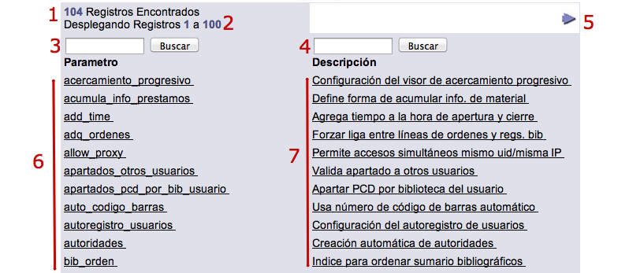

meta-json: {"viewport":"width=device-width, initial-scale=1.0, maximum-scale=1.0,\nuser-scalable=0","robots":"noindex,follow","title":"Formularios de información en Administración | Ayuda contextual de\nJanium","generator":["Divi v.2.2","WordPress 4.0.18"]}
robots: noindex,follow
title: Formularios de información en Administración | Ayuda contextual de
  Janium
viewport: width=device-width, initial-scale=1.0, maximum-scale=1.0, user-scalable=0
Date:Dec 1, 2014

# Formularios de información en Administración

[%Date]

## Creación y edición de registros

NOTA: dado que el proceso para crear y editar un registro de información
en el módulo de Administración es idéntico para cualquier tipo de
función, se describe en este punto de forma global, evitando así la
reiteración de incluirlo en cada una de las secciones relacionadas.

El procedimiento a seguir es el siguiente:

-   Introducir el valor a crear en el cuadro de texto del campo (o
    campos) ***Información***, o seleccionarlo de la lista desplegable,
    dependiendo del tipo de función.

-   Hacer clic en el botón **OK**. Si el valor introducido en el paso
    anterior ya está asignado, el registro se despliega para editarlo.
    Si no es así, si es nuevo, el registro se despliega para completarlo
    y guardarlo.

-   Además, si se quiere saber cuál es el último número de orden que va
    a ser asignado por el sistema al valor que se va a crear, se puede
    hacer clic sobre el icono situado a la derecha del campo
    ***Información***.

## Búsqueda y selección de registros

Para poder buscar, y seleccionar a continuación, valores ya creados para
alguna de las funciones del módulo se debe desplegar la lista que se
encuentra en el campo ***Nombre***. Al llevar a cabo la selección del
valor deseado, el sistema lo coloca de forma automática en su campo
***Información*** correspondiente.

No obstante, la lista desplegable mencionada no muestra el total de los
valores registrados para la función. Si se quiere seleccionar uno que no
esté en ella, se debe hacer clic en el botón **Examinar** y buscarlo en
la ventana emergente que se despliega, mediante los cuadros de texto
disponibles. Es importante destacar que dichos cuadros son sensibles a
textos en minúsculas y mayúsculas (no es igual *Nombre* que *NOMBRE* o
*nombre*).

Una vez encontrado el valor deseado, hacer clic sobre su nombre para que
el sistema lo coloque en el campo ***Información***, como en el caso
anterior.

La ventana emergente mencionada también puede mostrarse haciendo clic
sobre la opción **Ver más**, que se encuentra al final de la lista
desplegable de valores del campo ***Nombre***.

Los elementos que pueden verse en la ventana de búsqueda y selección de
registros son los siguientes:

-   Número de registros encontrados en total (1).

-   Número de registros desplegados por página (2).

-   Primera opción de búsqueda, que puede usarse introduciendo los
    términos deseados en el cuadro de texto y haciendo clic en el botón
    **Buscar** (3).

-   Segunda opción de búsqueda, que puede usarse introduciendo los
    términos deseados en el cuadro de texto y haciendo clic en el botón
    **Buscar** (4).

-   Botones de navegación, para pasar de una página de registros a otra
    (5).

-   Columna con los nombres de los valores, redactados de forma breve
    (6).

-   Columna con las descripciones respectivas de los valores (7).

-   Botón para cerrar la ventana emergente, situado en la parte inferior
    de la misma (8).

