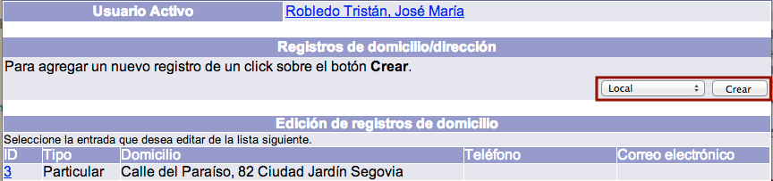
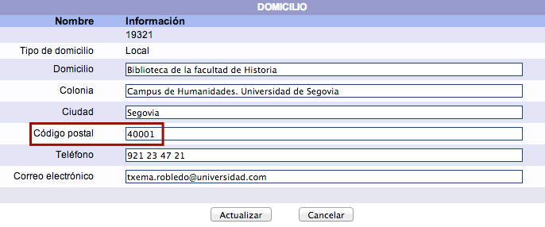
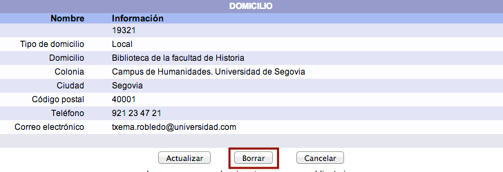

meta-json: {"viewport":"width=device-width, initial-scale=1.0, maximum-scale=1.0,\nuser-scalable=0","robots":"noindex,follow","title":"Gestión de domicilios | Ayuda contextual de Janium","generator":["Divi v.2.2","WordPress 4.0.18"]}
robots: noindex,follow
title: Gestión de domicilios | Ayuda contextual de Janium
viewport: width=device-width, initial-scale=1.0, maximum-scale=1.0, user-scalable=0
Date:Nov 26, 2014

# Gestión de domicilios

[%Date]

## Asignación de domicilios

En el sistema Janium, es posible registrar la información de hasta
**cuatro domicilios** para un mismo usuario. En este sentido, el sistema
establece cuatro categorías:

- **Local:** para los usuarios que trabajan en la propia institución, se
recogen los datos de localización de la persona dentro de la misma
(área, departamento, dirección, sección, edificio, número de teléfono,
extensión, etc.).
- **Lugar de origen:** para los usuarios cuyo lugar de origen es
diferente al lugar (ciudad o país) donde se encuentra la institución.
- **Particular:** para los usuarios cuyo lugar de origen es igual al
lugar donde se encuentra la institución, pero no trabajan en ella.

- **Temporal:** para los usuarios que no residen en el mismo lugar
(ciudad, país) de la institución y sólo serán usuarios por un tiempo
específico. Es decir, son visitantes.

El procedimiento a seguir es el siguiente:

-   Hacer clic sobre la opción **Usuarios** de la barra de herramientas
    del módulo.

-   Buscar al usuario en cuestión por ID del usuario, número de cuenta / identificador
    alterno o nombre.
-   Teniendo al usuario como **registro activo**, hacer clic en el botón
    **Domicilios** de la sección *Edición de domicilios*.

-   Se despliega la pantalla de gestión de domicilios para el usuario
    activo. Elegir el tipo de
    domicilio que se desea crear y hacer clic sobre el botón
    **Crear**. (Es necesario tener en cuenta que no es posible crear
    **dos domicilios del mismo tipo**)

-   Escribir los datos correspondientes y hacer clic en el botón
    **Crear**.

## Modificación de domicilios

El sistema Janium también permite realizar cambios en la información
registrada en el domicilio (o domicilios) del usuario.

El procedimiento a seguir es el siguiente:

-   Hacer clic sobre la opción **Usuarios** de la barra de herramientas
    del módulo.

-   Buscar al usuario en cuestión por ID del usuario, número de cuenta / identificador
    alterno o nombre.
-   Teniendo al usuario como **registro activo**, hacer clic en el botón
    **Domicilios** de la sección *Edición de domicilios*.

-   Se despliega la pantalla de gestión de domicilios para el usuario
    activo. Hacer clic sobre el **ID** del domicilio cuyos datos se
    desean modificar.

-   En el formulario de edición, realizar los cambios correspondientes y
    hacer clic en el botón **Actualizar**.

## Borrado de domicilios

Si fuera necesario, es posible borrar una dirección específica del
registro del usuario.

El procedimiento a seguir es el siguiente:

-   Hacer clic sobre la opción **Usuarios** de la barra de herramientas
    del módulo.

-   Buscar al usuario en cuestión por ID del usuario, número de cuenta / identificador
    alterno o nombre.
-   Teniendo al usuario como **registro activo**, hacer clic en el botón
    **Domicilios** de la sección *Edición de domicilios*.

-   Se despliega la pantalla de gestión de domicilios para el usuario
    activo. Hacer clic sobre el **ID** del domicilio cuyos datos se
    desean borrar.

-   En el formulario de edición, hacer clic en el botón **Borrar** para
    ejecutar la acción (el
    sistema pedirá confirmación de la misma).

