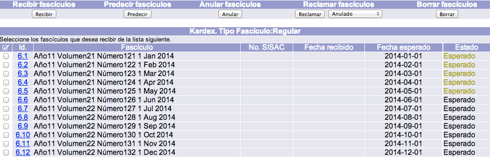
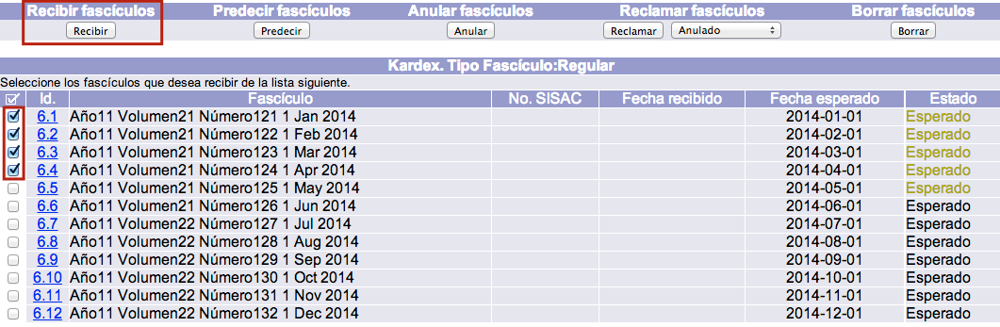
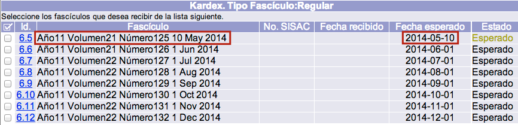

meta-json: {"viewport":"width=device-width, initial-scale=1.0, maximum-scale=1.0,\nuser-scalable=0","robots":"noindex,follow","title":"Gestión de fascículos | Ayuda contextual de Janium","generator":["Divi v.2.2","WordPress 4.0.18"]}
robots: noindex,follow
title: Gestión de fascículos | Ayuda contextual de Janium
viewport: width=device-width, initial-scale=1.0, maximum-scale=1.0, user-scalable=0
Date:Nov 27,2014

# Gestión de fascículos

[%Date]

## Predicción de fascículos

Ahora que la publicación periódica ya tiene creado un registro de
suscripción y éste tiene asociado un control de cronología y numeración,
es posible predecir los fascículos que se van a recibir. En este punto
es necesario tener en cuenta que dichos fascículos **aún no se han
recibido en el sistema**.

Este procedimiento es útil para revisar el control de cronología y
numeración seleccionado, así como para verificar la exactitud de las
fechas y numeraciones de cada fascículo. Por otro lado, mientras no se
**anulen y borren**, los fascículos predichos y aún no recibidos van a
desplegarse como parte del *kardex* del tipo de fascículo de la
suscripción.

Además, cada vez que se haga clic en el botón **Predecir**, el sistema
realizará la acción _para un
nuevo lote de fascículos de un año_.

El procedimiento a seguir para la predicción es el siguiente:

-   Estando en la pantalla de *kardex* mencionada en la sección
    anterior, y teniendo la _suscripción activa_, hacer
    clic sobre el botón **Predecir**.

-   El sistema lleva a cabo la acción y presenta la predicción de
    fascículos de un año en la parte inferior de la ventana. Cada
    fascículo que vaya a ser recibido _debe ser predicho antes_.
    El sistema predice **lotes de fascículos**, permitiendo así
    listarlos para revisar cualquier posible excepción y hacer cambios
    en uno o más de ellos antes de recibirlos.

## Recepción de fascículos

Una vez que se hayan predicho los fascículos en cuestión, el
procedimiento a seguir para su recepción es el siguiente:

-   Hacer clic sobre el cuadro selector, situado a la izquierda del
    campo *Id*., de todos aquellos fascículos de la lista que se quieran
    recibir. A continuación, hacer clic en el botón **Recibir**.El
    sistema realiza el proceso y, si está configurado así, también crea
    un registro de ítem para esos fascículos y los incluye en las
    existencias MARC.

-   Por defecto, después de haber recibido uno o más fascículos, se
    despliega la lista de aquellos que aún están pendientes de recibir,
    es decir, con estado **Esperado**. Si se desea visualizar alguna
    otra categoría específica, o todos los fascículos de manera general,
    puede hacerse usando el menú desplegable de la sección *Kardex. Tipo
    Fascículo*.

### Edición de fascículos

Puede darse la circunstancia de que alguno de los fascículos predichos
llegue a la institución con una **numeración y / o fecha diferente a la
esperada**, en tales casos, es posible modificar los datos presentes en
el sistema para ajustarlos a los reales.

El procedimiento a seguir es el siguiente:

-   Hacer clic sobre el **número de Id** del fascículo correspondiente.
    Este identificador es asignado de forma automática y es único para
    cada fascículo predicho en la suscripción.

-   Se muestra el formulario con los campos detallados del fascículo.
    Hacer clic en el botón **Actualizar** para proceder a realizar los
    cambios necesarios._Campos
    que afectan a las existencias MARC_
    -   *1er. nivel numeración:* en este caso, corresponde al dato
        **Año**, con valor 11.
    -   *2o. nivel numeración:* en este caso, corresponde al dato
        **Volumen**, con valor 21.
    -   *3er. nivel numeración:* en este caso, corresponde al dato
        **Número**, con valor 125.
    -   *Niveles siguientes:* el sistema acepta hasta 8 niveles de
        numeración.
    -   *1er. nivel cronología:* en este caso, corresponde al dato
        **Día**, con valor 1.
    -   *2o. nivel cronología:* en este caso, corresponde al dato
        **Mes**, con valor 5.
    -   *3er. nivel cronología:* en este caso, corresponde al dato
        **Año**, con valor 2014.
    -   *Niveles siguientes:* el sistema acepta hasta 4 niveles de
        cronología.  
        _Campos que afectan a
        los registros de ítems
    -   *Fascículos:* en este apartado se recogen los datos que necesita
        el sistema para crear registros de ítems.

-   Llevar a cabo las modificaciones oportunas, teniendo en cuenta que
    todos los cambios que se hagan en los niveles de numeración y
    cronología **afectarán a las existencias MARC** creadas
    automáticamente al recibir el fascículo. Por ejemplo, si un
    fascículo fue predicho con un número y fecha específicas, pero se
    publicó con otros diferentes, y la información es cambiada en estos
    campos, al crear la existencia MARC se generará con los nuevos datos
    (nuevo número y nueva fecha).Por otro lado, si se hizo un cambio en
    los campos de *niveles de numeración* y / o *cronología*, es
    necesario que también se haga en el campo de *Fascículo*. De no ser
    así, se podría generar una existencia MARC y un registro de ítem
    **con datos diferentes para un mismo fascículo**. Además, es posible
    que si se cambió la fecha del fascículo en los dos lugares que se
    acaban de mencionar, deba modificarse también en el campo ***Fecha
    esperado***. Esto depende más de la frecuencia o periodicidad de la
    publicación, con el objetivo de que el sistema no genere
    reclamaciones erróneas.

-   Hacer clic en el botón **Actualizar** para confirmar los cambios
    realizados.

