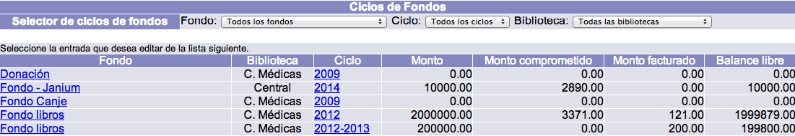
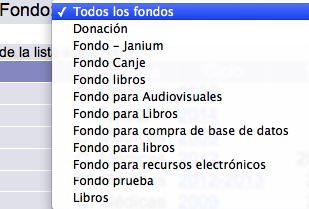
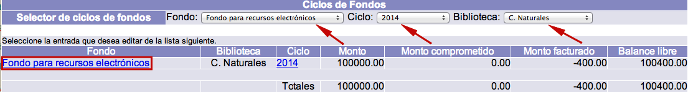
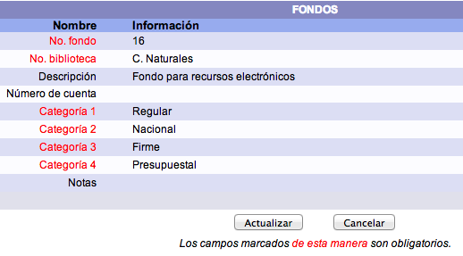
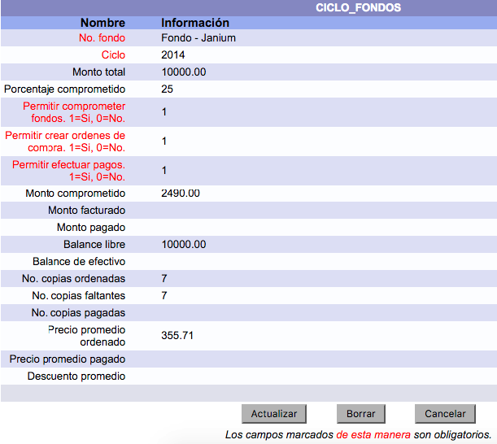

# Gestión de fondos y ciclos de fondos

{{date}}

Los **fondos** representan los presupuestos económicos que van a ser
usados por la institución para pagar a los proveedores por sus
materiales facturados. Los **ciclos de fondos**, por su parte, son las
cantidades parciales o partidas destinadas a un fondo que, generalmente,
se crean para definir de cuánto dinero se dispone en un espacio de
tiempo concreto, como años o semestres.

Cada fondo debe tener al menos
un ciclo de fondo relacionado para poder pagar con él. De esta
forma, en la configuración previa, el fondo se crea una sola vez
mientras que los ciclos de fondos se crean conforme se vayan
necesitando.

Poniendo un ejemplo de esto: una institución puede establecer un fondo
para la adquisición de ***material audiovisual*** y un ciclo de fondo
para el año ***2014***, de manera que, del total para la compra de estos
materiales, el gasto para el período indicado va a ser de 30.000. Esta
cifra se registra en el ciclo de fondo, mientras que en el fondo se
define que se trata de una partida para adquirir ese tipo de material.

## Consulta de fondos y ciclos de fondos

El procedimiento a seguir es el siguiente:

-   Hacer clic en la opción **Fondos** de la barra de herramientas del
    módulo.

-   Se despliega la lista o sumario de los fondos **con los que se ha
    ordenado material**. Es decir, es posible que no todos los fondos
    definidos en la configuración del sistema aparezcan en esta lista.
    Para verlos todos, se debe acceder al módulo de Administración.

-   En el sumario pueden encontrarse los siguientes datos: el fondo, la biblioteca, el ciclo de fondo, el monto (cantidad total),
    el monto
    comprometido (cantidad ya asignada a algún pedido), el monto facturado (cantidad
    ya pagada) y el balance
    libre.

-   Además, cuando hay más de un fondo, se puede utilizar la **lista
    desplegable de fondos** para mostrar sólo los resultados
    correspondientes a uno específico.

-   Por otra parte, si hay varios ciclos y se desean consultar sólo los
    relacionados con un único fondo, se puede usar la **lista
    desplegable de ciclos de fondos**.

-   También es posible limitar los resultados por la biblioteca
    responsable de las adquisiciones.

## Edición de fondos

El procedimiento a seguir es el siguiente:

-   Identificar el fondo a editar y seleccionarlo haciendo clic sobre su
    **código o nombre**.

-   Se despliega el registro del fondo. Hacer clic en el botón
    **Actualizar** para proceder a su edición (o **Cancelar**, si se
    desea regresar a la pantalla anterior). Los campos que se presentan
    en dicho registro son los siguientes:
    -   *No. de fondo:* número único asignado por el sistema a cada
        fondo.
    -   *Biblioteca:* biblioteca para la que se define este fondo. Por
        ejemplo, si los fondos presupuestales se distribuyen por
        bibliotecas, se puede crear uno por cada una de ellas.
    -   *Descripción:* descripción o nombre completo del fondo.
    -   *Número de cuenta:* si el fondo o presupuesto es identificado
        con un número de cuenta o partida, se puede registrar en este
        campo.
    -   *Categoría 1:* primera categoría definida previamente para fines
        estadísticos.
    -   *Categoría 2:* segunda categoría definida previamente para fines
        estadísticos.
    -   *Categoría 3:* tercera categoría definida previamente para fines
        estadísticos.
    -   *Categoría 4:* cuarta categoría definida previamente para fines
        estadísticos.
    -   *Notas:* campo para añadir cualquier información adicional sobre
        el fondo.

## Edición de ciclos de fondos

El procedimiento a seguir es el siguiente:

-   Identificar el ciclo a editar y seleccionarlo haciendo clic sobre su
    **código o nombre**.

-   Se despliega el registro del ciclo de fondo. Hacer clic en el botón
    **Actualizar** para proceder a su edición (o **Cancelar**, si se
    desea regresar a la pantalla anterior). Los campos que se presentan
    en dicho registro son los siguientes:
    -   *No. de fondo:* fondo a partir del que se ha creado el ciclo.
    -   *Ciclo:* código o nombre del ciclo.
    -   *Monto total:* cantidad total de dinero asignada al ciclo.
    -   *Porcentaje comprometido:* porcentaje del monto que se puede
        comprometer para crear líneas de órdenes, antes de facturarlas.
        Cuando se alcanza este porcentaje el sistema despliega un
        mensaje indicando que se ha llegado al límite de la cantidad que
        se puede comprometer. Sin embargo, al facturar una o más líneas
        que utilizan este ciclo, se libera la cantidad correspondiente,
        que es asignada al monto facturado.
    -   *Permitir comprometer fondos 1=Sí, 0=No:* se usa para definir si
        al crear líneas de orden se va a comprometer del ciclo la
        cantidad correspondiente o no; de tal manera que, si no se
        compromete, no cuenta en el cálculo que se realiza según el
        campo anterior.
    -   *Permitir crear órdenes de compra 1=Sí, 0=No:* si no se permite,
        cuando se vaya a crear una línea de orden usando este ciclo, se
        despliega un mensaje indicando que no está permitido por el
        fondo.
    -   *Permitir efectuar pagos 1=Sí, 0=No:* si no se permite, cuando
        se vaya a facturar algún material, se despliega un mensaje
        indicando que no está permitida esa acción.
    -   *Monto comprometido:* cuando se creen líneas de orden utilizando
        este ciclo, la cantidad correspondiente se va a comprometer y
        mostrar en este campo. Cuando se facturen y paguen esas líneas,
        la cantidad deja de estar comprometida, por lo que el campo se
        actualiza automáticamente para reflejar el cambio. Cuando la
        cantidad comprometida es cero significa que no hay líneas de
        orden pendientes por pagar.
    -   *Monto facturado:* cantidad total que se ha facturado utilizando
        este ciclo.
    -   *Monto pagado:* cantidad total que se ha pagado utilizando este
        ciclo.
    -   *Balance libre:* cantidad no utilizada y disponible de este
        ciclo.
    -   *Balance de efectivo*.
    -   *No. copias ordenadas:* número de ejemplares que se han
        solicitado usando este ciclo.
    -   *No. copias faltantes:* número de ejemplares que se han
        solicitado pero que no se han recibido.
    -   *No. copias pagadas:* número de ejemplares que se han pagado
        usando este ciclo.
    -   *Precio promedio ordenado:* promedio de los precios por ejemplar
        o copia que se han ordenado con este ciclo.
    -   *Precio promedio pagado:* promedio de los precios por ejemplar o
        copia que se han pagado con este ciclo.
    -   *Descuento promedio:* promedio de los descuentos que se han
        aplicado a los materiales adquiridos con este ciclo.

