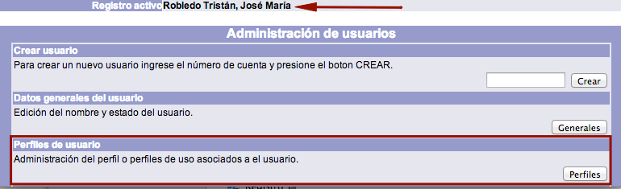
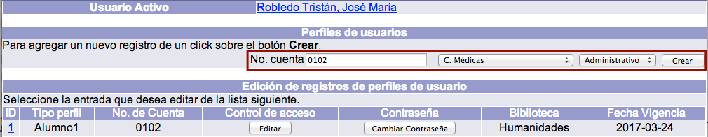
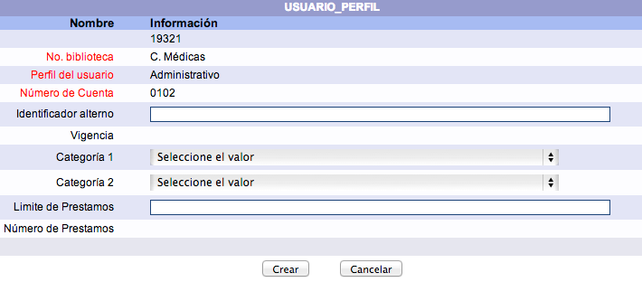

meta-json: {"viewport":"width=device-width, initial-scale=1.0, maximum-scale=1.0,\nuser-scalable=0","robots":"noindex,follow","title":"Gestión de perfiles de usuario | Ayuda contextual de Janium","generator":["Divi v.2.2","WordPress 4.0.18"]}
robots: noindex,follow
title: Gestión de perfiles de usuario | Ayuda contextual de Janium
viewport: width=device-width, initial-scale=1.0, maximum-scale=1.0, user-scalable=0
Date:Nov 26, 2014

# Gestión de perfiles de usuario

[%Date]

Esto se lleva a cabo cuando un usuario tiene **diferentes roles** dentro
de una institución y, por lo tanto, necesita distintos perfiles para
interactuar con el sistema, con sus características propias cada uno de
ellos.

Por ejemplo, en una universidad, una persona puede ser trabajador administrativo y,
a la vez, profesor. O
bien, profesor de
licenciatura y alumno
de posgrado al mismo tiempo.

El procedimiento a seguir es el siguiente:

-   Hacer clic sobre la opción **Usuarios** de la barra de herramientas
    del módulo.

-   Buscar al usuario en cuestión por ID del usuario, número de cuenta / identificador
    alterno o nombre.
-   Teniendo al usuario como **registro activo**, hacer clic en el botón
    **Perfiles** de la sección *Perfiles de usuario*.

-   Se despliega la pantalla de gestión de perfiles para el usuario
    activo. Escribir el número
    de cuenta del usuario al que asociar el nuevo perfil, la
    biblioteca
    encargada de los servicios y el tipo de perfil deseado.
    Hacer clic en el botón **Crear**.

-   El sistema muestra la pantalla **USUARIO\_PERFIL**, donde es
    necesario introducir los datos requeridos. Hacer clic en el botón
    **Crear**.

