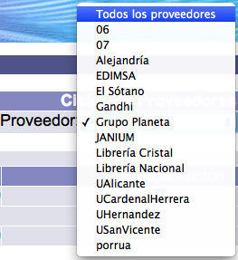

meta-json: {"viewport":"width=device-width, initial-scale=1.0, maximum-scale=1.0,\nuser-scalable=0","robots":"noindex,follow","title":"Gestión de proveedores | Ayuda contextual de Janium","generator":["Divi v.2.2","WordPress 4.0.18"]}
robots: noindex,follow
title: Gestión de proveedores | Ayuda contextual de Janium
viewport: width=device-width, initial-scale=1.0, maximum-scale=1.0, user-scalable=0
Date:Nov 28, 2014

# Gestión de proveedores

[%Date]

Otra de las opciones que ofrece este módulo del sistema Janium es poder
revisar y actualizar la información acerca de los proveedores y sus
ciclos / partidas asociadas. No obstante, esta información **sólo puede
ser borrada por operadores con acceso al módulo de Administración**.

## Consulta de proveedores

El procedimiento a seguir es el siguiente:

-   Hacer clic en la opción **Proveedores** de la barra de herramientas
    del módulo.

-   Se despliega la lista o sumario de los proveedores **a los que se ha
    ordenado material**. Es decir, es posible que no todos los
    proveedores definidos en la configuración del sistema aparezcan en
    esta lista. Para verlos todos, se debe acceder al módulo de
    Administración.

-   En el sumario pueden encontrarse los siguientes datos: el código o nombre del
    proveedor, el ciclo
    asociado, el monto
    (cantidad económica) facturado por cada proveedor, el período de espera hasta realizar
    una posible reclamación, el período de espera hasta realizar
    una posible cancelación y el descuento otorgado por cada
    proveedor.En relación con el concepto de **ciclo del
    proveedor**, cuando se crea una línea de orden y se elige un ciclo
    de fondo para pagar el material pedido, el sistema crea
    automáticamente un ciclo del proveedor, que son los que aparecen en
    este momento. Cada uno de estos ciclos puede tener descuentos y
    períodos de reclamación y cancelación diferentes a los registrados
    en los parámetros del proveedor.

-   Además, cuando hay más de un ciclo, se puede utilizar la **lista
    desplegable de ciclos** para mostrar sólo los resultados
    correspondientes a uno específico.

-   Por otra parte, si hay varios ciclos y se desean consultar sólo los
    relacionados con un único proveedor, se puede usar la **lista
    desplegable de proveedores**.

## Edición de proveedores

El procedimiento a seguir es el siguiente:

-   Identificar el proveedor a editar y seleccionarlo haciendo clic
    sobre su **código o nombre**.

-   Se despliega el registro del proveedor. Hacer clic en el botón
    **Actualizar** para proceder a su edición (o **Cancelar**, si se
    desea regresar a la pantalla anterior).Los campos que se presentan
    en dicho registro son los siguientes:
    -   *Código del proveedor:* código, de hasta 30 caracteres, con el
        que se va a identificar al proveedor.
    -   *Proveedor:* nombre completo o descripción del proveedor.
    -   *No. moneda:* unidad monetaria en la que cobra el proveedor.
        Si no cobra en la moneda local, cuando se pague a este
        proveedor, el sistema hará la conversión según el tipo de cambio
        definido.
    -   *No. tipo de descuento:* tipo de descuento que aplica el
        proveedor cuando le ordenamos material, si lo hubiera. Este
        parámetro se crea y edita en el módulo de Administración.
    -   *Código de cliente:* código con el que el proveedor identifica a
        la institución.
    -   *Período de reclamo en días:* número de días que deben pasar
        antes de reclamar al proveedor los materiales ordenados.
    -   *Período de cancelación en días:* número de días que deben pasar
        antes de cancelar la orden de los materiales solicitados.
    -   *Categoría 1:* primera categoría estadística para identificar al
        proveedor. Estos elementos se configuran previamente.
    -   *Categoría 2:* segunda categoría estadística para identificar al
        proveedor. Estos elementos se configuran previamente.
    -   *Activo, 1=Sí, 0=No:* si el proveedor está activo, se registra
        el valor **1**. Si se trata de un proveedor al que ya no se le
        va a ordenar material, pero se desea mantener en la base de
        datos, puede asignarse el valor **0**.
    -   *Atención:* nombre de la persona, contacto o empresa a la que
        van a ir dirigidas las comunicaciones enviadas a este proveedor.
    -   *Calle:* calle del domicilio del proveedor a la que van a ir
        dirigidas las comunicaciones.
    -   *Ciudad:* ciudad del domicilio del proveedor a la que van a ir
        dirigidas las comunicaciones.
    -   *Código del estado:* código de la división geográfica,
        administrativa o de otro tipo relacionada con la dirección del
        proveedor.
    -   *Código Postal:* código postal del domicilio del proveedor al
        que van a ir dirigidas las comunicaciones.
    -   *País:* país del domicilio del proveedor al que van a ir
        dirigidas las comunicaciones.
    -   *Teléfono:* el o los teléfonos de contacto del proveedor.
        Conviene incluir los prefijos o claves internacionales.
    -   *FAX:* el o los faxes de contacto del proveedor. Conviene
        incluir los prefijos o claves internacionales.
    -   *Correo electrónico:* la o las cuentas de correo electrónico de
        contacto por parte del proveedor.
    -   *WEB:* página o sitio web del proveedor.
    -   *Notas:* cualquier nota adicional sobre el proveedor que sea de
        utilidad al personal u operador del módulo.
    -   *RFC / CIF:* código de identificación fiscal del proveedor.
        Varía según el país.
    -   *Idioma:* lengua asociada al proveedor.

## Edición de ciclos de proveedor

La primera vez que se utiliza un ciclo de fondo para pagarle a un
proveedor se crea automáticamente un ciclo de proveedor. Este
ciclo es útil para definir ciertos parámetros propios que podrían ser
diferentes a los del registro del proveedor **pero que sólo se van a
aplicar durante la vigencia del ciclo**.

El procedimiento a seguir es el siguiente:

-   Identificar el ciclo a editar y seleccionarlo haciendo clic sobre su
    **código o nombre**.

-   Se despliega el registro del ciclo. Hacer clic en el botón
    **Actualizar** para proceder a su edición (o **Cancelar**, si se
    desea regresar a la pantalla anterior).Los campos que se presentan
    en dicho registro son los siguientes:
    -   *Código proveedor:* código, de hasta 30 caracteres, con el que
        se va a identificar al proveedor. Este campo es ingresado
        automáticamente por el sistema.
    -   *Ciclo:* ciclo creado por el sistema con base en el ciclo de
        fondo que se utilizó al ordenar por primera vez un material.
    -   *Monto total:* cantidad gastada utilizando el ciclo de fondo
        específico, y que se ha pagado al proveedor.
    -   *Período de reclamo en días:* número de días que deben pasar
        antes de reclamar al proveedor los materiales ordenados durante
        este ciclo. Este valor se inserta automáticamente tomándolo del
        campo correspondiente del registro del proveedor. Además, si se
        desea hacer una excepción que aplique sólo durante la vigencia
        del ciclo, por ejemplo, durante un semestre o un año, se
        modifica en este campo sin tener que hacerlo en el proveedor.
    -   *Período de cancelación en días:* número de días que deben pasar
        antes de cancelar la orden de los materiales solicitados durante
        este ciclo. Este valor se inserta automáticamente tomándolo del
        campo correspondiente del registro del proveedor. Además, si se
        desea hacer una excepción que aplique sólo durante la vigencia
        del ciclo, por ejemplo, durante un semestre o un año, se
        modifica en este campo sin tener que hacerlo en el proveedor.
    -   *Tipo de descuento 1:* primer valor indicativo del tipo de
        porcentaje aplicado.
    -   *Monto descuento 1:* primer valor indicativo monetario del
        porcentaje aplicado.
    -   *Tipo de descuento 2:* segundo valor indicativo del tipo de
        porcentaje aplicado.
    -   *Monto descuento 2:* segundo valor indicativo monetario del
        porcentaje aplicado.
    -   *Tipo de descuento 3:* tercer valor indicativo del tipo de
        porcentaje aplicado.
    -   *Monto descuento 3:* tercer valor indicativo monetario del
        porcentaje aplicado.
    -   *Tipo de descuento 4:* cuarto valor indicativo del tipo de
        porcentaje aplicado.
    -   *Monto descuento 4:* cuarto valor indicativo monetario del
        porcentaje aplicado.
    -   *Tipo de descuento 5:* quinto valor indicativo del tipo de
        porcentaje aplicado.
    -   *Monto descuento 5:* quinto valor indicativo monetario del
        porcentaje aplicado.
