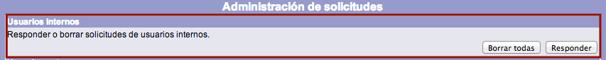
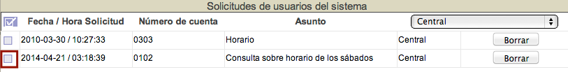
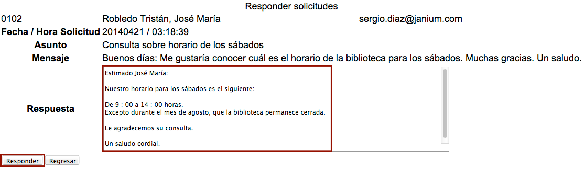
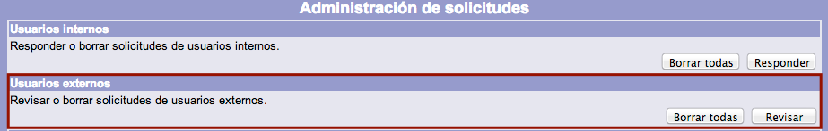
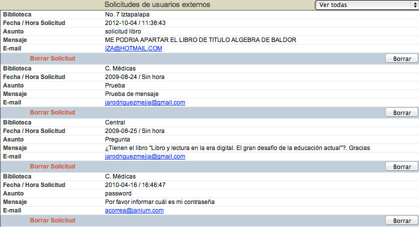
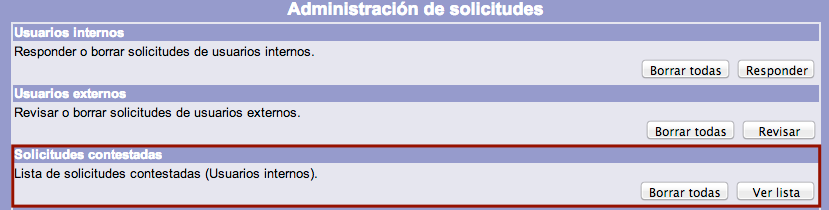
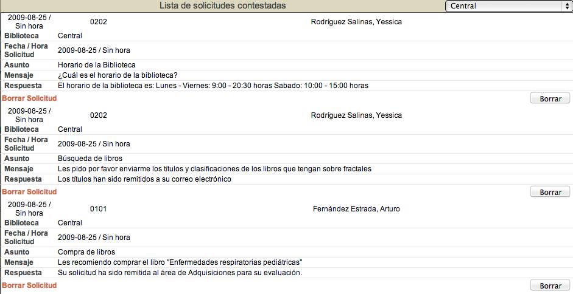
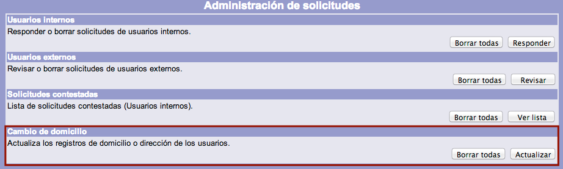
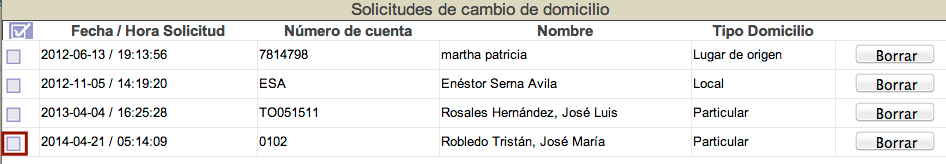
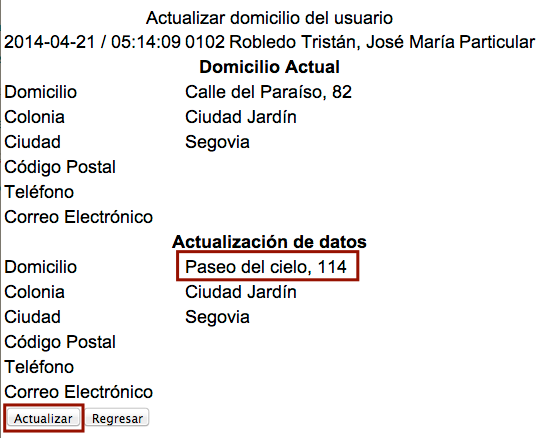

meta-json: {"viewport":"width=device-width, initial-scale=1.0, maximum-scale=1.0,\nuser-scalable=0","robots":"noindex,follow","title":"Gestión de solicitudes | Ayuda contextual de Janium","generator":["Divi v.2.2","WordPress 4.0.18"]}
robots: noindex,follow
title: Gestión de solicitudes | Ayuda contextual de Janium
viewport: width=device-width, initial-scale=1.0, maximum-scale=1.0, user-scalable=0
Date:Nov 26, 2014

# Gestión de solicitudes

[%Date]

## Responder solicitudes

Esta acción se utiliza para los mensajes enviados por usuarios internos
que no han sido respondidos.

El procedimiento a seguir es el siguiente:

-   Hacer clic sobre la opción **Solicitudes** de la barra de
    herramientas del módulo.

-   Una vez en la pantalla de administración de solicitudes, hacer clic
    en el botón **Responder** de la sección *Usuarios internos*.

-   Se despliega la lista de solicitudes pendientes de respuesta. Hacer
    clic en el cuadro selector situado a la izquierda de la fecha de la
    solicitud a responder.

-   El sistema muestra los detalles de la solicitud elegida. Escribir la
    respuesta correspondiente en el campo de texto destinado para ella.
    Hacer clic en el botón **Responder**.

-   Finalmente, se genera el mensaje que informa de que la solicitud ha
    sido contestada con éxito y el sistema regresa a la lista de
    solicitudes pendientes de respuesta.

## Revisar solicitudes

Esta acción se utiliza para gestionar los mensajes enviados por usuarios
externos y que no pueden ser respondidos a través del módulo de
Circulación usando el procedimiento para usuarios internos, al no
existir en este caso un **número de cuenta vinculado**.

El procedimiento a seguir es el siguiente:

-   Hacer clic sobre la opción **Solicitudes** de la barra de
    herramientas del módulo.

-   Una vez en la pantalla de administración de solicitudes, hacer clic
    en el botón **Revisar** de la sección *Usuarios externos*.

-   Se despliega la lista de solicitudes de usuarios externos para
    proceder a su gestión.

**IMPORTANTE:** para llevar a cabo la respuesta a las solicitudes de
estos usuarios no registrados bastará con hacer clic sobre la dirección
de correo electrónico del solicitante, siempre y cuando el operador
tenga activada una cuenta de correo en el equipo desde donde esté
trabajando.

## Ver solicitudes contestadas

Esta acción se utiliza para consultar las solicitudes contestadas a los
usuarios internos. El ordenamiento de la lista es **cronológico de forma
ascendente**, es decir, de la respuesta más antigua a la más reciente.

El procedimiento a seguir es el siguiente:

-   Hacer clic sobre la opción **Solicitudes** de la barra de
    herramientas del módulo.

-   Una vez en la pantalla de administración de solicitudes, hacer clic
    en el botón **Ver lista** de la sección *Solicitudes contestadas*.

-   Se despliega la lista de solicitudes respondidas a los usuarios
    internos, con el ordenamiento ya indicado.

## Actualizar cambio de domicilio

Como se ha explicado anteriormente, los usuarios internos pueden llevar
a cabo cambios en los datos relativos a sus domicilios asignados. Estas
modificaciones generan un **registro de solicitud de cambio de
domicilio**, que es revisado desde el módulo de Circulación por un
operador.

El procedimiento a seguir es el siguiente:

-   Hacer clic sobre la opción **Solicitudes** de la barra de
    herramientas del módulo.

-   Una vez en la pantalla de administración de solicitudes, hacer clic
    en el botón **Actualizar** de la sección *Cambio de domicilio*.

-   Se despliega la lista de solicitudes de cambio de domicilio
    pendientes de revisión. Hacer clic en el cuadro selector situado a
    la izquierda de la fecha de la solicitud a responder.

-   El sistema muestra la información del domicilio actual registrado
    así como la modificada por el usuario. Hacer clic en el botón
    **Actualizar** para realizar el cambio solicitado.

-   Finalmente, se genera el mensaje que informa de que la solicitud ha
    sido procesada con éxito y el sistema regresa a la lista de
    solicitudes pendientes de respuesta.

