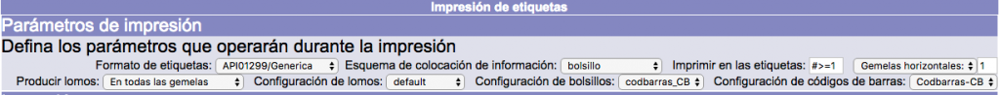
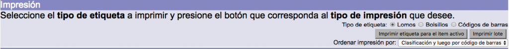
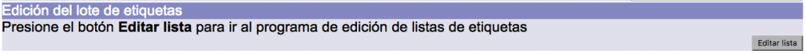
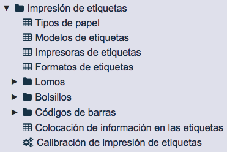

# Impresión de etiquetas
## Pantalla de impresión de etiquetas

Esta pantalla presenta los valores que se pueden definir para la creación del patrón de etiquetas.

Se divide en tres secciones:

**Parámetros de impresión**, que contiene los siguientes campos:

- _Formato de etiquetas_: define las características físicas de las etiquetas, así como el tipo de impresora que será utilizada.
- _Esquema de colocación de información_: define la distribución general de los campos de información en las etiquetas, en función del tipo que se elija.
- _Imprimir en las etiquetas_: define a partir de qué etiqueta comienza el proceso de impresión.
- _Gemelas_: define la cifra exacta de etiquetas idénticas que serán impresas para cada ejemplar seleccionado, así como la orientación que van a presentar: *horizontal* o *vertical*.
- _Producir lomos_: campo relacionado con el anterior en el que se define a cuáles de las etiquetas gemelas ya indicadas se les va a agregar el dato de lomo.
- _Configuración de lomos / tejuelos_: define las características concretas de la etiqueta de lomo / tejuelo (campos que serán impresos, tipo y tamaño de la letra).
- _Configuración de bolsillos_: define las características concretas de la etiqueta de bolsillo (campos que serán impresos, tipo y tamaño de la letra).
- _Configuración de códigos de barras_: define las características concretas de la etiqueta de código de barras (anchura y altura del código de barras, encabezamiento utilizado).

**Impresión**, que permite seleccionar cualquiera de los tipos de etiquetas para impresión (lomos / tejuelos, bolsillos y códigos de barras), así como la posibilidad de generar el archivo para el ítem activo (último ejemplar creado o editado) o la generación para imprimir lotes mayores. También se puede aquí elegir el criterio de ordenación de los ejemplares en la impresión: **por clasificación y luego por código de barras** o simplemente, **por código de barras**.

**Edición del lote de etiquetas**, que otorga acceso para editar la lista de ejemplares seleccionados para la impresión de etiquetas.

## Procedimiento de impresión de etiquetas

Debido a la diversidad tanto de etiquetas físicas que existen como de características de impresión **no existe un procedimiento estándar**.

El sistema puede ser configurado para generar etiquetas individuales, dos etiquetas o hasta las tres etiquetas al mismo tiempo. Esto dependerá de la configuración de las etiquetas y del esquema de colocación configurado.

A pesar de lo anterior, se puede establecer que el operador, al generar el archivo para impresión, realiza lo siguiente:

1.  Elección de _Formato de etiquetas_.
2.  Elección de _Esquema de colocación de información_.
3.  Elección de _Configuración de lomos / tejuelos, bolsillos o códigos de barras_, dependiendo del esquema seleccionado previamente.
4.  Elección de _Tipo de etiqueta_ (lomos / tejuelos, bolsillos o códigos de barras), dependiendo del esquema seleccionado previamente.
5.  Clic sobre el botón _Imprimir lote_.

Para generar correctamente el archivo para impresión es necesario que el tipo de etiqueta seleccionado **coincida** con el esquema de colocación de información. Es decir, si el tipo de etiqueta es *Lomos*, el esquema de colocación debe ser para la impresión de lomos / tejuelos.

Por el contrario, si es seleccionado un tipo de etiqueta no coincidente con el esquema de colocación, puede ocurrir que:

- El archivo de impresión no muestre ninguna información.
- El archivo de impresión muestre información, pero de forma descolocada en alguna sección.
- Al imprimir el archivo, la información exceda los límites de la etiqueta física.
- Se genere un mensaje del sistema del tipo *Internal server error*.

Si los parámetros seleccionados son coincidentes, se abrirá el archivo de etiquetas seleccionadas en formato PDF, o se desplegará el mensaje para guardar el archivo localmente. Con la función *Imprimir* del visor del archivo (el visor tradicional es Adobe Acrobat Reader) se procede a enviarlo a impresión.

**IMPORTANTE:** la configuración de las etiquetas se realiza en el módulo de Administración, sección *Configuración general*:

