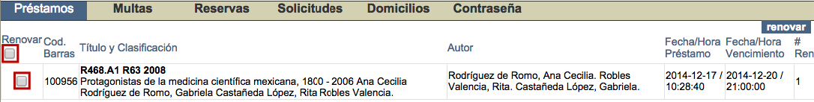
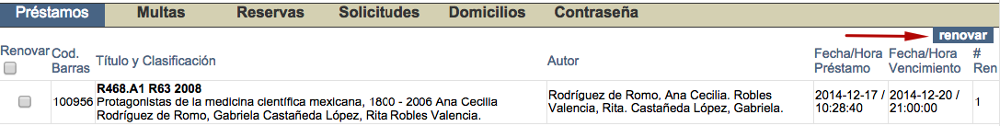

meta-json: {"viewport":"width=device-width, initial-scale=1.0, maximum-scale=1.0,\nuser-scalable=0","robots":"noindex,follow","title":"Información del usuario | Ayuda contextual de Janium","generator":["Divi v.2.2","WordPress 4.0.18"]}
robots: noindex,follow
title: Información del usuario | Ayuda contextual de Janium
viewport: width=device-width, initial-scale=1.0, maximum-scale=1.0, user-scalable=0
Date:Nov 21, 2014

# Información del usuario

[%Date]

A través de esta opción del Catálogo al público, el usuario puede
consultar sus datos de:

-   Nombre.
-   Estado.
-   Fecha de creación del usuario en el sistema.
-   Números de cuenta (o IDs alternos) asociados.
-   Bibliotecas a las que pertenece.
-   Perfiles que tiene asignados.
-   Vigencia de cada uno de los perfiles.
-   Categorías estadísticas asociadas a sus cuentas.

Además, aquí también se despliega su información relacionada con el
módulo de Circulación:

-   **Préstamos**, tantos los activos como el listado de los históricos.

-   **Multas acumuladas.**

-   **Reservas pendientes.**

-   **Solicitudes realizadas.**

-   **Domicilios asociados.**

-   **Gestión de contraseñas.**

**IMPORTANTE:** Para llevar a cabo todas estas acciones, se debe
introducir antes un **número de cuenta** y **contraseña** autorizadas.

## Renovación de préstamos desde *Información del usuario*

Dentro de esta sección del Catálogo al público, los propios usuarios
tienen la posibilidad de efectuar la renovación de sus materiales
prestados.

Para llevar a cabo este proceso, estando en la opción *Préstamos*, se
debe hacer clic sobre los **cuadros de selección individuales** de todos
aquellos materiales que se quieran renovar, situados en la parte
izquierda de la pantalla. O bien sobre el **cuadro de selección
global**, para elegir todos los materiales de una vez.

Una vez hecho lo anterior, se debe hacer clic sobre el botón
***Renovar***, situado en la parte derecha de la pantalla.

