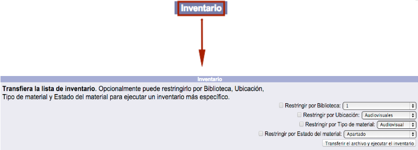
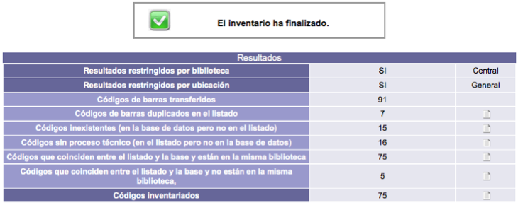
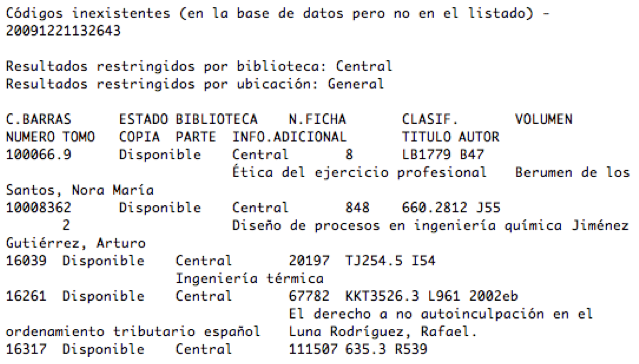

# Inventario

{{date}}

Integrada en el módulo de Circulación se encuentra una función con una
destacada importancia para cualquier tipo de institución: la **ejecución
de inventarios**. De manera precisa, esta acción se define como el
*proceso de comparación entre los materiales existentes en las
colecciones contra la información registrada en un sistema de control
(base de datos, lista impresa, sistema de automatización, etc.)*.

Por lo tanto, el objetivo principal de un inventario es verificar la presencia real de todos
los materiales recogidos en las colecciones y en el sistema de
control, sea cual sea este.

## Funcionamiento general

Explicado de forma sencilla, el comportamiento de esta función puede
resumirse en tres puntos:

-   El operador envía una **lista de códigos de barras** al sistema,
    indicando las restricciones
    (biblioteca, ubicación, tipo de material o estado del material) a
    aplicar durante la comparación contra los datos de ejemplares
    registrados en el propio sistema.
-   El sistema despliega los **resultados** del proceso en pantalla.
-   El operador revisa los resultados y descarga las **listas creadas**.

Un par de comentarios adicionales:

1.  Se indica la biblioteca
    propietaria de los materiales inventariados para que el
    sistema no considere los materiales de otras bibliotecas (por
    ejemplo, en el caso de una red de ellas). De esta manera se evita
    obtener resultados equivocados en las listas generadas.
2.  Se indica la ubicación de
    los materiales inventariados para que el sistema no considere
    los materiales de otras ubicaciones de la biblioteca. De esta manera
    se evita, al igual que en el caso anterior, obtener resultados
    erróneos en las listas generadas.

## Procedimiento de ejecución

### Lista de códigos de barras

En primer lugar, es necesario crear un fichero que contenga los números
de códigos de barras de los materiales. Para generar esta lista se
recomienda el uso de lectores
de códigos de barras, ya que estos dispositivos agilizan el
procedimiento y disminuyen la existencia de errores en la captura de los
datos.

Por otro lado, la lista de códigos de barras debe tener las siguientes
características:

-   Ser un fichero de *texto plano* (extensión **txt**).
-   Tener un número de código de barras por línea.
-   Sin espacios u otros caracteres antes del código de barras.
-   Sin espacios u otros caracteres después del código de barras.

### Transferencia del archivo

El acceso a la función de inventario se realiza a través de la opción
correspondiente en la barra de herramientas del módulo.

En esta pantalla se deben marcar aquellas restricciones que se deseen
aplicar al inventario: *biblioteca*, *ubicación*, *tipo de material* y
*estado del material*, para después hacer clic en el botón **Transferir
el archivo y ejecutar el inventario**.

### Obtención de resultados

Después de transferir el archivo con la lista de códigos de barras al
sistema, el proceso de inventario se lleva a cabo automáticamente. Esta
acción puede tardar algunos minutos dependiendo de la cantidad de ejemplares existentes en
el archivo y de la cantidad de ejemplares considerados
para la comparación.

Al finalizar el proceso mencionado, el sistema muestra los resultados
obtenidos en detalle.

Las cifras se distribuyen en las siguientes categorías:

-   **Códigos de barras transferidos**: cantidad de códigos existentes
    en el archivo transferido.
-   **Códigos de barras duplicados en el listado**: cantidad de códigos
    existentes en dos o más ocasiones dentro del archivo transferido.
-   **Códigos inexistentes (en la base de datos pero no en el
    listado)**: cantidad de códigos que están en el sistema pero no en
    el archivo transferido.
-   **Códigos sin proceso técnico (en el listado pero no en la base de
    datos)**: cantidad de códigos que están en el archivo transferido
    pero que no fueron encontrados en el sistema.
-   **Códigos que coinciden entre el listado y la base y están en la
    misma biblioteca**: cantidad de códigos existentes en el archivo
    transferido, en el sistema y en la biblioteca elegida como
    restricción.
-   **Códigos que coinciden entre el listado y la base y no están en la
    misma biblioteca**: cantidad de códigos existentes en el archivo
    transferido y en el sistema pero pertenecientes a otra biblioteca
    diferente a la seleccionada en la restricción.
-   **Códigos inventariados**: cantidad total de códigos de barras
    tratados.

### Listados descargables

Para todos aquellos resultados de un inventario que son **numéricos**,
se generan listados asociados que pueden ser descargados. Estas listas
se crean cuando el número de códigos de barras resultante es mayor que cero.

La opción que permite la descarga de los listados aparece representada
por un icono situado en la parte derecha de la pantalla.

#### Listado de códigos duplicados

Este tipo de lista muestra los números de códigos de barras que fueron
localizados en dos o más ocasiones.

#### Listado de códigos inexistentes

Este tipo de lista muestra los datos de los ejemplares cuyos códigos de
barras no existen en el archivo transferido y, por lo tanto, se
consideran no
inventariados.

En este listado pueden aparecer indicados: código de barras, estado del
material, biblioteca propietaria, número de ficha / registro,
clasificación, volumen, número, tomo, ejemplar, parte, información
adicional, título y autor, para su posible búsqueda y recuperación.
Además, los resultados se encuentran ordenados por estado del material /
código de barras.

#### Listado de códigos sin proceso técnico

Este tipo de lista muestra los códigos de barras de los ejemplares cuyos
números existen en el archivo transferido pero no están registrados en
el sistema.

#### Listado de códigos de otras bibliotecas

Este tipo de lista muestra los datos de los ejemplares cuyos números
están en el archivo transferido pero que pertenecen a otra biblioteca.
Es decir, no coinciden con la restricción de biblioteca propietaria
utilizada en la ejecución del inventario.

En este listado pueden aparecer indicados: código de barras, estado del
material, biblioteca propietaria, número de ficha / registro,
clasificación, volumen, número, tomo, ejemplar, parte, información
adicional, título y autor.

#### Listado de códigos inventariados

Este tipo de lista muestra los datos de los ejemplares cuyos números
están en el archivo transferido y fueron encontrados en el sistema, por
lo que son materiales
inventariados.

En este listado pueden aparecer indicados: código de barras, estado del
material, biblioteca propietaria, número de ficha / registro,
clasificación, volumen, número, tomo, ejemplar, parte, información
adicional, título y autor.

