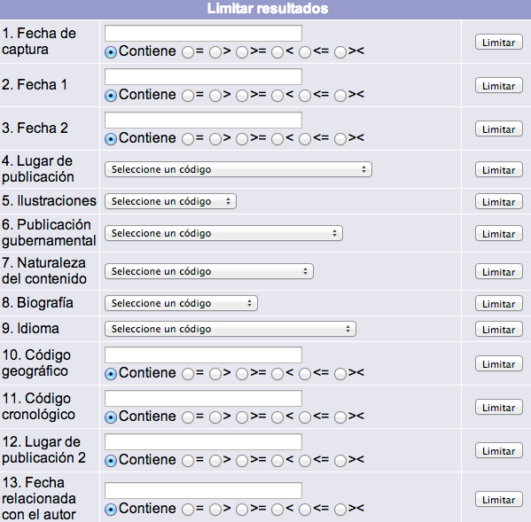

meta-json: {"viewport":"width=device-width, initial-scale=1.0, maximum-scale=1.0,\nuser-scalable=0","robots":"noindex,follow","title":"Limitación de resultados | Ayuda contextual de Janium","generator":["Divi v.2.2","WordPress 4.0.18"]}
robots: noindex,follow
title: Limitación de resultados | Ayuda contextual de Janium
viewport: width=device-width, initial-scale=1.0, maximum-scale=1.0, user-scalable=0
Date:Nov 24, 2014

# Limitación de resultados

[%Date]

Después de haber hecho una búsqueda y obtener el sumario de resultados
correspondientes, se puede proceder a una depuración o ajuste de los
resultados. Para ello, debe usarse el botón *Limitar resultados*,
explicado con anterioridad, que da paso a la siguiente pantalla:

Los elementos predeterminados de este apartado se definen a partir de la
etiqueta **008** del formato MARC21, y son:

-   **Fecha de captura:** campo de texto donde se escribe (en formato
    AAMMDD) la fecha de captura del registro bibliográfico en el
    sistema.
-   **Fecha 1:** campo de texto donde se escribe (en formato AAAA) el
    año de publicación del material.
-   **Fecha 2:** campo de texto donde se escribe (en formato AAAA) otra
    fecha relacionada con el material (año de copyright, de impresión, o
    cierre de publicación).
-   **Lugar de publicación:** lista que despliega una serie de códigos
    alfabéticos y su equivalencia sobre el lugar de publicación,
    producción o ejecución del material.
-   **Ilustraciones:** lista que despliega una serie de códigos
    alfabéticos y su equivalencia sobre el tipo de ilustraciones que
    contiene el material.
-   **Publicación gubernamental:** lista que despliega una serie de
    códigos alfabéticos y su equivalencia sobre las características
    específicas del material, si es o no una publicación gubernamental y
    de qué nivel, en caso de serlo.
-   **Naturaleza del contenido:** lista que despliega una serie de
    códigos alfabéticos y su equivalencia sobre el tipo de contenido de
    una parte significativa del material (cuando esta parte es
    relevante).
-   **Biografía:** lista que despliega una serie de códigos alfabéticos
    y su equivalencia sobre las características específicas del
    material, si es o no una biografía y el tipo de material biográfico,
    en caso de serlo.
-   **Idioma:** lista que despliega una serie de códigos alfabéticos y
    su equivalencia sobre el idioma en que se encuentra codificado el
    material.

Además, algunas de estas opciones de limitación cuentan con funciones
asociadas que deben ser utilizadas, pero sólo una a la vez:

-   **Contiene** se recuperarán los registros que CONTENGAN el dato
    ingresado en el campo de texto.
-   **=** se recuperarán los registros que SEAN IGUALES al dato
    ingresado en el campo de texto.
-   **&gt;** se recuperarán los registros que SEAN MAYORES al dato
    ingresado en el campo de texto.
-   **&gt;=** se recuperarán los registros que SEAN MAYORES O IGUALES al
    dato ingresado en el campo de texto.
-   **&lt;** se recuperarán los registros que SEAN MENORES al dato
    ingresado en el campo de texto.
-   **&lt;=** se recuperarán los registros que SEAN MENORES O IGUALES al
    dato ingresado en el campo de texto.
-   **&gt;&lt;** se recuperarán los registros que SEAN DIFERENTES al
    dato ingresado en el campo de texto.

Una vez ejecutada la limitación deseada, se muestra el sumario de
resultados coincidentes (pero con los registros en estado inactivo) acompañado
por dos botones que permiten **Aceptar** o **Anular** dicha selección,
dependiendo de si se está de acuerdo con ella o se quiere regresar al
sumario original. En caso de aceptar, sobre el sumario obtenido podrán
realizarse nuevas limitaciones.

