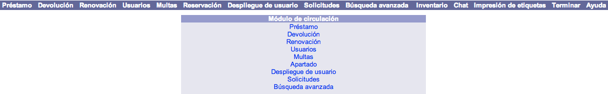

meta-json: {"viewport":"width=device-width, initial-scale=1.0, maximum-scale=1.0,\nuser-scalable=0","robots":"noindex,follow","title":"Menú principal de Circulación | Ayuda contextual de Janium","generator":["Divi v.2.2","WordPress 4.0.18"]}
robots: noindex,follow
title: Menú principal de Circulación | Ayuda contextual de Janium
viewport: width=device-width, initial-scale=1.0, maximum-scale=1.0, user-scalable=0
Date:Nov 26, 2014

# Menú principal de Circulación

[%Date]

La pantalla principal de gestión del módulo de Circulación presenta el
siguiente diseño:

## Barra de herramientas

Este elemento se presenta en primer plano al ingresar al módulo. El
despliegue de las opciones que lo componen varía dependiendo de cual se
esté ejecutando en ese momento.

A continuación, se describen en detalle las opciones que se muestran:

-   **Préstamo:** acceso a la pantalla de gestión de préstamos para el
    usuario introducido.
-   **Devolución:** acceso a la pantalla de gestión de devoluciones para
    el usuario introducido.
-   **Renovación:** acceso a la pantalla de gestión de renovaciones de
    ejemplares para el usuario introducido.
-   **Usuarios:** acceso a la pantalla de administración de usuarios.
-   **Multas:** acceso a la pantalla de administración de multas.
-   **Reservación:** acceso a la pantalla de gestión de apartados /
    reservas para el usuario introducido.
-   **Despliegue de usuario:** acceso a la pantalla de consulta de toda
    la información asociada con el usuario introducido.
-   **Solicitudes:** acceso a la pantalla de administración de
    solicitudes de usuarios.
-   **Búsqueda avanzada:** acceso a la opción de búsqueda avanzada del
    catálogo al público.
-   **Inventario:** acceso a la pantalla de ejecución de inventarios de
    material.
-   **Chat:** acceso a la función de conversación con los usuarios del
    catálogo al público.
-   **Impresión de etiquetas:** acceso a la pantalla de gestión de
    impresión de etiquetas para materiales (lomo / tejuelos, bolsillo o
    código de barras).
-   **Terminar:** función que permite cerrar la sesión activa de
    trabajo.
-   **Ayuda:** acceso a la página de ayuda del sistema Janium.

