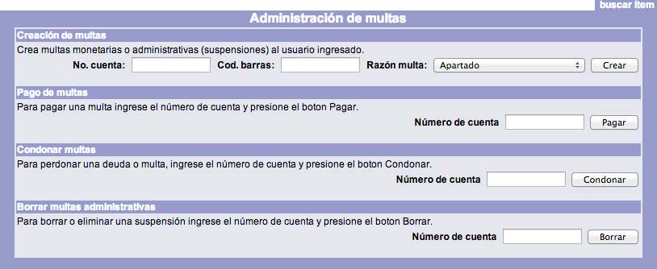

# Multas

El sistema Janium permite gestionar las multas monetarias y las sanciones administrativas relacionadas directamente con las acciones de **préstamo** y **devolución**. La ejecución de estas multas relacionadas con la devolución de un material vencido se realiza de forma automática, sin la intervención de un operador del módulo, ya que se aplican de forma directa los parámetros definidos en las **políticas de circulación**. Para llevar a cabo estos procesos, el sistema revisa *fecha y hora de vencimiento* y *fecha y hora de devolución*, determinando el tiempo transcurrido entre una y otra para calcular la sanción correspondiente.

Por otro lado, la institución puede crear **multas monetarias o sanciones administrativas de otro tipo**. Esto ocurre cuando es necesario crear una multa que el sistema no puede gestionar (como pueden ser, por ejemplo, los daños al mobiliario). Ante estas situaciones no controladas, la institución debe diseñar una sanción dependiendo de la gravedad de lo ocurrido y, por lo tanto, debe definir la cantidad económica o en tiempo que se aplicará al usuario.

La creación de multas también puede ser vista como  **cobro de servicios** que la institución ofrece a los usuarios y que no pueden ser gestionados automáticamente por el sistema, como las tareas de fotocopiado o digitalización de documentos. Ahora bien, al crear una multa o sanción es posible que sea necesario escribir el código de barras del material relacionado con esta. Esto se determina en la configuración de las *razones de multa*, que son los motivos por los cuales la institución genera algún cobro por multa, sanción o servicio.

En este sentido, hay razones que solicitan escribir el código de barras para crear la sanción, multa o servicio (por ejemplo: vencimiento de préstamos o daños a materiales y dispositivos), mientras que pueden haber otras razones por la cuales no sea obligatorio escribir el código de barras (como daños a las instalaciones).