# Obtención de resultados de búsqueda
## Sumario de resultados

Si se recupera más de un registro que coincida con los términos introducidos, se despliega un sumario de resultados como el siguiente:

_NOTA_: esta opción de despliegue de resultados sólo se da en búsquedas **por palabra clave**.

(Ejemplo de búsqueda: término *Tecnología*, opción *Por palabra clave*, índice *Palabra*)

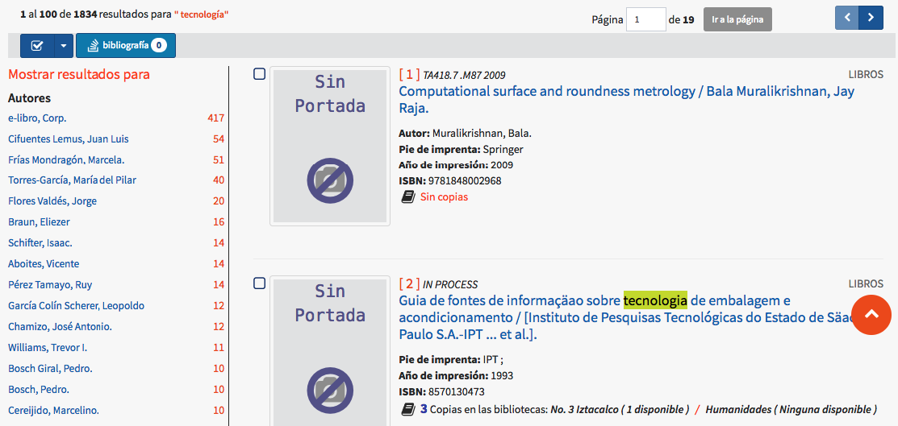 

Los elementos de que consta este modo de despliegue son:

- **Información sobre resultados recuperados en total y desplegados por página.**

+ **Indicadores acerca del número de página de resultados en la que se encuentra el usuario y la cantidad de páginas totales**.

En este punto, se puede ir directamente a una página concreta sin necesidad de usar las flechas de navegación, de una forma más rápida, introduciendo en el cuadro de texto el número de la misma y haciendo clic después en el botón ***Ir a la página***.

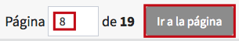

+ **Flechas de navegación por las páginas de resultados (_página anterior_ y _página siguiente_).**

+ **Selector de registros para bibliografía:** esta opción posibilita la selección y deselección masiva de resultados por página completa, para la posterior creación de bibliografías. En concreto, si se hace clic sobre ***Todos***, el sistema seleccionará la totalidad de los registros de la página; mientras que haciendo clic sobre ***Ninguno*** se borrará la selección hecha de forma global.

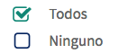

Es importante señalar que el número de registros seleccionados por este método **dependerá del límite de resultados por página configurado para el sistema en cuestión**.

- **Botón de bibliografía:** permite crear una bibliografía a partir de uno o varios registros seleccionados previamente. Por omisión, el indicador numérico que aparece en este botón es **0**, hasta que se seleccione algún resultado por medio de las opciones correspondientes.

+ **Botón para solicitar préstamo:** ofrece la posibilidad de ejecutar una solicitud de préstamo sobre alguno de los ejemplares asociados al registro activo. Por omisión, el indicador numérico que aparece en este botón es **0**, hasta que se seleccione algún ítem por medio de la casilla situada en la parte izquierda del mismo.

+ **Opción para volver al principio de la página:** haciendo clic sobre esta opción, desde cualquier parte de la página de resultados en que se encuentre el usuario, el sistema regresa automáticamente al comienzo de ella.

+ **Facetado de resultados:** en esta sección se muestra la información que se ha recuperado desglosada por *índices de búsqueda* y acompañada por el número de *referencias* localizadas para los términos indizados.

Si se pincha sobre uno de los términos destacados, el sistema ejecuta una **nueva búsqueda para recuperar únicamente los registros señalados**. Siguiendo con el proceso, en el sumario de resultados se visualiza el filtro aplicado, así como la posibilidad de eliminarlo pinchando sobre el icono de _equis_.

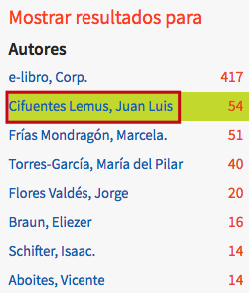

Además, **es posible utilizar más de un filtro a la vez**, si se desea restringir aún más los resultados de la búsqueda realizada.

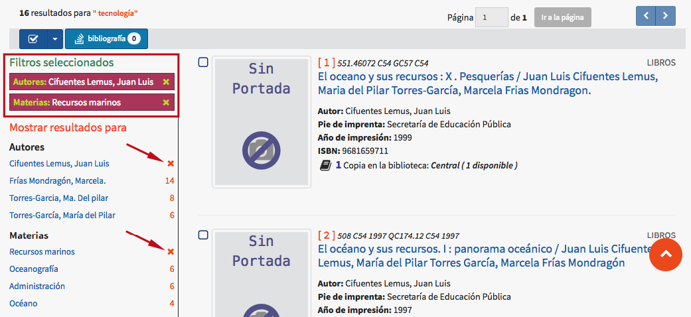

+ **Registro en el sumario:** de manera individual, los resultados que se despliegan en el sumario presentan estos elementos:

	

	+ **Casillas de selección:** permiten seleccionar, o deseleccionar, los registros deseados para usarlos posteriormente; por ejemplo, para crear una bibliografía o asignarles una _tag_.  

	+ **Portada del registro**: imagen representativa del material y que sirve además para enlazar con el objeto vinculado al registro, en el caso de que exista.

	

	Además, en este punto, el sistema es capaz de mostrar una **portada genérica** para todos aquellos registros que no tengan una asignada, si así lo decide la institución.

	
	
	+ **Número de orden del registro dentro del sumario**. 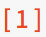

		Este número no es el del registro, propiamente dicho. Es decir, no es su *número de ficha*.

	+ **Clasificación del registro**. 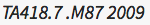

	+ **Tipo de material del registro**. 

	+ **Campo de Título/Autor**. Este elemento, además de presentar la información acerca del título y autor(es) del material, sirve como vínculo para acceder a la vista en detalle del registro, haciendo clic sobre él.

	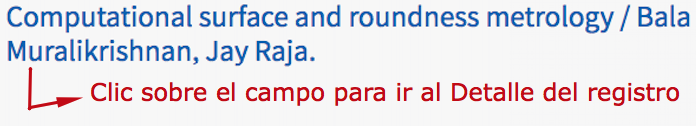

	+ **Campos adicionales**: pueden mostrar, de forma predeterminada, datos sobre el autor, edición (lugar, responsable y fecha) o ISBN.

	

	+ **Información sobre ejemplares:** donde se indica la cantidad total de ejemplares, así como las cifras desglosadas de ítems por bibliotecas, incluyendo el estado de los mismos.

	

Además del modo de despliegue de sumario de resultados que se acaba de explicar, hay otras variantes que tienen lugar en diferentes situaciones:

### Sumarios a partir de búsquedas alfabéticas por índices Tema y Autor

### Sumario a partir de búsqueda por índice ISBN

(Para mostrar este tipo de sumarios se ha realizado una búsqueda de ejemplo usando **sólo** los primeros dígitos del número completo. Por lo general, al ejecutar búsquedas por este índice lo que se presentará será un único registro en vista de detalle).

### Sumario a partir de búsqueda por índice Clasificación

(Para mostrar este tipo de sumarios se ha realizado una búsqueda de ejemplo usando **sólo** los primeros dígitos del número completo. Por lo general, al ejecutar búsquedas por este índice lo que se presentará será un único registro en vista de detalle).

## Registro en detalle

En ocasiones, es posible que sólo se recupere un único registro que se ajuste a los criterios requeridos en la búsqueda. En esos casos, esto es lo que se muestra:

_NOTA_: esta opción de despliegue de resultados sólo se da en búsquedas **por palabra clave** o **por número de ficha y código de barras**.

(Ejemplo de búsqueda: términos *Diccionario de mitología universal*, índice *Título*)

Las dos secciones de que consta este modo de despliegue son:

**_Información bibliográfica_**

Con los siguientes elementos destacados:

+ **Número de ficha:** este es el número de identificación interna asignado por el sistema de manera automática en el momento de la creación del registro.

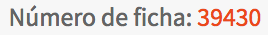

+ **Casilla de selección:** permiten seleccionar, o deseleccionar, el registro para usarlo posteriormente; por ejemplo, para crear una bibliografía o asignarle una _tag_.  

+ **Portada del registro**: imagen representativa del material y que sirve además para enlazar con el objeto vinculado al registro, en el caso de que exista.

Además, en este punto, el sistema es capaz de mostrar una **portada genérica** para todos aquellos registros que no tengan una asignada, si así lo decide la institución.

+ **Botón de contenido relacionado:** da acceso a la información bibliográfica enriquecida para el registro, suministrada por el servicio Syndetics Plus.

- **Botón para compartir registro:** permite desplegar las opciones configuradas para compartir la información del registro bibliográfico. A saber: permalink (enlace permanente), envío por correo electrónico, publicación en redes sociales (Twitter, Facebook, Pinterest, Google Plus) y código QR.

- **Botón de bibliografía:** permite crear una bibliografía a partir de uno o varios registros seleccionados previamente. Por omisión, el indicador numérico que aparece en este botón es **0**, hasta que se seleccione algún registro por medio de la casilla situada en la parte izquierda del mismo.

+ **Botón para solicitar préstamo:** ofrece la posibilidad de ejecutar una solicitud de préstamo sobre alguno de los ejemplares asociados al registro activo. Por omisión, el indicador numérico que aparece en este botón es **0**, hasta que se seleccione algún ítem por medio de la casilla situada en la parte izquierda del mismo.

- **Botón para desplegar etiquetas:** da acceso a la vista del registro con formato de etiquetas según el esquema de catalogación utilizado (en el ejemplo: MARC21).

+ **Flechas de navegación por los registros del sumario (_registro anterior_ y _registro siguiente_).**

- **Campos descriptivos:** contienen los datos relativos al registro catalogado. La información de algunos de ellos enlaza con las autoridades asociadas y, además, se muestra el número de _**referencias**_ que se han encontrado en la base de datos para cada uno de los términos indizados.

Si se pincha sobre alguno de estos campos que son, a su vez, **enlaces**, se accede a los registros en los que aparece el término de que se trate.

**_Información de ejemplares_**

En aquellos casos en que el registro bibliográfico tiene asociado algún ejemplar o existencia, es en este apartado donde puede visualizarse la información descriptiva de cada uno de estos **ítems**, como es su localización física, colección a la que pertenece, tipo de material o estado en el que se encuentra. Incluso se puede determinar el número de ítems que se despliega por intervalos.

También es posible modificar el **ordenamiento de las columnas** en esta sección, de manera ascendente o descendente. Para ello, se debe hacer clic en la opción situada a la derecha del encabezamiento de la columna correspondiente:

- **Opción sin activar.**

- **Ordenamiento ascendente de ítems por código de barras.**

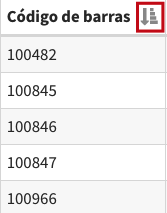

- **Ordenamiento descendente de ítems por código de barras.**

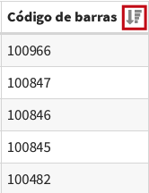

Además, también se pueden llevar a cabo búsquedas de ejemplares concretos dentro del listado completo, usando la opción **Buscar**. Esto puede resultar muy útil cuando la cantidad de ejemplares para un mismo registro es muy amplia.

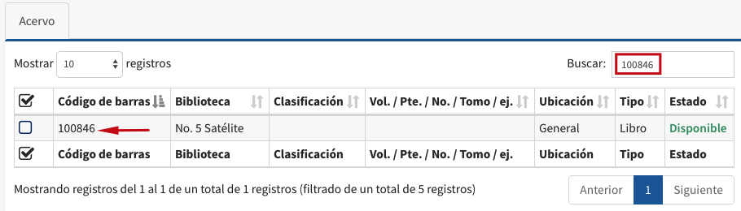

## Búsqueda sin resultados

Cuando al ejecutar una búsqueda no se recupera ningún resultado coincidente, el sistema genera un **sumario de posibles registros relacionados con los términos introducidos**, a partir de una búsqueda alfabética por la primera palabra escrita.

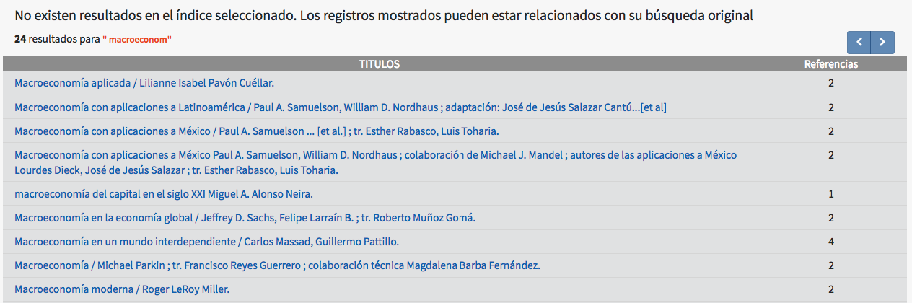

Si se produce la circunstancia de que no exista equivalencia alguna entre los términos de búsqueda introducidos y la información recogida en el sistema, lo que se despliega es un mensaje avisando de la situación.

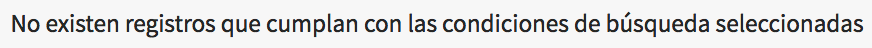

## Recursos vinculados

El listado de archivos vinculados a un registro se muestra con el siguiente estilo por defecto, en la vista en *Detalle*:

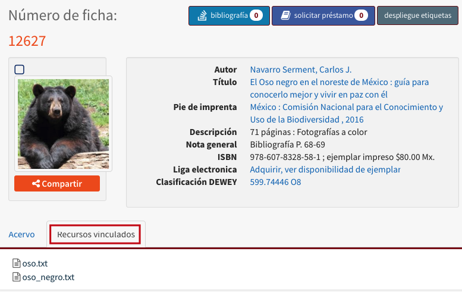