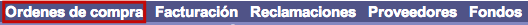
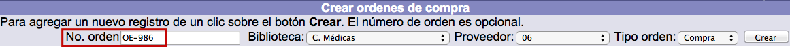
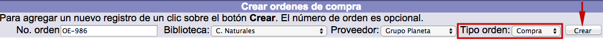

meta-json: {"viewport":"width=device-width, initial-scale=1.0, maximum-scale=1.0,\nuser-scalable=0","robots":"noindex,follow","title":"Órdenes de compra | Ayuda contextual de Janium","generator":["Divi v.2.2","WordPress 4.0.18"]}
robots: noindex,follow
title: Órdenes de compra | Ayuda contextual de Janium
viewport: width=device-width, initial-scale=1.0, maximum-scale=1.0, user-scalable=0
Date:Nov 27, 2014

# Órdenes de compra

[%Date]

Como ya se ha comentado, este elemento es el primero que debe crearse
para iniciar el flujo de adquisiciones. Cada orden de compra se
identifica con una **clave** que puede ser asignada por el sistema
automáticamente o por la institución, si así lo decide.

Existen dos estados de órdenes de compra:

-   **Abiertas:** son aquellas que permiten seguir agregando líneas a la
    orden de compra. Es decir, las órdenes abiertas admiten la inclusión
    de nueva información sobre pedidos de materiales.
-   **Cerradas:** no permiten incluir nuevas líneas de compra de
    materiales.

### Creación de órdenes

El procedimiento a seguir es el siguiente:

-   Hacer clic sobre la opción **Órdenes de compra** de la barra de
    herramientas del módulo.

-   En la pantalla de gestión de órdenes, introducir la clave a asignar
    en el campo **No. orden** de la sección *Crear órdenes de compra*.
    Esta clave puede ser alfanumérica y de hasta 30 caracteres. Si se
    decide no añadir este identificador, el sistema lo hace de forma
    automática incluyendo el prefijo “O” delante de la secuencia
    numérica.

-   Elegir la biblioteca para la que está creando la orden en el campo
    **Biblioteca** de la sección *Crear órdenes de compra*.

-   Elegir el proveedor al que se va a enviar la orden en el campo
    **Proveedor** de la sección *Crear órdenes de compra*.

-   Elegir el tipo de la orden a crear (compra, canje o donación)
    en el campo **Tipo orden** de la sección *Crear órdenes de compra*.
    A continuación , hacer clic en el botón **Crear**.

-   El sistema genera la orden de compra y despliega la pantalla para
    agregar **líneas** a dicha orden (no obstante, esta acción puede
    llevarse a cabo posteriormente). Los datos sobre la orden activa se
    muestran en la parte superior.

### Edición de órdenes

Siempre que sea necesario, es posible realizar modificaciones en los
datos recogidos para una orden de compra.

El procedimiento a seguir es el siguiente:

-   Hacer clic sobre la información de *Orden de compra activa*.

-   Se despliega el registro correspondiente a la orden de compra
    concreta. Hacer clic en el botón **Actualizar** (o **Cancelar**, si
    se desea regresar a la pantalla anterior). Los campos que se
    presentan en dicho registro son los siguientes:
    -   *No. orden:* número identificador interno (ID) que otorga el
        sistema. **No confundir con el que se asigna manualmente al
        crear la orden de compra**.
    -   *No. biblioteca, Código proveedor, No. orden local, Tipo de
        orden:* se corresponden con los campos ya mencionados en el
        proceso de creación de la orden.
    -   *Fecha creación:* fecha en que se genera la orden. Asignada
        automáticamente por el sistema.
    -   *Fecha modificación:* última fecha en que se ha realizado algún
        cambio en el registro de la orden. Asignada automáticamente por
        el sistema.
    -   *Fecha de envío:* fecha en que el proveedor envía sus
        materiales.
    -   *Fecha de envío correo:* fecha en que se ha enviado la orden al
        proveedor por correo.
    -   *Fecha de reclamación:* fecha en que se ha llevado a cabo la
        reclamación sobre algún material al proveedor.
    -   *Fecha de cancelación:* fecha en que se ha realizado la
        anulación de la orden de compra.
    -   *Notas:* texto auxiliar informativo sobre la orden.
    -   *Instrucciones:* directrices que deben seguirse al recibir los
        materiales ordenados o durante el periodo que dure la orden
        activa.

-   Realizar los cambios necesarios y hacer clic de nuevo en el botón
    **Actualizar** para guardar la información.

