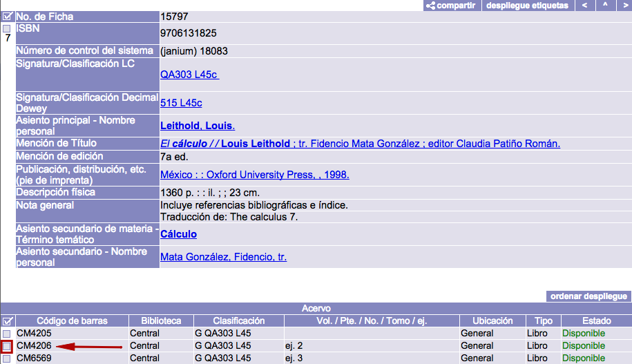
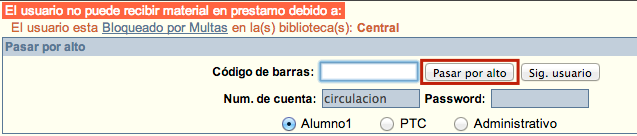

meta-json: {"viewport":"width=device-width, initial-scale=1.0, maximum-scale=1.0,\nuser-scalable=0","robots":"noindex,follow","title":"Préstamos | Ayuda contextual de Janium","generator":["Divi v.2.2","WordPress 4.0.18"]}
robots: noindex,follow
title: Préstamos | Ayuda contextual de Janium
viewport: width=device-width, initial-scale=1.0, maximum-scale=1.0, user-scalable=0
Date:Nov 26, 2014

# Préstamos

[%Date]

Estos procesos consisten en inscribir al usuario solicitante, utilizando
su **número de cuenta**, y al material solicitado, a través de su
**número de código de barras**, en un registro de préstamo. El sistema
asigna la fecha y hora de devolución correspondiente considerando el
mapa de circulación
configurado, que engloba, a su vez, los datos sobre: perfil del usuario,
tipo de material, biblioteca prestataria, biblioteca del usuario y regla
de circulación (periodo de préstamo + multa asociada).

Los préstamos pueden ser por horas o días, dependiendo de las
**políticas definidas por la institución**, y se realizan cuando el
usuario tiene un estado *OK* y el material está *Disponible* para ser
prestado.

Por lo general, un usuario tiene el estado ***OK*** cuando:

-   No tiene multas monetarias pendientes de pago.

-   No tiene suspensiones administrativas.

-   No tiene préstamos vencidos.

-   Puede tener materiales en préstamo (todavía no vencidos).

-   Puede tener materiales reservados.

-   No han expirado sus privilegios de usuario.

A su vez, también de forma genérica, un material se considera
***Disponible*** cuando:

-   La institución ha decidido que circule y sea accesible (ya sea
    alojado en salas, estanterías o depósitos no abiertos al público).

-   No ha sido reservado por algún usuario.

-   Tiene un nivel de seguridad asociado menor o igual al nivel del
    usuario que lo solicita.

### Pantalla

La pantalla de Préstamo se compone de cinco secciones:

-   **Información del usuario**, que muestra lo siguiente:

    -   Fotografía del usuario.
    -   Número de cuenta.
    -   Nombre y apellidos del usuario.
    -   Biblioteca (s), perfil (es) y vigencia (s) del usuario.

-   **Campo de código de barras y notas**, que muestra lo siguiente:

    -   Campo de texto para escribir el código de barras del material.
    -   Notas informativas vinculadas al usuario.

-   **Lista de material prestado en la sesión activa**, que muestra lo
    siguiente:

    -   Código de barras y biblioteca del ejemplar.
    -   Clasificación, título y autor.
    -   Número de cuenta del usuario, biblioteca del usuario y perfil.
    -   Fecha y hora de préstamo.
    -   Fecha y hora de vencimiento.
    -   Número de cuenta del operador de Circulación.

-   **Lista de material en poder del usuario al iniciar la sesión
    activa**, que muestra lo siguiente:

    -   Código de barras y biblioteca del ejemplar.
    -   Clasificación, título y autor.
    -   Número de cuenta del usuario, biblioteca del usuario y perfil.
    -   Fecha y hora de préstamo.
    -   Fecha y hora de vencimiento.
    -   Número de cuenta y biblioteca del operador de Circulación.
    -   Renovaciones efectuadas.

-   **Lista de préstamos acumulados (*histórico de préstamos*)**, que
    muestra lo siguiente:

    -   Código de barras y biblioteca del ejemplar.
    -   Clasificación, título y autor.
    -   Número de cuenta del usuario, biblioteca del usuario y perfil.
    -   Fecha y hora de préstamo.
    -   Fecha y hora de vencimiento.
    -   Fecha y hora de devolución.
    -   Número de cuenta y biblioteca del operador de Circulación
        responsable del préstamo.
    -   Número de cuenta y biblioteca del operador de Circulación
        responsable de la devolución.
    -   Renovaciones efectuadas.

### Procedimiento de préstamo

-   Hacer clic sobre la opción **Préstamo** de la barra de herramientas
    del módulo.

-   En el cuadro que aparece, escribir el número de cuenta del
    usuario en el campo correspondiente y hacer clic en el botón
    **Aceptar**.

-   Estando en la pantalla de Préstamo, hacer clic en el botón **buscar
    ítem**, situado en la parte derecha de la misma, para acceder a la
    función de búsqueda
    avanzada del catálogo (en ventana emergente) y así llevar a
    cabo la búsqueda del ítem que se va a prestar. Esto solo en caso de
    que el usuario no conozca el código de barras del material que desea
    en préstamo. En caso contrario, **no es necesario realizar la
    búsqueda**, basta con teclear el código o escanearlo con un lector
    óptico.

-   Introducir los términos de búsqueda correspondientes, ejecutar la
    acción y desplegar el registro bibliográfico del material en
    cuestión para seleccionar uno de sus ítems, haciendo clic sobre su cuadro
    selector.

-   El sistema introduce automáticamente el número de código de barras del
    ítem a prestar que se ha seleccionado en el campo de texto de
    la sección destinada para ello. Hacer clic en el botón **Aceptar**.

-   Al llevar a cabo la acción anterior, los datos del préstamo
    registrado se despliegan en la lista **Material prestado en la
    sesión**.

### Préstamos a usuarios con varios perfiles

Un usuario puede tener asignados diferentes perfiles para distintas
bibliotecas. Por ejemplo, podría ser **Alumno de posgrado** con un
perfil asociado a la biblioteca de la facultad de Derecho y a la vez
**Profesor**, con otro perfil relacionado con la biblioteca de la
facultad de Medicina.

Esta circunstancia implica que el usuario puede obtener préstamos
utilizando cualquiera de sus perfiles. En este sentido, el sistema
permite seleccionar el perfil al cual serán vinculados los préstamos en
el momento de la solicitud del usuario.

El procedimiento a seguir es exactamente igual que el ya explicado,
salvo por un paso añadido:

-   Justo después de introducir el número de código de barras del
    material y antes de ejecutar el préstamo mediante el botón
    *Aceptar*: hacer clic sobre el **perfil que se desea vincular** al
    material solicitado. Los perfiles se despliegan debajo del campo
    *Código de barras*.

### Alertas de préstamo

#### Alerta al intentar prestar un material ya prestado

Puede ocurrir que un usuario solicite en préstamo un material que ya
esté en posesión de otra persona. Ante esta situación, la medida ideal
es que la biblioteca detenga el material para investigar por qué esta físicamente disponible
pero en el sistema está registrado como prestado.

El posible mensaje de alerta es el siguiente:

> No se pudo realizar el préstamo debido a que el material está prestado
> al usuario: Número de cuenta: 1234 Nombre: Juan Rodríguez Magán

#### Alerta al intentar prestar un material no registrado

Cuando un usuario solicita en préstamo un material cuyo código de barras
no está registrado, el sistema presenta la alerta correspondiente. El
mismo aviso se presenta cuando el número de código de barras fue escrito
**de forma equivocada**.

La medida ideal en este caso es que la biblioteca detenga el material
para confirmar si el número de
código de barras ha sido escrito correctamente al intentar
registrar el préstamo. Si es necesario, tendría que ser remitido al área
de Control Bibliográfico para su búsqueda en la base de datos
bibliográfica.

El posible mensaje de alerta es el siguiente:

> No se pudo realizar el préstamo debido a que no existe registro alguno
> que tenga el código de barras ingresado.

#### Alerta por número máximo de préstamos en uno de los perfiles de usuario

Como ya se ha explicado, un usuario puede tener asignados varios
perfiles para diferentes bibliotecas, esto implica que puede obtener
materiales en préstamo utilizando cualquiera de ellos.

En el momento de la solicitud, el sistema revisa el **número máximo de
préstamos que puede obtener el usuario para cada uno de sus perfiles**.
Si en alguno ya se ha alcanzado este límite, se alerta al operador de
dicha situación. No obstante, el sistema continuará registrando los
siguientes préstamos en otro perfil disponible.

El posible mensaje de alerta es el siguiente:

> El usuario: 1234 llegó al límite de sus préstamos con el perfil:
> Alumno

#### Alerta por privilegios vencidos en uno de los perfiles de usuario

Cabe la posibilidad de que los privilegios o permisos establecidos por
la institución para alguno de los perfiles de un usuario pierdan su
vigencia por algún motivo. Si se produce esta circunstancia, el sistema
muestra el aviso correspondiente y utiliza otro perfil disponible para
seguir registrando los préstamos.

El posible mensaje de alerta es el siguiente:

> Han vencido los privilegios del usuario para el perfil: Profesor.

### Opción “pasar por alto”

Al intentar registrar un préstamo de material puede presentarse algún
tipo de impedimento que evite seguir adelante con el proceso. Las
restricciones principales que pueden producirse son las siguientes:

-   Usuario bloqueado por multa.
-   Usuario con privilegios vencidos.
-   Usuario con máximo de préstamos registrados.
-   Usuario con préstamos vencidos.
-   Usuario con total de préstamos registrados.
-   Material que no circula (no se presta).
-   Material con nivel de acceso mayor al autorizado al usuario.
-   Material apartado por otro usuario.
-   Usuario con máximo de préstamos por tipo de material.

Para todas estas situaciones es posible, si la institución lo autoriza,
registrar el préstamo del material en cualquier caso. Para llevar a cabo
esto es necesario que haya un **operador del módulo con privilegios de
“pasar por alto”**. Estos permisos se configuran al definir los
operadores del módulo en la política *Privilegios del staff de
circulación* del módulo de Administración.

Sobre el procedimiento a
seguir: en el momento de identificar al usuario o material en la
sección de *Préstamo*, el sistema revisa los estados de ambos para
detectar si existe alguna restricción. En caso de haberla, se despliega
la alerta correspondiente agregando la opción **Pasar por alto** en la
pantalla.

A continuación, el operador con privilegios de “pasar por alto” puede
escribir el código de
barras del material a prestar, además de su número de cuenta y contraseña para autorizar el
registro del préstamo. No obstante, es importante mencionar que el uso
de esta opción **no elimina la restricción existente** sobre el usuario
o el material, por lo que, al intentar registrar otro movimiento, el
sistema avisará nuevamente de ella a través de alertas.
