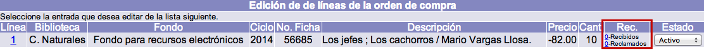
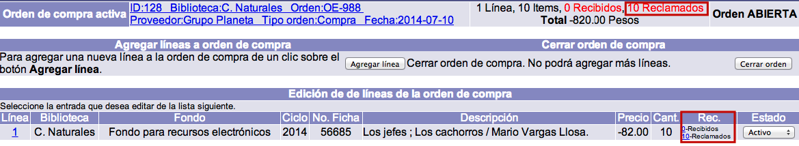

# Reclamación de material

{{date}}

Los materiales ordenados y no recibidos pueden ser reclamados a los
proveedores. Cada línea de orden aún no enlazada a una factura contiene
una opción para reclamar uno o más ejemplares o copias.

NOTAS IMPORTANTES:

1.  Después de facturar, **ya no es posible reclamar un ejemplar**,
    puesto que se asume que con la introducción de los datos de la
    factura enviada por el proveedor, se está aceptando el pedido.
2.  Por cada reclamación, se crea un registro de ella en la base de
    datos, por lo que, si se recibe un material que ha sido reclamado y
    ésta se anula, **el registro de reclamación correspondiente no se
    borra**, sino que se despliega un mensaje indicando tal situación.

## Creación de reclamaciones

El procedimiento a seguir es el siguiente:

-   Identificar la orden de compra correspondiente y seleccionarla,
    haciendo clic sobre su ID.

-   En la siguiente pantalla, de entre todos los datos que se despliegan
    relacionados con las líneas de orden, es necesario fijarse en la
    columna ***Rec.*** En esta sección, hacer clic sobre el número de
    dicha columna correspondiente a **Reclamados** de la línea para la
    que se van a reclamar los materiales.

-   Se abre una ventana emergente en la que se pueden registrar: cuántos
    ejemplares se están reclamando, en qué fecha y el motivo o razón de
    la reclamación. Por omisión, aparece la fecha actual y el número de ejemplares que se
    ordenaron.Una vez establecidos los valores deseados, hacer
    clic en el botón **Reclamar**.

-   El sistema cierra la ventana emergente y muestra el sumario de
    líneas, con el número actualizado de copias reclamadas para la línea
    en cuestión. También se actualiza la cifra total de existencias
    reclamadas para la orden activa.

## Edición de reclamaciones

El procedimiento a seguir es el siguiente:

-   Estando en cualquier pantalla del módulo, hacer clic en la opción
    **Reclamaciones** de la barra de herramientas principal.

-   En la lista o sumario de reclamaciones al que se accede, identificar
    aquella que se va a editar y seleccionarla haciendo clic sobre su
    **ID**.

-   Se despliega el registro de la reclamación. Hacer clic en el botón
    **Actualizar** para proceder a su edición (o **Cancelar**, si se
    desea regresar a la pantalla anterior. O **Borrar**, para eliminar
    el registro completo).Los campos que se presentan en dicho registro
    son los siguientes:
    -   *No. de orden:* número de la orden a la que pertenecen los
        materiales reclamados. Es ingresado automáticamente por el
        sistema.
    -   *No. de línea:* número de línea de orden correspondiente a los
        materiales reclamados. Es ingresado automáticamente por el
        sistema.
    -   *Tipo de reclamación:* este parámetro se crea durante la
        configuración previa del módulo. La institución puede crear los
        tipos de reclamación que necesite. Este campo pretende reflejar
        la razón o motivo de la reclamación.
    -   *Fecha de reclamación:* fecha en que se creó la reclamación. Es
        ingresada automáticamente por el sistema.
    -   *Cantidad:* cifra de ejemplares o copias reclamadas.
    -   *No. de partes:* número de unidades físicas, cuando hay más de
        una, que componen cada unidad del material que se está
        reclamando. Por ejemplo, si se trata del título de un libro que
        además está acompañado de un CD, se puede registrar en este
        campo el número **2**.
    -   *Fecha de envío:* fecha en que se envió la reclamación al
        proveedor.
    -   *No. de reclamaciones:* cantidad de reclamaciones enviadas al
        proveedor.
    -   *Código del estado:* valor numérico que representa el estado en
        que se encuentra la reclamación. Si se cambia, la reclamación ya
        no se desplegará en la lista o sumario de reclamaciones.
    -   *Respuesta:* respuesta del proveedor a la reclamación.
    -   *Fecha de respuesta:* fecha en que se recibió la respuesta del
        proveedor.

