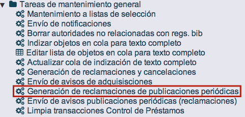
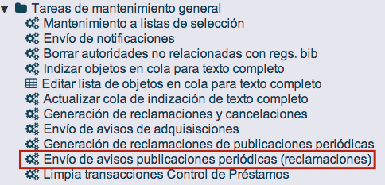

meta-json: {"viewport":"width=device-width, initial-scale=1.0, maximum-scale=1.0,\nuser-scalable=0","robots":"noindex,follow","title":"Reclamaciones de fascículos | Ayuda contextual de Janium","generator":["Divi v.2.2","WordPress 4.0.18"]}
robots: noindex,follow
title: Reclamaciones de fascículos | Ayuda contextual de Janium
viewport: width=device-width, initial-scale=1.0, maximum-scale=1.0, user-scalable=0
Date:Dec 2, 2014

# Reclamaciones de fascículos

[%Date]

Cuando, por alguna circunstancia, uno o más fascículos no llegan en las
fechas en que se esperan, el sistema Janium está preparado para generar
las reclamaciones correspondientes de forma automática. Estas
reclamaciones se crean tomando como referencia el campo **Fecha
esperado** de cada fascículo y el valor del campo **No. de días para
reclamar** de la suscripción (esta opción ha sido explicada en la
sección *Edición de suscripciones*).

Un aspecto que es necesario tener en cuenta es que, si un fascículo no
ha sido predicho, no puede ser reclamado.

En cuanto al procedimiento que se sigue, desde el módulo de
Administración, el operador debe ejecutar la función de **Generación de
reclamaciones de publicaciones periódicas**. A continuación, debe hacer
lo mismo con la función de **Envío de avisos de publicaciones periódicas
(reclamaciones)**. Con estas acciones, el sistema crea y envía correos
electrónicos con los avisos a las direcciones asociadas a los
proveedores.

NOTA IMPORTANTE: en el caso de que los números que se deseen reclamar
tengan fechas de esperado superiores (en número de días) al valor que
conste para el proveedor en el campo *Período de cancelación en días*,
dentro del módulo de Adquisiciones, estos fascículos se establecerán
como **anulados** y no se enviarán reclamaciones.

Esto ocurriría, por ejemplo, con un fascículo que tuviera como fecha de
esperado **10 – 06 – 2014** y en el registro del proveedor, **3** días
asignados como período de cancelación. De esta forma, al ejecutar la
función de generación de reclamaciones con fecha 15 – 06 – 2014, el
número no va a ser reclamado al haber transcurrido ya más de 3 días sino
que queda como *Anulado*. Para que la reclamación sea enviada, debería
ejecutarse el programa el 11, 12 o 13 de junio.

### Formato de reclamaciones

Los mensajes de correo electrónico que son enviados a los proveedores
pueden presentar el formato que se observa a continuación. No obstante,
los textos del mensaje, el de inicio y el de final pueden ser
modificados desde el módulo de Administración.

Por otro lado, volviendo al módulo de Publicaciones periódicas, en la
lista de fascículos esperados, aquellos que han sido reclamados aparecen
con estado *Esperado* en color rojo.

Además, al acceder a la sección **Reclamaciones\_PP** es posible
consultar la información detallada de cada una de ellas: suscripción,
biblioteca, tipo de fascículo, proveedor, fecha de reclamación y fecha
de respuesta. También es posible editar algunos de sus datos haciendo
clic sobre el valor correspondiente de la columna *Enlace*.

### Reclamaciones manuales

Además del método automático ya explicado, también es posible reclamar
manualmente uno o más fascículos.

NOTA IMPORTANTE: si se reclaman de forma manual uno o varios números, en
el momento de generar los avisos para los proveedores, el sistema
también incluirá aquellos fascículos que aún no hayan llegado **aunque
el operador no los haya marcado manualmente para la reclamación**.

El procedimiento a seguir es el siguiente:

-   Seleccionar los fascículos a reclamar y elegir la razón de la
    reclamación en la lista desplegable correspondiente.

-   Hacer clic en el botón **Reclamar**.

-   El sistema presenta los fascículos reclamados, marcándolos con
    estado *Esperado* en color rojo.

Por otro lado, si alguno de los fascículos reclamados llega finalmente a
la institución, basta con marcarlo y establecerlo como *Recibido*.

