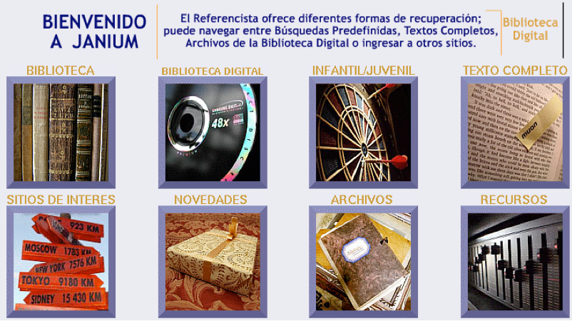

meta-json: {"viewport":"width=device-width, initial-scale=1.0, maximum-scale=1.0,\nuser-scalable=0","robots":"noindex,follow","title":"Referencista electrónico | Ayuda contextual de Janium","generator":["Divi v.2.2","WordPress 4.0.18"]}
robots: noindex,follow
title: Referencista electrónico | Ayuda contextual de Janium
viewport: width=device-width, initial-scale=1.0, maximum-scale=1.0,user-scalable=0
Date: Nov 21, 2014

# Referencista electrónico

[%Date]

Este módulo del sistema Janium permite representar las colecciones de
una institución a través de **imágenes organizadas de forma
jerárquica**, con el objetivo de ofrecer a los usuarios una mejor
visibilidad y acceso a los mismos.

Esta estructura conceptual jerárquica puede diseñarse considerando
diversos criterios como la temática del fondo, los tipos de materiales o
usuarios, o los servicios que desee destacar la institución.

Desde el Referencista electrónico se pueden configurar los siguientes
tipos de acciones:

-   Búsquedas por palabra clave.
-   Búsquedas alfabéticas.
-   Búsquedas combinadas.
-   Búsquedas por tags.
-   Acceso a otros grupos del Referencista.
-   Acceso a recursos externos (bases de datos, buscadores, otros
    catálogos, etc.).

