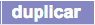
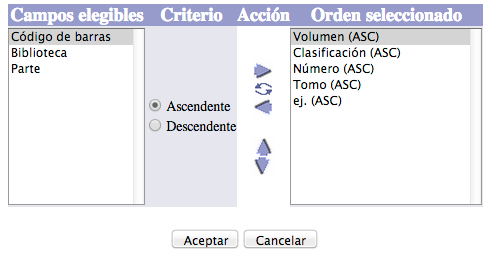

# Registro en detalle en Control bibliográfico

{{date}}

En ocasiones, es posible que sólo se recupere un único registro que se
ajuste a los criterios requeridos en la búsqueda. En esos casos, esto es
lo que se muestra:

NOTA: esta opción de
despliegue de resultados sólo se da en búsquedas **por palabra clave** o
**por número de ficha y código de barras**.

(Ejemplo de búsqueda: términos *Diccionario de mitología universal*,
índice *Título* )

Las dos secciones de que consta este modo de despliegue son:

**Información
bibliográfica**

Con los siguientes elementos destacados:

-   **Botón para compartir registro:** permite generar un *permalink* al
    registro seleccionado para su publicación en redes sociales o envío
    por correo electrónico.

-   **Botón *Nuevo item*:** permite crear un nuevo ejemplar asociado al
    registro bibliográfico.

-   **Botón *Duplicar*:** ejecuta una duplicación del registro que está
    desplegado en ese momento.

-   **Botón para desplegar etiquetas:** da acceso a la vista en formato
    MARC21 de la información.

-   **Campos descriptivos:** contienen los datos relativos al registro.
    El contenido de algunos de ellos enlaza con las autoridades
    asociadas.

**Información de
ejemplares**

En aquellos casos en que el registro bibliográfico tiene asociado algún
ejemplar o existencia, es en este apartado donde puede visualizarse la
información descriptiva de cada uno de estos **ítems**, como es su
localización física, colección a la que pertenece, tipo de material o
estado en el que se encuentra.

También es posible modificar la forma en que se ordenan los campos
mostrados en esta sección. Para ello, se debe hacer clic en el botón
*Ordenar despliegue*, lo que da paso a una ventana emergente donde
personalizar la configuración.

