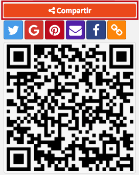

# Registro en detalle

En ocasiones, es posible que sólo se recupere un único registro que se ajuste a los criterios requeridos en la búsqueda. En esos casos, esto es lo que se muestra:

NOTA: esta opción de despliegue de resultados sólo se da en búsquedas **por palabra clave** o **por número de ficha y código de barras**.

(Ejemplo de búsqueda: términos _Diccionario de mitología universal_, índice _Título_)

Las dos secciones de que consta este modo de despliegue son:

## Información bibliográfica

Con los siguientes elementos destacados:

+ **Número de ficha:** este es el número de identificación interna asignado por el sistema de manera automática en el momento de la creación del registro.

+ **Casilla de selección:** permiten seleccionar, o deseleccionar, el registro para usarlo posteriormente; por ejemplo, para crear una bibliografía o asignarle una _tag_.  

+ **Portada del registro**: imagen representativa del material y que sirve además para enlazar con el objeto vinculado al registro, en el caso de que exista.

Además, en este punto, el sistema es capaz de mostrar una **portada genérica** para todos aquellos registros que no tengan una asignada, si así lo decide la institución.

+ **Botón de contenido relacionado:** da acceso a la información bibliográfica enriquecida para el registro, suministrada por el servicio Syndetics Plus.

+ **Botón para compartir registro:** permite desplegar las opciones configuradas para compartir la información del registro bibliográfico. A saber: permalink (enlace permanente), envío por correo electrónico, publicación en redes sociales (Twitter, Facebook, Pinterest, Google Plus) y código QR.

+ **Botón de bibliografía:** permite crear una bibliografía a partir de uno o varios registros seleccionados previamente. Por omisión, el indicador numérico que aparece en este botón es **0**, hasta que se seleccione algún registro por medio de la casilla situada en la parte izquierda del mismo.

+ **Botón para solicitar préstamo:** ofrece la posibilidad de ejecutar una solicitud de préstamo sobre alguno de los ejemplares asociados al registro activo. Por omisión, el indicador numérico que aparece en este botón es **0**, hasta que se seleccione algún ítem por medio de la casilla situada en la parte izquierda del mismo.

+ **Botón para desplegar etiquetas:** da acceso a la vista del registro con formato de etiquetas según el esquema de catalogación utilizado (en el ejemplo: MARC21).

+ **Campos descriptivos:** contienen los datos relativos al registro catalogado. La información de algunos de ellos enlaza con las autoridades asociadas y, además, se muestra el número de _**referencias**_ que se han encontrado en la base de datos para cada uno de los términos indizados.

Si se pincha sobre alguno de estos campos que son, a su vez, **enlaces**, se accede a los registros en los que aparece el término de que se trate.

## Información de ejemplares

En aquellos casos en que el registro bibliográfico tiene asociado algún ejemplar o existencia, es en este apartado donde puede visualizarse la información descriptiva de cada uno de estos **ítems**, como es su localización física, colección a la que pertenece, tipo de material o estado en el que se encuentra. Incluso se puede determinar el número de ítems que se despliega por intervalos.

También es posible modificar el **ordenamiento de las columnas** en esta sección, de manera ascendente o descendente. Para ello, se debe hacer clic en la opción situada a la derecha del encabezamiento de la columna correspondiente:

- **Opción sin activar.**

- **Ordenamiento ascendente de ítems por código de barras.**

- **Ordenamiento descendente de ítems por código de barras.**

Además, también se pueden llevar a cabo búsquedas de ejemplares concretos dentro del listado completo, usando la opción **Buscar**. Esto puede resultar muy útil cuando la cantidad de ejemplares para un mismo registro es muy amplia.

